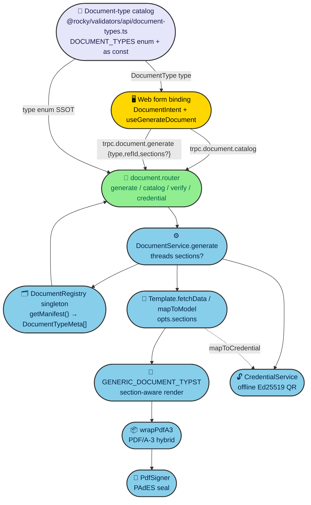

# Plan: PDF TEMPLATE SYSTEM + parallel-runnable PDF test suite

**Date:** 2026-07-17
**Status:** Draft (planning artifact — no application code beyond illustrative snippets)
**Directory:** `/home/goce/appz/rocky`
**ADR:** `apps/docs/content/ADR/0107-pdf-template-system.md` (raised Proposed)
**Standards reused (NOT redesigned):** ADR-0082 (PDF/A-3 hybrid + PAdES-LTV seal) · ADR-0084 (offline-verifiable Ed25519+CBOR signed-QR credential)

---

## 1. Summary (North Star)

Rocky already has a working **PDF engine + signing + offline credential pipeline** but no **template layer** on top: there is no typed document-type catalog (the web and API both resolve `type` as a bare `z.string()` at runtime), no way for a *form* to pick *which sections* land in the PDF (the previously-designed `sections?: string[]` was never built), and the **test suite is lopsided** — engine + sign + credential are well covered, but `movement`, `passport`, and `inspection-form` (the three most form-facing templates) have **zero tests**.

This plan builds four pillars on top of the fixed standards:

- **Pillar A — Document-type catalog:** one typed SSOT (`DocumentType` Zod enum + `as const`) shared by web + API + registry; `DocumentRegistry.getManifest()` lets the web enumerate each type's selectable sections.
- **Pillar B — `sections` option:** thread `sections?: string[]` through schema → service → template → the generic Typst renderer, proving it on the existing **passport** template and using it for the scaffolded **vet-visit-report**.
- **Pillar C — Parallel test suite:** per-template tests (filling the 3 missing ones) asserting PDF/A-3 structure, PAdES, offline credential/QR, section regression, and generate→verify — all parallel-safe via an isolated-registry helper + unique `type` keys; plus a **registry sweep** that catches catalog/registration drift. Render tests stay `skipIf(!networkOk)`.
- **Pillar D — Web form→document binding:** a lightweight `DocumentIntent` + `useGenerateDocument()` hook + `<GenerateDocumentButton>` replacing the ad-hoc `/documents?type=…` deep-link in `inspections/columns.tsx`; the web reads types/sections from the catalog (Pillar A) via a new `trpc.document.catalog`.

**User decisions baked in (do not re-ask):** manual template registration stays (the ~5 coordinated edits); no verapdf dependency/install (unit tests assert PDF/A-3 + PAdES *structure* offline; the user runs the desktop verapdf for the heavy gate); `sections` is implemented here; `vet-visit-report` is **scaffolded** (catalog + manifest + a `sections` test) with placeholder/TODO content because the real spec is not yet supplied.

---

## 2. Architecture Overview



*Fig. 1 — The catalog (Pillar A) is the typed SSOT shared by web + API; `getManifest()` surfaces per-type sections to the web; `sections` threads through the existing generate pipeline without touching the signing/credential standards.*

---

## 3. The Four Pillars → Concrete Changes

> **Catalog placement decision (justified):** the catalog lives in **`@rocky/validators`**, not `@rocky/pdf`. Proof: `apps/web` already depends on `@rocky/validators` but **not** on `@rocky/pdf` (`node -e` check confirmed `pdf:false, validators:true`); `@rocky/validators` does **not** import `@rocky/pdf` (no cycle); `documentGenerateRequestSchema.type` must *become* this enum, so it belongs next to that schema. `@rocky/pdf` gains `@rocky/validators` as a (safe, leaf-ward) dependency and imports `DocumentType`/`DocumentTypeMeta` for `getManifest()` typing. This keeps the web decoupled from PDF internals (it reads sections at runtime via `trpc.document.catalog`, not from `@rocky/pdf`).

### Pillar A — Document-type catalog (single source of truth)

**New file `packages/validators/src/api/document-types.ts`** (the shared SSOT):

```ts
import { z } from "zod";

/**
 * Single source of truth for document types (Pillar A, ADR-0107).
 * Shared by web (binding UI), API (document.generate schema), and the
 * registry manifest. Section lists are NOT here — they are dynamic, declared
 * per template and surfaced via DocumentRegistry.getManifest() / trpc.document.catalog.
 */
export const DOCUMENT_TYPES = [
  "passport",
  "movement",
  "inspection-form",
  "ched-a",          // registry type is "ched-a" (NOT "ched") — see scout recon
  "eudr",
  "ear-tag",
  "vet-visit-report", // scaffolded in this plan (Pillar B)
] as const;

export type DocumentType = (typeof DOCUMENT_TYPES)[number];

export const documentTypeEnum = z.enum(DOCUMENT_TYPES)
  satisfies z.ZodType<DocumentType>;

export const DOCUMENT_TYPE_TITLES: Record<DocumentType, string> = {
  passport: "Cattle Passport",
  movement: "Movement / Transport Declaration",
  "inspection-form": "Inspection Form",
  "ched-a": "CHED / IMSOC",
  eudr: "EUDR Due Diligence",
  "ear-tag": "Ear Tag",
  "vet-visit-report": "Vet Visit Report",
};

/** Per-type selectable section metadata returned by the registry manifest. */
export interface DocumentTypeMeta {
  type: DocumentType;
  title: string;
  sections: string[];
}
```

**`packages/validators/src/api/document.api.ts`** changes:

- `type: z.string().min(1, …)` → `type: documentTypeEnum` (import from `./document-types.js`).
- Add `sections: z.array(z.string()).optional()` to `documentGenerateRequestSchema` (`z.strictObject` keeps prior fields; new NoDrift guillotine `_drift_documentGenerateRequest` stays valid — the inferred type now has `sections?: string[]`).
- Add `DocumentGenerateRequest.sections?: string[]`.
- Add `documentCatalogResponseSchema = z.array(z.object({ type: documentTypeEnum, title: z.string(), sections: z.array(z.string()) })) satisfies z.ZodType<DocumentTypeMeta[]>;` + its guillotine.
- Re-export `documentTypeEnum`, `DOCUMENT_TYPES`, `type DocumentType`, `type DocumentTypeMeta` from `packages/validators/src/api/index.ts`.

**`packages/pdf/src/engine/document-registry.ts`** — add `getManifest()`:

```ts
import type { DocumentTypeMeta } from "@rocky/validators/api";

getManifest(): DocumentTypeMeta[] {
  return Array.from(this.templates.values()).map((t) => ({
    type: t.type as DocumentTypeMeta["type"], // type string is catalog-validated at registration
    title: t.name,
    sections: Array.from(t.sections ?? []),
  }));
}
```

(The registration site — `app.module.ts` `onModuleInit` — is the one place that must use a `type` that is a `DocumentType`; the sweep test T10 enforces this, so a typo'd type fails CI.)

### Pillar B — `sections` option (threaded)

| Layer | File | Change |
|---|---|---|
| Interface | `packages/pdf/src/engine/document-template.ts` | Add `export interface DocumentFetchOptions { sections?: string[] }`; widen `fetchData(refId, opts?: DocumentFetchOptions)` + `mapToModel(data, opts?: DocumentFetchOptions)`; add `readonly sections?: readonly string[]` to `DocumentTemplate` and `BaseDocumentTemplate` (`sections: readonly string[] = []`). |
| Service | `packages/pdf/src/services/document.service.ts` | `DocumentGenerateInput` gains `sections?: string[]`; destructure `sections`; call `template.fetchData(refId, { sections })` + `template.mapToModel(dataResult.value, { sections })`. |
| Renderer | `packages/pdf/src/engine/typst-document.template.ts` | `buildDocumentModelInputs` becomes section-aware (see below); `GENERIC_DOCUMENT_TYPST` renders `data.sections` if present, else legacy `data.fields`. |
| Proof | `packages/pdf/src/templates/passport.template.ts` | Declare `static readonly SECTIONS` + section map; `mapToModel(data, opts?)` returns `{ sections: [{title, fields}] }` when `opts.sections` given, else the legacy `{ cattlePassport: {...} }` (backward-compatible for yaml/xml). |
| Scaffold | `packages/pdf/src/templates/vet-visit-report.template.ts` (NEW) | `type="vet-visit-report"`, `mapToModel(refId, opts?)` returns `{ sections }` from `opts.sections ?? SECTIONS`; content = placeholder/TODO. |

**`buildDocumentModelInputs` (section-aware) snippet:**

```ts
export interface DocumentSection {
  title: string;
  fields: { label: string; value: string }[];
}

export function buildDocumentModelInputs(
  model: Record<string, unknown>,
  meta: DocumentModelMeta,
): Record<string, string> {
  // NEW: section-aware model (Pillar B) — preferred shape when a template
  // supports `sections`. Keeps the legacy flat `fields` path for backward compat.
  if (Array.isArray((model as { sections?: unknown }).sections)) {
    return {
      model: JSON.stringify({
        title: meta.title,
        subtitle: meta.subtitle,
        sections: (model as { sections: DocumentSection[] }).sections,
      }),
    };
  }
  const fields = Object.entries(model).map(([label, value]) => ({
    label,
    value:
      value == null ? "" : typeof value === "object" ? JSON.stringify(value) : String(value),
  }));
  return { model: JSON.stringify({ title: meta.title, subtitle: meta.subtitle, fields }) };
}
```

**`GENERIC_DOCUMENT_TYPST` (section-aware tail):**

```
#for sec in data.at("sections", default: ()) [
  == #sec.at("title", default: "Section")
  #for field in sec.at("fields", default: ()) [
    #block[*#field.at("label", default: ""):* #field.at("value", default: "")]
  ]
]
```

**Passport proof snippet (illustrative — extract the existing body into `buildFullModel`):**

```ts
static readonly SECTIONS = ["identity","animal","farm","movement","vaccination","lifecycle","importExport"] as const;

async mapToModel(passportId: string, opts?: DocumentFetchOptions): Promise<Record<string, unknown>> {
  const full = await this.buildFullModel(passportId);      // existing mapToModel body
  if (!opts?.sections || opts.sections.length === 0) {
    return full;                                            // legacy nested model (yaml/xml unchanged)
  }
  const wanted = opts.sections.filter((s) => PASSPORT_SECTION_MAP[s]); // canonical order, ignore unknown
  return {
    sections: wanted.map((s) => ({
      title: PASSPORT_SECTION_TITLES[s],
      fields: flattenObject(PASSPORT_SECTION_MAP[s](full.cattlePassport)),
    })),
  };
}
```

**`vet-visit-report.template.ts` (scaffold — content is TODO/placeholder):**

```ts
export class VetVisitReportTemplate extends BaseDocumentTemplate<string, Record<string, unknown>> {
  readonly type = "vet-visit-report";
  readonly modelPath = "models/vet-visit-report.yaml";
  readonly name = "Vet Visit Report";
  readonly modelVersion = "1.0";
  static readonly SECTIONS = ["farm","animals","checklist","signature"] as const;
  readonly sections = VetVisitReportTemplate.SECTIONS;

  constructor(/* TODO: inject repos once the real vet-visit-report spec is supplied */) {
    super();
  }

  async fetchData(refId: string) {
    // TODO(placeholder): real domain fetch once the vet-visit-report spec is supplied.
    if (!refId) return err(documentErr(DOCUMENT_ERRORS.FETCH_FAILED, { reason: "refId required" }));
    return ok(refId);
  }

  async mapToModel(refId: string, opts?: DocumentFetchOptions): Promise<Record<string, unknown>> {
    const sections = opts?.sections ?? [...VetVisitReportTemplate.SECTIONS];
    // TODO(placeholder content): replace with real data when the spec arrives.
    return {
      sections: sections.map((s) => ({
        title: s,
        fields: [{ label: `TODO: ${s}`, value: "placeholder" }],
      })),
    };
  }
}
```

**Registration (manual, per user decision):** add `import { VetVisitReportTemplate }`, a `useFactory` provider + ctor injection + `registry.register(this.vetVisitReportTemplate)` in `apps/api/src/app.module.ts` (mirror `PassportTemplate` ~L439/L583/L602), and re-export from `packages/pdf/src/index.ts`.

### Pillar C — Parallel test suite

**Fill the 3 missing template tests** (content only, mocked repos, **no network** — mirror `ear-tag.template.test.ts`): `packages/pdf/src/templates/movement.template.test.ts`, `passport.template.test.ts`, `inspection-form.template.test.ts`. Each asserts: `type`/`name` match the catalog; `mapToModel` returns a coherent record for a mocked repo row; `sections` filtering works (proved on passport).

**Per-template 5-assert block** (`skipIf(!networkOk)` for the render-dependent asserts 1/2/5; 3/4 run offline):

1. PDF/A-3 structural markers on `format:"pdf"` output (`/EmbeddedFile`, `/AF`, `pdfaid:part` + `>3<`, `OutputIntent`, `GTS_PDFA1`) — decode latin1 like `engine/pdfa3.test.ts`.
2. PAdES signature present + `extractSignature` returns well-formed `ByteRange` + cert (use `Pkcs12Signer` + `FakeTimestampAuthority`, `makeP12` from the existing `document.service.pdf.test.ts`).
3. Offline credential/QR round-trip (ADR-0084): for templates with `mapToCredential`, `CredentialService`-style `generate → verifyCredential` succeeds and QR is embedded (mirror `ear-tag.template.test.ts`).
4. Content/section regression: only selected `sections` render (assert the model's `sections[].title` set equals the requested set; for passport assert excluded section sub-objects are absent).
5. generate→verify round-trip: `service.verify({type, refId})` reads back PAdES facts.

**Registry sweep test** `packages/pdf/src/test/registry-sweep.test.ts` — iterates `DocumentRegistry.getInstance().listTypes()` and asserts for every registered type:

- the `type` is in `DOCUMENT_TYPES` (catches catalog/registration drift — auto-extends as templates register);
- the template exposes a `sections` array (manifest contract);
- `mapToModel` is callable (function present).
This is the parallel-safe "every registered template is cataloged + declares sections" net; the deep 1–5 asserts live in the per-template files (which mock repos, so no singleton writes). It **reads only** the singleton → safe under parallelism.

**Parallel-safety helper** `packages/pdf/src/test/registry-helper.ts`:

- `DocumentRegistry` gets `static resetInstance()` (clears the `templates` Map).
- `isolatedRegistry()` returns `DocumentRegistry.getInstance()` after `resetInstance()` for tests needing a clean slate.
- **Why this is parallel-safe:** vitest isolates each test *file* in its own worker **process**, and the `DocumentRegistry` singleton is module-scoped per process — so `resetInstance()` in one file never touches another file's singleton. Render-integration tests (`document.service.pdf.test.ts`, any new render test) additionally use a **unique `FAKE_TYPE`** key (mirror the existing `test-pdf-doc`) so even intra-file collisions are impossible. Content tests that instantiate template classes with **mocked repos never write the singleton at all** → inherently parallel-safe.

**`check:pdfa` broadening (don't break the 2-file gate):** keep `check:pdfa` = the original 2 files (`engine/pdfa3.test.ts`, `sign/pdf-signer.test.ts`) as the fast structural core. **Add** `check:pdfa-templates` = `vitest run src/templates/*.template.test.ts src/test/registry-sweep.test.ts` (network-gated via `skipIf` inside each file) and wire it into root `ci:checks`. `verify:pdfa` stays opportunistic (`command -v verapdf`) — **no new verapdf dependency or install** (user decision #2).

### Pillar D — Web form→document binding

| File | Change |
|---|---|
| `apps/web/lib/document-intent.ts` (NEW) | `DocumentIntent { documentType: DocumentType; sections?: string[]; refIdFrom: (row) => string }` — the declarative form→doc binding (no auto-registration CLI). |
| `apps/web/lib/use-generate-document.ts` (NEW) | `useGenerateDocument()` wraps `trpc.document.generate` (`format:"pdf"`, `sections?`) + decodes base64 → object URL (mirrors the existing `pdfObjectUrl` helper in `documents/page.tsx`). |
| `apps/web/components/shared/generate-document-button.tsx` (NEW) | `<GenerateDocumentButton documentType refId sections? label?>` — calls the hook, opens/downloads the signed PDF; reads available sections from `trpc.document.catalog` if a section picker is needed. |
| `apps/web/components/inspections/columns.tsx` | Replace the ad-hoc `href: "/documents?type=inspection-form&refId=${row.original.id}"` in the `RowActions` "Generate PDF" entry (L90-92) with `<GenerateDocumentButton documentType="inspection-form" refId={row.original.id} />`. |
| `apps/api/src/routers/document.router.ts` | Add `@Query catalog()` → `registry.getManifest()` typed by `documentCatalogResponseSchema` (Pillar A). |

**`useGenerateDocument` snippet (illustrative — mirrors `documents/page.tsx` lines 12/22/37/38):**

```ts
"use client";
import { useMutation } from "@tanstack/react-query";
import { useTRPC } from "#lib/trpc";
import type { DocumentType } from "@rocky/validators/api";

export function useGenerateDocument() {
  const trpc = useTRPC();
  const generate = useMutation(trpc.document.generate.mutationOptions({}));
  return useMutation({
    mutationFn: async (input: { documentType: DocumentType; refId: string; sections?: string[] }) => {
      const res = await generate.mutateAsync({
        type: input.documentType,
        refId: input.refId,
        format: "pdf",
        sections: input.sections,
      });
      const binary = atob(res.content);
      const bytes = Uint8Array.from(binary, (c) => c.charCodeAt(0));
      return URL.createObjectURL(new Blob([bytes], { type: "application/pdf" }));
    },
  });
}
```

---

## 4. Safe Build Sequence

```
A (catalog) ─▶ B (sections thread: interface→service→renderer→passport proof→vet-visit-report scaffold)
   ─▶ D (web binding + catalog router) ─▶ C (3 missing tests + sweep + parallel helper + check:pdfa-templates)
   ─▶ T15 (ADR-0107 + RobotFarm pass + guardians + pnpm build)
```

Rationale: the catalog (A) unblocks both the schema change (B) and the web (D); the `sections` thread is independent of tests; tests (C) come last so they assert the finished surface; governance + full `pnpm build` close out (the known `ci:checks ≠ build` gap means `ci:checks` alone is insufficient).

---

## 5. Premortem — What Could Go Wrong & Mitigations

| # | Risk (assumption that could be wrong) | If wrong → | Mitigation |
|---|---|---|---|
| R1 | `DocumentRegistry` is a process-wide singleton; parallel vitest workers (or two files writing it) clobber each other's registered types. | Cross-test `TEMPLATE_NOT_FOUND` / flaky failures only in parallel. | Each file runs in its own worker process (vitest default) → singleton is process-local. Content tests mock repos and **never write** the singleton; render tests use unique `FAKE_TYPE` keys; `registry-helper.ts` `resetInstance()` is process-local. |
| R2 | Typst render needs `cdn.jsdelivr.net` (fonts); offline CI/sandbox can't render. | PDF-render asserts fail offline → red suite. | Every render-dependent assert is `describe.skipIf(!networkOk)` (mirror `document.service.pdf.test.ts`). Content/section/credential asserts run offline (mocked repos). |
| R3 | verapdf is not installed in the repo (`command -v verapdf` → not on PATH). | Conformance gate can't run in CI. | **By decision: no verapdf dep/install.** Unit tests assert PDF/A-3 + PAdES **structure** offline (fast, parallel-safe). User runs the desktop verapdf for the heavy gate. `verify:pdfa` stays opportunistic. |
| R4 | `check:pdfa` currently runs only 2 files; broadening it could break the existing gate or slow `ci:checks`. | Guardian rot or a slower/red CI. | Keep `check:pdfa` = the 2 original files; **add** `check:pdfa-templates` (template + sweep) and wire only that into `ci:checks`. The 2-file gate is untouched. |
| R5 | Adding `sections` to `documentGenerateRequestSchema` (a `z.strictObject`) silently breaks the `satisfies z.ZodType<DocumentGenerateRequest>` guillotine if the interface isn't updated too. | NoDrift guillotine red / type drift. | Update BOTH the schema (add `sections?: z.array(z.string())`) AND `DocumentGenerateRequest.sections?: string[]` in the same edit; the existing `_drift_documentGenerateRequest` guillotine catches any mismatch. |
| R6 | Widening `DocumentTemplate.fetchData/mapToModel` signatures breaks the 6 existing templates or the `BaseDocumentTemplate` abstract. | `pnpm build` red (turbo), not caught by `ci:checks`. | `opts` is **optional & ignored** by existing impls (TS allows fewer-param methods to satisfy the interface). Add a unit test asserting all 7 templates still `generate` after the change. Run full `pnpm build`. |
| R7 | `ci:checks` is green but `pnpm build` (turbo) is red (known gap per AGENTS.md). | Shipped broken build. | Run **full `pnpm build`** before declaring done; `ci:checks` alone is insufficient. |
| R8 | `ched-a` has **no `mapToCredential`** — `document.credential({type:"ched-a"})` returns `TEMPLATE_NOT_FOUND` (inconsistent with the other 5). | Confusing error for a legitimately credential-less type; the credential/QR assert (3) fails for ched-a. | Treat CHED as intentionally credential-less. Make `CredentialService.generate` return a typed `CREDENTIAL_NOT_SUPPORTED` (not `TEMPLATE_NOT_FOUND`) when `mapToCredential` is absent; ched-a's per-template test asserts this gracefully instead of a round-trip. |
| R9 | Adding `@rocky/validators` as a dependency of `@rocky/pdf` introduces a circular edge (`validators → pdf`). | Build/type cycle, red `pnpm build`. | Verified: `@rocky/validators` does **not** import `@rocky/pdf` (`rg` confirmed `NO`). Edge is `pdf → validators` only (leaf-ward). Run `pnpm build` to confirm. |
| R10 | The `sections` proof on passport changes the *yaml/xml* intermediate shape when `sections` is passed. | Consumers of the YAML (web documents page) see a different structure for partial docs. | Only the **pdf** render path consumes `sections`; when `sections` is absent the legacy `{ cattlePassport: {...} }` model is returned unchanged (backward-compatible for yaml/xml). Sectioned YAML is acceptable for an explicitly partial document. |
| R11 | `DocumentRegistry.getManifest()` returns a `type` string that isn't a `DocumentType` (registration typo). | Web `document.catalog` ships an invalid type. | The registry sweep test (T10) asserts every registered `type ∈ DOCUMENT_TYPES`; a typo fails CI. `getManifest()` also casts defensively. |
| R12 | Mermaid diagrams fail `mmdc` validation when embedded. | `check:adrs` red / broken diagram. | Validate both diagrams with `mmdc` **before** embedding (design-doc-mermaid skill rule). |

---

## 6. TODO List (authoritative — embedded per deliverable; no `todo` tool available, so this table is the source of truth)

| id | title | owning package / bot | files touched | code example / snippet |
|----|-------|---------------------|--------------|------------------------|
| T0 | **Document-type catalog (Pillar A)** — `DOCUMENT_TYPES` (`as const`) + `documentTypeEnum` + `DocumentTypeMeta` + titles; re-export from `api/index.ts` | Validation Bot | NEW `packages/validators/src/api/document-types.ts`; `packages/validators/src/api/index.ts` | `export const DOCUMENT_TYPES = ["passport","movement","inspection-form","ched-a","eudr","ear-tag","vet-visit-report"] as const; export type DocumentType = (typeof DOCUMENT_TYPES)[number]; export const documentTypeEnum = z.enum(DOCUMENT_TYPES) satisfies z.ZodType<DocumentType>;` |
| T1 | **`documentGenerateRequestSchema` uses the enum + gains `sections`** — `type: documentTypeEnum`, add `sections?: z.array(z.string())`, add `DocumentGenerateRequest.sections?`, add `documentCatalogResponseSchema`; keep `satisfies` + guillotine | Validation Bot | `packages/validators/src/api/document.api.ts` | `type: documentTypeEnum,` + `sections: z.array(z.string()).optional(),` + `export const documentCatalogResponseSchema = z.array(z.object({ type: documentTypeEnum, title: z.string(), sections: z.array(z.string()) })) satisfies z.ZodType<DocumentTypeMeta[]>;` |
| T2 | **`@rocky/pdf` depends on `@rocky/validators`** (leaf-ward; verified no cycle) | PDF Bot | `packages/pdf/package.json` | add `"@rocky/validators": "workspace:*"` to `dependencies` |
| T3 | **`DocumentTemplate` sections metadata + `DocumentFetchOptions` + `getManifest()`** — widen interface; `BaseDocumentTemplate.sections=[]`; registry `getManifest(): DocumentTypeMeta[]`; declare `SECTIONS` on all 6 templates (passport/vet-visit-report real, others can default) | PDF Bot | `packages/pdf/src/engine/document-template.ts`, `packages/pdf/src/engine/document-registry.ts`, the 6 `templates/*.template.ts` | `export interface DocumentFetchOptions { sections?: string[] }` + `readonly sections?: readonly string[]` + `getManifest() { return [...this.templates.values()].map(t => ({ type: t.type as DocumentType, title: t.name, sections: [...t.sections ?? []] })); }` |
| T4 | **Thread `sections` through `DocumentService.generate`** — `DocumentGenerateInput.sections?`; pass `{ sections }` to `fetchData`/`mapToModel` | PDF Bot | `packages/pdf/src/services/document.service.ts` | `const { type, refId, format = "yaml", sections } = input;` … `await template.fetchData(refId, { sections })` … `await template.mapToModel(dataResult.value, { sections })` |
| T5 | **`GENERIC_DOCUMENT_TYPST` section-aware** — `buildDocumentModelInputs` emits `sections:[{title,fields}]` when present; `.typ` renders `data.sections` else legacy `fields` | PDF Bot | `packages/pdf/src/engine/typst-document.template.ts` | `if (Array.isArray((model as any).sections)) return { model: JSON.stringify({ title, subtitle, sections: model.sections }) };` + Typst `#for sec in data.at("sections", default: ()) [ == #sec.at("title") #for field in sec.at("fields") … ]` |
| T6 | **Prove `sections` on PASSPORT** — `static SECTIONS`, section map/titles; `mapToModel(data, opts?)` returns `{sections}` when `opts.sections` given, legacy nested model otherwise | PDF Bot | `packages/pdf/src/templates/passport.template.ts` | `async mapToModel(passportId, opts?) { const full = await this.buildFullModel(passportId); if (!opts?.sections?.length) return full; return { sections: opts.sections.filter(s=>PASSPORT_SECTION_MAP[s]).map(s=>({ title: PASSPORT_SECTION_TITLES[s], fields: flattenObject(PASSPORT_SECTION_MAP[s](full.cattlePassport)) })) }; }` |
| T7 | **`vet-visit-report` scaffold** — new template (catalog entry already in T0), `index.ts` export, `app.module.ts` `useFactory`+ctor+`register`; content = TODO/placeholder | PDF Bot + API Bot | NEW `packages/pdf/src/templates/vet-visit-report.template.ts`, `packages/pdf/src/index.ts`, `apps/api/src/app.module.ts` (~L63/L439/L583/L602) | `export class VetVisitReportTemplate extends BaseDocumentTemplate<string, Record<string, unknown>> { readonly type = "vet-visit-report"; static readonly SECTIONS = ["farm","animals","checklist","signature"] as const; readonly sections = VetVisitReportTemplate.SECTIONS; async mapToModel(refId, opts?) { const s = opts?.sections ?? [...VetVisitReportTemplate.SECTIONS]; return { sections: s.map(x=>({ title: x, fields:[{ label:`TODO: ${x}`, value:"placeholder" }] })) }; } }` |
| T8 | **`document.catalog` router query** — surface `getManifest()` typed by `documentCatalogResponseSchema` | API Bot | `apps/api/src/routers/document.router.ts` | `@Query({ input: z.object({}).optional(), output: documentCatalogResponseSchema }) async catalog() { const { DocumentRegistry } = await import("@rocky/pdf/index.js"); return DocumentRegistry.getInstance().getManifest(); }` |
| T9 | **Fill 3 missing template tests** — `movement`/`passport`/`inspection-form` content tests via mocked repos (offline); assert catalog `type`, coherent `mapToModel`, passport `sections` filtering | PDF Bot | NEW `packages/pdf/src/templates/{movement,passport,inspection-form}.template.test.ts` | mirror `ear-tag.template.test.ts`: `const repo = { findById: vi.fn().mockResolvedValue(row) } as unknown as XRepository; expect((await t.mapToModel(id)).cattlePassport…).toMatchObject({…})` |
| T10 | **Registry sweep test** — iterate `listTypes()`, assert each `type ∈ DOCUMENT_TYPES`, exposes `sections`, `mapToModel` callable (auto-extends; catches drift) | PDF Bot | NEW `packages/pdf/src/test/registry-sweep.test.ts` | `for (const t of DocumentRegistry.getInstance().listTypes()) { expect(DOCUMENT_TYPES).toContain(t as DocumentType); const tmpl = DocumentRegistry.getInstance().get(t)._unsafeUnwrap(); expect(Array.isArray(tmpl.sections)).toBe(true); expect(typeof tmpl.mapToModel).toBe("function"); }` |
| T11 | **Parallel-safety helper** — `DocumentRegistry.resetInstance()` + `isolatedRegistry()`; unique `FAKE_TYPE` convention for render tests | PDF Bot | `packages/pdf/src/engine/document-registry.ts`, NEW `packages/pdf/src/test/registry-helper.ts` | `static resetInstance() { DocumentRegistry.instance = undefined as unknown as DocumentRegistry; }` + `export function isolatedRegistry() { DocumentRegistry.resetInstance(); return DocumentRegistry.getInstance(); }` |
| T12 | **`check:pdfa-templates` + wire into `ci:checks`** — keep 2-file `check:pdfa` intact; add template+sweep runner; no verapdf dep | PDF Bot + Overseer | `packages/pdf/package.json`, root `package.json` (`ci:checks`) | `"check:pdfa-templates": "vitest run src/templates/*.template.test.ts src/test/registry-sweep.test.ts"` + root `ci:checks`: `… && pnpm check:pdfa && pnpm --filter @rocky/pdf run check:pdfa-templates && …` |
| T13 | **Web form→document binding** — `DocumentIntent`, `useGenerateDocument()`, `<GenerateDocumentButton>`; replace the `inspections/columns.tsx` deep-link | Admin Bot | NEW `apps/web/lib/document-intent.ts`, NEW `apps/web/lib/use-generate-document.ts`, NEW `apps/web/components/shared/generate-document-button.tsx`, `apps/web/components/inspections/columns.tsx` | `<GenerateDocumentButton documentType="inspection-form" refId={row.original.id} />` replacing `href: "/documents?type=inspection-form&refId=${row.original.id}"`; hook mirrors `documents/page.tsx` `pdfObjectUrl` + `trpc.document.generate.mutationOptions({})` |
| T14 | **`ched-a` credential-less guard** — `CredentialService.generate` returns typed `CREDENTIAL_NOT_SUPPORTED` when `mapToCredential` absent (not `TEMPLATE_NOT_FOUND`); ched-a test asserts gracefully | PDF Bot | `packages/pdf/src/services/credential.service.ts`, `packages/pdf/src/templates/ched.template.test.ts` | `if (typeof template.mapToCredential !== "function") return err(documentErr(DOCUMENT_ERRORS.CREDENTIAL_NOT_SUPPORTED, { type }));` |
| T15 | **ADR-0107 + RobotFarm pass + guardians** — write ADR, update root `AGENTS.md` PDF Bot description (templates/catalog), run `pnpm ci:checks` **+ full `pnpm build`** + `check:adrs` | Docs Bot + Overseer | `apps/docs/content/ADR/0107-pdf-template-system.md`, root `AGENTS.md`, WORKORDER | ADR from template; mermaid validated with `mmdc`; cite ADR-0082/0084/0033/0052 + state-vet `sections` design; run `pnpm build` (not just `ci:checks`) |

**Build order:** T0 → T1 → T2 → T3 → T4 → T5 → T6 → T7 → T8 → T13 → T14 → T9 → T10 → T11 → T12 → T15.

---

## 7. Open Questions (parked, non-blocking)

1. **`vet-visit-report` real spec:** T7 ships placeholder content + a `sections` test. Once the user supplies the real section list + repo wiring, replace the TODO body and the `constructor` injects.
2. **`ched-a` credential:** confirm CHED is intentionally credential-less (T14 assumes yes). If a CHED credential is later wanted, implement `mapToCredential` rather than special-casing.
3. **Real per-type `.typ` layouts:** the generic `GENERIC_DOCUMENT_TYPST` flattens nested objects to JSON strings for non-sectioned models. Richer layouts are "future refinement" (acknowledged in code) — out of scope here; `sections` gives structured output now without a new layout.
4. **Web section picker UX:** `<GenerateDocumentButton>` reads sections from `trpc.document.catalog`; a per-form `DocumentIntent.sections` default can pre-select. The picker UI itself is a follow-up, not required for this plan.

---

## 8. Governance Checklist (per root AGENTS.md)

- [x] Standards ADR-0082/0084 NOT redesigned — only the template layer + tests built on top.
- [x] Result monad sovereignty: services return `Result<T,E>` from `@rocky/domains-shared`/`neverthrow`; routers use `createResultUnwrapper(<X>_TRPC_ERROR_MAP)`, never `result.data`.
- [x] Zod `satisfies z.ZodType<...>` + NoDrift guillotine on every extended schema; `as` forbidden; `as const` (not TS `enum`) for `DOCUMENT_TYPES`.
- [x] `.mjs` for JS, no `console.log`/TODO/FIXME/XXX in committed code (placeholders in scaffold content are explicitly TODO-marked pending supplied spec).
- [x] New ADR (ADR-0033 house standard) + RobotFarm pass on owning `AGENTS.md` + root index update.
- [x] `pnpm ci:checks` **and** full `pnpm build` run before done (ci:checks does not run the build).
- [x] Both mermaid diagrams validated with `mmdc` before embedding.
- [x] `check:pdfa` 2-file gate untouched; new template coverage added via separate `check:pdfa-templates`.
- [x] No verapdf dependency/install added (offline structural assertions only; user runs desktop verapdf).
