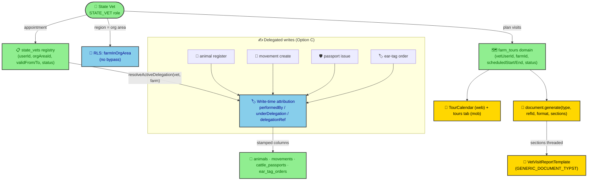

# Plan: STATE VET Capability (region-bounded act-on-behalf, tour calendar, section-selectable PDF)

**Date:** 2026-07-17
**Status:** Draft (planning artifact — no application code beyond illustrative snippets)
**Directory:** `/home/goce/appz/rocky`
**ADR:** `apps/docs/content/ADR/0106-state-vet-capability.md` (raised Proposed)

---

## 1. Summary (North Star)

Rocky has **no "act on behalf of a farmer" primitive** and **no tour/calendar entity**. A *state veterinarian* is a **region (org-area) regulator**, not a superuser. This plan adds three coordinated capabilities:

1. **RBAC + regulatory registry** — a new `STATE_VET` role (org-scoped, cloned FARMER permission set + the vet's existing org read/write) and a new `state_vets` regulatory table that records who is appointed to which region, with validity and status. **No RLS bypass** — region access reuses the existing `farmInOrgArea` fragment.
2. **Write-time attribution** — when a state vet performs an animal registration / movement / passport / ear-tag, the record is stamped `performedBy = vet`, `underDelegation = true`, `delegationRef → state_vets.id`, so the audit reads *"state vet acted under delegation for farm X"*. The farmer's `farm_subjects` row is **never** touched (Option C, not Option A/B).
3. **Tour domain + calendar + section-selectable PDF** — a new `farm_tours` (vet visit) entity with a real data-bound calendar on web (replacing the demo `calendar-1.tsx`) and a mobile screen; plus a `sections` option threaded through the PDF pipeline and a sample `vet-visit-report` template (the user will supply exact section contents later).

> **Critical constraint from scout:** "VS" in this codebase = **Veterinary *Station*** (`vs_contracts`/`vs_assignments`) — servicing metadata, **not** delegation and **not** state vet. Do **not** reuse it. A `current_farm` / impersonation session var does **not** exist and is **not** introduced.

**Jurisdiction gating is bidirectional (D0):** the capability must be turn-off-able **both ways** — a heavily-regulated country disables State Vet (a feature it may not permit), and a **non-EU** country hides EU-only regulation features (EUDR, CHED/IMSOC) it does not apply. One mechanism serves both directions (see Pillar 0): the `RuleSet` (ADR-0030) already carries the EU-direction flags (`euAligned`, `eudr.enabled`, `imsoc.enabled`); we extend it uniformly and make `modules` visibility param-driven. **Every flag defaults `false`** → install is safe in any jurisdiction.

---

## 2. Architecture Overview



*Fig. 1 — State vet flows: region-bounded RLS + regulatory registry drives write-time attribution; a separate tour domain feeds the calendar UI and a section-selectable PDF.*

---

## 3. The Four Pillars → Concrete Changes

### Pillar 0 — Jurisdiction capability registry (bidirectional gating)

The kill-switch must work **both ways**: a heavily-regulated country disables State Vet, and a non-EU country hides EU-only regulation features (EUDR, CHED/IMSOC). Both directions ride the *same* infrastructure — the `RuleSet` (ADR-0030) is the single jurisdiction capability map and already carries the EU-direction flags (`euAligned`, `eudr.enabled`, `imsoc.enabled`); we add a symmetric `stateVet: { enabled, delegation, tour, pdfSections }` built from `STATE_VET_*` `system_parameters`. Module visibility becomes param-driven (one column, both directions): a nullable `modules.visibilityParam` points at a `system_parameters` code, and effective visibility = `isActive && (!visibilityParam || param==="true")`. The `state_vet` module binds `STATE_VET_ENABLED`; the `eudr`/`imsoc` modules bind `EUDR_ENABLED`/`IMSOC_ENABLED` — so EU-only modules auto-hide in non-EU *exactly* like State Vet auto-hides when disabled.

| Layer | Change | Shape |
|---|---|---|
| RuleSet (system domain) | Add `stateVet: { enabled, delegation, tour, pdfSections }` to `RuleSet` + read in `buildRuleSet` from `STATE_VET_*` params (mirror `farmerCanAdminister`) | `packages/domains/system/src/rule-set.ts` |
| system_parameters seed | `STATE_VET_ENABLED` (master), `STATE_VET_DELEGATION`, `STATE_VET_TOUR`, `STATE_VET_PDF_SECTIONS` — **all default `"false"`, `isEditable=true`, `group="stateVet"`** | `seed.ts` |
| modules visibility | Add nullable `visibilityParam` (varchar) to `modules`; effective visibility = `isActive && (!visibilityParam || param==="true")`. Seed `state_vet` module `visibilityParam="STATE_VET_ENABLED"`; EU-only modules (`eudr`, `imsoc`) `visibilityParam="EUDR_ENABLED"`/`"IMSOC_ENABLED"` | `schema/sm/modules.ts`, `seed.ts` |
| PolicyEngine gate | Mirror `farmerCanAdminister` block: deny `STATE_VET` role if `!ruleSet.stateVet.enabled`; deny delegated-farmer writes if `!ruleSet.stateVet.delegation` | `packages/authorization/src/policies/engine.ts` |
| Authoritative service check | T5's `StateVetRegistryService.resolveActiveDelegation` consults `ruleSet.stateVet.delegation` — refuses to stamp if off (defense-in-depth) | `packages/domains/state-vet/` |
| Superadmin UI | `feature-flags/page.tsx` + `system-parameters/page.tsx` already generic over `modules`/`system_parameters` — new module + params appear automatically; extend flag display to show effective (param-gated) visibility | `apps/web/app/(admin)/*` |

**Illustrative snippet — `RuleSet` extension (`rule-set.ts`):**

```ts
export interface RuleSetStateVet {
  enabled: boolean;      // master kill-switch (module visible + role usable)
  delegation: boolean;   // act-as-farmer write attribution
  tour: boolean;         // tour calendar vertical
  pdfSections: boolean;  // section-selectable PDF
}
// in RuleSet:  stateVet: RuleSetStateVet;
// in buildRuleSet:
stateVet: {
  enabled:     byCode.get("STATE_VET_ENABLED")?.value     !== "false",
  delegation:  byCode.get("STATE_VET_DELEGATION")?.value !== "false",
  tour:        byCode.get("STATE_VET_TOUR")?.value        !== "false",
  pdfSections: byCode.get("STATE_VET_PDF_SECTIONS")?.value!== "false",
},
```

**Illustrative snippet — `modules.visibilityParam` + default-off seed:**

```ts
// schema/sm/modules.ts
visibilityParam: varchar("visibility_param", { length: 50 }), // → system_parameters.code; module shown only if param true

// seed.ts (safe defaults for regulated/non-EU jurisdictions)
{ name: "state_vet", title: "State Vet",    type: MODULE_TYPE.FEATURE, isActive: true, visibilityParam: "STATE_VET_ENABLED", route: "/admin/state-vet" },
{ name: "eudr",      title: "EUDR",         type: MODULE_TYPE.FEATURE, isActive: true, visibilityParam: "EUDR_ENABLED",      route: "/admin/eudr" },
{ name: "imsoc",     title: "CHED / IMSOC", type: MODULE_TYPE.FEATURE, isActive: true, visibilityParam: "IMSOC_ENABLED",     route: "/admin/imsoc" },
{ code: "STATE_VET_ENABLED", value: "false", dataType: "BOOLEAN", group: "stateVet", isEditable: true, description: "Enable State Vet region delegation (off by default)" },
{ code: "EUDR_ENABLED",      value: "false", dataType: "BOOLEAN", group: "eudr",      isEditable: true, description: "Show EUDR features (EU jurisdictions only)" },
```

> **Posture:** every flag **defaults `false`** → install is safe everywhere. An island jurisdiction seeds `STATE_VET_ENABLED=true`; an EU jurisdiction seeds `EUDR_ENABLED`/`IMSOC_ENABLED=true`; a non-EU regulated country leaves both off (State Vet disabled *and* EU features hidden). No code fork, no env var.

### Pillar 1 — RBAC: new `STATE_VET` role + permissions

| File | Change | Shape |
|---|---|---|
| `packages/database/src/constants/user-role.ts` | Add `STATE_VET` to `USER_ROLE` + `USER_ROLE_VALUES` | follows `as const` enum-object convention (no TS `enum`) |
| `packages/database/src/constants/role-hierarchy.ts` | Add `[USER_ROLE.STATE_VET]: 65` (above `VD_STAFF` 60) | privilege ordering |
| `packages/database/src/constants/rls-role-groups.ts` | Add `STATE_VET` to `ORG_SCOPED_ROLES` | app-layer access level = `organization` |
| `packages/database/src/constants/org-read-roles.ts` | Add `STATE_VET` to `ORG_READ_ROLE_VALUES` | drives `rlsForFarmColumn` org-area **read** |
| `packages/database/src/constants/write-roles.ts` | Add `STATE_VET` to `WRITE_ROLE_VALUES` | drives `adminAndVetWrite` / `withCheck` **write** |
| `packages/validators/src/rbac/permissions.ts` | Add `TourRead: "tour:read"`, `TourWrite: "tour:write"` (isomorphic SSOT) | see existing `ReportGenerate` entry |
| `packages/database/src/seed.ts` | `PERMISSION_DEFS` add `tour:read/write`; `ROLE_DEFS` add `STATE_VET` (priority e.g. `ROLE_PRIORITY.HIGH`); `ROLE_PERM_MAP.STATE_VET` = cloned FARMER set + VETERINARIAN set + `tour:*` + `report:*` | WO-101 drift test enforces parity with `Permissions` const |

**Illustrative snippet — `user-role.ts`:**

```ts
export const USER_ROLE = {
  SUPER_ADMIN: "SUPER_ADMIN",
  // ... existing 8 roles ...
  FARMER: "FARMER",
  STATE_VET: "STATE_VET",   // NEW — region(org-area) regulator, NOT superadmin
} as const;

export const USER_ROLE_VALUES = createEnumValues([
  USER_ROLE.SUPER_ADMIN,
  // ...
  USER_ROLE.FARMER,
  USER_ROLE.STATE_VET,   // NEW
] as const);
```

**Illustrative snippet — `ROLE_PERM_MAP.STATE_VET` (seed.ts):**

```ts
STATE_VET: [
  // Cloned FARMER permission set (farmer REMAINS untouched — Option C)
  "animal:read", "animal:register", "animal:write", "animal:death",
  "movement:read", "movement:write",
  "eartag:read", "eartag:order",
  "birth_notification:read", "birth_notification:write",
  "pasture:read", "pasture:declare",
  "hk:farm:read", "health:read",
  // + the vet's existing org read/write
  "eartag:allocate", "report:read", "report:generate",
  // + new tour capability
  "tour:read", "tour:write",
],
```

> **Note on "VS":** `vs_contracts`/`vs_assignments` (Veterinary *Station*) are servicing metadata and feed **no** RLS or farmer-authority delegation. They are **out of scope** and must not be repurposed. The new `state_vets` registry is the correct home for the state-vet appointment.

---

### Pillar 2 — Regulatory registry (`state_vets`) + write-time attribution

**(a) New registry table** — `packages/database/src/schema/reg/state-vets.ts` (new `reg` regulatory folder, sibling to `hk`/`an`):

```ts
export const STATE_VET_STATUS = { APPOINTED: "APPOINTED", ACTIVE: "ACTIVE", SUSPENDED: "SUSPENDED", EXPIRED: "EXPIRED" } as const;

export const stateVets = pgTable("state_vets", {
  id: uuid("id").primaryKey().defaultRandom(),
  userId: uuid("user_id").notNull().references(() => users.id),     // SM user
  orgAreaId: uuid("org_area_id").notNull().references(() => orgAreas.id), // region
  appointmentRef: varchar("appointment_ref", { length: 64 }).notNull(),
  validFrom: timestamp("valid_from").notNull(),
  validTo: timestamp("valid_to"),
  status: stateVetStatusPgEnum("status").notNull().default("ACTIVE"),
  createdAt: timestamp("created_at").notNull().defaultNow(),
  createdBy: uuid("created_by"),
}, (t) => [
  index("idx_state_vets_user").on(t.userId),
  index("idx_state_vets_org").on(t.orgAreaId),
  pgPolicy("state_vet_access_policy", {
    as: "permissive", to: "public", for: "all",
    using: sql`(
      ${isRoleIn(...ADMIN_ROLES)}
      OR ${t.orgAreaId} = ${currentOrgId}
      OR ${t.userId} = ${currentUserId}
    )`,
  }),
]);
```

**(b) New package** `packages/domains/state-vet/` (StateVet Bot) owning `StateVetRegistryService`:

- `resolveActiveDelegation(vetUserId, farmId): Promise<Result<{stateVetId, orgAreaId}, StateVetError>>` — looks up an `ACTIVE` row for `(userId, orgAreaOf(farmId))` within `validFrom..validTo`; **this is the authoritative region check** (RLS is defense-in-depth only).
- `validateDelegationRef(ref, vetUserId, farmId): Promise<Result<boolean, StateVetError>>` — explicit ref path.
- Register in `apps/api/src/app.module.ts` providers + `AppModule` constructor `onModuleInit` (no registry needed — it's a service, not a PDF template).

**(c) Attribution columns** on the four entity tables (nullable — no backfill, no RLS change on these tables):

- `packages/database/src/schema/an/animals.ts`
- `packages/database/src/schema/an/movements.ts`
- `packages/database/src/schema/an/cattle-passports.ts`
- `packages/database/src/schema/an/ear-tag-orders.ts`

```ts
performedBy: uuid("performed_by"),                       // → sm users (the vet)
delegationRef: uuid("delegation_ref"),                  // → state_vets.id
underDelegation: boolean("under_delegation").notNull().default(false),
```

**(d) Attribution wiring** — each affected domain service stamps at write time. Worker must confirm the exact "registration" insert target (e.g. `animal_registrations` vs `animals`); the pattern is:

```ts
// inside AnimalService.register(...) — illustrative
const delegation = await this.stateVetRegistry.resolveActiveDelegation(principal.id, farmId);
const stamp = delegation.isOk()
  ? { performedBy: principal.id, underDelegation: true, delegationRef: delegation.value.stateVetId }
  : { performedBy: principal.id, underDelegation: false, delegationRef: null };
// merge stamp into the insert values
```

The optional request field `delegationRef?` (in the relevant Dumb Zod schemas under `packages/validators/src/api/`) lets a vet pin an explicit appointment; when omitted, the service auto-resolves from org area.

---

### Pillar 3 — PDF: section-selectable pipeline + sample template

| File | Change | Shape |
|---|---|---|
| `packages/validators/src/api/document.api.ts` | Extend `documentGenerateRequestSchema` + `DocumentGenerateRequest` with `sections?: string[]` | keep `satisfies z.ZodType<...>` + guillotine |
| `packages/pdf/src/engine/document-template.ts` | Widen `fetchData(refId, opts?: DocumentFetchOptions)` + `mapToModel(data, opts?)`; add `interface DocumentFetchOptions { sections?: string[] }` | **optional opts → backward-compatible** for the 7 existing templates |
| `packages/pdf/src/services/document.service.ts` | `DocumentGenerateInput` gains `sections?`; thread into `template.fetchData(refId, { sections })` / `mapToModel(model, { sections })` | see `generate()` lines 60-120 |
| `packages/pdf/src/templates/vet-visit-report.template.ts` | **NEW** `VetVisitReportTemplate extends BaseDocumentTemplate`, `type = "vet-visit-report"`, uses `GENERIC_DOCUMENT_TYPST` (already renders arbitrary `fields[]`), conditionally omits blocks by `sections` | sample only — user supplies final sections |
| `apps/api/src/app.module.ts` | `useFactory` provider + `registry.register(...)` for the new template (mirror `InspectionFormTemplate` at ~L439) | no new router (reuses `document.generate`) |

**Illustrative snippet — `document-template.ts` widening (safe for existing 7 templates):**

```ts
export interface DocumentFetchOptions { sections?: string[] }

export interface DocumentTemplate<TData = unknown, TModel = Record<string, unknown>> {
  // ...
  fetchData(refId: string, opts?: DocumentFetchOptions): Promise<Result<TData, DocumentError>>;
  mapToModel(data: TData, opts?: DocumentFetchOptions): TModel | Promise<TModel>;
}
// BaseDocumentTemplate already declares these abstract; widen its signatures identically.
```

**Illustrative snippet — section gating inside the sample template's `mapToModel`:**

```ts
async mapToModel(data: VetVisitData, opts?: DocumentFetchOptions) {
  const sections = opts?.sections ?? ["farm", "animals", "checklist", "signature"]; // default = all
  const model: Record<string, unknown> = { title: "Vet Visit Report" };
  if (sections.includes("farm"))      model.farm = data.farm;
  if (sections.includes("animals"))   model.animals = data.animals;
  if (sections.includes("checklist")) model.checklist = data.checklist;
  if (sections.includes("signature")) model.signature = data.signature;
  return model;
}
```

The `GENERIC_DOCUMENT_TYPST` already consumes arbitrary `fields[]`, so chosen sections render without a new `.typ` layout (a dedicated layout is a future refinement, noted as out-of-scope).

> **PDF lineage:** cite **ADR-0082** (PDF/A-3 + PAdES) and **ADR-0084** (offline signed-QR) in the ADR — the `vet-visit-report` should optionally implement `mapToCredential` for an offline-verifiable QR like `InspectionFormTemplate` does.

---

### Pillar 4 — Tour domain + calendar UI (web + mobile)

| File | Change | Shape |
|---|---|---|
| `packages/database/src/schema/reg/farm-tours.ts` (or `packages/domains/tour/src/schema/`) | **NEW** `farm_tours` table: `vetUserId, farmId, scheduledStart, scheduledEnd, purpose, status, notes, checklistRef` | RLS: `rlsForFarmColumn(farmId)` (admin + org-area + createdBy) + `createdBy` audit, mirrors `farm_subjects` policy |
| `packages/domains/tour/` | **NEW** package `TourService` (Result-based) + RLS | Status enum `TOUR_STATUS = { PLANNED, IN_PROGRESS, COMPLETED, CANCELLED }` |
| `apps/api/src/routers/tour.router.ts` | **NEW** router: `create`, `listByDateRange`, `complete`, `cancel` — `@Policy({ action: "tour:write"/"tour:read", ... })` | register in `app.module.ts`; regenerate `packages/trpc/src/generated/server.ts` |
| `apps/web/components/calendar-1.tsx` | **REPLACE** hardcoded demo with data-bound `TourCalendar` querying `tour.listByDateRange` (keep export name to avoid breaking imports; grep usages first) | web admin, Admin Bot |
| `apps/mob/app/(tabs)/tours/index.tsx` + `[id].tsx` | **NEW** mobile list + detail screen bound to `tour.*` (`AppRouter`) | Mobile Bot + Frontend Bot |

**Illustrative snippet — `farm_tours` RLS (reuse `rlsForFarmColumn`):**

```ts
export const farmTours = pgTable("farm_tours", {
  id: uuid("id").primaryKey().defaultRandom(),
  vetUserId: uuid("vet_user_id").notNull().references(() => users.id),
  farmId: uuid("farm_id").notNull().references(() => farms.id, { onDelete: "cascade" }),
  scheduledStart: timestamp("scheduled_start").notNull(),
  scheduledEnd: timestamp("scheduled_end"),
  purpose: varchar("purpose", { length: 256 }),
  status: tourStatusPgEnum("status").notNull().default("PLANNED"),
  notes: text("notes"),
  checklistRef: uuid("checklist_ref"),
  createdBy: uuid("created_by"),
}, (t) => [
  index("idx_farm_tours_farm").on(t.farmId),
  index("idx_farm_tours_vet").on(t.vetUserId),
  pgPolicy("farm_tour_access_policy", {
    as: "permissive", to: "public", for: "all",
    using: rlsForFarmColumn(t.farmId),
    withCheck: isRoleIn(...WRITE_ROLE_VALUES),
  }),
]);
```

**Business rule "must visit all farms in region":** implement as a **soft coverage report** (count of `COMPLETED` tours vs total farms in the vet's org area) — **not** a hard gate. Hard enforcement is deferred (out of scope) to avoid blocking tour creation.

---

## 4. Safe Build Sequence (todos follow this order)

```
T0 (gating) ─▶ DB/migration ─▶ RBAC role+perms ─▶ state_vets domain+RLS ─▶ attribution wiring
      ─▶ tour domain+router ─▶ PDF section mechanism+sample ─▶ calendar UI (web+mob)
      ─▶ ADR + RobotFarm pass + guardians
```

Rationale: schema + role/perm seed first (everything depends on them); then the registry + attribution (Option C core); then tour (independent entity); then PDF threading (independent); then UI; finally governance (ADR + RobotFarm index + `pnpm ci:checks` + full `pnpm build`).

---

## 5. Premortem — What Could Go Wrong & Mitigations

| # | Risk (assumption that could be wrong) | If wrong → | Mitigation |
|---|---|---|---|
| R1 | STATE_VET's org-area RLS relies on the vet's SM `org` == the `org_area`. If the org hierarchy differs, `farmInOrgArea` won't match. | Vet sees no farms. | `state_vets.orgAreaId` is the **authoritative** region; `resolveActiveDelegation` enforces exact `orgAreaOf(farm) == stateVet.orgAreaId` at write time. RLS = defense-in-depth only. |
| R2 | Cloning FARMER perms + vet perms over-/under-grants (e.g. farmer lacks passport admin). | Wrong privilege surface. | Enumerate the cloned set explicitly in `ROLE_PERM_MAP.STATE_VET`; **WO-101 drift test** fails on any mismatch between `Permissions` const and seed. Run `pnpm check:drift`. |
| R3 | Adding attribution columns to 4 core tables breaks migrations / RLS. | Build-rot or policy recursion. | Columns are **nullable** (no backfill); RLS on those tables is unchanged (only `state_vets` gets a new policy). Use `scripts/db-recreate.sh` for clean state. |
| R4 | Widening `DocumentTemplate.fetchData/mapToModel` signatures breaks the 7 existing templates. | `pnpm build` red. | Opts param is **optional & ignored** by existing impls (TS allows fewer-param methods to satisfy the interface). Add a unit test asserting all 7 still generate after the change. |
| R5 | "Visit all farms" hard gate is ambiguous / unenforceable. | Blocks tour creation. | Implement as **soft coverage report**, not a gate. Defer hard enforcement (out of scope). |
| R6 | Replacing `calendar-1.tsx` breaks existing imports. | Web build red. | `grep -rn "calendar-1"` before replacing; preserve the component export name; bind only the new `tour.*` procedures. |
| R7 | `ci:checks` is green but `pnpm build` (turbo) is red (known gap). | Shipped broken build. | **Run full `pnpm build`** before declaring done; `ci:checks` alone is insufficient (per AGENTS.md warning). |
| R8 | ADR mermaid fails `mmdc` validation when embedded. | `check:adrs` red / broken diagram. | Validate the diagram with `mmdc` **before** embedding (design-doc-mermaid skill rule). |
| R9 | Gating is one-directional only (disables State Vet but leaves EU-only features visible in non-EU, or vice-versa). | Inconsistent jurisdiction posture; features show where unlawful. | Make `modules.visibilityParam` + `RuleSet` flags the **single** bidirectional mechanism (State Vet off AND EU features hidden both flow from `system_parameters` defaults). |
| R10 | `modules.visibilityParam` migration breaks the generic Feature Flags UI. | Web build red / flags page blank. | `visibilityParam` is **nullable + additive** (old modules have `null` → visibility = `isActive`); `feature-flags/page.tsx` computes effective visibility client-side. |

---

## 6. TODO List (authoritative — embedded per deliverable; no `todo` tool available in this session, so this table is the source of truth)

| id | title | owning package / bot | files touched | code example / snippet |
|----|-------|---------------------|--------------|------------------------|
| T0 | **Jurisdiction capability registry (bidirectional gating)** — `RuleSet.stateVet` + `STATE_VET_*` params (default false), `modules.visibilityParam` + EU-module bindings, `PolicyEngine` gate (mirror `farmerCanAdminister`), `resolveActiveDelegation` consults flag; Feature Flags page shows effective visibility | Database + System + Authorization Bots | `packages/domains/system/src/rule-set.ts`, `packages/database/src/schema/sm/modules.ts`, `packages/database/src/seed.ts`, `packages/authorization/src/policies/engine.ts`, `apps/web/app/(admin)/feature-flags/page.tsx` | see Pillar 0 snippets (`stateVet` RuleSet object + `visibilityParam` seed) |
| T1 | **DB + constants migration** — add `STATE_VET` to role enum, hierarchy, RLS groups, org-read + write role arrays | Database Bot | `packages/database/src/constants/user-role.ts`, `role-hierarchy.ts`, `rls-role-groups.ts`, `org-read-roles.ts`, `write-roles.ts` | `USER_ROLE.STATE_VET: "STATE_VET"` + `USER_ROLE_VALUES` push; `[USER_ROLE.STATE_VET]: 65`; add `STATE_VET` to `ORG_SCOPED_ROLES`, `ORG_READ_ROLE_VALUES`, `WRITE_ROLE_VALUES` |
| T2 | **`state_vets` registry table + migration** — userId↔orgArea, appointmentRef, validFrom/To, status, RLS | Database Bot | NEW `packages/database/src/schema/reg/state-vets.ts`; `reg/index.ts`; migration via `pnpm generate` + `fix-rls-sql.mjs` | see Pillar 2(a) snippet (`state_vets` pgTable + `state_vet_access_policy` using `isRoleIn(ADMIN_ROLES) OR orgAreaId = currentOrgId OR userId = currentUserId`) |
| T3 | **Attribution columns migration** — `performedBy` / `delegationRef` / `underDelegation` on 4 entity tables | Database Bot | `packages/database/src/schema/an/animals.ts`, `movements.ts`, `cattle-passports.ts`, `ear-tag-orders.ts` | see Pillar 2(c) snippet (3 nullable columns, `underDelegation default false`) |
| T4 | **RBAC permissions + seed** — `tour:read/write` const, `PERMISSION_DEFS`, `ROLE_DEFS`, `ROLE_PERM_MAP.STATE_VET` (cloned FARMER+VET) | Validation Bot + Database Bot | `packages/validators/src/rbac/permissions.ts`, `packages/database/src/seed.ts` | `TourRead: "tour:read"`, `TourWrite: "tour:write"`; `STATE_VET: [ "animal:register", "movement:write", "eartag:order", "tour:read", "tour:write", ... ]` |
| T5 | **StateVet domain package** — `StateVetRegistryService` (`resolveActiveDelegation`, `validateDelegationRef`), RLS wiring, app.module registration | StateVet Bot (new) | NEW `packages/domains/state-vet/` (service + `index.ts`); `apps/api/src/app.module.ts` providers | `resolveActiveDelegation(vetUserId, farmId): Result<{stateVetId, orgAreaId}, StateVetError>` — authoritative region check (Pillar 2b) |
| T6 | **Attribution wiring in 4 services** — stamp at write time via `StateVetRegistryService`; optional `delegationRef?` request field | Animal / Movement / Passport / EarTag Bots | `packages/domains/animal\|movement\|passport\|eartag` services; relevant Dumb Zod in `packages/validators/src/api/` | see Pillar 2(d) snippet (merge `stamp` into insert) |
| T7 | **Tour domain + router** — `farm_tours` schema (RLS via `rlsForFarmColumn`), `TourService` (Result), `tour.router.ts`, register + regenerate tRPC | Tour Bot (new) + API Bot | NEW `packages/domains/tour/`, NEW `apps/api/src/routers/tour.router.ts`, `apps/api/src/app.module.ts`, `packages/trpc/src/generated/server.ts` | `farm_tours` snippet (Pillar 4); router `@Policy({ action: "tour:write", organization: true })`; `nestjs-trpc generate` |
| T8 | **PDF section mechanism + sample template** — `sections?` through schema→template→service; `VetVisitReportTemplate` | PDF Bot + Validation Bot | `packages/validators/src/api/document.api.ts`, `packages/pdf/src/engine/document-template.ts`, `packages/pdf/src/services/document.service.ts`, NEW `packages/pdf/src/templates/vet-visit-report.template.ts`, `apps/api/src/app.module.ts` | see Pillar 3 snippets (`DocumentFetchOptions`, widened interface, section gating, `registry.register`) |
| T9 | **Calendar UI — web** — replace demo `calendar-1.tsx` with data-bound `TourCalendar` | Admin Bot | `apps/web/components/calendar-1.tsx` (rewrite, keep export name) | `useQuery(tour.listByDateRange, { from, to })` → render events; grep usages first |
| T10 | **Calendar UI — mobile** — new tours tabs bound to `tour.*` | Mobile Bot + Frontend Bot | NEW `apps/mob/app/(tabs)/tours/index.tsx`, `[id].tsx` | list + detail using `AppRouter` `tour.listByDateRange` / `tour.complete` |
| T11 | **ADR + RobotFarm pass + guardians** — write `0106-state-vet-capability.md`, update root `AGENTS.md` Child RobotFarm Index (StateVet Bot + Tour Bot), create child `AGENTS.md` for new packages, run `pnpm ci:checks` **+ full `pnpm build`** + `check:adrs`/`check:drift` | Docs Bot + Overseer | `apps/docs/content/ADR/0106-state-vet-capability.md`, root `AGENTS.md`, new child `AGENTS.md` files, WORKORDER | ADR from template; mermaid validated with `mmdc`; cite ADR-0006/0018/0019/0021/0022/0032/0082/0084; run `pnpm build` (not just `ci:checks`) |

**Build order:** T0 → T1 → T2 → T3 → T4 → T5 → T6 → T7 → T8 → T9 → T10 → T11.

---

## 7. Open Questions (parked, non-blocking)

1. **SM org vs region:** assumed the state vet's SM `org` equals the `org_area`. `state_vets.orgAreaId` is authoritative regardless; confirm whether the user record also carries the org area or only the registry does.
2. **Exact cloned FARMER set:** T4 enumerates a proposed set — confirm with the user's regulation which farmer perms a state vet inherits (passport admin is intentionally **excluded** from FARMER, but a vet may need `passport:create`).
3. **`delegationRef` flow:** default = auto-resolve from org area; explicit per-request ref accepted. Confirm this is acceptable vs always-required.
4. **Tour checklist schema:** `checklistRef` is a UUID pointer — confirm whether it points to a new `tour_checklists` table or a JSON column. Soft coverage report is the agreed interim.

---

## 8. Governance Checklist (per root AGENTS.md)

- [x] Result monad sovereignty respected (services return `Result<T,E>` from `@rocky/domains-shared`; routers use `createResultUnwrapper(<X>_TRPC_ERROR_MAP)`, never `result.data`).
- [x] Zod `satisfies z.ZodType<...>` + NoDrift/SubtypeGuillotine on every new/extended schema; `as` forbidden; enum flow constants→pgEnum→Zod.
- [x] `.mjs` for JS, ESM `.js` imports, no `console.log`/TODO/FIXME/XXX.
- [x] New role/perm drift-tested (WO-101) — `Permissions` const + seed `PERMISSION_DEFS`/`ROLE_DEFS`/`ROLE_PERM_MAP`.
- [x] New tables carry pgPolicy from `rls-helpers` fragments; no new session var / `current_farm` introduced.
- [x] tRPC regenerated after router changes; frontends consume `AppRouter`.
- [x] New ADR (ADR-0033 house standard) + RobotFarm pass on owning `AGENTS.md` + root index update.
- [x] `pnpm ci:checks` **and** full `pnpm build` run before done (ci:checks does not run the build).
