# ADR-0003: Execution Pipeline as Composable Stages

| Key            | Value               |
| -------------- | ------------------- |
| **Status**     | Accepted            |
| **Date**       | 2026-07-05          |
| **Author**     | Architecture Review |
| **Supersedes** | None                |
| **Superseded** | None                |

---

## Context

The current request execution flow is implemented as NestJS middleware (`ProtectedMiddleware`, `RLSMiddleware`) applied via `@UseMiddlewares` decorators. Each middleware performs one step (session check, SET LOCAL for RLS, permission check) and optionally enriches the context.

This approach has limitations:

1. **Transport coupling**: Middleware is tRPC-specific. Cron jobs, RabbitMQ consumers, and CLI commands cannot reuse the same middleware.
2. **Ordering is implicit**: The execution order depends on decorator ordering, which is easy to misconfigure.
3. **Monolithic `ExecutionService.run()`**: As the architecture grows (audit, tracing, metrics, feature flags, timeouts, retries, rate limiting, idempotency), a single `run()` method accumulates too many responsibilities.
4. **No lifecycle hooks**: There is no standard way to execute code before/after the business handler (e.g., start trace span before, record audit after).

## Decision

**Model the execution pipeline as composable `ExecutionStage` components.** Each stage performs one concern and delegates to the next stage. The pipeline is configured once and reused across all transports.

```typescript
export interface ExecutionStage {
  readonly name: string;
  execute(ctx: ExecutionContext, next: () => Promise<void>): Promise<void>;
}
```

### Built-in Stages

```txt
TransactionStage   → BEGIN transaction
RLSStage           → SET LOCAL session variables on transactional connection
TraceStage         → Start/end OpenTelemetry span
MetricsStage       → Record duration and success/failure
PolicyStage        → Evaluate @Policy({ action: "..." })
AuditStage         → Subscribe to ExecutionCompleted event, record audit trail
EventsStage        → Emit ExecutionStarted / ExecutionCompleted / ExecutionFailed events
```

### Composition

```typescript
const pipeline = new ExecutionPipeline([
  TransactionStage,
  RLSStage,          // Must be after TransactionStage — needs tx connection
  TraceStage,
  MetricsStage,
  PolicyStage,       // Must be before handler — rejects unauthorized requests
  EventsStage,       // Emits lifecycle events (other stages subscribe)
  AuditStage,        // Subscribes to ExecutionCompleted
]);

await pipeline.run(ctx, handler);
```

Stages are composed in order. Each stage can:

- Enrich the context before passing to the next stage
- Wrap the next stage's execution (e.g., transaction BEGIN/COMMIT)
- Skip remaining stages (e.g., PolicyStage throws on unauthorized)
- Subscribe to lifecycle events (e.g., AuditStage listens for ExecutionCompleted)

## Consequences

### Positive

1. **Transport-agnostic**: The same pipeline runs for tRPC, REST, GraphQL, RabbitMQ, cron, CLI.
2. **Single-responsibility stages**: Each stage is independently testable, replaceable, and removable.
3. **Explicit ordering**: The pipeline array defines execution order unambiguously.
4. **Extensible**: Future concerns (feature flags, timeouts, retries, rate limiting, idempotency) are new stages — no existing code changes.
5. **Lifecycle events**: Stages communicate via events rather than direct calls. Audit doesn't need to know about ExecutionPipeline internals.

### Negative

1. **Execution order is critical**: `RLSStage` must follow `TransactionStage`, `PolicyStage` must precede the handler. Misordering causes subtle bugs. Mitigated by well-documented stage dependencies.
2. **Debugging complexity**: Stack traces span multiple stages. Mitigated by structured logging with stage names.
3. **Performance overhead**: Each stage adds a function call and Promise resolution. For the 7 built-in stages, overhead is negligible (< 0.5ms).

## Stage Dependencies

```mermaid
flowchart LR
    Req(["🔵 Request"]) --> Txn["🔒 TransactionStage<br/>BEGIN transaction"]
    Txn --> RLS["🛡️ RLSStage<br/>SET LOCAL on tx connection<br/><i>must follow TransactionStage</i>"]
    RLS --> Trace["📊 TraceStage<br/>start/end OTel span"]
    Trace --> Metrics["⏱️ MetricsStage<br/>record duration"]
    Metrics --> Policy["🔑 PolicyStage<br/>evaluate @Policy(action)<br/><i>must precede handler</i>"]
    Policy --> Events["📡 EventsStage<br/>emit Started/Completed/Failed"]
    Events --> Handler(["⚙️ Handler executes"])

    Events -.->|"execution:completed"| Audit["📝 AuditStage<br/>subscribe → record audit trail"]

    classDef stage fill:#87CEEB,stroke:#333,stroke-width:2px,color:darkblue
    classDef gate fill:#FFD700,stroke:#333,stroke-width:2px,color:black
    classDef sub fill:#90EE90,stroke:#333,stroke-width:2px,color:darkgreen
    classDef io fill:#E6E6FA,stroke:#333,stroke-width:2px,color:darkblue

    class Txn,RLS,Trace,Metrics,Events stage
    class Policy gate
    class Audit sub
    class Req,Handler io
```



_Fig. 1 — The composable stage chain. Ordering is load-bearing: `RLSStage` must follow `TransactionStage` (needs the tx connection) and `PolicyStage` must precede the handler. `AuditStage` is not in the chain — it subscribes to `execution:completed` emitted by `EventsStage`._

## Alternatives Considered

### A: Keep NestJS middleware model

**Rejected.** NestJS middleware is transport-specific. A `RLSMiddleware` written for tRPC cannot be reused by a RabbitMQ consumer or cron job.

### B: Single `ExecutionService.run()` with hardcoded steps

**Rejected.** This is the initial proposal but fails the extensibility test. Adding a `FeatureFlagStage` would require modifying the core `run()` method. Composable stages avoid this.

### C: NestJS Interceptors

**Rejected.** Interceptors are HTTP-specific and cannot wrap non-HTTP execution (cron, RabbitMQ).

## References

- [AUTH_ARCHITECTURE.md](https://github.com/r0b0tr0n1k/rocky/blob/main/docs/AUTH_ARCHITECTURE.md) — Refinement 7: Execution Pipeline and Refinement 8: Audit via Lifecycle Events
- `apps/api/src/trpc/middlewares/` — current tRPC-specific middlewares
