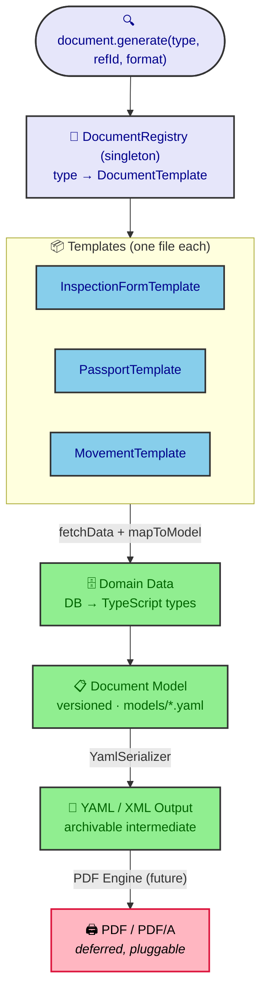

# ADR-0009: Document Generation Architecture — Scalable YAML/XML Framework

| Key            | Value                            |
| -------------- | -------------------------------- |
| **Status**     | Accepted                         |
| **Date**       | 2026-07-05                       |
| **Author**     | Architecture Review              |
| **Supersedes** | None                             |

---

## Context

The Rocky system has multiple document types that must be generated as printable exports:

- **Cattle Passports** — The central legal document of the I&R system, issued per animal
- **Inspection Forms** — Printed by CPC for on-spot visits with animal checklists
- **Movement/Transport Declarations** — Legal transport documents for animal movements
- **Vaccination & Health Certificates** — Required for export and food chain entry
- **Slaughter/Death Certificates** — Legal end-of-life documentation
- **Ear Tag Orders / Tagging Receipts** — Physical tag inventory and application records
- **Farm Book Bundles** — Keeper registration documentation

The existing codebase has:

1. **`models/inspection-form.yaml`** — A complete data model definition for inspection forms
2. **`inspection.printForm`** — A tRPC endpoint that returns JSON data conforming to the model
3. **Zero PDF generation code** — No pdfmake, pdfkit, Playwright, or any other rendering library
4. **Zero document template code** — No abstraction for mapping domain data to printable output

The `docs/old/future.md` mandates **PDF/A digital archiving** with QR codes and cryptographic seals, but the immediate need is to **enable users to produce YAML/XML output** from the system, with PDF generation deferred as a configurable, environment-specific concern.

## Decision

### Core Architecture

**Build a document generation framework with a pluggable template registry and YAML/XML intermediate output.** The architecture has four layers:



_Fig. 1 — Four-layer generation pipeline (domain data → model → YAML/XML → future PDF), driven by the `DocumentRegistry` singleton that maps a document `type` to a pluggable `DocumentTemplate`._

### Key Design Decisions

#### 1. DocumentTemplate Interface — The Core Abstraction

Every document type implements a single interface:

```typescript
interface DocumentTemplate<TData = unknown, TModel extends Record<string, unknown> = Record<string, unknown>> {
  readonly type: string;           // e.g. 'inspection-form'
  readonly modelPath: string;      // 'models/inspection-form.yaml'
  readonly name: string;           // 'Inspection Form'
  readonly availableFormats: DocumentFormat[];  // ['yaml']
  readonly modelVersion: string;   // Semantic version from the YAML model

  fetchData(refId: string, ctx?: ExecutionContext): Promise<Result<TData, DocumentError>>;
  mapToModel(data: TData): TModel;
}
```

Benefits:

- Adding a new document type = **one file + one registration line**
- No changes to tRPC routers, validators, or the NestJS module
- Templates are `@Injectable()` classes that can inject any repository

#### 2. DocumentRegistry — Pluggable Template Store

A singleton registry that maps `type` → `DocumentTemplate`. Templates register themselves on module init. The generic `document.generate` endpoint looks up the template by type.

#### 3. YAML/XML as Intermediate Format

- **Primary output is YAML** (consistent with existing `models/` directory)
- XML can be added later as a `DocumentFormat` plugin without changing the template interface
- The YAML conforms to the `models/*.yaml` definition for each document type
- YAML is human-readable, version-controllable, and can be archived alongside future PDFs

#### 4. PDF Generation Deferred

The PDF engine is **pluggable** (pdfmake, pdfkit, Playwright, etc.) and will be added when:

- A specific PDF library is chosen
- Environment configuration determines which engine to use
- PDF/A requirements are defined

Until then, the system produces YAML/XML output that can be:

- Downloaded by users
- Emailed (future Nodemailer integration)
- Archived (via existing `archive_documents` table)

#### 5. Generic tRPC Endpoint

```typescript
// Single endpoint for ALL document types
document.generate(input: {
  type: 'inspection-form' | 'passport' | 'movement' | ...;
  refId: string;       // UUID of the domain entity
  format: 'yaml';      // 'xml' later
}) → {
  documentType: string;
  modelVersion: string;
  generatedAt: string;  // ISO 8601
  content: string;      // YAML string
}
```

Existing domain-specific endpoints (`inspection.printForm`) **delegate** to the generic endpoint internally for backward compatibility.

#### 6. QR Codes on Generated Documents

Generated documents (passport, movement declaration, inspection form) SHOULD embed a **QR code**
encoding the document's `refId` / animal identifier. QR generation is inexpensive (a QR library) and
adds field-scan-and-verify to every printed export — a natural companion to the **QR ear tags** in
ADR-0024 and the **PDF/A** rendering in Phase 2/3.

- The QR encodes the same identifier the document already carries; no new schema.
- **QR payload format is a per-jurisdiction RuleSet choice** (ADR-0030) — the default (MK) encodes the
  bare `refId`.
- QR is included in document-generation scope _now_ (it is easy); it is emitted alongside the
  YAML/XML intermediate and rendered onto the PDF when PDF/A lands. This directly satisfies the
  `docs/old/future.md` mandate for QR codes, ahead of the cryptographic-seal work.

### Package Structure

```txt
packages/pdf/
├── package.json              ← @rocky/pdf
├── tsconfig.json             ← extends @rocky/typescript-config
└── src/
    ├── index.ts              ← Barrel export
    ├── engine/
    │   ├── document-template.ts    ← Interface + BaseDocumentTemplate
    │   ├── document-registry.ts    ← Singleton registry
    │   └── yaml-serializer.ts      ← js-yaml wrapper
    ├── templates/
    │   ├── inspection-form.template.ts  ← InspectionFormTemplate
    │   ├── passport.template.ts         ← PassportTemplate
    │   └── movement.template.ts         ← MovementTemplate
    ├── services/
    │   └── document.service.ts     ← Orchestrator
    └── errors/
        └── document.errors.ts      ← Error codes + class
```

### YAML Model Convention

Every document type has a YAML model in `models/<document-type>.yaml`. The model:

- Is the **Single Source of Truth** for the document's data structure
- Lists every field with `type`, `source`, `description`, and optional `format`
- Is versioned (`formVersion`, `modelVersion`)
- Serves as documentation for what data the template consumes

## Consequences

### Positive

1. **Scalable**: New document types are single-file additions. No router changes, no new endpoints.
2. **Library-agnostic**: PDF rendering library is a configuration detail, not an architectural constraint.
3. **Auditable**: YAML intermediate output is human-readable and can be version-controlled.
4. **Backward-compatible**: Existing `inspection.printForm` still works — it delegates to the new service.
5. **Error sovereignty**: All template operations return `neverthrow` `Result` types.
6. **Testable**: Templates are pure functions after `fetchData` — `mapToModel` has no side effects.

### Negative

1. **Two-step generation**: The YAML → PDF step adds latency in the future PDF pipeline.
2. **Template maintenance**: Each document type needs a template file. Adding a new document requires some code.
3. **YAML size**: YAML is more verbose than JSON — larger output for complex documents.

### Migration Path

1. **Phase 1 (now)**: Framework + inspection-form template + passport template + movement template → YAML output
2. **Phase 2 (future)**: Add PDF engine (pdfmake or Playwright), add PDF/A support
3. **Phase 3 (future)**: Add email delivery (Nodemailer), QR codes, cryptographic seals

## Alternatives Considered

### A: Hardcoded per-document endpoints with pdfmake

**Rejected.** Every new document type would require a new tRPC endpoint, new validator, new router method, and changes to `app.module.ts`. Not scalable.

### B: Single PDF library (pdfmake) from the start

**Rejected per discussion.** The library choice should remain open until environment-specific requirements are clear. YAML/XML intermediate is library-agnostic.

### C: Binary PDF stored in DB on generation

**Rejected.** Storage strategy should be decided when the PDF engine is added. For now, YAML is generated on-demand and returned to the client.

### D: JSON instead of YAML

**Rejected but partially adopted.** JSON is the natural output of JS objects, but YAML is more human-readable and consistent with the existing `models/` directory (which uses YAML for the same purpose). The YAML serializer uses `js-yaml` which handles the conversion efficiently.

## References

- `models/inspection-form.yaml` — Existing inspection form data model
- `models/inspection-form.json` — Example JSON instance
- `packages/domains/inspection/src/services/inspection.service.ts` — `generateInspectionForm()` method
- `packages/domains/passport/` — Passport domain with lifecycle state machine
- `packages/domains/movement/` — Movement domain with 14 movement types
- `docs/old/future.md` — PDF/A digital archiving requirements
- `packages/pdf/` — The document generation package (this ADR's implementation)
- ADR-0024 (QR-code-scannable ear tags, mobile scanning) — companion QR identification.
- ADR-0030 (Jurisdiction-Configurable Rule Engine) — QR payload format as a per-jurisdiction choice.
