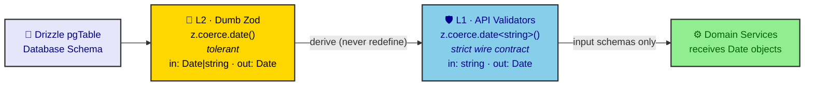

# ADR 0010: Date Coercion Architecture

**Status:** Accepted (Updated 2026-07-07)
**Date:** 2026-07-05
**Author:** RobotFarm
**Supersedes:** N/A

## Context

Client payloads arrive as ISO strings (e.g., `"2024-01-15T10:30:00Z"`), but database operations require `Date` objects. Without a unified approach, developers must manually add `z.coerce.date()` to every API validator, leading to:

- Inconsistent date handling across domains
- Forgotten coercions causing runtime errors
- Verbose schema definitions
- Maintenance burden when patterns change

## Decision

We adopt a **two-layer date coercion pattern** — each layer has a different truth:

### Layer 2 (Dumb Zod) — Tolerant Coercion

The Drizzle schema factory in `packages/database/src/zod/factory.ts` uses `createSchemaFactory({ coerce: { date: true } })`. This means every `createSelectSchema` / `createInsertSchema` / `createUpdateSchema` output uses `z.coerce.date()` for timestamp/date columns.

**Why tolerant?** Because Dumb Zod represents the PostgreSQL database. Postgres rows pass through multiple serialization boundaries (tRPC HTTP, queues, JSONB round-trips) where `Date` objects become strings. Pure `z.date()` would reject these serialized values. `z.coerce.date()` accepts both `Date` and `string` inputs — it tolerates whatever the DB/JSON layer gives it.

```typescript
// packages/database/src/zod/factory.ts
const factory = createSchemaFactory({
  coerce: {
    date: true,
  },
});
```

**Input type:** `Date | string` (tolerant — accepts both)
**Output type:** `Date` (always coerces to Date)

### Layer 1 (API Validators) — Strict Wire Contract

When an L1 API schema `.extend()`s a Dumb Zod field to re-assert a date, it MUST use `z.coerce.date<string>()` — the generic `<string>` locks the wire input type.

**Why `<string>`?** Bare `z.coerce.date()` infers input as `Date | string`, which breaks strict `.pipe()` chains and causes the TS2345 error. The `<string>` generic tells TypeScript: "the wire sends a string, I will coerce it to Date." This is NOT redundant with the L2 coercion — it narrows the contract at the HTTP boundary.

```typescript
// ✅ L1 API schema — strict wire contract
export const animalResponseSchema = animalSelectSchema
  .omit({ createdBy: true, validTo: true })
  .extend({
    birthDate: z.coerce.date<string>(),           // wire sends string
    taggingDate: z.coerce.date<string>().nullable(), // wire sends string | null
    status: animalStatusSchema,
  })
  .strip();
```

**Input type:** `string` (strict — rejects `Date` objects from the wire)
**Output type:** `Date` (always coerces to Date)

### The Two-Layer Truth

| Layer         | File                                   | Pattern                   | Input Type       | Purpose                        |
| ------------- | -------------------------------------- | ------------------------- | ---------------- | ------------------------------ |
| L2 (Dumb Zod) | `packages/database/src/zod/factory.ts` | `z.coerce.date()`         | `Date \| string` | Tolerate DB/JSON serialization |
| L1 (API)      | `packages/validators/src/api/*.api.ts` | `z.coerce.date<string>()` | `string`         | Strict wire contract           |

**Rule:** L2 coercion = "I tolerate what the DB/JSON gives me." L1 coercion = "I demand exactly a string from the outside." Two truths, two layers. Neither is redundant.

### Propagation Chain



_Fig. 1 — Two-layer coercion truth. L2 (Dumb Zod) tolerates `Date | string` from the DB/JSON boundary; L1 (API validators) demands a strict `string` on the wire via `z.coerce.date<string>()`. Only input schemas need the L1 override — response schemas rely on SuperJSON and skip it._

### Response Schemas — No L1 Override Needed

Response schemas that derive their type via `export type X = z.infer<typeof XSchema>` do NOT need the L1 `<string>` override. The Dumb Zod's `z.coerce.date()` is sufficient because:

1. The response is serialized by tRPC's SuperJSON, which handles `Date → string` on the wire
2. The frontend receives a string, but the TypeScript type says `Date` (SuperJSON deserializes it back)
3. No `.pipe()` chains are used on response schemas, so the TS2345 error doesn't apply

Only **input schemas** (create, update, query params) that receive raw JSON from the wire need the explicit `z.coerce.date<string>()` override.

## Cross-Field Date Validation

Cross-field validation (e.g., "endDate must be after startDate") lives ONLY at L1 — it is an interaction semantic, meaningless inside Postgres.

Use `.superRefine()` with an explicit `path: ["fieldName"]` so React Hook Form displays the error on the correct input:

```typescript
export const createContractRequestSchema = z.strictObject({
  startDate: z.coerce.date<string>(),
  endDate: z.coerce.date<string>(),
  // ...
}).superRefine((data, ctx) => {
  if (data.endDate && data.endDate <= data.startDate) {
    ctx.addIssue({
      code: z.ZodIssueCode.custom,
      message: "End date must be after start date",
      path: ["endDate"],  // 🚨 Points error at the specific UI field
    });
  }
}) satisfies z.ZodType<CreateContractRequest>;
```

**Rules:**

- `.superRefine()` goes at the VERY END of the schema chain — after `.strict()`, after `satisfies`
- Always specify `path: ["fieldName"]` — never leave it unset (defaults to root)
- Use `.superRefine()` over `.refine()` when you need field-level error paths
- Cross-field validation NEVER goes in Dumb Zod (L2)

## The Null vs Default Paradox

**The Law:** `.default()` triggers ONLY on `undefined`. If the frontend sends `null`, Zod treats it as a value and bypasses `.default()`.

```typescript
// The trap:
const schema = z.enum(['it', 'es']).nullish().transform(x => x ?? undefined).default('it');
schema.safeParse(null);  // → undefined (NOT 'it'!)
// Why? null is a value → .default() doesn't fire → transform turns null→undefined → done
```

**The Diamond Seal Solution:**

If you need "null and undefined both map to default", use one of:

```typescript
// Option A: .catch() — catches null/failed parse, falls back to default
const languageSchema = z.enum(['it', 'es', 'fr', 'uk'])
  .nullable()
  .optional()
  .catch('it');  // null or undefined → 'it'

// Option B: .transform() — explicit null coalescing
const languageSchema = z.enum(['it', 'es', 'fr', 'uk'])
  .nullable()
  .optional()
  .transform(x => x ?? 'it');  // null or undefined → 'it'
```

**Rule of thumb:** If the frontend might send `null` and you want a default, use `.catch()` or `.transform(x => x ?? defaultValue)`. Never rely on `.default()` alone for nullable fields.

## Consequences

### Positive

- Eliminates manual `z.coerce.date()` in 90% of API validators
- Reduces schema verbosity and maintenance burden
- Ensures consistent date handling across all domain boundaries
- Prevents common "string instead of Date" runtime errors
- Aligns with Diamond Seal validation doctrine
- The `<string>` generic prevents TS2345 pipe errors

### Negative

- Developers must understand the two-layer coercion chain
- Debugging requires tracing through factory → Dumb Zod → API validators
- Some edge cases may need manual overrides (e.g., optional date fields)
- The `<string>` generic adds a small cognitive overhead

### Neutral

- All existing API validators must verify they inherit coercion correctly
- New validators automatically benefit without additional configuration
- Documentation must clarify the pattern for onboarding

## Implementation

### Factory Configuration

```typescript
// packages/database/src/zod/factory.ts
import { createSchemaFactory } from "drizzle-orm/zod";

const factory = createSchemaFactory({
  coerce: {
    date: true,
  },
});

export const createSelectSchema = factory.createSelectSchema;
export const createInsertSchema = factory.createUpdateSchema;
```

### L1 API Validator Pattern (Input Schemas)

```typescript
// packages/validators/src/api/example.api.ts
import { exampleSelectSchema } from "@rocky/database/zod";
import { z } from "zod";

// Response — no L1 override needed (SuperJSON handles serialization)
export const exampleResponseSchema = exampleSelectSchema
  .omit({ createdBy: true, validTo: true })
  .strip();

// Create input — explicit z.coerce.date<string>() for wire contract
export const createExampleRequestSchema = exampleSelectSchema
  .pick({ name: true, startDate: true, endDate: true })
  .extend({
    startDate: z.coerce.date<string>(),
    endDate: z.coerce.date<string>().nullable(),
  })
  .strict()
  .superRefine((data, ctx) => {
    if (data.endDate && data.endDate <= data.startDate) {
      ctx.addIssue({
        code: z.ZodIssueCode.custom,
        message: "End date must be after start date",
        path: ["endDate"],
      });
    }
  }) satisfies z.ZodType<CreateExampleRequest>;
```

### Interface Alignment

```typescript
export interface CreateExampleRequest {
  name: string;
  startDate: Date;   // After coercion, always Date
  endDate: Date | null;
}

type _drift_createExample = NoDriftSimple<
  z.infer<typeof createExampleRequestSchema>,
  CreateExampleRequest
>;
```

## Alternatives Considered

### 1. Pure `z.date()` at L2 (No Factory Coercion)

**Why rejected:** Pure `z.date()` rejects string inputs. Every repository reading a serialized JSONB row or tRPC deserialized value would fail at runtime. The factory coercion is unavoidable.

### 2. Global Zod Plugin

```typescript
// Rejected: Opaque, hard to debug
z.plugin(zodCoerceDates());
```

**Why rejected:** Magic behavior, difficult to trace, debugging nightmare.

### 3. Transform at Service Layer

```typescript
// Rejected: Late transformation, type mismatch
const service = {
  transform: (data) => ({
    ...data,
    createdAt: new Date(data.createdAt),
  }),
};
```

**Why rejected:** Runtime errors, no compile-time safety, duplicated logic.

## References

- [Drizzle Zod Documentation](https://orm.drizzle.team/docs/zod)
- [Zod Coerce Documentation](https://zod.dev/?id=coercion-for-primitives)
- [Diamond Seal Validation Doctrine](../../packages/validators/src/utils/type-bridge.ts)
- [Validator Design Guide](../VALIDATOR_DESIGN_GUIDE.md)

## Related ADRs

- ADR 0008: Diamond Seal Testing Doctrine (validation patterns)
- ADR 0011: Diamond Seal Layer Boundaries
- ADR 0018: API Validator Schema Design
