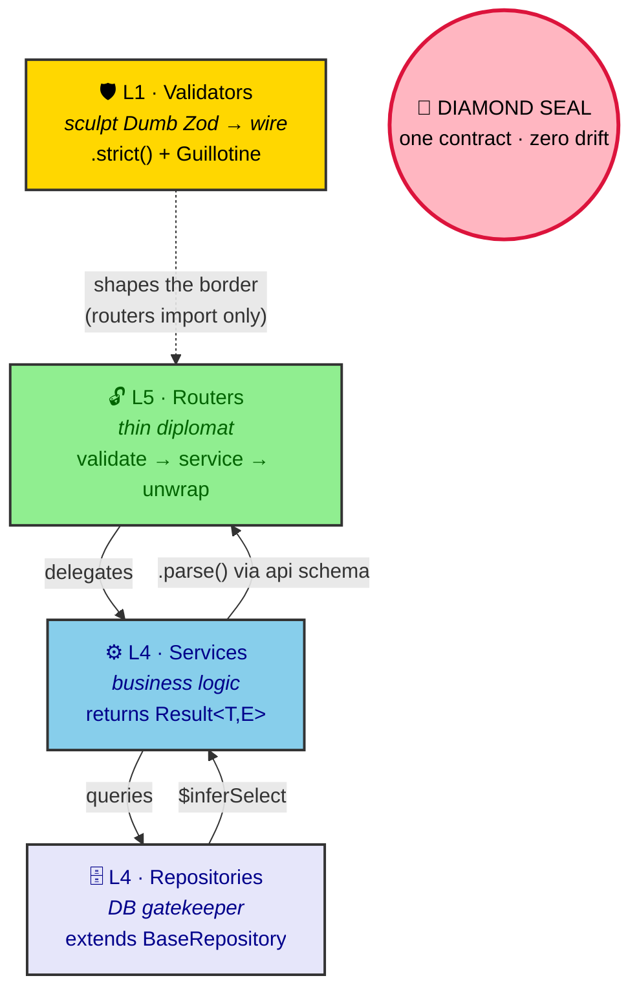

# ADR 0011: Diamond Seal Layer Boundaries

**Status:** Accepted
**Date:** 2026-07-05
**Author:** RobotFarm
**Supersedes:** N/A

## Context

Without explicit layer boundaries, codebases degenerate into circular dependencies, leaky abstractions, and "spaghetti" imports. Repositories publish events, routers contain business logic, and validators import domain internals. Each violation erodes testability, type safety, and reasoning about the system.

The Diamond Seal doctrine defines four distinct layers, each with a precise purpose, import scope, and behavioral contract. Without a documented boundary contract, developers lack a single source of truth for "what goes where."

## Decision

We adopt a **four-layer Diamond Seal boundary contract** with strict import/behavior rules per file type. Every file in the codebase must comply with its layer's rules.

### Layer Architecture



_Fig. 1 — The Diamond Seal as a validation circle: a request enters through the L5 router, descends through the L4 service and repository, and the L1 validators sculpt the single wire contract that routers import. The 💎 at the center is the tether — one contract, no horizontal drift. (Forbidden imports per layer are listed in the Detailed Contracts below.)_

### Detailed Contracts

#### L1 — API Validators (`packages/validators/src/api/*.api.ts`)

**Purpose:** Input/output schemas for tRPC routers

**Must use:**

- `.strict()` on all response schemas
- `.omit({ tenantId: true })` on tenant-scoped create schemas
- `tenantId` stripping on `createInputSchema`
- `satisfies z.ZodType<T>` or `as z.ZodType<T>` (last resort) on all schemas
- `NoDrift`/`NoDriftSimple` guillotines to prevent schema/interface drift
- `ActivateGuillotines` export to enforce drift checks

**Import only from:**

- `@rocky/database/zod` — Drizzle-Zod derived schemas
- `@rocky/validators/enums` — branded enum schemas
- `@rocky/database/constants` — internal enums

**Must NOT import:**

- `events/`, `integrations/`, `domains/`, `queue/`

**File naming:** `<domain>.api.ts`

#### L5 — Routers (`apps/api/src/**/*.router.ts`)

**Purpose:** Expose tRPC procedures, delegate to services, unwrap `Result<T,E>`

**The Diplomat:** the router speaks the contract, it does not draft it. All shape arrives pre-sculpted via `@rocky/validators/api` (which itself derives from Dumb Zod). The router is thin: validate (via the api schema), call the domain service, `return unwrap(result)`.

**LAW 1 (Router Does NOT Think):**

- No business logic
- No direct DB access
- No event publishing

**Import only from:**

- `@rocky/validators/api` — input/output schemas (the single contract; already wraps Dumb Zod, tenant-stripped, strict)
- `@rocky/validators/enums` — branded enum schemas + dictionaries (see two-form enum rule below)
- `@rocky/validators/errors` — tRPC error maps
- `@rocky/domains-*` — domain services (via DI only)
- `@rocky/trpc` — `createResultUnwrapper`
- `@rocky/authorization` — `@Policy()` decorator
- `@nestjs/common` / `nestjs-trpc` / `@trpc/server`

**NEVER import (hard ban — the tether):**

- `@rocky/database` and `@rocky/database/*` — **including `@rocky/database/zod`** (Dumb Zod may NOT be imported by routers; shape must arrive via `@rocky/validators/api`)
- `@rocky/database/constants` — enum dictionaries are re-exported by `@rocky/validators/enums`; routers must not reach past the enums layer
- `integrations/`, `events/`, `validators/internal`, `queue/`, `domains/schemas/`, `domains/*/src/repositories/`

**Two-form enum rule (how the router may use enums):**

1. **Branded Zod enum schemas** (`*Schema`) — for type inference when the router needs an enum type. The router rarely needs these directly; the api.ts schema already uses them.
2. **The Dictionary** (`RIDE_STATUS`, `SCHEDULE_STATUS`, etc. — the `CONSTANT` re-exports from `@rocky/validators/enums`) — for **runtime switches / lookups inside the router's thin logic** (e.g. `if (input.status === RIDE_STATUS.PENDING)`).

- **NEVER magic strings** — `'pending'` is a CRIME.
- **NEVER define enums in routers** — they are synthesized elsewhere (SSOT in `database/constants`, branded in `validators/enums`).

**Pattern:** `return unwrap(result)` — NEVER `return res.data` (and never `return result.data` unless `result` is a domain DTO that legitimately carries a `.data` property).

**File naming:** `<domain>.router.ts`

#### L4 — Domain Services (`packages/domains/<domain>/src/**/*.service.ts`)

**Purpose:** Business logic, orchestrate repositories

**Import allowed from:**

- `@rocky/validators/api` — API types and response schemas
- `@rocky/database/constants` — enum dictionaries
- `@rocky/domains-shared` — `ok()` / `err()` / `Result`
- `@rocky/logger` / `nestjs-pino`
- Own `<domain>.repository.ts`, `<domain>.errors.ts`, own `flows/`
- Cross-domain repos/services (via DI only)

**NEVER import:**

- `@rocky/validators/integrations`
- `@rocky/validators/internal`
- `@rocky/validators/api/*` for DB types
- L3 adapter packages (`@rocky/telegram`, `@rocky/asterisk-ami`, etc.)
- `@rocky/database/zod` — use `typeof table.$inferInsert` instead

**Return type:** Always `Promise<Result<T, E>>`

**Pattern:** `validate` → inject tenant context → delegate to repo → return `ok()` / `err()`

**File naming:** `<feature>.service.ts`

#### L4 — Domain Repositories (`packages/domains/<domain>/src/**/*.repository.ts`)

**Purpose:** Sole gatekeeper to the database

**Extends:** `BaseRepository` (from `@rocky/domains-shared`)

**Import allowed from:**

- `@rocky/database` — barrel (tables, relations)
- `@rocky/database/constants` — enum dictionaries
- Own `<domain>.module.ts`, local types

**NEVER import:**

- `@rocky/validators/*`
- `@rocky/domains-*`
- `@rocky/queue`, `@rocky/queue/src/`
- `integrations/`

**NEVER publish events** — only services publish (LAW 4 anti-pattern)

**NEVER return API types** — return DB entity types only (`typeof table.$inferSelect`)

**File naming:** `<entity>.repository.ts`

### Summary Table

| Rule                         | api.ts (L1)           | router.ts (L5)          | service.ts (L4)      | repository.ts (L4) |
| ---------------------------- | --------------------- | ----------------------- | -------------------- | ------------------ |
| Can publish events           | ❌                     | ❌                       | ✅ (future)           | ❌                  |
| Can call domain services     | ❌                     | ✅ via DI                | ✅ via DI             | ❌                  |
| Can access database          | ❌                     | ❌                       | ❌ (use repo)         | ✅                  |
| Can import validators/api    | —                     | ✅                       | ✅                    | ❌                  |
| Can import validators/events | ❌                     | ❌                       | ✅ (future)           | ❌                  |
| Can import domains-\*        | ❌                     | ✅ (services)            | ✅ (except forbidden) | ❌                  |
| Can import queue             | ❌                     | ❌                       | ✅ (future)           | ❌                  |
| Returns Result\<T,E\>        | N/A                   | runtime unwrap          | ✅                    | may return Result  |
| Pattern                      | `satisfies z.ZodType` | `return unwrapResult()` | `repo → ok()/err()`  | `BaseRepository`   |
| Drift prevention             | `NoDrift` guillotines | N/A                     | N/A                  | N/A                |

## Consequences

### Positive

- **Clear ownership:** Every developer knows exactly what to put where
- **No circular dependencies:** Strict import boundaries prevent cycles
- **Testability:** Layers can be mocked at defined boundaries
- **Type safety:** Each layer returns appropriate types (API vs DB)
- **Reasoning:** Business logic lives in services, data access in repositories
- **Onboarding:** New developers learn the architecture in minutes

### Negative

- **Enforcement requires discipline:** CI checks needed for import rules
- **Cross-boundary refactors:** Moving code between layers requires careful import auditing
- **Thin repositories:** `BaseRepository` is intentionally minimal (a `client` getter only); RLS scoping and the transactional connection are injected by `ExecutionPipeline` (ADR 0006). Repositories do **not** call `withRls()` / `validate()` — row→api mapping lives in the service (ADR 0019).

### Neutral

- **Repository pattern:** Known pattern, well-documented in NestJS ecosystem
- **Result type pattern:** Requires understanding of `neverthrow` at boundaries

## Implementation

### CI Enforcement

```typescript
// scripts/check-layer-boundaries.ts — enforces import rules per file type
// Run: pnpm check:layers
// Rules: api.ts → no domains/ imports, router.ts → no database/ imports, etc.
```

### Code Review Checklist

- [ ] Does `api.ts` use `.strict()`, `.omit({ tenantId: true })`, and `satisfies`?
- [ ] Does `api.ts` have `NoDrift` guillotines and `ActivateGuillotines` export?
- [ ] Does `router.ts` contain business logic? (It shouldn't)
- [ ] Does `router.ts` use `@Policy()` for authorization? (Not inline checks)
- [ ] Does `service.ts` return `Result<T,E>`?
- [ ] Does `repository.ts` extend `BaseRepository` and avoid forbidden imports?
- [ ] Are imports within each layer's allowed scope?
- [ ] Does `repository.ts` avoid publishing events or importing validators?

## Alternatives Considered

### 1. Single-Layer Architecture (NestJS Default)

**Why rejected:** Default NestJS encourages logic in controllers and services mixed with DB access. No import boundaries.

### 2. Clean Architecture (Outer → Inner)

**Why rejected:** Over-engineered for this codebase size. Diamond Seal layers are simpler and sufficient.

### 3. No Enforcement

**Why rejected:** Codebases inevitably degenerate. Explicit contracts prevent entropy.

## Current State (July 2026)

### Implemented

- **Import boundaries:** All 81 files pass forbidden import checks (100% clean)
- **Result types:** All 22 services return `Promise<Result<T, E>>` (100%)
- **Router thinness:** 18/20 routers are pure delegates (90%)
- **Repository purity:** 20/20 repositories publish zero events (100%)
- **Diamond Seal compliance:** 11/19 api.ts files have guillotines (58%)

### Known Violations

- **notification.router.ts:** Inline role-based auth (should use `@Policy()`), manual TRPCError throws
- **8 api.ts files:** Missing `satisfies` and/or guillotines (archive, holdings, organizations, pda-devices, rbac, registration, subjects, users)
- **risk-analysis.service.ts:** Direct DB access (documented exception for cross-table analytics)
- **todo.service.ts:** Demo domain with no repository (intentional simplification)

## Future Roadmap

### Planned Additions

- **Observability (`@rocky/observability`):** `withSpan()` tracing for service layer operations
- **Event System (`@rocky/queue`):** `EventPublisher` for async domain events
- **`@rocky/validators/events`:** Event payload type schemas

These additions will be implemented when the codebase reaches sufficient scale to justify the infrastructure overhead. Current direct cross-domain calls are adequate for the present domain count.

> **Repository mapping decision (ratified by ADR 0019):** Rocky deliberately does **not** introduce a `ValidatedRepository` with `withRls()` / `validate()`. `BaseRepository` stays thin (a `client` getter only); RLS/transaction is injected by `ExecutionPipeline` (ADR 0006), and the DB-row → api-shape mapping lives in the **service** via the api response schema's `.parse()`. Keep the translation in the service, not the repository.

## References

- [Diamond Seal Validation Doctrine](../../packages/validators/src/utils/type-bridge.ts)
- [NestJS Providers](https://docs.nestjs.com/providers)
- [neverthrow Result Pattern](https://neverthrow.gitbook.io/neverthrow)

## Related ADRs

- ADR 0008: Diamond Seal Testing Doctrine
- ADR 0010: Date Coercion Architecture
- ADR 0018: API Validator Schema Design (Diamond Seal Guillotines) — how `api.ts` is constructed
- ADR 0019: Two Type Contracts — The Dialectic from Postgres to tRPC Client — the type-flow companion
