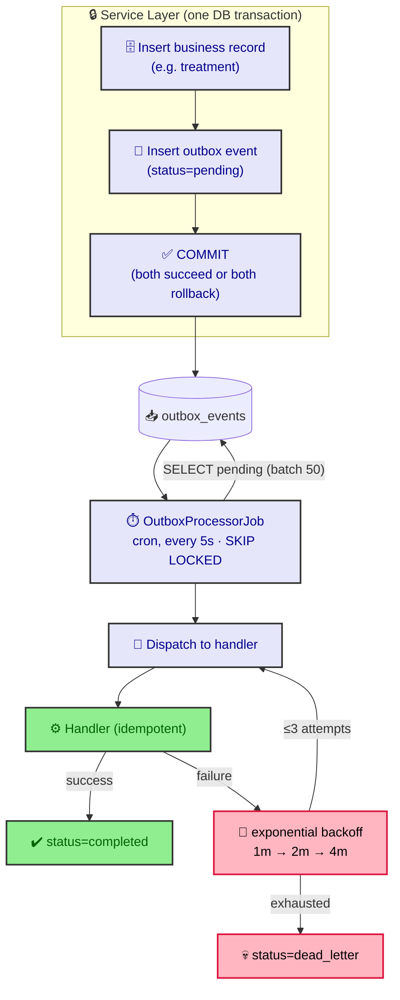

# ADR-0012: Transactional Outbox for Domain Events

**Status:** Accepted  
**Date:** 2026-07-06  
**Author:** RobotFarm  
**Supersedes:** ADR-0007 (Audit via Lifecycle Events)

## Context

ADR-0007 proposed in-memory `ExecutionEventEmitter` for audit and lifecycle events. This works for **intra-process** telemetry, but fails for **cross-process** side effects:

- **Problem 1:** Emitted events are lost if the NestJS worker crashes between DB commit and subscriber execution.
- **Problem 2:** No retry semantics — a failed email send means the notification is gone forever.
- **Problem 3:** No ordering guarantee when multiple events are emitted in one transaction.
- **Problem 4:** The existing `ExecutionEventEmitter` is synchronous; a slow subscriber blocks the request thread.

We need exactly-once delivery for business events: disease detection → inspection flagging, animal movement → notification dispatch, farm approval → audit logging.

## Decision

We adopt the **Transactional Outbox Pattern** using PostgreSQL as the sole message broker.

### Architecture



_Fig. 1 — Transactional Outbox: the business row and the outbox event commit in one transaction, then `OutboxProcessorJob` polls (`SKIP LOCKED`) every 5s and dispatches to idempotent handlers with exponential-backoff retries; exhausted attempts go to `dead_letter`._

### Components

| Component | Location | Purpose |
|-----------|----------|---------|
| `outbox_events` table | `packages/database/src/schema/sm/outbox-events.ts` | Persistent event queue |
| `OutboxEventPublisher` | `packages/execution/src/outbox/outbox-publisher.ts` | In-transaction publisher |
| `OutboxProcessorJob` | `apps/api/src/jobs/outbox-processor.job.ts` | 5-second cron poller |
| `OutboxEventHandlers` | `apps/api/src/jobs/outbox-handlers.ts` | Handler registry |

### Event Flow

1. Service publishes event via `OutboxEventPublisher.publish()` within existing DB transaction
2. Event stored in `outbox_events(status='pending')`
3. `OutboxProcessorJob` polls every 5 seconds, fetches batch of 50 with `SKIP LOCKED`
4. Event dispatched to registered handler
5. On success: `status='completed'`, `processedAt` set
6. On failure: exponential backoff retry (1min → 2min → 4min), then `status='dead_letter'` after 3 attempts

### Key Properties

- **Exactly-once delivery:** `deliveryAttempts` counter + `processing` → `completed` state machine
- **Atomic with business data:** Event and business record commit/rollback together
- **No external dependencies:** Pure PostgreSQL — no Kafka, no RabbitMQ, no Redis
- **Idempotent handlers:** Handlers must be safe to retry

## Consequences

### Positive

- **Reliability:** Events survive process crashes and restarts
- **Observability:** Failed events visible in `audit_log` + dead-letter metrics
- **Simplicity:** Zero infrastructure — just a table and a cron job
- **Decoupling:** Health → Inspection via events, not direct service calls

### Negative

- **Latency:** 5-second poll interval for routine events; urgent events require explicit wakeup via `pg_notify`
- **Throughput:** Single poller process; horizontal scaling requires `SKIP LOCKED` + multiple workers (already supported)
- **Complexity:** Event handlers must be idempotent and handle retries

### Neutral

- **Event schema:** JSONB payloads are self-describing but untyped at DB level
- **Dead-letter handling:** Manual intervention required for failed events

## Implementation

### Schema

```typescript
outbox_events = pgTable('outbox_events', {
  id: uuid('id').primaryKey().defaultRandom(),
  type: varchar('type', { length: 100 }).notNull(),
  aggregateType: varchar('aggregate_type', { length: 50 }).notNull(),
  aggregateId: uuid('aggregate_id').notNull(),
  payload: jsonb('payload').notNull().default('{}'),
  status: outboxEventStatusPgEnum('status').notNull().default('pending'),
  processedAt: timestamp('processed_at', { withTimezone: true }),
  errorMessage: text('error_message'),
  deliveryAttempts: integer('delivery_attempts').notNull().default(0),
  nextAttemptAt: timestamp('next_attempt_at', { withTimezone: true }).notNull().defaultNow(),
  createdAt: timestamp('created_at', { withTimezone: true }).notNull().defaultNow(),
  createdBy: uuid('created_by').references(() => users.id),
});
```

### Publishers (Current)

| Service | Event Type | Trigger |
|---------|-----------|---------|
| `AnimalService` | `animal_registered` | First tagging, import, birth notification |
| `FarmService` | `approval_requested` | Farm submitted for VD approval |
| `MovementService` | `animal.moved` / `movement_recorded` | Any non-pasture movement |
| `HealthService` | `notifiable_disease.detected` | Notifiable disease treatment recorded |
| `ForeignPassportRetentionJob` | `foreign_passport_expiring` | Monthly retention scan |

## Alternatives Considered

### 1. Kafka / RabbitMQ

**Why rejected:** Requires separate infrastructure, operational overhead, and consumer group management. Our scale (single region, <10K events/day) does not justify it.

### 2. PostgreSQL `LISTEN/NOTIFY`

**Why rejected:** No persistence — if no listener is connected, the event is lost. The outbox pattern is strictly more reliable.

### 3. In-memory `ExecutionEventEmitter`

**Why rejected:** Lost on crash. Good for telemetry, bad for business events.

### 4. Direct service-to-service calls

**Why rejected:** Tight coupling. Health calling Inspection directly means any Inspection change requires Health deployment.

## Current State (July 2026)

### Implemented

- **Outbox table:** `outbox_events` with 6 event types emitting
- **Publisher:** `OutboxEventPublisher` uses AsyncLocalStorage for transactional insertion
- **Processor:** `OutboxProcessorJob` runs every 5 seconds, `SKIP LOCKED`, exponential backoff
- **Handlers:** `OutboxEventHandlers` with `SubscriptionResolver` for 6 event types
- **Dead-letter:** Events moved to `dead_letter` after 3 failures

### Known Limitations

- **No `pg_notify` wakeup for urgent events** — future optimization
- **Single poller** — not horizontally scaled yet
- **No event replay** — by design; `audit_log` is the source of truth

## Related ADRs

- ADR-0007: Audit via Lifecycle Events (superseded for cross-process events)
- ADR-0006: RLS via Transactional Connection (enables atomic outbox insertion)
- ADR-0003: Execution Pipeline as Composable Stages (pipeline emits lifecycle events only)

## References

- [Transactional Outbox Pattern](https://microservices.io/patterns/data/transactional-outbox.html)
- [PostgreSQL SKIP LOCKED](https://www.postgresql.org/docs/current/explicit-locking.html#SKIP-LOCKED)
