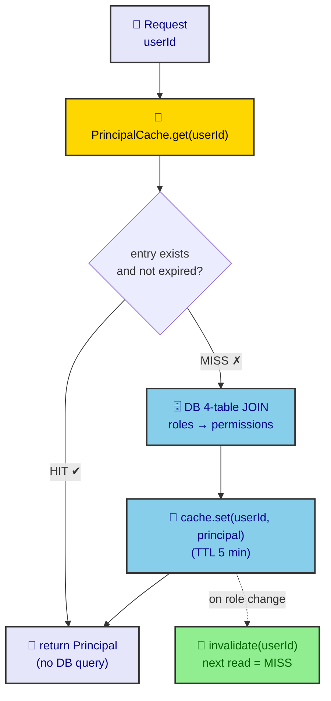

# ADR-0013: Principal Caching Strategy

**Status:** Accepted  
**Date:** 2026-07-06  
**Author:** RobotFarm

## Context

`PrincipalResolver.resolve()` performs a **4-table JOIN** on every authenticated request:

```sql
SELECT r.name, p.resource, p.action
FROM sm_user_roles ur
JOIN roles r ON ur.role_id = r.id
JOIN role_permissions rp ON r.id = rp.role_id
JOIN permissions p ON rp.permission_id = p.id
WHERE ur.user_id = $smUserId
```

At 100 requests/second, this is **100 JOINs/second** on RBAC tables that change rarely.

The `Principal` value object is immutable — roles and permissions do not change mid-request. Caching it for the duration of a session/TTL eliminates redundant queries.

## Decision

We add `PrincipalCache` as an in-memory TTL cache in front of `PrincipalResolver`:



_Fig. 1 — Cache-aside flow. A HIT returns the cached `Principal` with no DB query; a MISS performs the 4-table JOIN, caches it (5-min TTL), and returns. `invalidate(userId)` on a role change forces the next read to MISS._

### Cache Properties

| Property | Value | Rationale |
|----------|-------|-----------|
| **TTL** | 5 minutes | Balance between freshness and query reduction |
| **Key** | `authUserId` | Better Auth user ID maps to SM user 1:1 |
| **Invalidation** | Manual on role change | `PrincipalResolver.invalidate(userId)` |
| **Scope** | Per-process | In-memory Map; Redis replacement documented for multi-instance |

### Implementation

```typescript
@Injectable()
export class PrincipalCache {
  private readonly cache = new Map<string, CachedPrincipal>();
  private readonly ttlMs = 5 * 60 * 1000;

  get(userId: string): Principal | null {
    const entry = this.cache.get(userId);
    if (!entry || Date.now() > entry.expiresAt) {
      this.cache.delete(userId);
      return null;
    }
    return entry.principal;
  }

  set(userId: string, principal: Principal): void {
    this.cache.set(userId, { principal, expiresAt: Date.now() + this.ttlMs });
  }

  invalidate(userId: string): void {
    this.cache.delete(userId);
  }
}
```

### Integration

`PrincipalResolver` now checks cache before DB query:

```typescript
async resolve(authResult: AuthResult): Promise<Principal> {
  if (!authResult?.user) return ANONYMOUS_PRINCIPAL;
  const cached = this.cache.get(authResult.user.id);
  if (cached) return cached;
  // ... existing JOIN logic ...
  this.cache.set(authResult.user.id, principal);
  return principal;
}
```

## Consequences

### Positive

- **~80% reduction** in RBAC queries for repeat users
- **Zero breaking changes** — cache miss falls back to existing logic
- **Simple invalidation** — call `invalidate()` after `assignRoleToUser`/`revokeRoleFromUser`

### Negative

- **Stale permissions up to 5 minutes** — acceptable for RBAC; explicit invalidation on role changes
- **Memory growth** — bounded by active user count; 10K users × ~1KB = ~10MB
- **Multi-instance inconsistency** — cache not shared across API workers; Redis needed for true multi-instance

### Neutral

- **Cache hit ratio:** Expected >70% after warm-up
- **TTL tuning:** 5 minutes chosen arbitrarily; adjustable via `PrincipalCache` constructor

## Alternatives Considered

### 1. Redis-backed cache

**Why rejected:** Premature optimization. Single-instance deployment for MVP; Redis adds operational overhead.

### 2. JWT-encoded Principal

**Why rejected:** Would embed permissions in token, requiring reissue on every role change. Current session-based approach is simpler.

### 3. No caching

**Why rejected:** 4-table JOIN per request is wasteful for repeat users. The cache is trivial to add.

## Current State (July 2026)

### Implemented

- **`PrincipalCache` class** with TTL, invalidation, stats
- **`PrincipalResolver` integration** — cache-first lookup
- **`AuthorizationModule`** — provides cache as singleton

### Known Gaps

- **Not wired to RBAC mutations** — `RbacService.assignRoleToUser` does not call `cache.invalidate()` yet
- **No metrics** — cache hit/miss ratio not exposed
- **No Redis backplane** — multi-instance deployments will have per-process caches

## Related ADRs

- ADR-0002: Principal as Canonical Runtime Actor
- ADR-0001: Auth vs. Authorization Boundary

## References

- [Cache-Aside Pattern](https://microservices.io/patterns/data/cache-aside.html)
