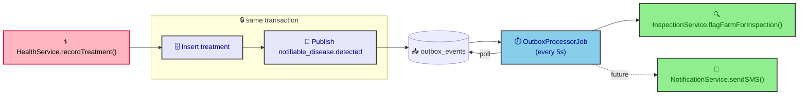

# ADR-0014: Cross-Domain Event Decoupling via Outbox

**Status:** Accepted  
**Date:** 2026-07-06  
**Author:** RobotFarm  
**Supersedes:** Direct `InspectionRepository` call in `HealthService`

## Context

`HealthService.recordTreatment()` contained a direct dependency on `InspectionRepository`:

```typescript
// BEFORE — tight coupling
constructor(
  private readonly inspectionRepo?: { flagFarmForInspection: ... }
) {}

if (isNotifiable && this.inspectionRepo) {
  await this.inspectionRepo.flagFarmForInspection({...});
}
```

This created **three problems**:

1. **Health domain imports Inspection domain** — violates Diamond Seal layer boundaries (ADR-0011)
2. **Single responsibility violation** — HealthService manages treatments AND inspection flagging
3. **Extension point blocked** — adding "send SMS to farmer" requires modifying HealthService again

## Decision

We replace the direct service-to-service call with an **outbox event**:



_Fig. 1 — Cross-domain decoupling. `HealthService` publishes `notifiable_disease.detected` in the same transaction as the treatment; the outbox processor later dispatches to `InspectionService` (and future handlers) — Health never imports Inspection._

### Implementation

**Before:**

```typescript
await this.inspectionRepo.flagFarmForInspection({
  farmId: input.farmId,
  riskScore: "HIGH",
  riskCriteria: `notifiable_disease:${input.diseaseId}`,
  ...
});
```

**After:**

```typescript
await this.outboxPublisher.publish({
  type: "notifiable_disease.detected",
  aggregateType: "treatment",
  aggregateId: treatment.id,
  payload: { diseaseId, diseaseName, farmId, animalId, vetId, createdBy },
  createdBy: input.createdBy,
});
```

**Handler in `OutboxEventHandlers`:**

```typescript
private async handleNotifiableDisease(event) {
  await this.inspectionService.flagFarmForInspection({
    farmId: event.payload.farmId,
    riskScore: "HIGH",
    riskCriteria: `notifiable_disease:${event.payload.diseaseId}`,
    ...
  });
}
```

### Event Contract

| Field | Type | Source |
|-------|------|--------|
| `diseaseId` | string | `input.diseaseId` |
| `diseaseName` | string | Looked up from `diseases` table |
| `farmId` | string | `input.farmId` |
| `animalId` | string | `input.animalId` |
| `vetId` | string | `input.vetId` |
| `createdBy` | string | `input.createdBy` |

## Consequences

### Positive

- **Zero coupling:** HealthService has no import of InspectionService
- **Extensible:** New handlers added without touching HealthService
- **Reliable:** Event persisted in same transaction as treatment; retried on failure
- **Testable:** Handler tested independently of HealthService

### Negative

- **Eventual consistency:** Inspection flagged ~5 seconds after treatment recorded
- **More files:** Outbox publisher + handler + job vs. single direct call
- **Debugging complexity:** Must trace through outbox table to see full flow

### Neutral

- **Payload shape:** JSONB allows schema evolution without migrations
- **Handler ordering:** Single handler per event type; multiple handlers require fan-out pattern

## Alternatives Considered

### 1. Keep direct call

**Why rejected:** Violates Diamond Seal boundaries; every new requirement touches HealthService.

### 2. Domain event interface (TypeScript EventEmitter)

**Why rejected:** In-memory only — lost on crash. Outbox is strictly more reliable.

### 3. Message queue (RabbitMQ/Kafka)

**Why rejected:** ADR-0012 covers this; external broker unjustified for our scale.

## Current State (July 2026)

### Implemented

- **HealthService** emits `notifiable_disease.detected` to outbox
- **OutboxEventHandlers.handleNotifiableDisease** calls `InspectionService.flagFarmForInspection`
- **Other event emitters:** `animal_registered`, `approval_requested`, `animal.moved`, `foreign_passport_expiring`

### Known Gaps

- **No `animal.moved` handler logic** — registered but placeholder only
- **No failure alerting** — dead-letter events logged but not alerted
- **No event versioning** — payload schema changes are implicit

## Related ADRs

- ADR-0012: Transactional Outbox for Domain Events
- ADR-0007: Audit via Lifecycle Events (superseded for cross-domain)
- ADR-0011: Diamond Seal Layer Boundaries

## References

- [Domain Events](https://docs.microsoft.com/en-us/azure/architecture/patterns/domain-events)
- [Event-Driven Architecture](https://aws.amazon.com/event-driven-architecture/)
