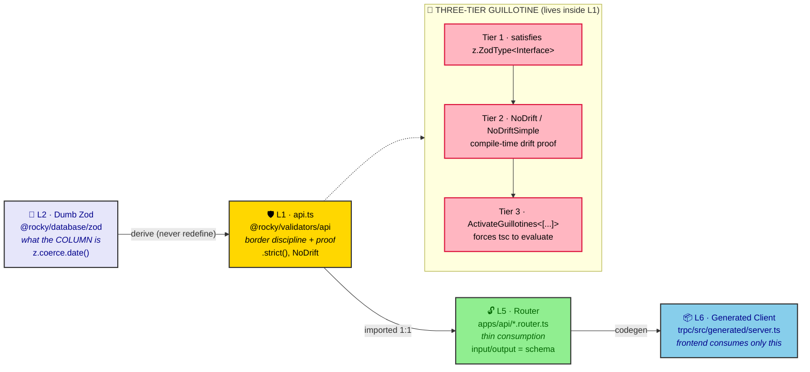

# ADR-0018: API Validator Schema Design (Diamond Seal Guillotines)

| Key | Value |
| --- | --- |
| **Status** | Accepted |
| **Date** | 2026-07-07 |
| **Author** | RobotFarm (Validation Bot) |
| **Supersedes** | None |
| **Superseded** | None |

---

**Superseded by:** N/A

## Context

ADR 0011 established *where* each Diamond Seal layer may import, but it did not fully pin down
*how* an API validator file is constructed — the concrete schema-derivation rules, the strictness
contract, and the compile-time drift-enforcement mechanism. Without an explicit construction
standard, the `packages/validators/src/api/*.api.ts` files diverged:

- 10/19 files used `satisfies z.ZodType<T>`; 9 did not.
- 13/19 files exported an `ActivateGuillotines` type alias; 6 did not.
- Response schemas were split between `.strict()` (reject unknown keys) and `.strip()` (silently
  drop them) — two different contract strengths for the same boundary.
- Some create schemas used `.omit()` (leaks new DB columns into the API) instead of `.pick()`.

The source of truth for validator shape already lived in `packages/validators/AGENTS.md` and the
live code, but it was not recorded as a ratified, enforceable decision. This ADR ratifies the
**API validator schema design standard** and the **three-tier guillotine** as project-wide law.

## Decision

We adopt a **single construction standard for every `*.api.ts` and `*.events.ts` file**, built on
the existing `utils/type-bridge.ts` guillotine primitives.

### A. Schema derivation

- **Response schemas** derive from Drizzle Dumb Zod: `*SelectSchema.omit({auditFields}).extend({zEnum}).strict()`.
- **Create schemas** derive via `*InsertSchema.pick({clientFields}).extend({overrides}).strict()` — **`.pick()` is mandated over `.omit()`** to prevent new DB columns leaking into the API contract.
- **Update schemas** are hand-built `z.strictObject({...})` with all fields `.optional()` plus an "at least one field" `.refine()`.
- **Query/manual schemas** (no DB shape, or multi-table, or check-digit/geo inputs) are hand-built `z.strictObject({...})`.
- **Event payloads** are always hand-built (events are not DB shapes) and follow the 4-part canonical blueprint (interface → payload schema → `eventEnvelopeSchema(payload)` → `NoDrift` guillotine).

### B. Strictness contract

- **Target: `.strict()` on every API schema.** `.strict()` rejects unknown keys; `.strip()` only
  drops them and is weaker. Current `.strip()` response schemas are transitional and must migrate
  to `.strict()` as they are touched.

### C. Three-tier guillotine (mandatory)

Every file **exports `ActivateGuillotines<[...]>`** (Tier 3) so TypeScript actually evaluates the
drift checks — this is the hard, enforceable requirement (a lazy unused alias is never checked).
Every schema with a **hand-written interface** carries `satisfies z.ZodType<Interface>` (Tier 1)
and a `NoDrift` / `NoDriftSimple` alias (Tier 2).

**Important constraint discovered during implementation:** `satisfies z.ZodType<X>` where
`X = z.infer<typeof schema>` is a **circular, illegal** TypeScript pattern (TS2456/TS7022). Therefore
response schemas that derive their type via `export type X = z.infer<typeof XSchema>` (the dominant
pattern in this codebase, e.g. `farms.api.ts` response schemas) do **not** carry `satisfies`; their
guillotine alias is the tautological `NoDrift<z.infer<typeof XSchema>, X>` (= `true`). Likewise,
**curated subset response interfaces** (interface intentionally narrower than the schema output,
e.g. `CorrectionResponse`, `PassportResponse`) cannot use `NoDrift` (bidirectional `AssertEqual`
rejects the subset). For these the sanctioned last-resort from `utils/type-bridge.ts` applies:
`type _drift_X = true;` (removes coverage) — the one-directional `satisfies` on the schema still
enforces the contract. The measurable, enforced guarantee is: **every `*.api.ts` file exports
`ActivateGuillotines`** with a `_drift_*` alias per schema.

### D. Enum SSOT — The Barrel

All enums import from `../enums/index.js` — the **public barrel** of branded `*Schema` validators and
curated dictionaries. `index.js` re-exports the generated schemas (from `../enums/domain.ts`) and the
read-only `VALUES` dictionaries from `@rocky/database/constants`.

- **Never import from `../enums/domain.js`.** `domain.ts` is the private auto-generated implementation
  (rebuilt by `scripts/regenerate-enums.mjs`). A deep import couples api files to generator internals
  and exposes the raw `*_VALUES` arrays, inviting hand-built `z.enum([...])` drift — exactly the risk
  the branded `*Schema` was generated to prevent.
- For a runtime string union (a switch / options array), import the `CONSTANT` from
  `@rocky/database/constants` — never hand-write `z.enum([...])`.
- Inline `z.enum([...])` unions are forbidden — they drift from the database enum.

### E. Import boundaries (from ADR 0011, reaffirmed)

`api/*.api.ts` may import only from `@rocky/database/zod`, `../enums/index.js`, `zod`,
`../utils/*`, and `../utils/check-digit.js`. It must **not** import `events/`, `domains-*`, or
other `api/` domains. `events/*.events.ts` must **not** import from `@rocky/database/zod` or `api/`.

### F. Consumer topology — vertical waterfall

The api schemas are the **single contract** for every external caller; they propagate downward, never
sideways.

- **`apps/api` tRPC routers** are the primary consumer: each imports `*Schema` from
  `@rocky/validators/api/index.js` as the procedure input/response type (the schema *is* the contract).
  The routers do NOT import Dumb Zod or enums directly — all shape arrives via api.ts. Codegen is driven
  by `nestjs-trpc generate --entrypoint src/app.module.ts` (per `packages/validators/AGENTS.md`); the
  runner scans the router files, which already pull schemas from `@rocky/validators/api`. There is no
  api-schema barrel inside `trpc.module.ts` — that module only configures `TRPCModule.forRoot`.
- **Frontends (`apps/web`, `apps/expo`)** consume the **generated tRPC client**
  (`@rocky/trpc` → `packages/trpc/src/generated/server.ts`), whose types derive from these schemas.
  They never import api schemas; for enum *values* they import the dictionary from
  `@rocky/validators/src/enums/index.js` (or the per-enum constant module).
- **`apps/worker`** consumes `events/` schemas (the message protocol), not the API gate.
- **Domain services (`packages/domains`)** receive already-validated, tenant-scoped data from the
  router and do not re-import api schemas.

This forbids horizontal type bleeding: the frontend sees only the shadow of the gate; the domain
service sees only the cleansed payload.

### G. The Layered Chain (L2 → L1 → L5 → L6)

Each layer owns exactly one truth. The Diamond Seal is a **four-hop pipeline**, not a flat contract:

*Fig. 1 — Validation flows one direction only (L2 → L1 → L5 → L6); nothing bleeds sideways. The three-tier guillotine lives inside L1 and turns "schema and interface disagree" into a `tsc` error.*

Note: the three-tier **guillotine** (Tier 1 `satisfies`, Tier 2 `NoDrift`/`NoDriftSimple`,
Tier 3 `ActivateGuillotines`) lives *inside* L1 — it is not a separate transport layer. The L2/L1/L5/L6
numbers above describe the *transport/derivation* chain; do not conflate them with the guillotine tiers.

**Why this is the synthesis:** Dumb Zod does the *coercion* (L2), api.ts does the *border discipline +
proof* (L1), the router does the *consumption* (L5). Any other arrangement — router importing Dumb Zod
directly, api.ts hand-defining fields, frontend importing api.ts — is ideological displacement that
breaks the tether and lets drift through.

## Consequences

### Positive

- **One contract per boundary:** clients and servers agree on exactly what crosses the wire.
- **Zero drift:** the guillotine turns "schema and interface disagree" into a compile error.
- **Safe schema evolution:** `.pick()` means adding a DB column never silently exposes it.
- **Onboarding:** a developer can copy any compliant `*.api.ts` as a template.

### Negative

- **Subset-response constraint:** curated response interfaces cannot use `NoDrift` (bidirectional);
  they rely on the `_drift_X = true` bypass, so their coverage is partial (one-directional `satisfies` only).
- **Verbosity:** every file ends with a guillotine tuple.
- **Runtime validation pending:** `.strip()` → `.strict()` and `.omit()` → `.pick()` migrations
  need a runtime smoke test before broad rollout.

### Neutral

- Event envelope shape (`{ header, source, payload }` via `eventEnvelopeSchema`) is fixed and
  shared; events are decoupled from DB shapes by design.

## Current State (2026-07-07, post-remediation)

### Achieved

- **19 / 19 `api/*.api.ts` files export `ActivateGuillotines`** (Tier 3). Previously 13/19.
- Import boundaries (ADR 0011) remain 100% clean — no forbidden imports introduced.
- `tsc --noEmit` green for `packages/validators` and `apps/api`.

### Real interface drifts fixed by the guillotine (hidden before — `satisfies` is one-directional)

- `CorrectionResponse` / `PassportResponse`: added missing `updatedAt` field.
- `PassportListRequest.status` / `OrderListRequest.status`: typed `string` → `passportStatusType` / `orderStatusType` enum union (matches schema).
- `DocumentGenerateRequest.format` / `OrderListRequest.limit` / `OrderListRequest.offset`: optional → required to match the schema **output** type (`.default()` makes them required in output).
- `document.api.ts`: added the missing `ActivateGuillotines` export (a `NoDriftSimple` block already existed but was lazy/unenforced).

### Curated subset responses (intentional) — `NoDrift` bypassed via `type _drift_X = true`

`correctionResponse`, `correctionListResponse`, `passportResponse`, `passportSummary`,
`passportListResponse`. `satisfies` on each schema still enforces the one-directional contract.

## Remaining roadmap (target, not yet enforced as a `tsc` error)

1. Migrate `.strip()` response schemas → `.strict()` (rejects unknown keys). Compile-safe; needs a runtime smoke test before broad rollout.
2. Convert create schemas using `.omit()` → `.pick()` (prevents new DB columns leaking into the API).

## Implementation

- Enforced by `npx tsc --noEmit -p packages/validators/tsconfig.json` (guillotine) and CI
  import-boundary lint (ADR 0011).
- Template: copy any of the fully-compliant reference files — `farms.api.ts`, `health.api.ts`,
  `inspection.api.ts`, `iot.api.ts`, `movements.api.ts`, or `notifications.api.ts`
  (all carry `satisfies z.ZodType` **and** `ActivateGuillotines`).
- Full how-to: `https://github.com/r0b0tr0n1k/rocky/blob/main/docs/VALIDATOR_DESIGN_GUIDE.md`.

## Alternatives Considered

### 1. Keep rules only in `packages/validators/AGENTS.md` (no ADR)

**Why rejected:** AGENTS.md is a working contract, not a ratified decision with a measured
compliance baseline. An ADR captures the *decision* and its current-state gap explicitly.

### 2. Enforce with a custom linter (`panopticon`-style CLI)

**Why rejected:** the three-tier guillotine already enforces drift at compile time via `tsc`,
which requires no new tooling. A separate CLI would duplicate what `tsc` + existing lint already do.

### 3. Always `.pick()` even for responses

**Why rejected:** response schemas must strip a *known, stable* set of audit fields
(`createdBy`, `validTo`); `.omit()` is appropriate and safer there because the full DB shape is
the source of truth for the response.

## Related ADRs

- ADR 0011: Diamond Seal Layer Boundaries (import/behavior contracts per layer)
- ADR 0008: Diamond Seal Testing Doctrine
- ADR 0010: Date Coercion Architecture (`z.coerce.date()` propagation)
- ADR 0019: Two Type Contracts — The Dialectic from Postgres to tRPC Client (the type-flow companion)
