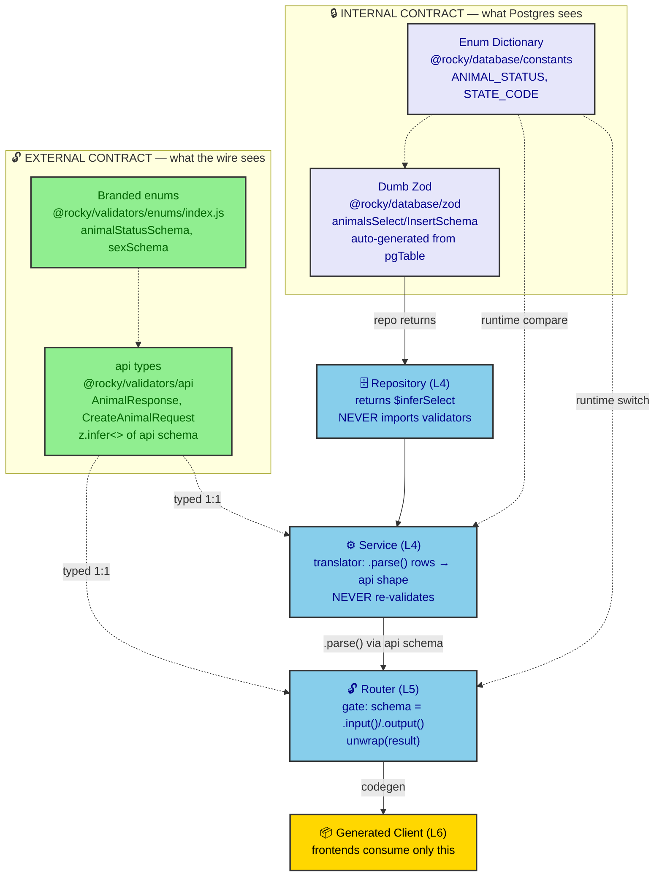

# ADR 0019: Two Type Contracts — The Dialectic from Postgres to tRPC Client

**Status:** Accepted
**Date:** 2026-08-07
**Author:** RobotFarm (Validation Bot + Architecture Overseer)
**Supersedes:** N/A
**Superseded by:** N/A

## Context

ADR 0011 fixed *where* each layer may import. ADR 0018 fixed *how* an `api.ts`
file is constructed. But neither pins down the **cross-layer type flow** — the single
most common source of confusion when a new domain is scaffolded: *which type is the
contract, who may import it, and where does the Postgres row become the wire object?*

An external specimen (the "rentals" domain) was offered to illustrate a clean type
dialectic — four type realms, two contracts, the service as translator. Rocky has no
rentals domain; the specimen's *logic* is sound but its *naming* (`@repo/*`,
`ValidatedRepository.validate()`, `RentalBookingDb = RentalBooking`) does not match
this monorepo (`@rocky/*`, thin `BaseRepository`, service-side mapping). The logic is
already our practice — it simply lacks a canonical name and a grounded reference.

This ADR ratifies the **Two Type Contracts** model and the concrete reuse flow,
grounded in the real `animal` domain (the most complete, Diamond-Seal-compliant
domain in the tree).

## Decision

We adopt a single mental model: **there are exactly two type contracts in the system.**

1. **The external contract** — `@rocky/validators/api` (`*.api.ts`). What the wire sees.
2. **The internal contract** — `@rocky/database/zod` (Dumb Zod). What Postgres sees.

The **service** is the translator between them; the **router** is the gate that
enforces the external contract; the **repository** is the gate that enforces the
internal contract. No hand-written DTO/input classes exist anywhere — input/output
"classes" are `z.infer<>` of the api schema, reused by type alone.

### A. The Four Realms, mapped to Rocky layers

| Realm (specimen)            | Rocky layer | Package / file                                                                           |
| --------------------------- | ----------- | ---------------------------------------------------------------------------------------- |
| Dumb Zod (raw Postgres)     | L2          | `@rocky/database/zod` — `animalsSelectSchema`, `animalsInsertSchema`                     |
| Enum SSOT (Dictionary)      | L2          | `@rocky/database/constants` — `ANIMAL_STATUS`, `STATE_CODE`                              |
| Wire contract (types)       | L1          | `@rocky/validators/api` — `AnimalResponse`, `CreateAnimalRequest`, `AnimalListResponse`  |
| Branded enum (runtime cmp)  | L1          | `@rocky/validators/enums` (public barrel `index.js`) — `animalStatusSchema`, `sexSchema` |
| Domain service + repository | L4          | `packages/domains/animal/src/services/*.service.ts`, `.../repositories/*.repository.ts`  |
| Router (gate)               | L5          | `apps/api/src/routers/animal.router.ts`                                                  |
| Generated client            | L6          | `packages/trpc/src/generated/server.ts`                                                  |

The L2 → L1 → L5 → L6 transport chain is already ratified in ADR 0018 §G. This ADR
adds the **type-flow** view that rides on top of that chain.

### B. The Two Contracts

- **Internal contract (`@rocky/database/zod`)** — the Dumb Zod select/insert schemas are
  auto-generated from the pgTable (`createSelectSchema` / `createInsertSchema`). They are
  the *only* authoritative description of the Postgres row. The repository returns exactly
  this shape: `typeof animalsTable.$inferSelect`.
- **External contract (`@rocky/validators/api`)** — the api schemas *sculpt* the Dumb Zod
  (`.omit()` audit fields, `.extend()` branded enums, coercion) into the wire shape. The
  types `AnimalResponse`, `CreateAnimalRequest`, etc. are `z.infer<>` of those schemas.
  The router uses these schemas 1:1 as `.input()` / `.output()`.

Everything else is a *view* of one of these two contracts. There is no third source of
truth.



*Fig. 1 — The Two Type Contracts. The internal contract (Dumb Zod) is the only description of the Postgres row; the repository returns it verbatim. The service translates rows into the external contract (api types) via `.parse()`; the router gates that contract 1:1; the generated client (L6) is the only thing frontends see. Enums flow SSOT→branded→consumed in both layers.*

### C. The Concrete Reuse Flow (grounded in `animal`)

**1. The api types are the shared language between router and service.**

`animal.service.ts:10-16` imports the contract types from `@rocky/validators/api`:

```ts
import type {
  AnimalListRequest, AnimalListResponse, AnimalResponse,
  CreateAnimalRequest, UpdateAnimalRequest,
} from "@rocky/validators/api";
```

The service method signature is literally typed with the api types
(`animal.service.ts:43,63`):

```ts
async getById(id: string): Promise<Result<AnimalResponse, Error>> { ... }
async create(input: CreateAnimalRequest & { createdBy?: string }): Promise<Result<AnimalResponse, Error>> { ... }
```

The router imports the *same* types (and the schemas) from `@rocky/validators/api/index.js`
(`animal.router.ts:9-22`) and uses them 1:1 as the tRPC procedure contract
(`animal.router.ts:37,52`):

```ts
@Query({ input: idParam, output: animalResponseSchema })
async getById(@Input() input: { id: string }): Promise<AnimalResponse> { ... }

@Mutation({ input: createAnimalRequestSchema, output: animalResponseSchema })
async create(@Input() input: CreateAnimalRequest, @Ctx() ctx: AppContext): Promise<AnimalResponse> { ... }
```

No re-declaration. The api type **is** the service's input/output contract. The module's
`index.ts` re-exports those types so the router could import them from
`@rocky/domains-animal` too — single source either way.

**2. Services receive VALIDATED data — they never re-validate against Zod.**

The router already ran `createAnimalRequestSchema` (via nestjs-trpc's `.input()`). The
service trusts the `CreateAnimalRequest` type. It does **not** `safeParse`, and it does
**not** import `@rocky/database/zod`. It performs only business logic: mother-on-farm
checks, calving-gap math, sex validation (`animal.service.ts:63-90`). This is LAW 1 —
"Router does NOT think; Service does NOT re-validate."

**3. Repositories return the internal (DB) shape; the SERVICE maps it to the external shape.**

`animal.repository.ts` imports the pgTable and constants only — never validators
(`animal.repository.ts:7-9`):

```ts
import { animals as animalsTable } from "@rocky/database";
import { SORT_ANIMAL_BY, SORT_ORDER } from "@rocky/database/constants";
import { BaseRepository } from "@rocky/domains-shared";
```

and returns the raw DB entity (`animal.repository.ts:45`):

```ts
Promise<{ data: Array<typeof animalsTable.$inferSelect>; total: number }>
```

The DB row → api shape translation happens **in the service**, via the api response
schema (`animal.service.ts:47,55`):

```ts
const animal = await this.repo.findById(id);
if (!animal) throw new AnimalError(ANIMAL_ERRORS.NOT_FOUND, { id });
return animalResponseSchema.parse(animal);          // DB row → AnimalResponse
// ... and in list():
data: data.map((d) => animalSummarySchema.parse(d)), // DB rows → AnimalSummary[]
```

> **Correction vs. the rentals specimen:** the specimen placed this mapping inside a
> `ValidatedRepository.validate(data, { stripUnknown: true })` against the Dumb Zod
> insert schema. **Rocky does not.** `BaseRepository` (`packages/domains/shared/src/repository.ts`)
> is a thin client getter — it has no `validate()` method. RLS scoping and the
> transactional connection are injected by `ExecutionPipeline` (via `DatabaseProvider.client`),
> not by the repository. The DB-row → api-shape mapping therefore lives in the **service**,
> where the Guillotine (`animalResponseSchema`) already proves the external type matches the
> Dumb Zod it was sculpted from. One shape, three views, zero redefinition.

**4. Enums: SSOT in `database/constants`, branded in `validators/enums`, consumed in both.**

- The service uses the raw **Dictionary** from `@rocky/database/constants` for runtime
  compare / cast to the DB literal union (`animal.service.ts:7`):
  `import { ANIMAL_STATUS, STATE_CODE } from "@rocky/database/constants";`
- The service receives a branded enum *type* already (e.g. `input.status` is `animalStatusType`
  because `CreateAnimalRequest` was derived through `animalStatusSchema`). No enum is
  defined locally in the service.
- The api schema imports the **branded** enum from the public barrel
  (`@rocky/validators/enums/index.js` — ADR 0018 §D), never from `../enums/domain.js`.
- The router uses the **Dictionary** (`ANIMAL_STATUS.*`, etc.) only for the rare runtime
  switch; it never uses magic strings (ADR 0011 §L5).

**5. Errors are domain-local, not validator-local.**

`AnimalErrorCode = (typeof ANIMAL_ERRORS)[keyof typeof ANIMAL_ERRORS]` is defined in
`animal.errors.ts`; the service returns `Result<T, Error>` (throwing `AnimalError`), and
the router unwraps via `ANIMAL_TRPC_ERROR_MAP` → `TRPCError` (`animal.router.ts:23,28,39`):

```ts
const unwrap = createResultUnwrapper(ANIMAL_TRPC_ERROR_MAP);
// ...
return unwrap(await this.animalService.getById(input.id));
```

Validators are **not** involved in error typing. The error flow is:
`service → Result<T, AnimalErrorCode>` ⇒ `router unwrap` ⇒ `TRPCError`.

### D. The Reuse Summary (the dialectical synthesis)

| Concern                 | Where defined (SSOT)                                                           | Who imports it                                                                                                                   |
| ----------------------- | ------------------------------------------------------------------------------ | -------------------------------------------------------------------------------------------------------------------------------- |
| Wire input/output shape | `@rocky/validators/api` (`*Request`, `*Response` types)                        | router (`.input`/`.output`), service (method sig), domain `index.ts` (re-export)                                                 |
| Zod schemas             | `@rocky/validators/api` (`*.api.ts`) + `@rocky/database/zod` (Dumb Zod)        | router uses api schema; **repo uses Dumb Zod**; service uses NEITHER at runtime (it uses the api schema only to `.parse()` rows) |
| DB row shape            | `@rocky/database/zod` (Dumb Zod select/insert)                                 | repository ONLY (returned as `typeof table.$inferSelect`)                                                                        |
| Enum values             | `@rocky/database/constants` (Dictionary) → `@rocky/validators/enums` (branded) | service (runtime compare + cast to DB literal); router (runtime switch); api (brand)                                             |
| Domain entity           | `typeof table.$inferSelect`                                                    | repository → service mapping (via api schema `.parse()`)                                                                         |
| Errors                  | `*.errors.ts` (`Result<T, Code>`)                                              | service returns; router unwraps to `TRPCError`                                                                                   |

**Net:** Two type contracts. The service is the translator; the router is the gate that
enforces the external one; the repository is the gate that enforces the internal one.
Input "classes"/DTOs are not hand-written — they are `z.infer<>` of the api schema, reused
by type alone. No duplication, no drift: the Guillotine on `api.ts` proves the external type
matches the Dumb Zod it was derived from, and the service's `.parse()` proves the DB row
conforms to the same external type at runtime.

## Consequences

### Positive

- **One shape, three views, zero redefinition.** New domains copy `animal` and inherit the
  contract for free.
- **Zero drift by construction.** The api schema is *derived* from Dumb Zod (not redefined),
  and the Guillotine enforces it at compile time (ADR 0018).
- **Clear translation point.** DB row → wire object happens in exactly one place (the
  service's `*.parse()`), so coercion/audit-stripping logic lives with business logic, not
  smuggled into the repository.
- **Onboarding.** A developer reads one domain (`animal`) and understands the whole type flow.

### Negative

- **Service owns the mapping.** Unlike the rentals specimen's `ValidatedRepository`, Rocky
  puts `*.parse()` in the service. This is intentional (keeps `BaseRepository` thin, keeps
  RLS/transaction in `ExecutionPipeline`), but it means services must remember to call the
  response schema on every returned row — a discipline item, not a compiler guarantee.
- **`.strip()` vs `.strict()` residual.** `animalResponseSchema` still uses `.strip()`
  (transitional per ADR 0018 §B). Until migrated to `.strict()`, unknown keys are silently
  dropped rather than rejected.

### Neutral

- The generated tRPC client (L6) is the *only* thing frontends consume; they never see
  Dumb Zod or api types directly. The two-contract model is invisible to the client — which
  is the point.

## Current State (2026-08-07)

- **`animal` domain** is the reference implementation: service typed by api types, repo
  returns `$inferSelect`, service maps via `animalResponseSchema.parse()`, errors domain-local.
- This ADR documents existing, verified practice — no code changes required.
- ADR 0011 (layer boundaries) and ADR 0018 (api validator design) remain the authoritative
  specs for *where* and *how*; this ADR is the *type-flow* companion.

## Implementation

- **New domains:** copy `packages/domains/animal/` as the template. The type flow comes for
  free: api types as the contract, repo returns `$inferSelect`, service `.parse()`s rows to
  the api shape, errors in `*.errors.ts`.
- **Static check:** `npx tsc --noEmit` (guillotine) + the ADR 0011 import-boundary lint
  already enforce the boundaries this ADR describes.
- Reference: `docs/VALIDATOR_DESIGN_GUIDE.md` for the full `api.ts` construction how-to.

## Alternatives Considered

### 1. Keep the type flow only in `AGENTS.md` / conversation (no ADR)

**Why rejected:** the rentals specimen shows the flow is *non-obvious* to newcomers and
prone to re-implementation (hand-written DTOs, repo-side validation). A ratified ADR with
file:line citations nails it as project law, complementing ADR 0011/0018.

### 2. Adopt the rentals `ValidatedRepository.validate()` pattern verbatim

**Why rejected:** Rocky's `BaseRepository` is deliberately thin; RLS/transaction injection
belongs to `ExecutionPipeline` (ADR 0006). Moving row→api mapping into the repository would
duplicate the api schema's job and break the "service translates" boundary. We keep the
*logic* (two contracts, service-as-translator) but place the translation in the service.

### 3. Generate a separate `*Db` entity type in each domain

**Why rejected:** `typeof table.$inferSelect` is already the DB entity type, maintained by
Drizzle. A hand-written `RentalBookingDb` equivalent would drift from the schema. We reuse
`$inferSelect` — no second definition.

## Related ADRs

- ADR 0011: Diamond Seal Layer Boundaries (import/behavior contracts per layer)
- ADR 0018: API Validator Schema Design (Diamond Seal Guillotines) — the L2→L1→L5→L6 chain
- ADR 0006: RLS via Transactional Connection (why `BaseRepository` stays thin)
- ADR 0010: Date Coercion Architecture (`z.coerce.date()` propagation across the two contracts)
