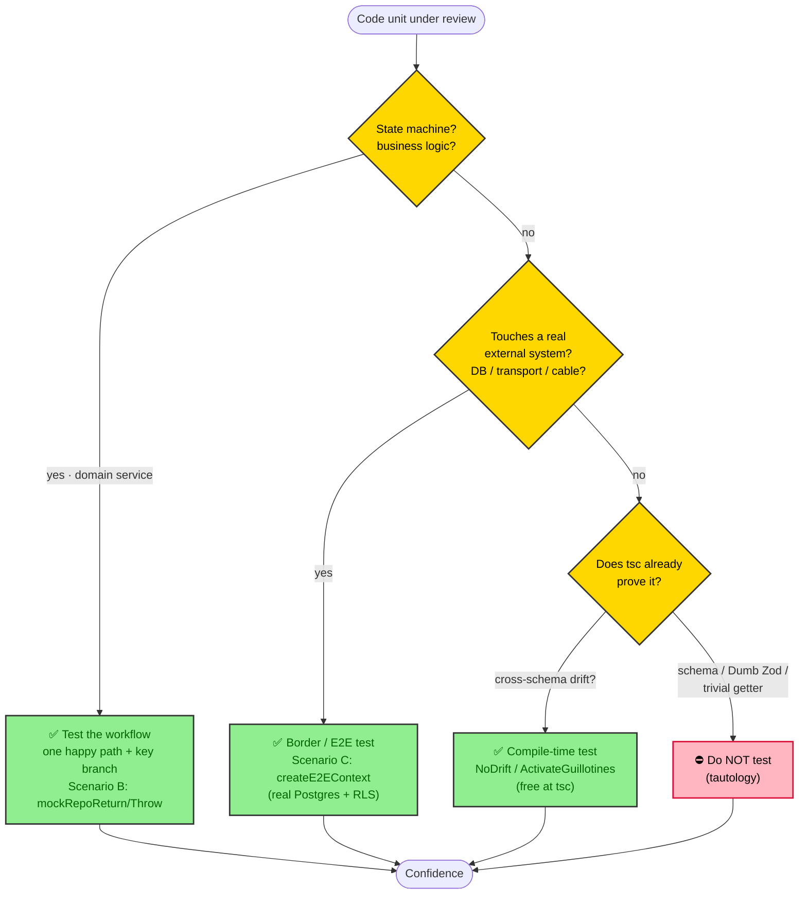
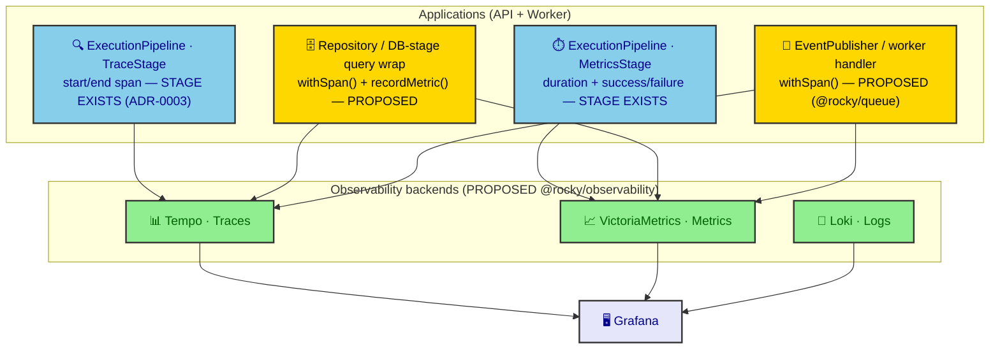

# ADR-0020: Pragmatic Marxist Doctrine for Testing, Documentation, and Observability

| Key | Value |
| --- | --- |
| **Status** | Accepted |
| **Date** | 2026-07-08 |
| **Author** | RobotFarm (Overseer) |
| **Supersedes** | None |
| **Superseded** | None |

---

**Superseded by:** N/A

> _"The philosophers have only interpreted the codebase; the point is to automate it."_
> — Adapted from Karl Marx, _Theses on Feuerbach_ (1845)

## Context

This ADR adapts the **Pragmatic Marxist Doctrine** (a cross-cutting philosophy for testing,
documentation, and observability) to Rocky's _actual_ material conditions. The doctrine was
originally drafted for a different monorepo (`@repo/*`, `bun:test`, `BaseTenantRepository.withRls()`,
a pre-built `@repo/observability` with `withSpan`/`recordMetric`). **Most of those claims do not
hold here**, and adopting them verbatim would be ideological falsification. We therefore ratify the
_thesis_ and re-ground every _mechanism_ in Rocky's real architecture:

| Claim in the original doctrine            | Rocky reality (verified)                                                                 |
| ----------------------------------------- | ---------------------------------------------------------------------------------------- |
| Test runner is `bun:test`                 | **vitest v4** is the standard runner (`packages/testing`, `vitest.config.ts`)             |
| `createE2EHarness` from `@repo/testing`   | `packages/testing` exposes **Scenario A/B/C** + `createE2EContext()` (testcontainers)     |
| `BaseTenantRepository.withRls()` traces   | Rocky's `BaseRepository` is a **thin client getter** (ADR-0019); RLS is pipeline-injected  |
| `@repo/observability` (withSpan/recordMetric) already built | **No `@rocky/observability` package exists**; tracing is _planned_ (ADR-0011/0019 roadmap) |
| `ExpectTrue<AssertEqual<>>` compile tests | Rocky's equivalent is the **three-tier guillotine** (`NoDrift`/`ActivateGuillotines`, ADR-0018) |
| Rides/drivers/Telegram/Halkbank examples  | Rocky is a cattle I&R system: animals, farms, ear tags, passports, movements, inspections  |

The doctrine has three theses. The **testing** thesis is already mechanized by ADR-0008 — this ADR
ratifies its _philosophy_ and extends it. The **documentation** and **observability** theses are new
and binding.

## Decision

### I. The Testing Doctrine — Test the Friction, Not the Structure

100% coverage is a bourgeois metric: it measures labor performed, not confidence gained. In Rocky's
Diamond Seal (ADR-0011), a tRPC router that merely delegates to a service is _superstructure_ — it
carries no logic, so it needs no test of its own. A Zod schema is already proven by `tsc` at build
time. These are **unproductive expenditures of developer labor**.

Test only where the code _decides_: state machines, cross-boundary effects, and drift between schemas.

#### A. State machines (domain services) — Scenario B

Test the **workflow**, not the helpers. One happy-path walk through a documented lifecycle catches
more than fifty unit tests of individual methods, because integration tests exercise _coupling_ — the
one thing unit tests cannot.

Use `packages/testing` Scenario B: mock the repository (`mockRepoReturn` / `mockRepoThrow`), drive the
service with `neverthrow` `Result`, and assert on `.isOk()` / `.value`. Example (illustrative —
method names follow the `<domain>.service.ts` convention; lifecycle states per the domain's AGENTS.md
contract, e.g. the EarTag order `DRAFT → SUBMITTED → CONFIRMED → SHIPPED → RECEIVED → COMPLETED`):

```typescript
// packages/domains/eartag/src/eartag-order.workflow.test.ts
import { describe, it, expect } from "vitest";
import { mockRepoReturn, mockRepoThrow } from "@rocky/testing";
import { EarTagOrderService } from "./eartag-order.service";

describe("Ear Tag Order Lifecycle (workflow)", () => {
  it("walks DRAFT → COMPLETED without manual state corruption", async () => {
    const repo = { /* stub per method */ } as any;
    const svc = new EarTagOrderService(repo);

    const created = await svc.create(mockRepoReturn({ status: "DRAFT" }));
    expect(created.isOk()).toBe(true);

    const confirmed = await svc.confirm(created.value.id);
    expect(confirmed.isOk()).toBe(true);
    expect(confirmed.value.status).toBe("CONFIRMED");

    // …ship → receive → complete…
  });

  it("fails closed when the repository throws", async () => {
    const svc = new EarTagOrderService(mockRepoThrow(new Error("deadlock")));
    const r = await svc.create(/* … */);
    expect(r.isErr()).toBe(true); // error sovereignty preserved
  });
});
```

#### B. Border tests (real systems) — Scenario C

Write tests that literally touch external reality: real Postgres (RLS leakage is a compliance
violation), the tRPC transport, the document-generation pipeline (ADR-0009), IoT geofence ingestion.
Boot real infrastructure via `createE2EContext()` (testcontainers) and assert on _effects_, not mocks.

> **Border tests reality (WO-033, 2026-07-11):** nestjs-trpc's `generate` emits `appRouter` with
> **placeholder resolvers** (`async () => "PLACEHOLDER_DO_NOT_REMOVE"`) for type inference only. The
> *real* runtime router — domain services, `ExecutionMiddleware` (RLS), `PolicyResolver`, and the
> `TRPC_ERROR_MAP` translation — is assembled **internally by nestjs-trpc and never exported**. Worse,
> the `globalMiddlewares` (`ExecutionMiddleware`, `PolicyResolver`) run only in the Nest HTTP layer, so
> `appRouter.createCaller()` **skips them**. A true full-pipeline e2e (Router -> Service -> Repo ->
> Postgres -> Zod, per role) is therefore **not achievable** without restructuring nestjs-trpc's
> runtime exposure.
>
> The dialectically-correct e2e that *is* achievable (delivered in WO-033):
> - **tRPC<->Zod wire boundary** — `packages/trpc/src/e2e/trpc-wire-boundary.test.ts` drives the
>   generated `appRouter` (whose `.input()`/`.output()` Zod schemas are REAL, imported from
>   `@rocky/validators`) via `appRouter.createCaller({ headers: new Headers() })` and asserts bad input
>   -> `TRPCError`. This proves the wire enforces the Diamond Seal schemas. The `appRouter` *instance*
>   is expropriated from the generator by `scripts/patch-trpc-transformer.mjs` (rewrites
>   `const appRouter` -> `export const appRouter`; idempotent, regeneration-safe) and re-exported from
>   `packages/trpc/src/index.ts`.
> - **Error-map translation** — `packages/trpc/src/e2e/error-map.test.ts` unit-tests
>   `createResultUnwrapper(ANIMAL_TRPC_ERROR_MAP)` -> `TRPCError` code mapping (the user-facing ask).
> - **RLS per role** stays in the repo-level `*.repository.rls.test.ts` (animal, movement, passport,
>   archive, farm, subject) — the *correct* layer for security (see §I "Points of Friction matrix").
> - Both suites run **without RLS env** (placeholder resolvers touch no DB); they execute in CI always.

#### C. Compile-time tests — the Guillotine (already running)

Rocky's `NoDrift` / `NoDriftSimple` / `ActivateGuillotines` (ADR-0018, `packages/validators/src/utils/type-bridge.ts`)
**are** tests. They run at `tsc` time and catch schema/interface drift that no runtime test can.
They are the most valuable tests in the tree. Do not delete them; they are the guillotine that
enforces the Diamond Seal.

#### Points of Friction matrix (Rocky)

| Test this                                  | Why                                          | Where                                        |
| ------------------------------------------ | -------------------------------------------- | -------------------------------------------- |
| Domain service state machines              | Complex logic, status transitions           | `*.service.workflow.test.ts` (Scenario B)    |
| Repository RLS policies                    | Data leakage = compliance violation          | `*.repository.rls.test.ts` (Scenario C)      |
| Border / integration                       | Cables and credentials break                 | `*/e2e/*.test.ts` via `createE2EContext()`   |
| Compile-time type contracts                | Drift between schemas and SDKs               | `NoDrift` / `ActivateGuillotines` (ADR-0018) |
| tRPC router I/O (wire boundary)           | Schema validation + error mapping            | `packages/trpc/src/e2e/*.test.ts` (createCaller + createResultUnwrapper) |

| **Do NOT test**                            | Why                                                                 |
| ------------------------------------------ | -------------------------------------------------------------------- |
| tRPC routers that just forward to services | Zero logic, zero value                                              |
| Zod schema shapes                          | `tsc` proves them                                                 |
| Dumb database schemas                      | The Drizzle migration _is_ the test                               |
| Simple getter / repository methods         | `findById` returning what you inserted is tautology, not a test    |



_Fig. 1 — The testing decision: route every unit to friction (test) or structure (skip). Rocky's
three `packages/testing` scenarios (A validator, B mock-repo, C E2E) map onto the three "test" leaves._

### II. Documentation — Document the Trauma, Not the Type

Manual JSDoc that restates the type system is ideological noise — a lie that must be maintained and
will rot:

```typescript
/** @param {string} rideId - The ID of the ride */ // ← CRIME: the type already says string
```

**Never document WHAT** (the Zod schema and TypeScript types explain the shape). **Only document WHY**
(the business constraint, the historical wound, the compliance rule). Good Rocky examples:

```typescript
/**
 * Tenant-scoped SELECT only. ⚠️ SECURITY: this method relies on SET LOCAL
 * injected by ExecutionPipeline's RLSStage (ADR-0006). Never call it outside
 * a pipeline-contextualized transaction — doing so reads across tenants.
 */
```

```typescript
/**
 * RETRY-WINDOW HACK: the external registry rejects orders submitted within
 * 300s of a prior rejection for the same keeper. We pad the window because the
 * upstream has a weekend race condition. Do not shrink this constant.
 */
```

And the code documents _itself_: Rocky's `api/*.api.ts` schemas (`packages/validators`) are the
single contract (ADR-0011/0018). `nestjs-trpc` codegen turns them into the generated client types that
frontends consume — change the schema, change the wire. Nextra renders the docs from the same code.
**No separate hand-maintained API docs to keep in sync.**

### III. Observability — Observe Automatically, Never Manually

> **Thesis:** If a developer must remember to write `logger.info()`, the architecture has already
> failed. Manual logging is a tax on attention that produces garbage data.

**Rocky's current state (verified):** there is **no `@rocky/observability` package** and no
`withSpan`/`recordMetric` calls anywhere. This is _not_ "already done." What _does_ exist is the
**architecture for** automatic observability:

- **ExecutionPipeline** already defines `TraceStage` and `MetricsStage` as composable stages
  (ADR-0003) — the injection point for execution tracing is designed, not absent.
- **RLS** is injected by `RLSStage` against a transactional connection (ADR-0006); repositories stay
  thin (ADR-0019), so DB tracing belongs in the pipeline's DB stage or a query wrapper — **not** in a
  `BaseTenantRepository.withRls()` that Rocky does not have.
- `@rocky/observability` (`withSpan()`, `recordMetric()`, business metrics) is an explicit **Future
  Roadmap** item in ADR-0011 and ADR-0019.

Therefore the doctrine's observability section is ratified as a **target architecture**, to be built
on the existing stage skeleton rather than bolted on by hand:

1. **API/execution tracing** — implement `TraceStage`/`MetricsStage` bodies via `@rocky/observability`
   (`withSpan`), so every tRPC call is timed without a single `logger.*` in a router.
2. **DB tracing** — wrap repository queries (or the pipeline's DB stage) in `withSpan` + latency
   `recordMetric`. Developers never log in a repository.
3. **Queue/worker tracing** — `EventPublisher` / worker handlers emit success/failure metrics.
4. **Business metrics** — emitted _inside_ domain services/workers (which understand meaning), never
   in routers/controllers.



_Fig. 2 — Observability target. Blue = stages already present in the ExecutionPipeline (ADR-0003);
yellow = work to build in `@rocky/observability` (ADR-0011/0019 roadmap). The point: instrumentation
is a _structural property of the environment_, not a developer responsibility._

### IV. The Synthesis — A Self-Reproducing System

Combine the three: Scenario-B/C tests + the Guillotine (compile-time) + self-documenting Zod
contracts + pipeline-stage tracing ⇒

1. **Confidence without toil** — tests live where logic decides; the compiler covers the rest.
2. **Zero manual logging** — tracing is free via pipeline stages; `logger.*` in services is technical
   debt to be retired.
3. **Self-documenting API** — `api.ts` Zod _is_ the contract; codegen makes it the client types.
4. **Drift is a build error** — the guillotine enforces the Diamond Seal at `tsc` time.
5. **Developers freed for business logic** — the only place friction actually lives.

## Consequences

### Positive

- **Honest baseline:** states exactly what is built (ADR-0008 testing, ADR-0003 stages) vs planned
  (`@rocky/observability`), instead of the original doctrine's false "already done."
- **Less toil:** testing effort concentrates on state machines + borders; docs are WHY-only; tracing
  is automatic-by-design.
- **Onboarding:** the decision flowchart (Fig. 1) tells a newcomer where not to waste time.

### Negative

- **Observability gap:** until `@rocky/observability` lands, Rocky has _no_ centralized metrics/traces.
  Mitigated by the existing `TraceStage`/`MetricsStage` skeleton, which makes adoption a fill-in, not a
  rewrite.
- **Doc-discipline required:** stripping tautological JSDoc is a cultural change, not a compiler check.

### Neutral

- **Aligns** with ADR-0008 (testing mechanics), ADR-0018 (guillotine = compile-time tests), ADR-0003
  (pipeline stages = tracing injection), ADR-0011/0019 (observability roadmap). Supersedes none.

## Implementation

### Phase 0 — Already real (the free lunch)

- ✅ Testing doctrine + `packages/testing` (vitest v4, Scenario A/B/C, factories) — ADR-0008
- ✅ Three-tier guillotine (`NoDrift`/`ActivateGuillotines`) — ADR-0018
- ✅ ExecutionPipeline `TraceStage` + `MetricsStage` stages defined — ADR-0003
- ✅ RLS via transactional connection, injected by pipeline — ADR-0006

### Phase 1 — This sprint (the only tests that matter)

- [ ] One `*.service.workflow.test.ts` per domain with a real state machine (ear tag order, inspection,
      correction) using Scenario B.
- [ ] One `*.repository.rls.test.ts` per security-sensitive domain via Scenario C.
- [ ] Audit existing JSDoc: strip WHAT-tautologies, keep WHY-constraints.

### Phase 2 — Next sprint (borders + observability skeleton)

- [x] `*/e2e/*.test.ts` border tests (tRPC<->Zod wire boundary + error-map unit) — delivered WO-033 (2026-07-11); see §I.B "Border tests reality".
- [ ] Scaffold `@rocky/observability` with `withSpan`/`recordMetric`; implement `TraceStage`/
      `MetricsStage` bodies.

### Phase 3 — Ongoing (the long march)

- [ ] Retire manual `logger.*` in services in favor of span attributes.
- [ ] Business metrics emitted inside domain services/workers.

## Alternatives Considered

### 1. Copy the original doctrine verbatim

**Rejected.** It asserts `bun:test`, `BaseTenantRepository.withRls()` tracing, and a built
`@repo/observability` — none exist in Rocky. Shipping that would be a documented falsehood.

### 2. Keep testing in ADR-0008 only; skip docs + observability

**Rejected.** The documentation (WHY-not-WHAT) and observability (auto-not-manual) theses are not
covered by ADR-0008 and are load-bearing for the "self-reproducing system" goal.

### 3. Build `@rocky/observability` immediately

**Rejected.** ADR-0011/0019 already defer it to "sufficient scale"; the stage skeleton exists, so the
correct move is to ratify the _target_ now and fill in when justified.

## Guiding Principles

1. **Test the friction, not the structure.** Test where the code _decides_, not where it _passes through_.
2. **Document the trauma, not the type.** Explain business constraints, not what TypeScript proves.
3. **Observe automatically, never manually.** If a developer must remember to log, the architecture is broken.
4. **The schema is the test.** `tsc` + Zod + the guillotine already form a suite — don't duplicate it.
5. **Integration over unit.** One happy-path walk catches more than fifty isolated method tests.

## Related ADRs

- ADR-0008: Diamond Seal Testing Doctrine (the _mechanics_ this ADR philosophizes)
- ADR-0018: API Validator Schema Design (the three-tier guillotine = compile-time tests)
- ADR-0003: Execution Pipeline as Composable Stages (`TraceStage`/`MetricsStage` = tracing injection)
- ADR-0006: RLS via Transactional Connection (where RLS/tenant context is injected)
- ADR-0011 / ADR-0019: Diamond Seal boundaries + observability `@rocky/observability` roadmap
