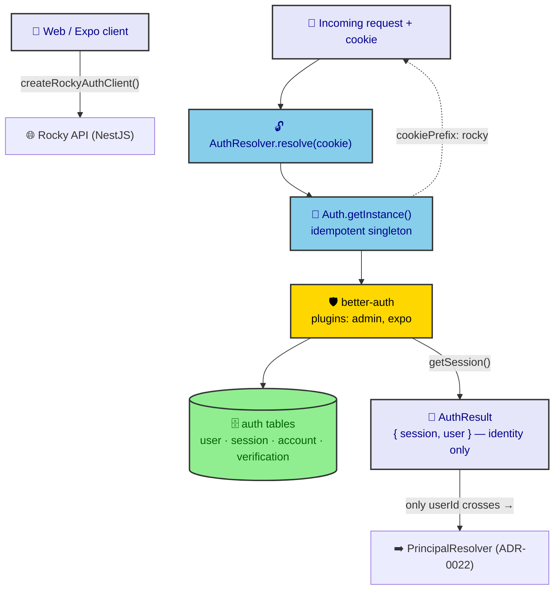

# ADR-0021: Better Auth Configuration & Session Resolution

| Key | Value |
| --- | --- |
| **Status** | Accepted |
| **Date** | 2026-07-08 |
| **Author** | RobotFarm (Auth Bot) |
| **Supersedes** | None |
| **Superseded** | None |

---

**Superseded by:** N/A

## Context

Rocky has one backend (`apps/api`) and two frontends (Next.js admin, Expo mobile) that all need
authentication. ADR-0001 fixed the *boundary* between auth and authorization, and ADR-0002 named the
`Principal` as the canonical actor — but neither ratifies **how** authentication is actually performed.
The mechanism lives in `packages/auth` and is real, undocumented, and easy to misuse:

- `Auth.getInstance(config)` is an **idempotent singleton** — one Better Auth server powers the whole
  monorepo. Call it twice, you get the same instance.
- The package is deliberately **identity-only**: it imports auth tables + sessions, and *nothing* about
  SM users, RBAC, or organizations. The `customSession` RBAC enrichment described in older docs does
  **not** live here — RBAC is resolved downstream by `PrincipalResolver` (ADR-0022). Only the `userId`
  crosses the boundary (ADR-0001).
- There are **two distinct role systems** that newcomers conflate: (a) Better Auth's **admin-plugin
  roles** (`_authRoles`), which gate user-management endpoints, and (b) the **SM RBAC** roles/permissions
  resolved into `Principal` by `PrincipalResolver`. `SUPER_ADMIN` is the convergence point.

Without a ratified decision, developers reinvent session handling per app and leak RBAC into the auth
package.

## Decision

We adopt **Better Auth as a single idempotent singleton**, fronted by a transport-agnostic
`AuthResolver` and a shared `createRockyAuthClient()` factory, with a strict **identity-only** boundary.

### A. The singleton (`Auth.getInstance`)

```typescript
// packages/auth/src/better-auth.ts
export class Auth {
  private static instance: ReturnType<typeof betterAuth>;
  static getInstance(config: AuthConfig) {
    if (Auth.instance) return Auth.instance;          // idempotent
    Auth.instance = betterAuth({
      database: drizzleAdapter(db, { provider: "pg", schema: { user, session, account, verification } }),
      advanced: { cookiePrefix: "rocky", generateId: false },
      emailAndPassword: { enabled: true, sendResetPassword: /* … */ },
      plugins: [admin({ adminRoles: ["SUPER_ADMIN"], roles: _authRoles }), expo()],
    });
    return Auth.instance;
  }
}
```

- **One instance** for the monorepo, initialized once in `apps/api/src/auth/auth.ts` from env
  (`BETTER_AUTH_SECRET` required, `TRUSTED_ORIGINS`, `BETTER_AUTH_URL`) and wired into
  `@thallesp/nestjs-better-auth`'s `AuthModule.forRoot()`.
- `cookiePrefix: "rocky"` — all Rocky cookies namespaced; `generateId: false` keeps DB-controlled IDs.
- **Plugins:** `admin({ adminRoles: ["SUPER_ADMIN"], roles: _authRoles })` (user management endpoints)
  and `expo()` (mobile session bridging).

### B. Transport-agnostic resolution (`AuthResolver`)

```typescript
// packages/auth/src/auth.resolver.ts
export class AuthResolver {
  static async resolve(auth, cookieHeader: string): Promise<AuthResult> {
    if (!cookieHeader) return null;
    const result = await auth.api.getSession({ headers: new Headers({ cookie: cookieHeader }) });
    return result ? { session: result.session, user: result.user } satisfies AuthResult : null;
  }
}
```

`AuthResolver` depends on **no** Express/tRPC/NestJS type — it takes a cookie string, returns
`AuthResult` (`{ session, user }`, identity only) or `null`. This is what lets the same auth serve
tRPC, cron, and future transports.

### C. Shared client factory (`createRockyAuthClient`)

```typescript
// packages/auth/src/client.ts
export function createRockyAuthClient(options: RockyAuthClientOptions = {}) {
  return createAuthClient({
    baseURL: options.baseURL ?? (process.env.NEXT_PUBLIC_API_URL ?? process.env.EXPO_PUBLIC_API_URL ?? "http://localhost:8080"),
    plugins: [adminClient(), ...(options.plugins ?? [])],  // org/2FA plugins intentionally absent (Identity-Only Boundary)
  });
}
```

Both frontends use the **same factory**: mobile passes `expoClient({ scheme, storage: SecureStore })` via `plugins` and sets `disableDefaultFetchPlugins: true`; web relies on the gateway `proxy.ts` for cookie handling (no `nextCookies()` plugin). No per-platform auth reimplementation.

### D. The identity boundary (what crosses)

`packages/auth` imports **only** `@rocky/database` auth tables (`user`, `session`, `account`,
`verification`). It does **not** import SM users, RBAC, or organizations. The `AuthResult` it emits
carries identity (`session.userId`); `PrincipalResolver` (ADR-0022) maps that to the SM user and
resolves RBAC. **Only `userId` crosses the line.**



*Fig. 1 — Session resolution. The auth package terminates at `AuthResult`; only `userId` flows onward
to authorization. The Better Auth `admin` plugin's roles are identity-level (user management), not
business RBAC.*

## Consequences

### Positive

- **One auth implementation** for the whole monorepo — no per-app reinvention.
- **Transport-agnostic** — `AuthResolver` serves tRPC, cron, and future transports identically.
- **Strict boundary** — auth package cannot leak RBAC/SM concerns; the Diamond Seal import rules
  (ADR-0011) hold at the package level.
- **Platform parity** — web and mobile share `createRockyAuthClient()`.

### Negative

- **Singleton coupling** — the instance is process-global; tests must reset it (handled by
  `apps/api` bootstrap, not the package).
- **Two role vocabularies** — Better Auth admin roles vs SM RBAC must be kept mentally distinct;
  `SUPER_ADMIN` is the only intentional overlap.
- **Cookie dependency** — `AuthResolver` needs the raw cookie header; non-HTTP transports must supply
  an equivalent credential.

### Neutral

- **`emailAndPassword.sendResetPassword`** is wired to `@rocky/email` (Nodemailer + React Email `PasswordResetEmail`); dev fallback logs without sending when SMTP is unset.

## Implementation

- Singleton initialized in `apps/api/src/auth/auth.ts`; never call `Auth.getInstance()` with divergent
  config from multiple entry points.
- Frontends import `createRockyAuthClient()` only — never `betterAuth` directly.
- Keep `packages/auth` free of `@rocky/database/constants` RBAC imports (use `auth` schema tables).

## Alternatives Considered

### 1. Per-app Better Auth instances

**Rejected.** Duplicates config, cookie namespaces, and sessions; breaks the single source of truth
for identity. The singleton is the monorepo contract.

### 2. RBAC enrichment via `customSession` inside auth

**Rejected (and not implemented).** It would pull SM users/permissions into the auth package,
violating the ADR-0001 boundary. RBAC stays in `PrincipalResolver` (ADR-0022).

### 3. Hand-rolled JWT/session

**Rejected.** Better Auth already provides the adapter, plugins, and expo bridging; rebuilding is
wasteful and less secure.

## Related ADRs

- ADR-0001: Auth vs. Authorization Boundary (only `userId` crosses)
- ADR-0002: Principal as Canonical Runtime Actor (`AuthResult` → `Principal`)
- ADR-0022: Authorization Policy Engine (what resolves RBAC from `AuthResult`)
- ADR-0011: Diamond Seal Layer Boundaries (auth package import scope)
