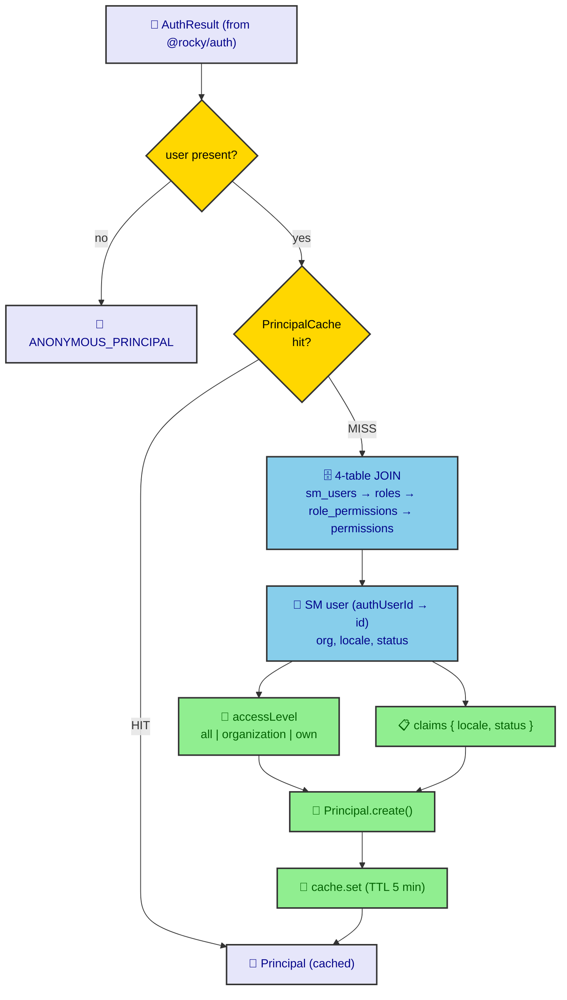
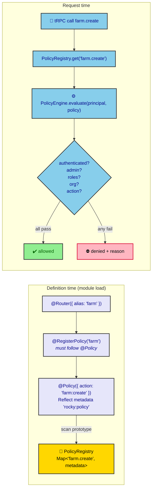

# ADR-0022: Authorization Policy Engine

| Key | Value |
| --- | --- |
| **Status** | Accepted |
| **Date** | 2026-07-08 |
| **Author** | RobotFarm (Authorization Bot) |
| **Supersedes** | None |
| **Superseded** | None |

---

**Superseded by:** N/A

## Context

ADR-0001 fixed the auth/authorization *boundary*, ADR-0002 named `Principal` the canonical actor, and
ADR-0004 established the *philosophy* that routers declare **actions, not permissions**. But the
**mechanics** of authorization are undocumented and live across `packages/authorization`:

- `Principal` is an immutable value object — the only auth construct business code may touch.
- `PrincipalResolver` is the **single** boundary that turns `AuthResult` (identity) into `Principal`
  (identity + RBAC), performing the Better Auth id → SM user id mapping and the 4-table RBAC JOIN.
- `@Policy()` / `@RegisterPolicy()` decorators + `PolicyRegistry` + `PolicyEngine` form a declarative,
  transport-agnostic authorization system — but the decorator-ordering contract and the registry
  lookup semantics are only recorded in code comments and the AGENTS.md troubleshooting table.

Without a ratified decision, the policy system is cryptic: a misordered decorator silently disables a
policy (ADR-0004 troubleshooting: "Policy not firing — router missing `@RegisterPolicy(alias)`").

## Decision

We adopt the **Principal + `@Policy` + `PolicyRegistry` + `PolicyEngine`** system as the single
authorization mechanism, with `PrincipalResolver` as the only auth→authorization boundary.

### A. `Principal` — the canonical actor

```typescript
// packages/authorization/src/principal/principal.ts
export class Principal {
  readonly id: string; readonly username: string;
  readonly roles: ReadonlyArray<string>; readonly permissions: ReadonlyArray<string>;
  readonly organization: OrganizationContext | null;
  readonly accessLevel: AccessLevel;            // "all" | "organization" | "own"
  readonly claims: Readonly<Record<string, unknown>>;
  hasPermission(p: string): boolean { return this.permissions.includes(p); }
  hasRole(r: string): boolean { return this.roles.includes(r); }
  isAdmin(): boolean { return this.roles.includes("SUPER_ADMIN"); }
}
```

Immutable, frozen, constructed via `Principal.create(...)`. Survives any infrastructure swap (Better
Auth → Keycloak, RBAC → OpenFGA): business code only ever sees `Principal`.

### B. `PrincipalResolver` — the only boundary

```typescript
// packages/authorization/src/principal/principal.resolver.ts
async resolve(authResult: AuthResult): Promise<Principal> {
  if (!authResult?.user) return ANONYMOUS_PRINCIPAL;            // anonymous
  const cached = this.cache.get(authResult.user.id);            // PrincipalCache (ADR-0013)
  if (cached) return cached;
  const [smUser] = await db.select().from(smUsers).where(eq(smUsers.authUserId, authResult.user.id));
  // 4-table JOIN: sm_users → user_roles → role_permissions → permissions
  // compute accessLevel (RLS_BYPASS_ROLES → "all"; ORG_SCOPED_ROLES → "organization"; else "own")
  // build claims { locale, status }
  const principal = Principal.create({ id: smUser.id, username, roles, permissions, organization, accessLevel, claims });
  this.cache.set(authResult.user.id, principal);                // TTL 5 min
  return principal;
}
```



*Fig. 1 — Principal resolution. The resolver is the sole place Better Auth id → SM id mapping, RBAC
reads, `accessLevel` computation, and claims building occur. Cache-first via `PrincipalCache` (ADR-0013).*

### C. Declarative policy (`@Policy` / `@RegisterPolicy`)

```typescript
// packages/authorization/src/policies/policy.decorator.ts
export function Policy(options: PolicyMetadata): MethodDecorator & ClassDecorator { /* Reflect.defineMetadata("rocky:policy", options, …) */ }
// packages/authorization/src/policies/register-policy.decorator.ts
export function RegisterPolicy(alias: string): ClassDecorator {
  return (target) => { PolicyRegistry.register(alias, target); };
}
```

- **`@Policy({ action, authenticated, organization, roles, admin })`** — attaches `rocky:policy`
  metadata via Reflect. Routers declare **actions**, never raw permissions (ADR-0004).
- **`@RegisterPolicy("alias")`** MUST appear **after** `@Policy()` in the decorator stack, so metadata
  is already set when it scans the prototype. Method-level `@Policy` overrides class-level.
- `PolicyRegistry` holds a **static** `Map<"alias.method", PolicyMetadata>`, populated at module-load
  (definition time), no DI needed.



*Fig. 2 — Policy flow. Left: decorators populate the static `PolicyRegistry` at load. Right: at
request time the engine evaluates the resolved `Principal` against the metadata.*

### D. `PolicyEngine.evaluate` — pluggable, ordered

```typescript
// packages/authorization/src/policies/engine.ts
async evaluate(principal: Principal, policy: PolicyMetadata): Promise<PolicyDecision> {
  if (policy.authenticated && principal.id === "anonymous") return deny("Authentication required");
  if (policy.admin && !principal.isAdmin()) return deny("Admin access required");
  if (policy.roles?.length && !policy.roles.some((r) => principal.hasRole(r))) return deny("Required one of roles: …");
  if (policy.organization && !principal.organization) return deny("Organization membership required");
  if (policy.action && !principal.hasPermission(policy.action)) return deny(`Missing required permission: ${policy.action}`);
  return { allowed: true };
}
```

Evaluation is **ordered** (authenticated → admin → roles → organization → action) and **pluggable**
(injected provider; tomorrow ABAC/ownership/time rules without touching routers). Routers never call
`principal.hasPermission` directly — they declare `@Policy({ action })`.

## Consequences

### Positive

- **Single authorization path** — `@Policy` + `PolicyRegistry` + `PolicyEngine`, transport-agnostic.
- **Routers stay declarative** — they name actions; the engine owns the rules (ADR-0004).
- **Principal is stable** — business code is immune to auth/infra churn.
- **Cache-backed resolution** — `PrincipalResolver` + `PrincipalCache` avoid the 4-table JOIN per request (ADR-0013).

### Negative

- **Decorator ordering is load-bearing** — `@RegisterPolicy` after `@Policy`, or the policy is never
  registered (silent allow). Mitigated by code review + the AGENTS.md troubleshooting table.
- **`PolicyRegistry.get()` fallback is fragile** — exact match first, then a prefix scan that returns
  the *first* entry it finds; routers must keep `@Router({ alias })` == `@RegisterPolicy(alias)`.
- **Cache staleness** — `PrincipalCache` TTL is 5 min; role changes need explicit `invalidate()` (ADR-0013).
- **Two role vocabularies** — `@Policy({ roles })` checks SM roles via `principal.hasRole`; `admin: true`
  checks `principal.isAdmin()` (SM `SUPER_ADMIN`). Better Auth admin-plugin roles are a *separate*
  identity-level concern (ADR-0021).

### Neutral

- `@Policy` metadata is static; dynamic, row-level ABAC (ownership, org status) is a future engine rule.

## Implementation

- Decorate every protected router method with `@Policy(...)`. Keep `@RegisterPolicy(alias)` directly
  above `@Router`, **after** the method-level `@Policy` decorators.
- Never put authorization logic in routers — declare `@Policy`, let `PolicyEngine` decide.
- Call `PrincipalResolver.invalidate(userId)` after any role/permission mutation.

## Alternatives Considered

### 1. Inline `principal.hasPermission()` checks in routers

**Rejected.** Duplicates rules across routers, breaks the action-abstraction (ADR-0004), and makes
policy changes require edits everywhere.

### 2. NestJS `Guards` / `CanActivate` for authz

**Rejected.** HTTP-framework-coupled; cannot serve cron/RabbitMQ/CLI transports. The decorator +
registry + engine is transport-agnostic (ADR-0003).

### 3. Better Auth admin-plugin roles as business RBAC

**Rejected.** Those roles gate user-management endpoints (identity-level, ADR-0021). Business
authorization (animal:create, farm:approve, …) is SM RBAC resolved into `Principal`.

## Related ADRs

- ADR-0001: Auth vs. Authorization Boundary (only `userId` enters)
- ADR-0002: Principal as Canonical Runtime Actor (`Principal` shape)
- ADR-0004: Policy Actions, Not Permissions (the philosophy this mechanizes)
- ADR-0013: Principal Caching Strategy (`PrincipalCache` used by the resolver)
- ADR-0021: Better Auth Configuration (produces the `AuthResult` this resolves)
- ADR-0006: RLS via Transactional Connection (`accessLevel` drives RLS scoping)
