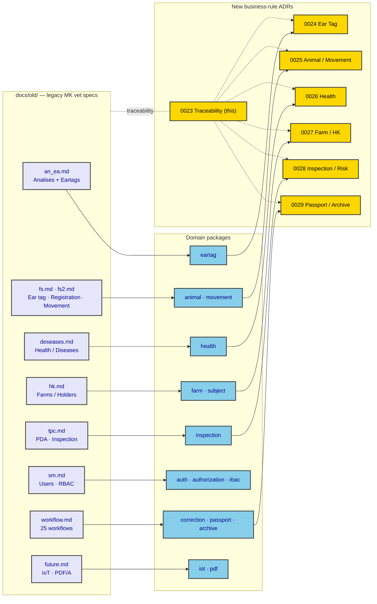

# ADR-0023: Business-Rule Adoption & Source-to-Code Traceability

| Key | Value |
| --- | --- |
| **Status** | Accepted |
| **Date** | 2026-07-08 |
| **Author** | RobotFarm (Overseer) |
| **Supersedes** | None |
| **Superseded** | None |

---

**Superseded by:** N/A

## Context

`docs/old/*.md` (and their sibling PDFs) are the **legacy Macedonian veterinary-system
specifications** — Oracle Designer schema reports and reconstructed process flows for ear tags,
animal registration, the farm book (HK), health/diseases, PDA field inspection (TPC), risk analysis
(Analises), system management (SM: users/RBAC), and 25 cross-domain workflows. They are the
**reference business rules (MK jurisdiction)** the Rocky domain packages were originally built from — one instance of a system that must support many jurisdictions (ADR-0030).

Until now those rules lived only in the legacy docs and in scattered service constants. There was
**no ratified record** of which rules were adopted, which diverged, and which were deferred — so
drift was invisible (e.g., AGENTS.md still describes a "6-stage" ear-tag order lifecycle that the
code no longer uses). This ADR ratifies the **adoption strategy** and establishes the
**traceability** backbone that the per-domain business-rule ADRs (0024+) hang from.

## Decision

We adopt the legacy specs as the **reference (MK) jurisdiction instance**, ratify the following, and commit to making every rule **jurisdiction-configurable** (ADR-0030):

1. **Traceability is mandatory.** Every business rule in `docs/old/*.md` maps to a concrete code
   location (service method / state machine / enum / Zod schema / cron job / outbox event). The
   mapping below is the canonical index; per-domain ADRs (0024+) expand it.

   > **Updated 2026-07-08 — jurisdiction reframe (ADR-0030).** `docs/old/*.md` are **NOT** universal source of truth; they are the **reference MK jurisdiction instance**. The authoritative source of truth is the **active jurisdiction's RuleSet** (ADR-0030). The "divergences" below are therefore *per-jurisdiction choices*, not deviations to be "corrected" back to MK.
2. **Rules live in code, not docs.** Business logic is expressed as:
   - **State machines** — `*_STATUS` enums + transition maps (`EAR_TAG_ORDER_STATUS`, `EAR_TAG_STATUS`, …).
   - **Service constants** — `DEFAULT_PARAMS` / thresholds (e.g. `ORDER_INTERVAL_DAYS = 120`).
   - **Zod schemas** — `packages/validators` + `@rocky/validators` (`earTagSchema`, date coercion).
   - **Cron jobs** — `apps/api/src/jobs/*` (risk-analysis, retention, correction-consistency).
   - **Outbox events** — `packages/domains/*/events` + `ExecutionPipeline` (ADR-0012/0014).
3. **The default (MK) RuleSet preserves its legacy algorithms verbatim.** `check-digit.ts`
   carries the exact source citation (e.g. `FS - eartags_MK(v1.0).pdf p6`) and the legacy weights — these are the MK *defaults*, pluggable per jurisdiction via the algorithm-provider model in ADR-0030.
4. **Divergences are recorded, not silently dropped.** Confirmed defects and deferred features are
   tracked in the registers below so they can be triaged, not forgotten.

*Fig. 1 — Source → domain package → ADR. `sm.md` (RBAC) is covered by ADR-0001/0004/0022; `future.md`
(IoT/PDF-A) by ADR-0009 + 0031 (planned).*

## Traceability Summary

Status legend: ✅ ADOPTED · 🟡 PARTIAL · ❌ MISSING · ⚠️ DEFERRED/CONTRADICTS.

| Domain | Source (docs/old) | Key adopted rules (code location) | Status |
|---|---|---|---|
| **Ear tag** | `fs.md`, `an_ea.md` | 8-digit numbering from `10000001`; check digit `[3,5,7,11,13,17,19]` (`check-digit.ts`); order lifecycle `EAR_TAG_ORDER_STATUS`; tag lifecycle `EAR_TAG_STATUS`; `ORDER_INTERVAL_DAYS=120`, `MAX_ORDERS_PER_YEAR=4`, 24h idempotency, supplier contingents, takeover file | ✅ + ⚠️ (takeover-file defect, ADR-0024) |
| **Animal registration** | `fs2.md` | Ear tag must be NEW; registration date ≤ today; mother age ≥ 17 mo, calving gap ≥ 365 d; self-mother / parent-sex integrity | ✅ (🟡 365 d vs legacy 120 d calving gap) |
| **Movement** | `fs2.md`, `workflow.md` | Stillborn ≤ 25 d; slaughter min age 25 d; ±2 d arrival correction; unregistered farm IDs `100000014`/`100000027`; pasture home-farm only; 4-leg market; import/export | ✅ |
| **Health / diseases** | `deseases.md` | Notifiable → inspection flag (outbox); batch expiry; `MIN_VACCINATION_AGE_DAYS=30`; stock decrement; vet-binding; alive checks; vaccine↔disease mapping | ✅ + ❌ (stock reconciliation) |
| **Farm / Holder (HK)** | `hk.md`, `fs2.md` | Address registry; `SUBJECT_ROLE` (owner/keeper/vet/…); geocoords; data-source ownership; soft-delete | ✅ + 🟡 (VI role missing, `FIELD_CHANGED`→VD lock partial) |
| **Inspection / risk** | `an_ea.md`, `workflow.md` | 10% annual selection (`@Cron`); weighted scoring `DEFAULT_WEIGHTS` (0.3/0.3/0.2/0.2); on-spot lifecycle; flagFarmForInspection | ✅ + 🟡 (per-farm results not persisted) |
| **Passport / archive** | `workflow.md` | Passport issuance/seizure/reprint; 3-tier archive (CPC/VS/VI); 3-year retention cron | ✅ |
| **Correction / PDA sync** | `tpc.md` | A priori / a posteriori; Passed/Warning/Rejected; consistency cron; field-error → VI escalation; farm-ID immutable | ✅ + ❌ (3-attempt device block) |
| **SM / RBAC** | `sm.md` | Better Auth singleton + `PrincipalResolver`; action-based `@Policy`; per-farm holdings via RLS; `SM_SYS_PARAMS` thresholds | ✅ + ❌ (sys-params table) |
| **IoT / PDF-A** | `future.md` | `iot` CRUD (devices/readings/geofences); `transmissionType`; `packages/pdf` templates (YAML/XML stable API) | 🟡 PARTIAL + ⚠️ (PDF/A, AMR, blockchain deferred) |

## Bug Register (confirmed)

| # | Defect | Location | Evidence | Action |
|---|---|---|---|---|
| B1 | **Takeover file uses the wrong check-digit algorithm AND synthetic tag numbers.** It computes `check = 10 - (sum % 10)` with weights `[3,1,3,1,3,1,3]` and enumerates `10000001 + i`, whereas the canonical `calculateEarTagCheckDigit` uses `[3,5,7,11,13,17,19]` + `sum % 10` and the real assigned tags. Export `.txt` files therefore contain invalid tags that fail `validateEarTagCheckDigit`. | `packages/domains/eartag/src/services/eartag.service.ts:512-536` | Verified against `packages/validators/src/utils/check-digit.ts` + legacy spec citation `FS - eartags_MK p6` | Fix in ADR-0024 scope; emit real assigned tags via `calculateEarTagCheckDigit` |
| B2 | **`SM_SYS_PARAMS` / RuleSet not implemented** — all thresholds (120/4, 25/25/2, 17mo/365d, 30d) are hardcoded service constants. | `eartag` / `movement` / `animal` / `health` services | No `ruleset` store yet | **Resolved by ADR-0030** (Jurisdiction-Configurable Rule Engine) |
| B3 | **`VI` (veterinary inspector) subject role missing** — only `VETERINARIAN` exists; workflow's VS/VI split is collapsed. | `packages/database/src/constants/subject-role.ts` | vs `workflow.md` Instance 18/22 | Add `VI` role or document the collapse (ADR-0027) |

## Deferral Register (by design)

| Feature | Source | Why deferred |
|---|---|---|
| PDF/A rendering + cryptographic seal | `future.md` §1–2 | `packages/pdf` exposes YAML/XML intermediate as the stable API (AGENTS.md); PDF/A is a future rendering concern |
| AMR tracking, 10 km outbreak buffer | `future.md` | Not in current scope |
| Genetic lineage / performance profiling | `future.md` | Only mother/father IDs modeled |
| Blockchain provenance | `future.md` | Not in current scope |
| Per-farm risk-analysis results table | `an_ea.md` (`GN_ANLS_RESULTS`) | Only the selected-farm count is persisted today |
| Birth-notification deadline enforcement (7/20 d) | `workflow.md` Instance 8 | Status enum + `calculateTaggingDeadline()` exist; no service/cron yet |

## Consequences

### Positive

- **Drift becomes visible.** AGENTS.md's stale "6-stage" claim is now contradicted by ADR-0024's
  verified 8-state enum, and the takeover-file defect is tracked rather than hidden.
- **Single index.** New developers can trace any legacy rule to code in one place.
- **Legacy fidelity preserved** where the law demands it (check-digit algorithms carry source citations).

### Negative

- **Maintenance burden** — this register must be updated as rules change (RobotFarm pass, AGENTS.md §Update After Editing).
- **Some legacy vocabulary is intentionally not preserved verbatim** (e.g., `ZACETNI`/`PREVZETA` →
  `NEW`/`COLLECTED`); functionally equivalent but not a 1:1 lexicon.

## Implementation

- This ADR is the **root** of the business-rule ADR subtree (0024+). Each per-domain ADR MUST cite
  its `docs/old` source(s) and the code locations, and MUST update the relevant row above.
- Confirmed defects (B1–B3) are owned by their domain ADR; resolution is tracked there.
- When a legacy rule changes in code, update both the domain ADR and this summary table.

## Recommended follow-on ADRs (roadmap)

| # | ADR | Domain | Priority |
|---|---|---|---|
| 0024 | Ear Tag Order Lifecycle & Numbering | `eartag` | **P1** (carries defect B1) |
| 0025 | Animal Registration & Movement Rules | `animal`, `movement` | **P1** |
| 0026 | Health & Disease Domain | `health` | **P1** |
| 0027 | Farm & Holder (HK) + Subject Roles | `farm`, `subject` | P2 |
| 0028 | Risk Analysis & On-Spot Inspection | `inspection` | P2 |
| 0029 | Passport Lifecycle & Archive Retention | `passport`, `archive` | P2 |
| 0030 | Jurisdiction-Configurable Rule Engine | cross-cutting (B2 + roles + algorithms + retention) | **P0 — now** |
| 0031 | IoT & Connectivity Abstraction | `iot`, `pdf` | P3 |

## Related ADRs

- ADR-0006: RLS (drives `SM_US_HOLDINGS` → `farm-*read/write-roles`)
- ADR-0007 / ADR-0016: Audit via lifecycle events (legacy `ID_SESSION` audit)
- ADR-0009: Document Generation (maps to `future.md` §1–2)
- ADR-0012 / ADR-0014: Outbox (health→inspection, movement→notification decoupling)
- ADR-0015: PDA Sync Conflict Resolution (maps to `tpc.md`)
- ADR-0022: Policy Engine (maps to `sm.md` RBAC)
- ADR-0001 / ADR-0004: Auth boundary + actions-not-permissions (maps to `sm.md`)
