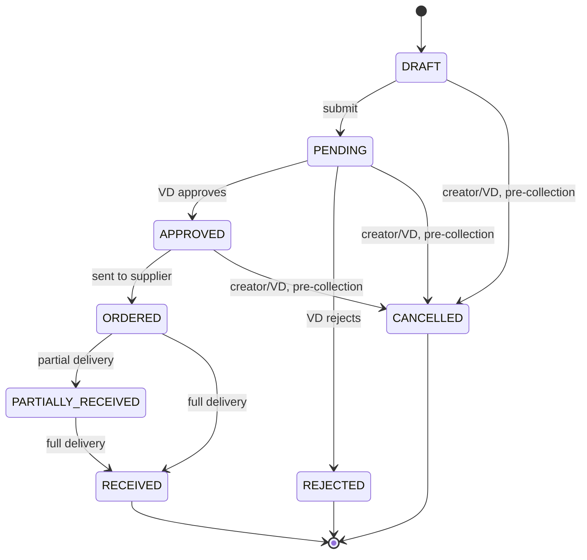
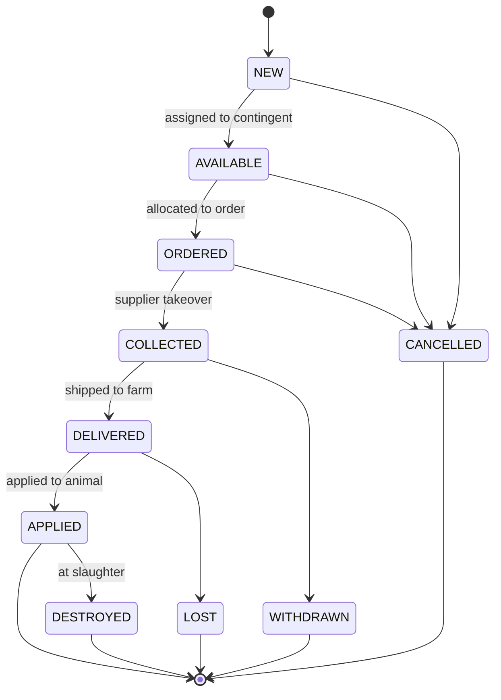
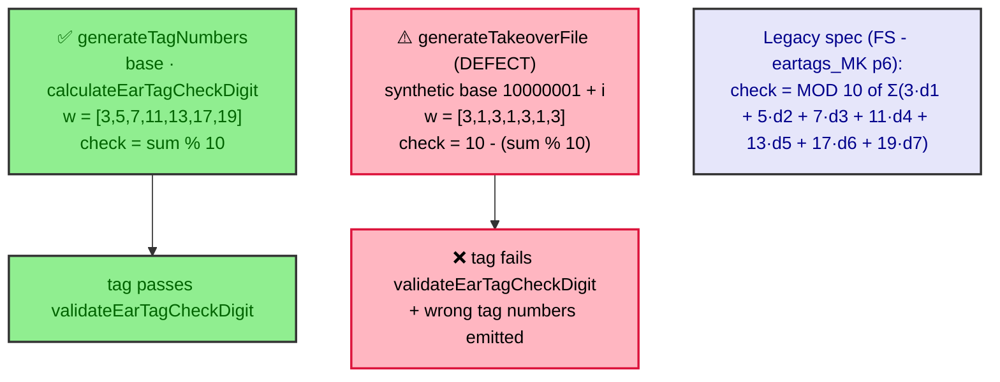
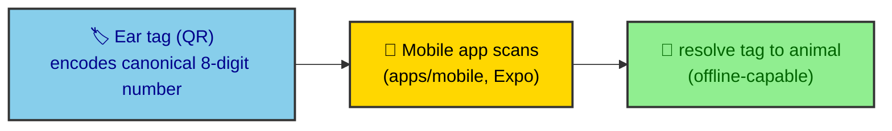

# ADR-0024: Ear Tag Order Lifecycle & Numbering

| Key | Value |
| --- | --- |
| **Status** | Accepted |
| **Date** | 2026-07-08 |
| **Author** | RobotFarm (EarTag Bot) |
| **Supersedes** | None |
| **Superseded** | None |

---

**Superseded by:** N/A
**Source of truth:** `docs/old/fs.md` (ear-tag process flows), `docs/old/an_ea.md` (Eartags DB schema), `FS - eartags_MK(v1.0).pdf p6`

## Context

Ear tags are the identity primitive for every animal in the system. The legacy specs (`fs.md`,
`an_ea.md`) define: an 8-digit numbering scheme with a weighted check digit, a multi-stage order
lifecycle (generation → supplier contingent → VD approval → collection → farm receipt), per-tag status
tracking, and a flat `.txt` "takeover" export for suppliers. AGENTS.md summarises this as a
"6-stage order lifecycle (DRAFT→SUBMITTED→CONFIRMED→SHIPPED→RECEIVED→COMPLETED)" — **that description
is stale**; the code uses an 8-state enum (see §Decision). This ADR ratifies the actual implemented
model and records a confirmed defect in the takeover-file export (tracked as B1 in ADR-0023).

## Decision

We ratify the ear-tag domain as implemented in `packages/domains/eartag` + `packages/validators`
(`check-digit.ts`), grounded in the legacy numeric scheme.

### A. Numbering & check digit (legacy-preserved)

- **8-digit tag**: 7-digit base + 1 check digit. Sequence starts at `10000001`
  (`eartag.service.ts:generateTagNumbers(count, startFrom = 10000001)`).
- **Check digit** (verbatim from `FS - eartags_MK p6`, preserved in `check-digit.ts`):
  `check = MOD 10 of Σ(3·d1 + 5·d2 + 7·d3 + 11·d4 + 13·d5 + 17·d6 + 19·d7)`.
  Implemented as `EAR_TAG_WEIGHTS = [3,5,7,11,13,17,19]`, `calculateEarTagCheckDigit = sum % 10`,
  guarded by `earTagSchema` (`/^\d{8}$/` + `validateEarTagCheckDigit`).

### B. Order lifecycle (actual enum — NOT the AGENTS.md 6-stage)

`EAR_TAG_ORDER_STATUS` (verified): `DRAFT → PENDING → APPROVED → REJECTED → ORDERED →
PARTIALLY_RECEIVED → RECEIVED → CANCELLED`. Final states: `RECEIVED`, `REJECTED`, `CANCELLED`.

_Fig. 1 — Order state machine (`EAR_TAG_ORDER_STATUS`). Cancel is permitted only pre-collection
(DRAFT/PENDING/APPROVED) and only by the creator or a VD role (enforced at the router via `@Policy`)._

### C. Individual tag lifecycle

`EAR_TAG_STATUS` (verified): `NEW → AVAILABLE → ORDERED → COLLECTED → DELIVERED → APPLIED`, with
terminal/branch states `CANCELLED`, `WITHDRAWN`, `LOST`, `DESTROYED`.

_Fig. 2 — Per-tag status machine (`EAR_TAG_STATUS`). `collectOrderTags()` requires `APPROVED` and
assigns `AVAILABLE` tags, transitioning them to `ORDERED`._

### D. Business rules adopted from `fs.md`

| Rule (legacy) | Implementation | Status |
|---|---|---|
| Generate sequential numbers, status `NEW` | `generateTagNumbers()` | ✅ |
| Supplier contingent assigned once; `.txt` re-downloadable | `assignSupplierContingent()` (range-overlap guard) + `generateTakeoverFile()` | ✅ + ⚠️ (see §Defect) |
| Max qty = female animals − remaining tags | `createOrder()` → `countFemaleAnimalsOnFarm − countRemainingEarTagsOnFarm` | ✅ |
| Farm must be valid (not slaughterhouse/inactive) | `createOrder()` rejects `SLAUGHTERHOUSE` / inactive | ✅ |
| 120-day gap since last order | `ORDER_INTERVAL_DAYS = 120` | ✅ (🟡 legacy says "non-cancelled" last order; code uses last order regardless of status) |
| Max 4 orders/year | `MAX_ORDERS_PER_YEAR = 4` | ✅ |
| Idempotency (no double entry) | `findRecentDuplicateOrder` (24 h window) | ✅ |
| Duplicate order: animal alive + on farm + valid farm | `createDuplicateOrder()` | ✅ |
| Cancel by creator/VD, pre-collection; cancel single tag early | `cancelOrder()` / `cancelOrderItem()` (DRAFT/PENDING) | ✅ |
| Append to existing order (owner + DRAFT/PENDING) | `appendToOrder()` | ✅ |

## Defect (B1 from ADR-0023) — takeover file export

`generateTakeoverFile()` (`eartag.service.ts:512-536`) does **not** reuse the canonical algorithm.
It synthesises tag numbers as `10000001 + i` and computes the check digit with the **wrong** weights
`[3,1,3,1,3,1,3]` and the **wrong** formula `10 - (sum % 10)`. The result is a `.txt` that:

1. lists **synthetic** tag numbers (not the real tags collected for the order), and
2. produces check digits that **fail `validateEarTagCheckDigit`**.

_Fig. 3 — The canonical path (used by `generateTagNumbers`) matches the legacy spec. The takeover-file
path diverges on both weights and formula, and ignores the real assigned tags._

**Resolution owner:** EarTag Bot. Fix: emit the order's actual collected tags and compute each check
digit via `calculateEarTagCheckDigit(base)`. Until fixed, supplier exports are not lawfully valid.

## E. QR-code-scannable ear tags (mobile) — modern identification

The legacy `TPC_PDA` spec identified animals via **PDA barcode scanners** — obsolete technology.
Ear tags MUST additionally carry a **QR code** encoding the canonical 8-digit ear-tag number (with its
valid check digit), replacing the barcode with a modern, phone-readable mark.

- **Mobile scanning** — the Expo app (`apps/mobile`) scans the QR to resolve the tag/animal instantly,
  including offline (local SQLite), per the Mobile Bot architecture.
- **QR generation is trivial** (a QR library); it encodes the _same_ number the check-digit algorithm
  already produces — no new numbering scheme.
- **QR payload format is a per-jurisdiction RuleSet choice** (ADR-0030): a plain number, a deep link,
  or a structured payload. The default (MK) encodes the bare ear-tag number.
- This is an _addition_ to §A's numbering/check-digit rules, not a change to them.

_Fig. 4 — QR ear tag → mobile scan → animal resolution. Replaces the legacy PDA barcode._

## Consequences

### Positive

- **Legacy numbering fidelity** — the check-digit algorithm is preserved with its source citation.
- **Explicit state machines** — both order and tag lifecycles are enumerated enums, not implicit flags.
- **Stale doc corrected** — AGENTS.md's "6-stage" summary is superseded by the verified 8-state enum.

### Negative

- **Takeover export is currently defective (B1)** — must be fixed before supplier hand-off is valid.
- **Status vocabulary diverged** from legacy (`ZACETNI`/`PREVZETA`/… → `NEW`/`COLLECTED`/…); a
  lexicon mapping may be needed for audit/legal traceability.
- **Cancel interval semantics** differ from legacy (last order vs last non-cancelled order).

## Implementation

- Keep `EAR_TAG_ORDER_STATUS` / `EAR_TAG_STATUS` as the single source for transitions; do not add
  ad-hoc boolean flags.
- Any change to numbering/check-digit MUST keep `check-digit.ts` in sync with `FS - eartags_MK p6`.
- Fix B1 in `generateTakeoverFile` before GA; add a regression test asserting exported lines pass
  `validateEarTagCheckDigit`.

## Alternatives Considered

### 1. Preserve legacy status strings verbatim

**Rejected.** The English `snake_case` enums are clearer for code and i18n; the mapping is documented
here. A lookup table can be added if legal reporting requires the original Macedonian labels.

### 2. Generate the takeover file with the same synthetic scheme as today

**Rejected (the bug).** It produces invalid check digits and wrong numbers; the spec requires real
assigned tags with the canonical algorithm.

## Related ADRs

- ADR-0023: Business-Rule Adoption & Traceability (root; carries defect B1)
- ADR-0019: Two Type Contracts (ear-tag DTOs)
- ADR-0018: API Validator Design (Guillotines over `earTagSchema`)
- ADR-0007: Audit via Lifecycle Events (per-status transition audit)
- ADR-0009: Document Generation (QR on generated PDF/A docs)
- ADR-0030: Jurisdiction-Configurable Rule Engine (QR payload format = RuleSet choice)
