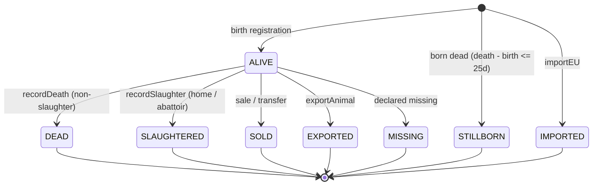
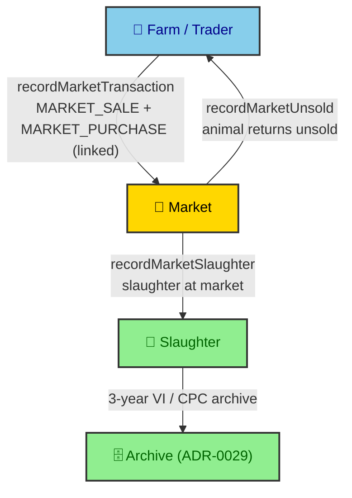

# ADR-0025: Animal Registration & Movement Rules

| Key | Value |
| --- | --- |
| **Status** | Accepted |
| **Date** | 2026-07-08 |
| **Author** | RobotFarm (Animal Bot + Movement Bot) |
| **Supersedes** | None |
| **Superseded** | None |

---

**Superseded by:** N/A
**Source of truth:** `docs/old/fs2.md` (registration & movements), `docs/old/workflow.md` (movement workflow instances)

## Context

Animal identification and livestock movement are the operational core of the system. The legacy specs
(`fs2.md`, `workflow.md`) define: registration integrity (ear tag, parentage, calving rules), death and
slaughter scenarios, pasture (alpine) movements, the 4-leg market transaction, and import/export with
foreign-passport retention. These rules were scattered as per-service `DEFAULT_PARAMS` constants with
no single ratified record. This ADR consolidates them and ratifies the implemented model.

## Decision

We ratify the animal + movement domains as implemented in `packages/domains/animal` +
`packages/domains/movement`, with enums in `packages/database/src/constants`.

### A. Animal registration integrity (`animal.service.ts:create`)

| Rule (legacy `fs2.md`) | Implementation | Status |
|---|---|---|
| Ear tag must be NEW (unused) | `repo.findByTag` → `EAR_TAG_ALREADY_USED` | ✅ |
| Registration date not in the future | `notInFuture` validator | ✅ |
| A.4a: mother on the farm at birth | `mother.currentFarmId !== input.currentFarmId` → error | ✅ |
| A.4b: mother alive at birth | `mother.status !== ANIMAL_STATUS.ALIVE` → error | ✅ |
| A.4c: mother ≥ `minMotherAgeMonths` (17) at birth | `monthsBetween(mother.birthDate, birthDate) < 17` → error | ✅ |
| A.4d: calving gap ≥ `calvingPeriodDays` (365) since last calf | `gapDays < 365` → error | 🟡 legacy 120 d; code uses **365 d** |
| A.4e: animal cannot be its own mother | `input.motherId === animalId` → `SELF_MOTHER` | ✅ |
| Parent sex integrity (mother female / father male) | `INVALID_PARENT_SEX` | ✅ |

Constants: `DEFAULT_PARAMS = { minMotherAgeMonths: 17, calvingPeriodDays: 365 }`
(`animal.service.ts:23`).

### B. Animal status machine (`ANIMAL_STATUS`)

8 states: `ALIVE, DEAD, SLAUGHTERED, SOLD, EXPORTED, IMPORTED, MISSING, STILLBORN`.

_Fig. 1 — Animal lifecycle (`ANIMAL_STATUS`). `recordDeath` sets `STILLBORN` when age ≤
`stillbornThresholdDays` (25 d); `recordSlaughter` sets `SLAUGHTERED`._

### C. Movement type taxonomy (`MOVEMENT_TYPE`, 16 types)

`SALE, PURCHASE, MARKET_SALE, MARKET_PURCHASE, TRANSFER, BIRTH_REGISTRATION, DEATH, HOME_SLAUGHTER,
SLAUGHTERHOUSE, PASTURE_DEPARTURE, PASTURE_RETURN, IMPORT, EXPORT, ALPINE_DEPARTURE, ALPINE_RETURN,
CORRECTION`.

Key scenarios and the rules enforced:

| Scenario | Method | Rules (constants in `movement.service.ts:42`) |
|---|---|---|
| Death (at farm / in transit / at slaughter) | `recordDeath` | `stillbornThresholdDays = 25` (stillborn if age ≤ 25 d) |
| Slaughter | `recordSlaughter` | `slaughterMinAgeDays = 25`; tags destroyed; 3-yr VI/CPC archive |
| Pasture / alpine | `declarePasture` | home-farm animals only; `invalidatePastureIfNeeded` on unexpected move |
| Market (4-leg) | `recordMarketTransaction` / `recordMarketUnsold` / `recordMarketSlaughter` | `MARKET_SALE` + `MARKET_PURCHASE` linked (`parentMovementId`, `legOrder`) |
| Import | `importEU` | foreign passport stored 3 years (`foreignPassportStored`, `storageExpiry +3y`) |
| Export | `exportAnimal` | `EXPORT` + `import_export_records` |
| Unregistered farm | — | `unregisteredDepartureFarmId = "100000014"`, `unregisteredArrivalFarmId = "100000027"` |
| Arrival correction | `recordSlaughter` | `arrivalCorrectionDays = 2` (departed→B but arrived→C within ±2 d) |

### D. Market 4-leg flow

_Fig. 2 — The market movement generates a paired `MARKET_SALE`/`MARKET_PURCHASE` (legacy Instance 15,
4 communications). Unsold animals return; market slaughter triggers the 3-year retention path._

## Consequences

### Positive

- **Single record** of registration + movement rules that were previously buried in service constants.
- **Type-safe taxonomy** — all movements are a closed `MOVEMENT_TYPE` enum, not free-text.
- **Cross-domain wiring explicit** — slaughter → tag destruction → archive (ADR-0029); market →
  archive; import → 3-yr foreign-passport retention.

### Negative / Divergences

- **Calving gap 365 d vs legacy 120 d** (🟡) — the code is stricter; confirm with the domain owner
  which is legally correct.
- **Birth-notification deadlines (7-day/20-day, `workflow.md` Instance 8) are unenforced** — the status
  enum and `calculateTaggingDeadline()` exist but no service/cron drives them. Tracked as a gap in
  ADR-0023.
- **No `MOVEMENT_STATUS` enum** — movements are typed, not state-machine'd; completion is implied by
  the linked-leg pattern rather than an explicit status.

## Implementation

- Registration/parentage rules live only in `animal.service.ts:create`; keep them there, not in routers.
- Movement numeric thresholds stay in `movement.service.ts:DEFAULT_PARAMS` until ADR-0030 decides the
  `system` parameter table.
- Any new movement scenario MUST add a `MOVEMENT_TYPE` member and a paired-leg convention for markets.

## Alternatives Considered

### 1. A single `MOVEMENT_STATUS` state machine alongside `MOVEMENT_TYPE`

**Rejected (for now).** Movements are event records, not long-lived entities; the linked-leg pattern
suffices. Revisit if completion tracking becomes a requirement.

### 2. Calving gap of 120 d to match legacy

**Deferred.** Needs domain-owner confirmation; current 365 d is stricter and safer. Logged as a
divergence to resolve, not silently align.

## Related ADRs

- ADR-0023: Business-Rule Traceability (root)
- ADR-0014: Cross-Domain Event Decoupling (movement → notification events)
- ADR-0029: Passport Lifecycle & Archive Retention (slaughter/market/import retention)
- ADR-0024: Ear Tag (tag destroyed at slaughter)
