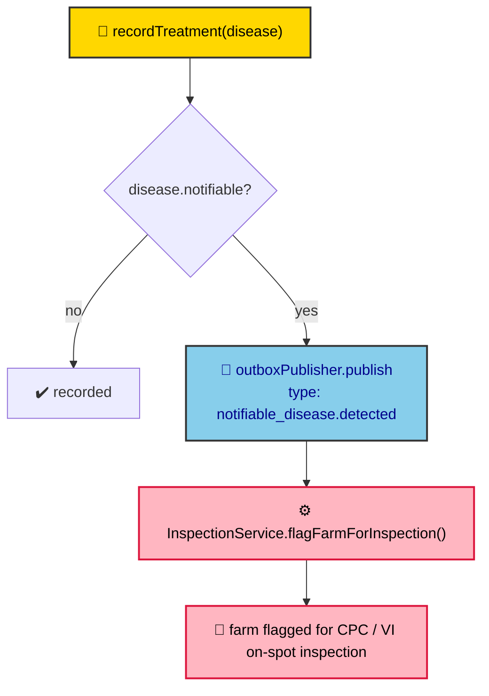
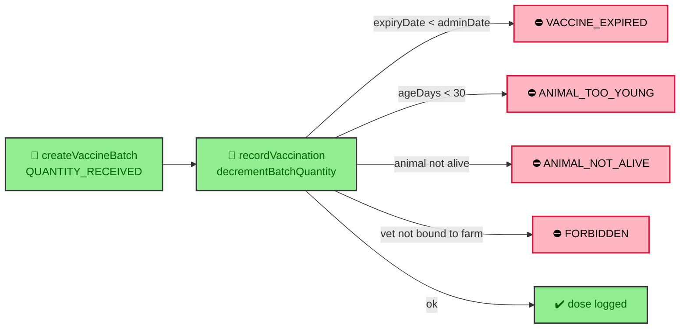

# ADR-0026: Health & Disease Domain

| Key | Value |
| --- | --- |
| **Status** | Accepted |
| **Date** | 2026-07-08 |
| **Author** | RobotFarm (Health Bot) |
| **Supersedes** | None |
| **Superseded** | None |

---

**Superseded by:** N/A
**Source of truth:** `docs/old/deseases.md` (diseases, vaccinations, treatments)

## Context

The health domain governs disease master data, vaccine catalogues and batches, vaccination/treatment
recording, and — critically — the **notifiable-disease → inspection** coupling that drives CPC/VI
field inspections. `deseases.md` defines batch-expiry enforcement, minimum vaccination age, stock
decrement, vet-binding, and the epidemiological alert path. This ADR ratifies the implemented model
and records the cross-domain event that links health to inspection.

## Decision

We ratify the health domain as implemented in `packages/domains/health`, with master data in
`packages/database` and the alert path via the outbox (ADR-0012/0014).

### A. Master data & mapping

- **Diseases** (`HD_DISEASES`): `createDisease(name, notifiable, description)`; `notifiable` flag
  drives epidemiological alerts (`health.service.ts:124`).
- **Vaccines / batches** (`HD_VACCINES`, `HD_VACCINE_BATCHES`): `createVaccine`, `createVaccineBatch`
  (`quantityReceived`).
- **Vaccine↔disease mapping**: `linkVaccineDisease` / `getVaccineDiseases` (`health.service.ts:330`).
- **Soft deactivation only** — no hard-delete endpoints for master data (legacy `VALID_TO` semantics).

### B. Vaccination rules (`recordVaccination`, `health.service.ts:171`)

| Rule (legacy `deseases.md`) | Implementation | Status |
|---|---|---|
| Minimum vaccination age | `MIN_VACCINATION_AGE_DAYS = 30`; `ageDays < 30` → `ANIMAL_TOO_YOUNG` | ✅ (🟡 hardcoded, not `SM_SYS_PARAMS`) |
| Batch expiry block | `expiryDate < adminDate` → `VACCINE_EXPIRED` | ✅ |
| Auto-decrement remaining stock | `repo.decrementBatchQuantity(batchId)` | ✅ |
| Animal must be alive | `ANIMAL_NOT_ALIVE` otherwise | ✅ |
| Vet must be bound to the farm | `subjectRepo.findSubjectBinding(farmId, vetId, VETERINARIAN)` → `FORBIDDEN` | ✅ |

### C. Treatment + notifiable-disease coupling (`recordTreatment`, `health.service.ts:224`)

If the treated disease is `notifiable`, the service publishes a domain event that asynchronously flags
the farm for inspection — the health→inspection decoupling point (ADR-0014).

_Fig. 1 — Notifiable disease path. The event type `notifiable_disease.detected` is published via
`OutboxEventPublisher` and consumed by `InspectionService.flagFarmForInspection()` (fire-and-forget,
idempotent)._

### D. Vaccine batch lifecycle

_Fig. 2 — Batch lifecycle. Stock is decremented on each dose; expired or under-age vaccinations are
rejected before any write._

## Consequences

### Positive

- **Epidemiological coupling is explicit and decoupled** — health never calls inspection directly; it
  publishes an event (ADR-0014).
- **Hard guards before write** — expiry, age, liveness, and vet-binding are all rejected upstream of
  the DB.
- **Audit-ready master data** — soft deactivation preserves history.

### Negative / Gaps

- **Stock reconciliation missing** (❌, Bug B in ADR-0023) — no report/job asserting
  `QUANTITY_RECEIVED == QUANTITY_REMAINING + doses_administered`.
- **Thresholds hardcoded** — `MIN_VACCINATION_AGE_DAYS = 30` is a constant, not a `system` parameter
  (ADR-0030).
- **Deferred by design** (ADR-0023) — AMR tracking, 10 km outbreak buffer zones, and genetic lineage
  are not implemented.

## Implementation

- Notifiable logic stays in `recordTreatment`; do not special-case diseases in the inspection service.
- The `notifiable_disease.detected` event contract (type string + payload) is owned by this ADR; any
  change must keep `InspectionService` consumption working.
- Stock reconciliation is a separate job to be added (tracked in ADR-0023 bug register).

## Alternatives Considered

### 1. Health service calls InspectionService directly

**Rejected.** Violates cross-domain decoupling (ADR-0014); would couple the write path to inspection
availability. The outbox event is the contract.

### 2. Configurable vaccination age via `SM_SYS_PARAMS`

**Deferred to ADR-0030.** Today the age is a constant; until the `system` parameter table exists, it
stays hardcoded but documented here.

## Related ADRs

- ADR-0023: Business-Rule Traceability (root; carries the stock-reconciliation gap)
- ADR-0014: Cross-Domain Event Decoupling (health → inspection)
- ADR-0012: Transactional Outbox (event durability)
- ADR-0028: Risk Analysis & On-Spot Inspection (consumer of `notifiable_disease.detected`)
- ADR-0007: Audit via Lifecycle Events
