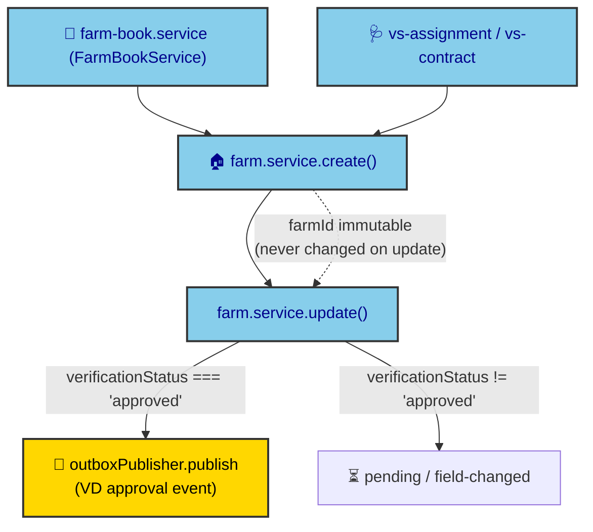
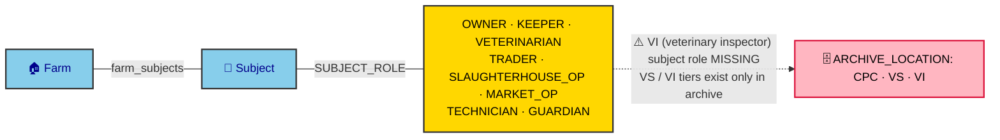

# ADR-0027: Farm & Holder (HK) Domain + Subject Roles

| Key | Value |
| --- | --- |
| **Status** | Accepted |
| **Date** | 2026-07-08 |
| **Author** | RobotFarm (Farm Bot) |
| **Supersedes** | None |
| **Superseded** | None |

---

**Superseded by:** N/A
**Source of truth:** `docs/old/hk.md` (holders/farms), `docs/old/fs2.md` (registration)

## Context

The farm (holder/keeper) registry and the subject-role model are the organizational backbone: every
animal, movement, and inspection is scoped to a farm, and every human/legal actor is a *subject* with
one or more roles on a farm. `hk.md` defines the address registry, the farm hierarchy, geocoordinates,
and the `HK_KMG_SUBJ` role bindings; `fs2.md` adds farm-book maintenance and VD approval on change.
This ADR ratifies the implemented model and records the VS/VI role gap.

## Decision

We ratify the farm + subject model as implemented in `packages/domains/farm` +
`packages/domains/subject`, with enums in `packages/database/src/constants`.

### A. Farm registry (`farm.service.ts`)

- **Create / update** with soft semantics (no hard delete). `create()` rejects duplicate `farmId`.
- **`farmId` is immutable** — `update()` never changes it (legacy rule: farm ID fixed once assigned).
- **VD approval on change**: when `update()` sets `verificationStatus === "approved"`, an outbox event
  is published (`farm.service.ts:77`). This is the farm-book change-approval hook.
- **Address registry** (`HK_ADDRESSES`) and geocoordinates (`X_COORDINATE`/`Y_COORDINATE`) are linked
  via the `farms`/`subjects` → `addresses` relation.
- **Farm book + VS contracts**: `farm-book.service.ts` (`FarmBookService`), `vs-assignment.service.ts`,
  `vs-contract.service.ts` model the farm book and veterinary-station assignment/contracts.

*Fig. 1 — Farm lifecycle. VD approval is event-driven (outbox); the `farmId` is permanent.*

### B. Subject roles (`SUBJECT_ROLE`) and farm bindings

`farm_subjects` binds a subject to a farm with a role. `SUBJECT_ROLE` (8 verified members):

`OWNER, KEEPER, VETERINARIAN, TRADER, SLAUGHTERHOUSE_OP, MARKET_OP, TECHNICIAN, GUARDIAN`.

Ownership is multi-source — `DATA_SOURCE` records where a binding originated:
`AIMCS, HK_IMP, HK_PDA, MOBILE, API, BATCH`.

*Fig. 2 — Subject-role binding. The 8 roles cover owners through technicians; the archive tiers
include `VI`, but no corresponding **VI subject role** exists (Bug B3 in ADR-0023).*

## Consequences

### Positive

- **Immutable farm identity** prevents referential churn across animals/movements/inspections.
- **Event-driven VD approval** keeps the farm service decoupled from downstream consumers (ADR-0014).
- **Multi-source ownership** (`DATA_SOURCE`) preserves provenance across AIMCS/HK/PDAs/mobile/API/batch.

### Negative / Divergences

- ~~**`VI` (veterinary inspector) subject role missing** (Bug B3)~~ **RESOLVED (2026-07-11, Horn A):** `VI` added to `SUBJECT_ROLE` (`"vi"`); distinct from private `VETERINARIAN`. State access via `VD_STAFF` + org-area RLS.
  workflow's VS/VI split is collapsed into the archive tiers alone.
- **`FIELD_CHANGED` → document-production lock is partial** — approval fires an outbox event, but there
  is no per-field lock that blocks document generation until VD approves (legacy `HK` behavior).
- **Farm hierarchy (`KMG_MID_SUP` self-ref)** exists as a schema FK but has no service-level rule.

## Implementation

- Keep `farmId` immutability in `farm.service.create`/`update`; never add an update path for it.
- VD-approval side-effects MUST go through the outbox, never direct calls.
- **B3 RESOLVED (2026-07-11, Horn A):** `VI` added to `SUBJECT_ROLE` (value `"vi"`). Veterinary Inspectors are distinct subjects from private `VETERINARIAN`s; their system access uses the existing `VD_STAFF` user role + org-area RLS (no new user role). No DB migration — `farm_subjects.role` is `varchar` + Zod `zEnum`, regenerated via `scripts/regenerate-enums.mjs`.

## Alternatives Considered

### 1. Per-field "blocks documents" lock on `FIELD_CHANGED`

**Deferred.** Would require a field-diff pipeline; the event-driven approval is sufficient for now.
Tracked as a divergence to revisit.

### 2. `VI` as a distinct subject role

**Resolved (B3, 2026-07-11) — Horn A chosen.** The domain owner confirmed: in the Macedonian (MK) jurisdiction the Veterinary Inspector is a *state agent* of the Food and Veterinary Agency (CPC), distinct from the private Veterinary Station (VS) and its Veterinarian. Collapsing VI into VS would merge the police with the audited contractor — a conflict of interest. Therefore `VI` was added to `SUBJECT_ROLE` (value `"vi"`). VI's *system* access uses the existing `VD_STAFF` user role + `org_areas` RLS scoping (no new user role); the `SUBJECT_ROLE.VI` entry enables creating a `Subject` for the inspector and referencing it in `inspections.inspectorId` / `error_corrections.escalatedTo`. `ADMINISTER_ROLES` can now include `"vi"` per jurisdiction (ADR-0030).

## Related ADRs

- ADR-0023: Business-Rule Traceability (root; carries B3)
- ADR-0006: RLS (farm-scoped `read/write-roles` derive from `farm_subjects`)
- ADR-0029: Passport / Archive (VS/VI tiers)
- ADR-0025: Animal / Movement (animals scoped to farms)
