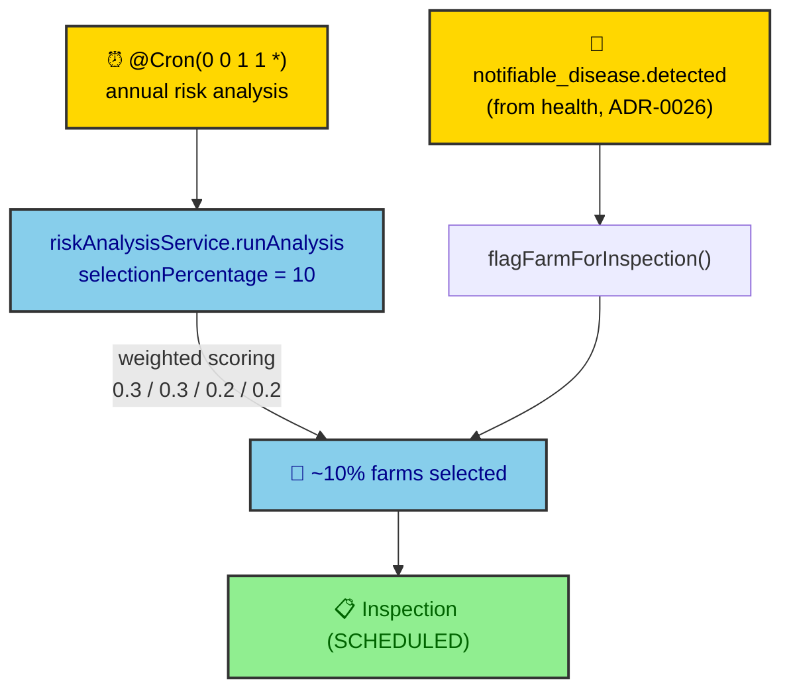
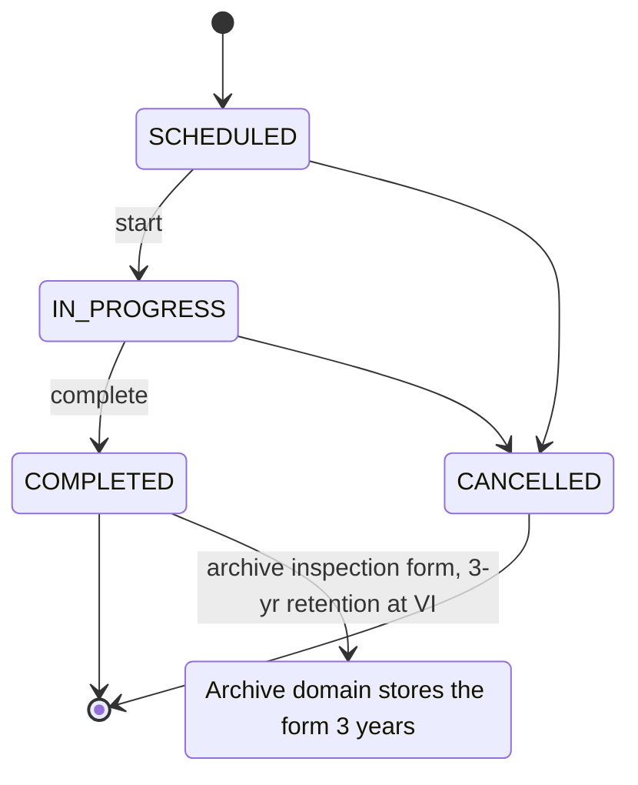

# ADR-0028: Risk Analysis & On-Spot Inspection

| Key | Value |
| --- | --- |
| **Status** | Accepted |
| **Date** | 2026-07-08 |
| **Author** | RobotFarm (Inspection Bot) |
| **Supersedes** | None |
| **Superseded** | None |

---

**Superseded by:** N/A
**Source of truth:** `docs/old/an_ea.md` (risk analysis), `docs/old/workflow.md` (Instance 18)

## Context

The CPC performs two linked functions: an **annual risk analysis** that selects ~10% of farms for
inspection via weighted random scoring, and **on-spot inspections** carried out in the field. The
legacy specs (`an_ea.md`, `workflow.md` Instance 18) also couple notifiable-disease detection (health)
to automatic farm flagging. This ADR ratifies the implemented inspection/risk model.

## Decision

We ratify the inspection domain as implemented in `packages/domains/inspection`, with an annual cron in
`apps/api/src/jobs/risk-analysis.job.ts`.

### A. Annual risk analysis

- **Trigger**: `@Cron("0 0 1 1 *")` (January 1) → `riskAnalysisService.runAnalysis({ selectionPercentage: 10 })`.
- **Selection**: ~10% of farms, weighted random. `DEFAULT_WEIGHTS` (verified):
  `farmSizeWeight 0.3, historyWeight 0.3, speciesWeight 0.2, regionWeight 0.2`.
- **Permission-gated**: risk analysis endpoints require `analysis:read` / `analysis:run` (ADR-0004/0022).
- **Gap**: only the selected-farm *count* is persisted (`selectedFarmCount`); the per-farm results
  table (`GN_ANLS_RESULTS` in the legacy spec, with a unique `(farm, runtime)` key) is **not**
  implemented — see ADR-0023.

*Fig. 1 — Two entry points to a scheduled inspection: the annual weighted risk selection and the
health-driven `flagFarmForInspection` (fired by `notifiable_disease.detected`, ADR-0026).*

### B. On-spot inspection lifecycle (`INSPECTION_STATUS`)

4 states: `SCHEDULED, IN_PROGRESS, COMPLETED, CANCELLED`. 8 tRPC endpoints. On completion, the form is
archived with 3-year retention at the **VI** tier (ADR-0029).

*Fig. 2 — Inspection state machine. `flagFarmForInspection` is idempotent (it checks for an existing
`SCHEDULED` inspection before creating).*

### C. Cross-domain wiring (decoupled)

- **Health → Inspection**: `recordTreatment(notifiable)` publishes `notifiable_disease.detected`
  (ADR-0026) → consumed by `flagFarmForInspection()` (fire-and-forget, idempotent).
- **Inspection → Archive**: `complete()` → `archiveInspectionForm()` (3-year retention, VI tier).
- Both paths are event/outbox-driven (ADR-0012/0014), so neither service calls the other directly.

## Consequences

### Positive

- **Single inspection lifecycle** with explicit, closed `INSPECTION_STATUS` enum.
- **Decoupled triggers** — risk selection and health alerts both funnel into `SCHEDULED` without
  either producer depending on the inspection service.
- **Auditable selection** — the annual cron is deterministic and permission-gated.

### Negative / Gaps

- **Per-farm risk results not persisted** — **Resolved (WO-021)**: `risk_analysis_results` table (with `risk_factors_snapshot` JSONB audit alibi for OCR 2017/625) now persists per-farm results + legacy unique-key guarantee.
- **Weighted parameters are hardcoded** — `DEFAULT_WEIGHTS` is a constant, not the legacy configurable
  `GN_ANLS_PARAMS` table (deferred to ADR-0030).
- **Birth-notification deadlines** (7/20 d, `workflow.md` Instance 8) — enacted (WO-022): `OVERDUE` status + daily `BirthDeadlineJob` + derived farm lock (ADR-0023).
- **Vaccine stock reconciliation** (mass-balance, `deseases.md`) — enacted (WO-020): `VaccineReconciliationJob` (@Cron daily 03:00) → `HealthService.reconcileVaccineStock()` opens a-posteriori COMPLEX `error_corrections` cases for any batch where `quantity_received != quantity_remaining + administered` (ADR-0023 / ADR-0026).

> **Health cluster status (2026-07-11): RESOLVED / ENFORCED.** WO-020 (stock reconciliation), WO-021 (per-farm risk results), WO-022 (birth-notification deadlines) are all Done. ADR-0028's health-surveillance obligations are now operational; only ADR-0030 configurability (weighted params) remains deferred.

## Implementation

- Keep `runAnalysis` weights in `DEFAULT_WEIGHTS`; any configurability waits for ADR-0030.
- `flagFarmForInspection` MUST stay idempotent (no duplicate `SCHEDULED` inspections).
- Inspection→archive coupling stays via `archiveInspectionForm`, never a direct archive call from the
  router.

## Alternatives Considered

### 1. Persist full per-farm risk results

**Enacted (WO-021).** Adds a `risk_analysis_results` table (with `risk_factors_snapshot` JSONB audit alibi for OCR 2017/625); now in scope. Logged
in ADR-0023.

### 2. Inspection service calls Archive service directly

**Rejected.** Violates cross-domain decoupling (ADR-0014); the archive call is made by the inspection
service method but the retention lifecycle is owned by the archive domain (ADR-0029).

## Related ADRs

- ADR-0023: Business-Rule Traceability (root; per-farm results gap)
- ADR-0026: Health & Disease (producer of `notifiable_disease.detected`)
- ADR-0014: Cross-Domain Event Decoupling
- ADR-0029: Passport / Archive (consumer of inspection forms)
- ADR-0004 / ADR-0022: Policy actions `analysis:read` / `analysis:run`
