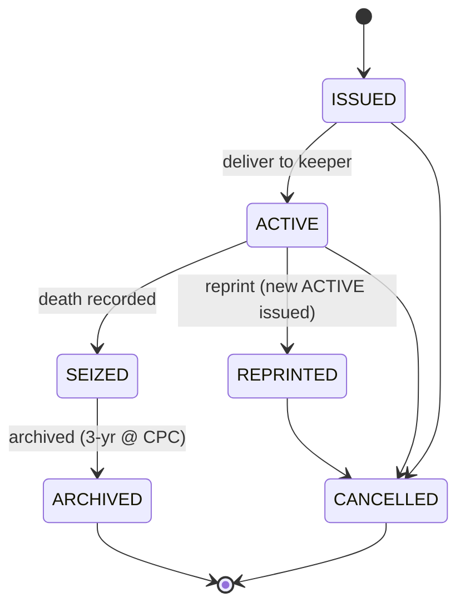
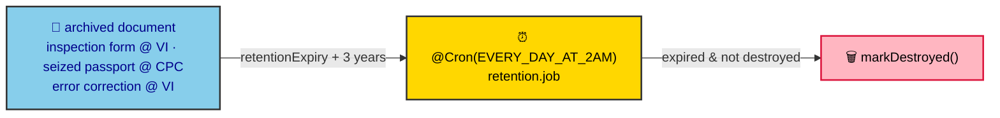

# ADR-0029: Passport Lifecycle & Archive Retention

**Status:** Accepted
**Date:** 2026-07-08
**Author:** RobotFarm (Passport Bot + Archive Bot)
**Supersedes:** N/A
**Superseded by:** N/A
**Source of truth:** `docs/old/workflow.md` (Instances 11/14/17), `docs/old/future.md`

## Context

The cattle passport is the animal's legal identity document; on death/seizure/reprint it must be
archived, and a range of documents (inspection forms, seized passports, error corrections) must be
retained for a statutory period in a 3-tier archive (Central CPC / VS / VI). The legacy specs
(`workflow.md` Instances 11/14/17) define the passport state machine and the 3-year retention; the
digital/PDF-A passport is a `future.md` vision. This ADR ratifies the implemented passport + archive
model.

## Decision

We ratify the passport lifecycle (`packages/domains/passport`) and the archive retention policy
(`packages/domains/archive`) as implemented, with enums in `packages/database/src/constants`.

### A. Passport lifecycle (`PASSPORT_STATUS`)

Verified transition map (`passport.service.ts:16`):

```
ISSUED   → [ACTIVE, CANCELLED]
ACTIVE   → [SEIZED, CANCELLED, REPRINTED]
SEIZED   → [ARCHIVED]
REPRINTED→ [CANCELLED]
ARCHIVED → []
```

- `issueForAnimal()` creates `ISSUED`; **at most one active passport per animal**.
- `activate()` → `ISSUED → ACTIVE` (delivered to keeper).
- `seize()` → `ACTIVE → SEIZED`, records death date/cause.
- `reprint()` → `ACTIVE → REPRINTED` (old invalidated; a new `ACTIVE` passport is issued).
- `SEIZED → ARCHIVED` hands the document to the archive domain (3-year retention at CPC).



_Fig. 1 — Passport state machine. The transition map is enforced by `validateTransition` before every
write._

### B. Archive: 3-tier retention (`ARCHIVE_LOCATION`, `ARCHIVE_DOCUMENT_TYPE`)

3 tiers: `CPC, VS, VI`. Retention is **3 years** from `retentionExpiry`. Three archive entry points:

| Document | Entry point | Tier | Retention |
|---|---|---|---|
| Inspection form | `archiveInspectionForm()` (on `complete`, ADR-0028) | `VI` | 3 years |
| Seized passport | `archiveSeizedPassport()` (on `SEIZED`) | `CPC` | 3 years |
| Resolved error correction | `archiveErrorCorrection()` | `VI` | 3 years |

Enforcement: `apps/api/src/jobs/retention.job.ts` runs `@Cron(EVERY_DAY_AT_2AM)`, finds documents where
`retentionExpiry < NOW()` and `destroyedAt IS NULL`, and calls `markDestroyed()`. The service also
exposes `listExpired` / `markDestroyed` (6 tRPC endpoints total).



_Fig. 2 — Retention enforcement. Documents live 3 years, then the daily cron marks them destroyed._

## Consequences

### Positive

- **Explicit passport state machine** enforced centrally (`validateTransition`).
- **Single retention policy** — every archivable document funnels through `archive.*` with a uniform
  3-year + daily-cron destruction rule.
- **Tier-aware storage** (`CPC/VS/VI`) matches the legacy 3-tier archive.

### Negative / Deferrals

- **Digital / PDF-A passport deferred** — `packages/pdf` emits YAML/XML intermediates as the stable
  API (ADR-0009); cryptographic PDF/A sealing is a `future.md` vision, not implemented.
- **Passport archive tier is CPC** while inspection forms use VI — the split is by document type, not a
  single rule; acceptable but worth noting for auditors.

## Implementation

- Passport transitions MUST go through `validateTransition`; do not write status directly.
- Any new archivable document type adds an `ARCHIVE_DOCUMENT_TYPE` member and calls the matching
  `archive.*` method with the correct tier + `retentionExpiry = now + 3y`.
- Retention destruction is cron-owned; never delete archive rows from request paths.

## Alternatives Considered

### 1. Per-document retention periods

**Rejected (for now).** All statutory documents use 3 years; a configurable period can follow ADR-0030
if a non-3-year class appears.

### 2. Immediate deletion at expiry

**Rejected.** The daily `markDestroyed` cron gives an auditable, recoverable destruction step rather
than silent loss.

## Related ADRs

- ADR-0023: Business-Rule Traceability (root)
- ADR-0028: Inspection / Risk (producer of inspection forms)
- ADR-0025: Animal / Movement (slaughter destroys ear tags; passport seized on death)
- ADR-0009: Document Generation (PDF/A deferred; YAML/XML stable API)
- ADR-0007: Audit via Lifecycle Events
