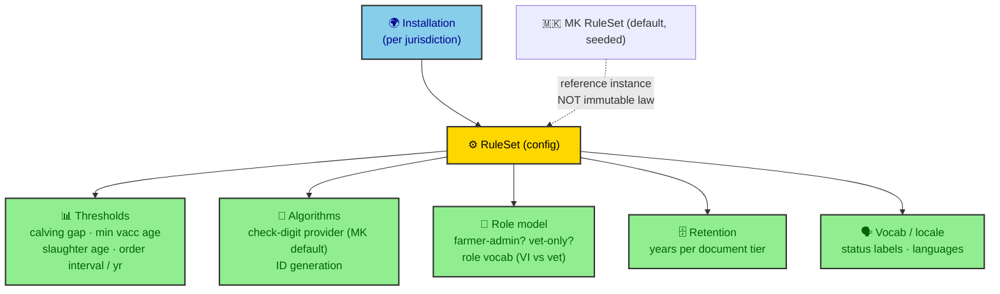

# ADR-0030: Jurisdiction-Configurable Rule Engine

**Status:** Accepted
**Date:** 2026-07-08
**Author:** RobotFarm (Overseer)
**Supersedes:** N/A (reframes ADR-0023's "source of truth" premise)
**Superseded by:** N/A
**Source of truth:** `docs/old/*.md` are the **reference MK jurisdiction instance**, not universal law (decided 2026-07-08)

## Context

`docs/old/*.md` are reconstructions of the **Macedonian (MK)** veterinary administration system — one
country's Oracle implementation. They are *not* written in stone. The system must run under **many
jurisdictions**, which differ in ways the MK instance does not cover:

- **Who administers.** In some deployments the *farmer* never touches the system — only veterinary
  staff administer. The role/permission model must be optional per jurisdiction, not baked in.
- **Non-European installations.** Different check-digit algorithms, ID schemes, vaccination/min-age
  thresholds, movement rules, retention periods, and role vocabularies (e.g. the MK `VI` vs `VET`
  split) apply elsewhere.
- **Future-proofing.** New jurisdictions must be adoptable by *configuration*, not code forks.

Today every rule is a **hardcoded service constant** (the B2 gap in ADR-0023): `ORDER_INTERVAL_DAYS`,
`MAX_ORDERS_PER_YEAR`, `MIN_VACCINATION_AGE_DAYS`, `calvingPeriodDays`, check-digit weights, retention
years, the farmer-admin role model. ADR-0023 originally called `docs/old` the "source of truth"; this
ADR **retracts** that and commits to a jurisdiction-configurable design.

## Decision

We adopt a **jurisdiction-scoped RuleSet** as the single source of truth for configurable behavior.
The MK specs become the **seeded default RuleSet**, not immutable law.

### A. RuleSet shape

Every installation selects (or inherits+overrides) a `RuleSet` that externalizes:

| Dimension | Today (hardcoded) | RuleSet future |
|---|---|---|
| **Thresholds** | `DEFAULT_PARAMS` in eartag/animal/movement/health | per-jurisdiction numeric config |
| **Algorithms** | `EAR_TAG_WEIGHTS` etc. in `check-digit.ts` | pluggable algorithm *provider* keyed by jurisdiction |
| **Role model** | farmer-admin assumed; `SUBJECT_ROLE` fixed | `farmerCanAdminister` flag + overridable role vocab |
| **Retention** | `now + 3y` literals (archive) | per-tier retention years |
| **Vocab / locale** | English `snake_case` enums | label maps + language per jurisdiction |

*Fig. 1 — A `RuleSet` externalizes every jurisdiction-varying dimension. The MK specs seed the default
RuleSet; other jurisdictions override only what differs.*

### B. Algorithms are providers, not constants

The check-digit (and any ID-generation scheme) becomes a **pluggable provider** selected by the active
RuleSet, defaulting to the canonical MK algorithm (`EAR_TAG_WEIGHTS = [3,5,7,11,13,17,19]`,
`sum % 10`, per `FS - eartags_MK p6`). This is also the **correct home for fixing defect B1** (ADR-0024):
`generateTakeoverFile` must call the active provider's `calculateCheckDigit`, never a private formula.

### C. Role model is optional, not assumed

A `farmerCanAdminister: boolean` (default `true` for MK) gates farmer-facing routers. Where it is
`false`, only veterinary/VD roles may administer — enforced via `@Policy` (ADR-0022) reading the
RuleSet, not hardcoded role checks. The role *vocabulary* is also overridable (e.g. a jurisdiction
that needs a distinct inspector role resolves Bug B3 naturally instead of forcing a `VI` constant).

### D. Seed & migration

- Ship an **MK RuleSet** seeded from current hardcoded values, so behavior is unchanged on upgrade.
- A migration copies today's constants into the `ruleset` table/JSON as the MK default.
- New installations supply their own RuleSet (file or DB row) at provisioning time.

## Consequences

### Positive

- **Jurisdiction is a config change, not a fork.** Non-European / vet-only deployments are adoptable.
- **Kills the "divergence" false-debt.** MK-specific values are the default RuleSet, not a law to
  conform to; other choices are first-class, not deviations (resolves the ADR-0023 framing).
- **Fixes B1 properly** — check-digit lives in the provider, so every export uses the active, valid
  algorithm.
- **Decouples spec from code** — `docs/old` becomes a reference seed, safe to diverge from.

### Negative

- **New surface & complexity** — a `ruleset` store, a provider registry, validation of overrides.
- **Override validation** — bad RuleSets (e.g. negative ages) must be rejected at load.
- **Test matrix grows** — behavior must be verifiable per RuleSet, not just MK.

### Neutral

- Defaults keep MK behavior bit-for-bit; existing tests stay green after migration.

## Implementation

- **Do not add new hardcoded thresholds.** Any new rule goes into the RuleSet model.
- **Provider registry** for algorithms (check-digit, ID gen) keyed by RuleSet; MK is the default entry.
- **`@Policy` reads `RuleSet.farmerCanAdminister`** rather than assuming farmer admin.
- **Retention & vocab** read from RuleSet; literals removed from archive/enum code.
- **B1 fix** lands inside the check-digit provider (ADR-0024) — no private formulas anywhere.

## Alternatives Conssidered

### 1. Keep hardcoded constants, just "document" them (status quo ante)

**Rejected.** Contradicts the explicit requirement to support vet-only and non-EU jurisdictions; every
new market would be a code change. This is the trap ADR-0023 briefly fell into by calling MK "source of
truth."

### 2. Per-jurisdiction code forks / branches

**Rejected.** Maintenance nightmare; the MK defaults would drift from every fork. Configuration, not
forking, is the dialectical negation of the false eternal.

### 3. Full rules-engine DSL (drools-like)

**Rejected (for now).** Over-engineering. A typed `RuleSet` config covers the known dimensions; a DSL
can be a later evolution if rules become genuinely conditional/logical.

## Related ADRs

- ADR-0023: Business-Rule Traceability — **premise retracted/reframed** by this ADR
- ADR-0024: Ear Tag — check-digit → provider (fixes B1); status vocab → label map
- ADR-0025: Animal/Movement — `DEFAULT_PARAMS` → RuleSet thresholds
- ADR-0026: Health — `MIN_VACCINATION_AGE_DAYS` → RuleSet threshold
- ADR-0027: Farm/Holder — `SUBJECT_ROLE` vocab → overridable; farmer-admin flag
- ADR-0029: Passport/Archive — retention years → RuleSet
- ADR-0004 / ADR-0022: Policy actions read `RuleSet.farmerCanAdminister`
