# ADR-0031: IoT & Connectivity Abstraction (Optional, Future-Facing)

| Key | Value |
| --- | --- |
| **Status** | Accepted |
| **Date** | 2026-07-08 |
| **Author** | RobotFarm (IoT Bot) |
| **Supersedes** | None |
| **Superseded** | None |

---

**Superseded by:** N/A
**Source of truth:** `docs/old/future.md` (IoT vision); current `packages/domains/iot` + `packages/database/src/constants/transmission-type.ts`

## Context

IoT is **not mandatory and not regulated** in the veterinary domain — it is a *future option*. The
field is wide open: connectivity may be **LoRaWAN, LTE-M, NB-IoT, Sigfox, satellite, Bluetooth, or an
ESP32-class microcontroller in a mesh**; device classes may be **cheap environmental sensors,
cameras running machine learning, or even ingestible "medical pill" sensors**. Because the space is
broad and evolving, the system must **offer the option — even if hidden** — rather than commit to any
single technology. This ADR ratifies IoT as an **optional, hidden-by-default, extensible** capability
with a connectivity-abstraction layer, and records the current minimal implementation.

## Decision

We adopt IoT as an **optional capability gated by the active RuleSet** (ADR-0030), with a
connectivity-abstraction model that does not presuppose any one transport or device class.

### A. Hidden-by-default gating (ties to ADR-0030)

IoT is **not in the default UI** and is **off unless the jurisdiction/installation RuleSet enables it**
(`RuleSet.features.iot = true`). This keeps a non-regulated, future-facing capability present in the
architecture without forcing it on regulated deployments.

```mermaid
flowchart TD
    RS["⚙️ RuleSet.features.iot<br/>(hidden by default, per jurisdiction)"] --> GATE{"iot enabled?"}
    GATE -->|"no"| HID["🚫 hidden / not in default UI"]
    GATE -->|"yes"| IOT["📡 IoT layer"]
    IOT --> CONN["🔌 Connectivity (TRANSMISSION_TYPE)<br/>LoRaWAN · NB-IoT · LTE-M · Sigfox<br/>Satellite · Bluetooth · ESP32-mesh"]
    IOT --> DEV["🧩 Device classes (DEVICE_TYPE)<br/>env sensors · cameras + ML · ingestible pills"]
    IOT --> DATA["📈 Ingest<br/>sensor_readings (time-series) · geofence events"]
    IOT -.->|"future, not now"| EDGE["🤖 edge AI / ML pipelines<br/>(camera inference, ingestible streams)"]
    classDef rs fill:#FFD700,stroke:#333,stroke-width:2px,color:black
    classDef hid fill:#E6E6FA,stroke:#333,stroke-width:2px,color:darkblue
    classDef iot fill:#87CEEB,stroke:#333,stroke-width:2px,color:darkblue
    classDef fut fill:#FFB6C1,stroke:#DC143C,stroke-width:2px,color:black
    class RS rs
    class HID hid
    class IOT,CONN,DEV,DATA iot
    class EDGE fut
```

*Fig. 1 — IoT is gated by the RuleSet (hidden unless enabled). Connectivity and device classes are
abstracted; edge-AI/ML is explicitly a future extension, not current scope.*

### B. Connectivity abstraction (`TRANSMISSION_TYPE`)

The transport is an **extensible enum**, not a hardcoded choice. Verified members:
`LORAWAN, SIGFOX, NB_IOT, LTE_M, SATELLITE, BLUETOOTH`. This already spans LPWAN (LoRaWAN, Sigfox,
NB-IoT), cellular (LTE-M), satellite, and short-range (Bluetooth). **ESP32-class mesh** is a
device-architecture concern (a mesh of cheap nodes), captured at the device level rather than as a
single transmission type — the abstraction leaves room to add `MESH` / new entries without code forks.

### C. Device classes (`DEVICE_TYPE`) + ingest

Devices register via `registerDevice(transmissionType, …)`; readings arrive through
`ingestReading` / `ingestReadings` (batch) into the `sensor_readings` time-series table; spatial
monitoring uses `createGeofence` / `logGeofenceEvent` (`animal_geofence_events`). The reading payload
is schema-flexible enough to carry:

- **Environmental sensors** (temperature, humidity, location) — the near-term, cheap case.
- **Cameras + ML** — future; the geofence/event model already supports "something happened here."
- **Ingestible / medical pill sensors** — future; a reading is a reading regardless of source.

No constraint is placed on *what* a device senses — only that it produces readings/events the store can
ingest. That is the deliberate non-commitment.

### D. Explicitly out of scope (now)

- **Real-time / stream processing** and **edge AI** (camera inference, ingestible-sensor streams).
- **ML pipelines** for behavior/health prediction.
- Anything that would make IoT **mandatory** or **regulated**.

The abstraction is built so these can be added as device classes / processing stages later, not now.

## Consequences

### Positive

- **Option without obligation** — IoT exists architecturally (hidden), satisfying "be ready for the
  future" without bloating regulated deployments.
- **Technology-agnostic** — adding LoRaWAN/NB-IoT/ESP32-mesh/ingestible sensors is an enum/device-class
  extension, not a rewrite.
- **RuleSet-gated** (ADR-0030) — an installation enables IoT only where it makes sense.

### Negative

- **Thin today** — only CRUD + time-series + geofence events; no analytics, no edge processing.
- **No SLA / QoS model** for lossy LPWAN links (e.g. deduplication, late-arrival handling) — future work.
- **Hidden == easy to forget** — must be called out in provisioning so it isn't silently never enabled.

## Implementation

- Keep `TRANSMISSION_TYPE` / `DEVICE_TYPE` as **extensible enums**; new transports are additions, not
  branches.
- IoT UI/routers stay behind `RuleSet.features.iot`; do not surface them in the default admin/mobile.
- Ingest is payload-shape-agnostic; validate only what the store needs (device, ts, value, location).
- Edge-AI/ML, when it comes, attaches as a *processing stage* after ingest, never inside the device
  contract.

## Alternatives Considered

### 1. Build a full real-time IoT platform now (Kafka, edge inference)

**Rejected.** Non-mandatory, non-regulated, and speculative. Over-engineering the future before the
option is even exercised. The hidden, extensible abstraction is the dialectically correct negation of
both "ignore IoT" and "build it all now."

### 2. Commit to one transport (e.g. LoRaWAN only)

**Rejected.** Contradicts the explicit requirement to support LTE-M/NB-IoT/ESP32-mesh/ingestible
devices. The abstraction is the whole point.

### 3. Make IoT a core, always-on module

**Rejected.** Would force a non-regulated capability onto regulated deployments and contradict the
"hidden option" requirement.

## Related ADRs

- ADR-0030: Jurisdiction-Configurable Rule Engine (gates `features.iot`; the "hidden option" mechanism)
- ADR-0009: Document Generation (PDF/A deferred; same future-facing, hidden spirit)
- ADR-0025: Animal / Movement (geofence events tie animal location to movement)
- ADR-0023: Business-Rule Traceability (IoT = `future.md`, deferred register)
