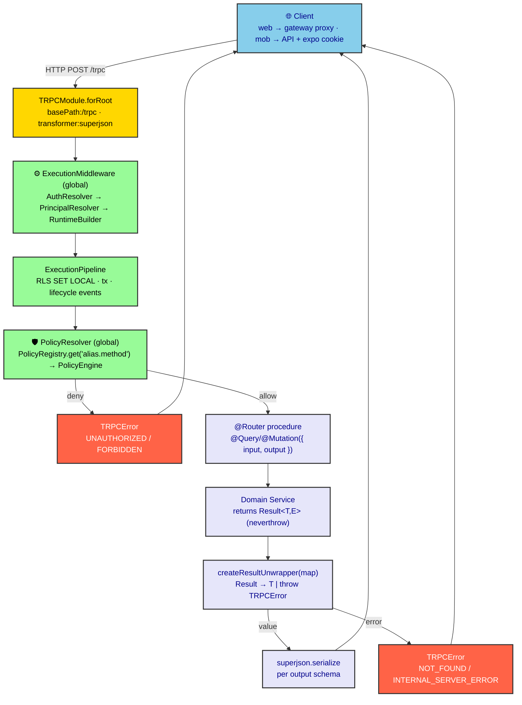
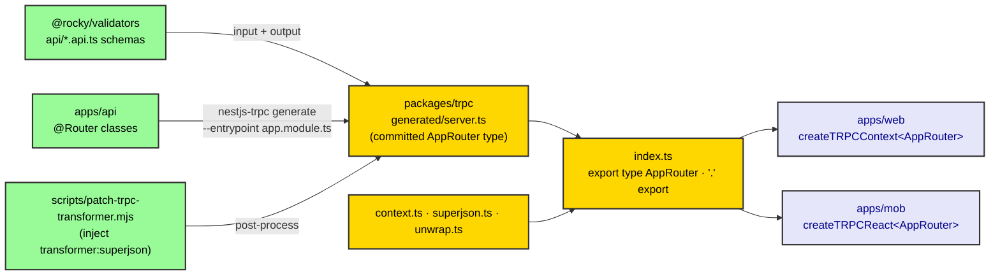

# ADR-0032: tRPC Transport Architecture & Mandatory `@Output` Schemas (Preventing TS6059 & Circular Dependencies)

| Key            | Value                              |
| -------------- | --------------------------------- |
| **Status**     | Accepted                          |
| **Date**       | 2026-07-08                       |
| **Author**     | Architecture Review              |
| **Supersedes** | None                             |
| **Superseded** | None                             |

---

## Context

The NestJS API (`apps/api`) exposes its entire surface through **tRPC** (`nestjs-trpc`). The
transport layer is owned by the `@rocky/trpc` package, whose job is twofold:

1. **Publish the `AppRouter` type** so the frontends (`apps/web`, `apps/mob`) get end-to-end type
   safety with zero runtime coupling to the backend.
2. **Carry the cross-cutting contract** — the request `AppContext`, the `superjson` transformer, and
   the `Result<T, E> → TRPCError` error mapping — so individual routers stay thin and domain services
   never see tRPC.

A previous incident produced two coupled failures that this ADR both fixes and forbids from
recurring:

1. **`TS6059`** — `packages/trpc` failed to type-check because its generated file type-imported
   backend NestJS *router classes* (`Awaited<ReturnType<ArchiveRouter["getById"]>>`, etc.) that live
   under `apps/api/src/routers/`. Those files sit outside `packages/trpc/src`, violating
   `rootDir: "src"`.
2. **Circular dependency** — an attempt to "fix" (1) added `"@rocky/api": "workspace:*"` to
   `packages/trpc/package.json` and an import-rewrite block to the post-generate patch script. This
   made `@rocky/trpc` depend on `apps/api`, which transitively depends on `@rocky/trpc` →
   `turbo run build --dry` reported `Circular package dependency detected: @rocky/api, @rocky/trpc`.

**Root cause:** the generator emits a backend-class `ReturnType<>` import for *every* procedure that
lacks an `@Output` schema. 70 of the procedures (across the archive, correction, device, document,
health, inspection, iot, and passport routers) had no `output:`. The import-rewrite "fix" only hid
the symptom and introduced a worse one (the cycle).

---

## Transport Architecture



*Fig. 1 — A tRPC request. Two global middlewares (Execution, Policy) run before the procedure body.
The router maps the domain `Result` to a value or a `TRPCError` and serializes the payload with
`superjson` per the declared `output` schema.*

### A. Package layout & responsibilities (`@rocky/trpc`)

`packages/trpc` is a **type-and-contract** package. Its `index.ts` re-exports exactly four things:

```ts
export type { AppContext } from "./context.js";
export { superjson, transformer } from "./superjson.js";
export { createResultUnwrapper, toAppError } from "./unwrap.js";
export type { AppRouter } from "./generated/server.js";
```

| File                   | Responsibility                                                                 |
| ---------------------- | ------------------------------------------------------------------------------ |
| `context.ts`           | `AppContext` — the per-request context type. Canonical actor is `ctx.execution.principal` (an `ExecutionContext` from `@rocky/execution`). Legacy `user`/`session` fields remain `@deprecated` for backwards compat. |
| `superjson.ts`         | `transformer` / `superjson` — the single serialization strategy for Date, Map, Set, BigInt across the wire. |
| `unwrap.ts`             | `createResultUnwrapper(map?)` — maps a domain `Result<T, E>` to `T` or throws a `TRPCError`. Built-in `errorToTRPCCode` maps `NotFoundError→NOT_FOUND`, `ForbiddenError→FORBIDDEN`, `DbError→INTERNAL_SERVER_ERROR`; a per-domain `map` overrides/extends this. |
| `generated/server.ts`  | The committed `AppRouter` type, produced by `nestjs-trpc generate` (see §F).   |

The package's `exports` map publishes a bare `"."` entry (→ `dist/index.js` / `dist/index.d.ts`) plus
subpaths `@rocky/trpc/context`, `@rocky/trpc/superjson`, `@rocky/trpc/unwrap`, and
`@rocky/trpc/generated`. **Without the `"."` entry, the bare `@rocky/trpc` specifier fails to
resolve** while the subpaths still work — cascading into hundreds of fake `{}`/`void`/`any` errors in
every frontend form.

### B. Router contract (decorator stack)

Every router follows one shape. Verified against `archive.router.ts`:

```ts
@Router({ alias: "archive" })          // → procedure path "archive.*"
@RegisterPolicy("archive")             // registers the router in PolicyRegistry
@Policy({ authenticated: true })       // policy evaluated by PolicyResolver (global)
@Injectable()
export class ArchiveRouter {
  constructor(@Inject(ArchiveService) private readonly svc: ArchiveService) {}

  @Query({ input: idParam, output: archiveDocumentResponseSchema })
  async getById(@Input() input: { id: string }) {
    return unwrap(await this.svc.getById(input.id));   // unwrap = createResultUnwrapper(ERROR_MAP)
  }

  @Mutation({ input: createArchiveDocumentRequestSchema, output: archiveDocumentResponseSchema })
  async create(@Input() input: CreateArchiveDocumentRequest, @Ctx() ctx: AppContext) {
    return unwrap(await this.svc.create(input));
  }
}
```

- **`@Router({ alias })`** sets the router segment of the procedure path (`alias.method`). The same
  alias is used by `@RegisterPolicy("alias")` so `PolicyRegistry.get("alias.method")` resolves.
- **`@Query` / `@Mutation` / `@Subscription`** take `{ input, output, meta }`. `input` and `output`
  are Zod schemas from `@rocky/validators/api`.
- **`@Input()` / `@Ctx()`** bind the validated input and the `AppContext` into the method signature.
- **`createResultUnwrapper(ERROR_MAP)`** is called once per router; the domain `Result` is unwrapped
  at the boundary. The router never throws raw domain errors — only `TRPCError`.

### C. `superjson` transformer

`@trpc/server` v11 requires the transformer to be declared **in the generated `AppRouter` type**, not
just at runtime. `nestjs-trpc@2.12.0`'s `generate` emits `initTRPC.create()` with no transformer,
leaving a phantom `TypeError<"You must define a transformer...">` that breaks the v11 client links.
The `transformer: superjson` is therefore injected **mechanically** after generation (see §F) — both
into the generated file and at runtime via `TRPCModule.forRoot({ transformer: superjson })`. The
clients consume the same `transformer` from `@rocky/trpc/superjson`.

### D. Error sovereignty (the `Result → TRPCError` boundary)

Per the Error Sovereignty Doctrine (Root AGENTS.md), domain services return `Result<T, E>` and know
nothing about HTTP/tRPC. The router is the boundary: `createResultUnwrapper(map)` inspects the error's
constructor name (or `.code`) and throws the mapped `TRPCError`. A final safety net,
`TrpcErrorHandler` (wired to `TRPCModule.forRoot({ onError })`), logs any error that escapes. This is
the *only* place tRPC error codes are produced — services stay transport-agnostic.

### E. Client consumption

- **Web** (`apps/web/lib/trpc.ts`): `createTRPCContext<AppRouter>()` (TanStack React Query
  integration). Links: `httpBatchLink` + `httpSubscriptionLink`, both with `transformer` from
  `@rocky/trpc/superjson`, pointed at the relative `/trpc` URL. The browser talks to **Next.js**, which
  proxies (rewrite) to the API — the browser never addresses the API directly (works across
  continents / VPNs). SSR calls the API URL directly.
- **Mobile** (`apps/mob/providers/trpc-provider.tsx`): `createTRPCReact<AppRouter>()` with the same
  `transformer`. Cookie forwarding uses `@better-auth/expo`'s `authClient.getCookie()` so the API can
  resolve the session.

Both import the type **only** from `@rocky/trpc` (`import type { AppRouter } from "@rocky/trpc"`). No
frontend defines a local `server.ts` router — that was the earlier source of `createTRPCReact`
collision errors and has been removed.

### F. Generate pipeline

```bash
pnpm -C apps/api generate:trpc
# = nestjs-trpc generate --entrypoint src/app.module.ts --output ../../packages/trpc/src/generated \
#   && node ../../scripts/patch-trpc-transformer.mjs
```

`nestjs-trpc` scans the routers reachable from `app.module.ts` and emits `AppRouter` into
`packages/trpc/src/generated/server.ts`. The patch script's **single legitimate job** is to inject
`transformer: superjson` into `initTRPC.create()` (idempotent; mirrors the repo's other post-processors
`fix-rls-sql.mjs`, `dumb-zod-transform.mjs`). It must **not** rewrite router imports.



*Fig. 2 — The generation topology. `@rocky/trpc` depends only on `@rocky/validators` (schemas),
`@rocky/database`, `@rocky/execution`, `@rocky/domains-shared` — never on `apps/api`. The generated
`AppRouter` flows one way, into both frontends.*

---

## Decision

The following are **build-blocking conventions**, not style preferences:

- **D1 — Mandatory `@Output`.** Every `@Query` / `@Mutation` / `@Subscription` MUST declare an
  `output:` schema. With `output:` present, `nestjs-trpc generate` emits `as any` for the procedure's
  output and imports **nothing** from the backend. With `output:` absent, it emits
  `Awaited<ReturnType<RouterClass["method"]>>` and imports the router *class* from the backend source —
  which is exactly what triggers `TS6059` and (via the wrong "fix") a circular dependency.

  | Procedure has…                          | Generated output          | Backend import? |
  | --------------------------------------- | ------------------------- | -------------- |
  | `@Query({ input, output: schema })`     | `as any`                  | **No**         |
  | `@Query({ input })` (no `output:`)      | `ReturnType<Router[...]>` | **Yes**        |

- **D2 — No backend dependency in the transport package.** `@rocky/trpc` must **never** depend on
  `apps/api`. A backend-class import in the generated file is a schema-coverage gap, not an
  import-resolution problem.
- **D3 — Patch script is single-purpose.** `scripts/patch-trpc-transformer.mjs` may only inject
  `transformer: superjson`. It must not rewrite router imports.
- **D4 — `AppRouter` is the public type.** Re-export it from `packages/trpc/src/index.ts` and keep the
  `"."` `exports` entry so the bare `@rocky/trpc` specifier resolves on both frontends.
- **D5 — Boundary error mapping only in routers.** Domain services return `Result<T, E>`; routers call
  `createResultUnwrapper(map)` and are the sole source of `TRPCError`. No `Result` crosses into tRPC
  un-unwrapped.

---

## Consequences

### Positive

- `TS6059` cannot occur: the committed generated file (`packages/trpc/src/generated/server.ts`) today
  contains **zero** backend-class imports (verified: `rg -c "ReturnType<"` → `0`).
- No package cycle: `@rocky/trpc` depends only on validator/database/execution/domains-shared packages.
- Frontends get real, strict output types instead of `any` (the few genuinely unmodeled returns use
  `z.any()` deliberately).
- One serialization strategy (`superjson`) and one error boundary (`createResultUnwrapper`) — both
  shared, both version-stable.

### Negative / Cost

- Every new procedure requires a corresponding response schema in `@rocky/validators` (Diamond Seal
  boundary, ADR-0011/0018) — an extra authoring step, accepted as the price of the contract.
- The generated `server.ts` uses `as any` for outputs, so output-side type drift between server and
  client is not caught at the generator boundary. Accepted: the schema is the source of truth,
  enforced at runtime by the procedure's `.parse()`/validation, not by the generated `as any`.

---

## Implementation

### 1. Inventory orphans

```bash
rg -c "ReturnType<" packages/trpc/src/generated/server.ts   # 0 = healthy
# each hit = one procedure missing @Output
```

### 2. Add response schemas (Diamond Seal, in `@rocky/validators/api/*.api.ts`)

- **Single entity**: reuse existing `*ResponseSchema` (`selectSchema.omit({ createdBy, validTo }).strip()`).
- **Paginated list**: `z.object({ data: z.array(XResponseSchema), total: z.number(), limit: z.number(), offset: z.number() }).strip()`.
- **Array-only** (e.g. `getVaccineDiseases`, `iot.listGeofences`): `z.array(XResponseSchema)` — **do NOT call `.strip()` on a `ZodArray`** (only `ZodObject` has `.strip()`).
- **Flag/primitive**: `z.object({ deleted: z.boolean() }).strip()` / `z.object({ blocked: z.boolean() }).strip()`.
- **`void` return**: `z.void()`.
- **Genuinely unmodeled** (raw printed form / YAML): `z.any()` or `z.array(z.unknown())` — acceptable only when no schema exists, never as a lazy default.
- Response schemas use `.strip()`; request schemas use `.pick()`/`.strictObject()`. **Never `.strict()` on a response schema** (see Anti-patterns).

### 3. Wire `output:` into routers

```ts
@Query({ input: idParam, output: passportResponseSchema })
async getById(@Input() input: { id: string }) { ... }
```

- Import the schema from `@rocky/validators/api/index.js` (barrel uses `export *`, so all defined schemas are re-exported).
- Edit in **small 2-line chunks** (decorator + method signature). Long multi-procedure blocks fail under the on-save formatter.
- Disambiguate procedures sharing `@Query({ input: idParam })` by the method name (`getById` vs `shipToVs` vs `deliverToKeeper`).
- Include any `@Policy(...)` line between the decorator and the method, or the match fails.

### 4. Build & regenerate

```bash
pnpm -C packages/validators build      # dist must expose new schemas (routers import dist, not src)
pnpm -C apps/api generate:trpc         # regenerates client; expect 0 ReturnType<, 0 backend imports
```

### 5. Export `AppRouter` from the transport package

- `packages/trpc/src/index.ts`: `export type { AppRouter } from "./generated/server.js";`
- `packages/trpc/package.json` `exports`: the `"."` entry → `./dist/index.js` / `./dist/index.d.ts`.
  **Without it, bare `@rocky/trpc` fails to resolve while `@rocky/trpc/superjson` still works.**
- `pnpm -C packages/trpc build`

### 6. Point frontends at the real type (already done)

- Web `apps/web/lib/trpc.ts`: `import type { AppRouter } from "@rocky/trpc";` (was `"./server.js"`).
- Mobile `apps/mob/providers/trpc-provider.tsx`: `import type { AppRouter } from "@rocky/trpc";`.
- The fake `server.ts` files (`apps/web/lib/server.ts`, `apps/mob/trpc/server.ts`) have been **deleted**
  — they caused `createTRPCReact` collision errors and masked the real `AppRouter`.

### 7. Remove the stale duplicate generated file

`apps/api/src/trpc/server.ts` is an **orphaned, stale** generated artifact: it still contains **70**
`ReturnType<` backend-class imports and is imported by **nothing** (the consumed client is
`packages/trpc/src/generated/server.ts`). It does not currently break the build only because no module
references it, but it is a latent `TS6059` hazard and a false signal. **Delete it** and drop it from the
patch script's `TARGETS` array (keep only `packages/trpc/src/generated/server.ts`).

---

## Verification (Definition of Done)

```bash
# Canonical consumed client — the file frontends actually type against:
rg -c "ReturnType<"            packages/trpc/src/generated/server.ts   # → 0
rg -c 'from "@rocky/api'        packages/trpc/src/generated/server.ts   # → 0
pnpm -C packages/trpc typecheck                                         # → exit 0  (literal TS6059 test)
pnpm -C apps/api build                                               # → 0 issues (nest build; all routers compile)
pnpm -C apps/web check-types                                         # → exit 0
# LSP on apps/mob/providers/trpc-provider.tsx                         # → clean (no createClient/Provider collision)
pnpm turbo run build --dry                                           # → no "Circular package dependency"
rg -n "@rocky/api" packages/trpc/package.json                         # → empty

# Stale artifact hygiene:
test -f apps/api/src/trpc/server.ts && echo "REMOVE STALE GENERATED FILE" || echo "ok"   # → ok
```

> Trust **live LSP** and actual `tsc` / `nest build` over cached diagnostics summaries — the cache
> lagged behind the real (fixed) state and reported stale `@rocky/trpc` / collision errors.

---

## Anti-Patterns (do not repeat)

1. **Depending on the backend package from the transport package.** If you reach for `"apps/api": "workspace:*"` in `@rocky/trpc`, stop — the fix is schemas, not imports.
2. **Import-rewrite patches.** Rewriting generated router imports to a backend alias hides `TS6059` and creates a cycle. The patch script may only inject `transformer: superjson`.
3. **`.strict()` on response schemas.** `strict()` rejects extra keys and surfaced as `unrecognized_keys` / `{}` client types. Response = `.strip()`; request = `.pick()`/`.strictObject()`.
4. **`z.array(X).strip()`.** `ZodArray` has no `.strip()`. Use `z.array(X)` alone.
5. **Fake `server.ts` files in frontends.** They cause `createTRPCReact` collision errors and mask the real `AppRouter`. Frontends import the type from `@rocky/trpc` only.
6. **Large single-block router edits.** They drift under the on-save formatter. Edit in small unique chunks.
7. **Leaving stale generated files.** A generated `server.ts` that is no longer the consumed one (different entrypoint, pre-`@Output`) is a latent `TS6059` trap. Generate to one canonical location and delete duplicates.

---

## CI Guard (recommended)

Add a step that fails the build if the generated client regresses:

```bash
test "$(rg -c "ReturnType<" packages/trpc/src/generated/server.ts)" = "0" || exit 1
test "$(rg -c 'from "@rocky/api' packages/trpc/src/generated/server.ts)" = "0" || exit 1
```

This catches a missing `@Output` (or a reintroduced import rewrite) at PR time instead of at `tsc`.
