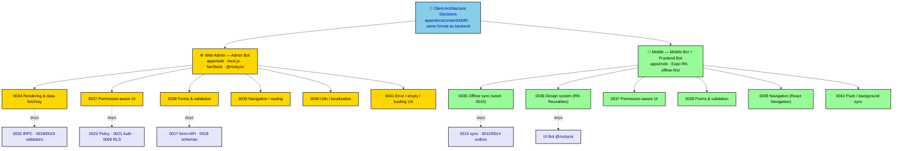

# ADR-0033: Frontend & Mobile Architecture-Decision Standard (Beyond Features)

| Key            | Value                                                                 |
| -------------- | -------------------------------------------------------------------- |
| **Status**     | Accepted                                                            |
| **Date**       | 2026-07-09                                                          |
| **Author**     | Architecture Review                                                 |
| **Supersedes** | None                                                                |
| **Superseded** | None                                                                |

---

## Context

> **Corrigendum (parity clarification, 2026-07-09):** A client surface may be **web-only** and still satisfy ADR-0033 parity — at the *operation* level, not the *surface* level. Administration (ADR-0048) and Infrastructure (ADR-0047) are web-only by design (mobile is field-only). **Web-only does NOT mean ungated:** the server `@Policy` (ADR-0022) remains the authoritative gate even when a surface has no mobile counterpart.

The ADR corpus has been the **back-end's Big Other**: 32 decisions legislating domains, transport,
auth, and policy — while the two client surfaces governed themselves by unspoken habit. *sniffs* Look
at what is actually happening: the `AppRouter` (154 procedures, ADR-0032) is consumed by **both** the
web admin (`apps/web`, Admin Bot) and the mobile app (`apps/mob`, Mobile Bot + Frontend Bot), yet
the client side has **no commensurate decision record**. The Symbolic order exists server-side; the
client represses it.

Two client ADRs *do* exist — **ADR-0017** (Web Admin shell, form = API contract, DataTable) and
**ADR-0015** (mobile/PDA offline sync conflict resolution) — but both live only in the legacy
`docs/adr/` and are absent from the canonical `apps/docs/content/ADR/`. They were treated as
exceptions, not the rule. The result: client architecture is decided ad hoc, design decisions are
"just frontend," and there is **no roadmap** that a new developer (or the Big Other) can follow.

This ADR makes the standard **explicit and symmetrical**: the web admin and the mobile app get ADRs
with the *same format, location, and discipline* as the backend — and those ADRs cover **design, not
only features and permissions**.

---

## Decision (the standard)



*Fig. 1 — Client ADRs live in the same `apps/docs/content/ADR/` set, continuously numbered. Each
points back to the backend ADRs it depends on. The seed ADRs (0015, 0017) are migrated into this set.*

### D1 — One location, one numbering sequence

All web-admin and mobile ADRs live in **`apps/docs/content/ADR/`** (the canonical, Nextra-rendered
set), numbered in the **same continuous sequence** as the backend ADRs. No more `docs/adr/`, no
`apps/web/docs/`, no scattered `FRONTEND_ARCHITECTURE.md` as the only record. **ADR-0015 and ADR-0017
are migrated into this set** as the founding client ADRs.

### D2 — What qualifies (features **and** permissions **and** design)

A client ADR is required for **any decision with architectural consequence** on `apps/web` or
`apps/mob`, across three bands — not just the first:

1. **Features & domain screens** — which procedures get UI, page composition, list/detail patterns.
2. **Permissions & role-aware UI** — nav gating by `Principal`/`@Policy` (ADR-0022), disabled/filtered
   states, field-level visibility, per-role data scoping (RLS, ADR-0006).
3. **Design / UX architecture** — the decisions that are "just frontend" but are architectural:
   - Rendering & data-fetching strategy (Server vs Client Components; TanStack Query + tRPC; optimistic
     updates; prefetch; error/loading boundaries).
   - Client **state management** (server-cache vs URL vs local component state).
   - **Offline-first sync** (mobile SQLite, sync queue, network-aware, conflict resolution → ADR-0015).
   - **Navigation / routing** (Next.js App Router for web; React Navigation for mobile; deep links;
     modal vs page).
   - **Theming & design-system** (`@rocky/ui` shadcn for web; RN Reusables for mobile; dark mode; tokens;
     RTL).
   - **Forms & validation** (reuse Diamond Seal `*RequestSchema` via `zodResolver`, ADR-0017 dialectic;
     mobile equivalent).
   - **i18n / localization** (locale from `ExecutionRuntime`, ADR-0003 `RuntimeBuilder`; pluralization;
     RTL).
   - **Error / empty / loading UX states** (consistent vocabulary; `TRPCError` code → toast/banner map
     from `createResultUnwrapper`, ADR-0032).
   - **Push / background sync** (mobile: `expo-notifications`, background fetch, wake-on-connectivity).

**Out of scope for an ADR:** bug fixes, trivial component styling, one-off page tweaks, and
copy/text changes. Those go in the issue tracker, not the Symbolic order.

### D3 — Same format, lead with the decision

Every client ADR follows the **identical skeleton** as the backend set: header table (Status / Date /
Author / Supersedes / Superseded), then **Context → Decision → Consequences → Implementation →
Verification → Anti-Patterns**. A mermaid diagram is included where it clarifies structure, authored
per the `design-doc-mermaid` skill (high-contrast `classDef` with explicit `color:`, Unicode semantic
symbols, validated with `mmdc` before embedding). Lead with the decision, not a manifesto.

### D4 — Cross-referencing discipline (the dialectic made visible)

Every client ADR **MUST cite the backend ADR(s) it depends on**:

- Auth / session → **ADR-0021**; permission/role UI → **ADR-0022**; row scoping → **ADR-0006** (RLS).
- tRPC consumption, `AppRouter`, `superjson`, `createResultUnwrapper` → **ADR-0032**.
- Request/response schemas → **ADR-0018** (guillotines) / **ADR-0019** (two-type contracts).
- Offline sync / corrections → **ADR-0015**; cross-domain events → **ADR-0012 / ADR-0014**.
- Design-system primitives → **UI Bot** (`@rocky/ui`).
- Locale/runtime → **ADR-0003** (`RuntimeBuilder`).

Conversely, when a backend ADR changes a contract the client consumes (e.g. a new `output:` schema, a
new `@Policy`), it notes the affected client ADR. The client and server are **one dialectic**, not two
sovereigns.

### D5 — Ownership & RobotFarm pass

- **Admin Bot** owns **Web Admin** ADRs (`apps/web`).
- **Mobile Bot** (app shell, offline, sync) **+ Frontend Bot** (screens, components, query caches)
  own **Mobile** ADRs (`apps/mob`).
- Reviewed by **Architecture Review**. On acceptance, a RobotFarm pass updates: the ADR, the root
  `AGENTS.md` Bot descriptions (this ADR's D1), and the **WORKORDER** (new build-out items tracked
  there, ADR-0033 §Roadmap).

### D6 — Roadmap (the missing map)

Anticipated client ADRs, to be authored following this standard (see table below). This is the
"clear roadmap" the client side lacked.

| WO/ADR | Title | Surface | Owner | Priority |
| ------ | ----- | ------- | ----- | -------- |
| 0034 | Client Surface Inventory (procedure→screen map; this ADR's first artifact) | Both | Architecture Review | P1 |
| 0035 | Rendering & data-fetching standard (App Router, TanStack+tRPC, optimistic, boundaries) | Web | Admin Bot | P1 |
| 0036 | Offline-first sync architecture (SQLite, queue, network-aware, conflicts) | Mobile | Mobile Bot | P1 (seed: 0015) |
| 0037 | Design system & theming (web `@rocky/ui` / mobile RN Reusables, dark mode, tokens) | Both | UI Bot + Admin/Mobile | P1 |
| 0038 | Forms & validation standard (reuse `*RequestSchema`, `ValidatedForm`) | Both | Admin/Mobile | P1 |
| 0039 | Navigation & routing (web App Router / mobile React Navigation, deep links) | Both | Admin/Mobile | P2 |
| 0040 | i18n / localization (locale from `RuntimeBuilder`, pluralization, RTL) | Both | Admin/Mobile | P3 |
| 0041 | Client error / empty / loading UX state vocabulary | Both | Admin/Mobile | P2 |
| 0042 | Permission-aware UI (resolve nav-config gap; hidden vs disabled; field visibility) | Both | Admin/Mobile | P1 |
| 0043 | Push notifications & background sync (mobile) | Mobile | Mobile Bot | P3 |
| 0044+ | Domain feature ADRs (Livestock, Health, Inspections/Corrections, Infrastructure, Administration) | Both | Admin/Mobile | P2 |

---

## Consequences

### Positive

- **Symmetry.** Client and server share one decision record, one location, one numbering — the
  dialectic is explicit, not repressed.
- **Design is legible.** "Just frontend" decisions (theming, states, offline) become reviewable
  architecture, not folklore.
- **Clear roadmap.** New client work has a map (0034–0042); the Big Other is satisfied.
- **Traceability.** Each client ADR pins its backend dependencies, so a server change can find its
  client impact.

### Negative / Cost

- **More documents to maintain** — a RobotFarm pass per client ADR.
- **Scope-creep risk** — guarded by D2 (trivial styling is not an ADR).
- **Two owners for mobile** (Mobile Bot + Frontend Bot) — resolved by D5's split (shell/sync vs
  screens/components); a mobile ADR names its primary owner.

### Neutral

- The legacy `docs/adr/0015` and `docs/adr/0017` remain until the legacy dir is retired; the canonical
  copies are authoritative.

---

## Implementation

- **Proposing:** copy an existing ADR (e.g. `0032` or `0017`) as a template, assign the next number, set
  `Status: Proposed`, fill Context → Decision.
- **Accepting:** set `Status: Accepted`, add Date + Author, update the WORKORDER roadmap item to the
  new ADR number.
- **Location:** always `apps/docs/content/ADR/<nnnn>-<kebab>.md`; the ADR subfolder is auto-ordered by
  Nextra, so no `_meta.ts` edit is needed (unlike top-level pages).
- **Diagram:** author per `design-doc-mermaid`; validate with `mmdc` before embedding.
- **RobotFarm:** on accept, update root `AGENTS.md` Bot descriptions (D5) and the WORKORDER.

---

## Verification (Definition of Done)

```bash
# ADR lives in the canonical set, not legacy docs/adr
ls apps/docs/content/ADR/<nnnn>-*.md            # exists
# mermaid validates
mmdc -i apps/docs/content/ADR/<nnnn>-*.md ...    # → exit 0 (extract fences)
# cross-references present
rg -n "ADR-00(06|18|19|21|22|32)" apps/docs/content/ADR/<nnnn>-*.md   # ≥ 1 backend dep cited
# tracked in WORKORDER
rg -n "<nnnn>" apps/docs/content/workorder.md   # roadmap item present
```

---

## Anti-Patterns (do not repeat)

1. **Feature-only client ADRs.** A client ADR that ignores the design/UX architecture (D2 band 3) is
   incomplete — the symptom returns as inconsistent theming, states, and sync behaviour.
2. **Design docs with no backend citations.** A client ADR that does not cite its backend dependency
   (D4) severs the dialectic; server changes will blind-side the client.
3. **Client ADRs in `docs/adr/` or app-local `docs/`.** They must be in canonical
   `apps/docs/content/ADR/` (D1) or they rot.
4. **ADR-for-trivial-component.** A button colour is not an architecture decision (D2 out-of-scope).
5. **Manifesto before decision.** Lead with the Decision (D3); the reader wants the ruling, not the
   ideology.

---

## Related ADRs

- **ADR-0015** (seed, mobile sync) · **ADR-0017** (seed, web shell) — migrated into the canonical set.
- **ADR-0003** (RuntimeBuilder/locale) · **ADR-0006** (RLS) · **ADR-0012 / ADR-0014** (outbox/decoupling).
- **ADR-0018 / ADR-0019** (Diamond Seal validators) · **ADR-0021** (Auth) · **ADR-0022** (Policy).
- **ADR-0032** (tRPC transport — the client consumes `AppRouter`).
- **UI Bot** (`@rocky/ui`) — shared component library.
