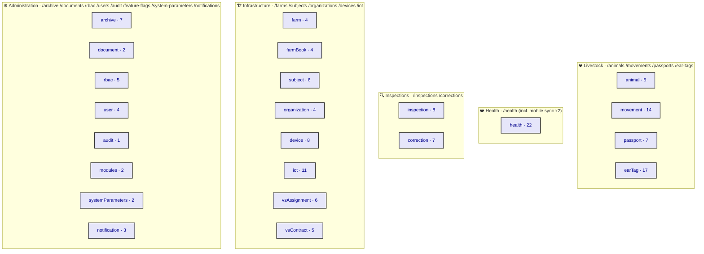

# ADR-0034: Client Surface Inventory — `AppRouter` Procedure → Screen Map

| Key | Value |
| --- | --- |
| **Status** | Accepted |
| **Date** | 2026-07-09 |
| **Author** | Architecture Review |
| **Supersedes** | None |
| **Superseded** | None |

---

## Context

ADR-0033 made the client ADR standard symmetrical with the backend. Its first prescribed artifact is
**this inventory**: before any feature ADR ("which procedures get UI"), permission ADR, or design ADR
can be written, we must know **what surface exists**. *sniffs* Look at what is actually there: the
committed `packages/trpc/src/generated/server.ts` exposes **154 procedures across 23 routers** — the
Real, not a fantasy. Yet no document maps those 154 procedures to the pages/screens that render them.
The web admin has a `nav-config.ts` (ADR-0017) that *implies* the surface; the mobile app has none.
The symptom: feature ADRs would atomize 154 procedures into 154 tiny decisions, or worse, invent
screens that do not correspond to a procedure.

This ADR is the **backbone**. It enumerates every router and procedure, groups them by the web nav
sections already established in `apps/web/lib/nav-config.ts`, classifies each as List / Detail / Form /
Workflow, and flags web-only vs mobile (offline) vs both. Every later client ADR (0035–0043 + domain
features) **MUST cite this ADR**.

### A Real found while inventorying

The mobile offline-sync transport — `syncDownload` (query) and `syncUpload` (mutation) — is **nested
inside the `health` router**. Sync is a cross-cutting transport concern (ADR-0015 / ADR-0032), not a
health domain operation. This mis-filing is recorded as defect **WO-081** and must be corrected by
promoting sync to a top-level `sync` router.

---

## Decision

The client surface is the **23 routers → 6 nav sections → pages/screens** mapping below. Procedure
counts are exact (extracted from the generated `server.ts`): **Q = query, M = mutation**.



*Fig. 1 — Router → nav-section grouping. Counts are (Q+M) procedures.*

### Master inventory table

| Router | Procs (Q/M) | Nav section (web) | Web page | Mobile screen | Pattern | Permission(s) |
| ------ | ----------- | ----------------- | -------- | ------------- | ------- | ------------- |
| **animal** | 3 / 2 | Livestock | `/animals` (list+detail+form) | Offline registration | CRUD + Detail | `animal:read` |
| **movement** | 2 / 12 | Livestock | `/movements` | Offline death/pasture/slaughter/import/export/market | Workflow (state machine) | `movement:read` |
| **passport** | 2 / 5 | Livestock | `/passports` | Issue / deliver (offline) | Workflow (issue→ship→deliver→seize→reprint) | `passport:read` |
| **earTag** | 9 / 8 | Livestock | `/ear-tags` (orders + tags) | Collect order tags (offline) | CRUD + Order lifecycle + Tag numbers | `eartag:read` |
| **health** | 13 / 9 | Health | `/health` (disease/vaccine/vaccination/treatment/labTest) | Record vaccination / treatment (offline) | CRUD + batches + **sync transport\*** | `health:read` |
| **inspection** | 4 / 4 | Inspections | `/inspections` | Create / schedule / complete (offline) | Workflow + Risk analysis | `analysis:read` (+`analysis:run` for risk) |
| **correction** | 2 / 5 | Inspections | `/corrections` | — | Workflow (review→resolve→escalate→reject) | `correction:read` |
| **farm** | 2 / 2 | Infrastructure | `/farms` | — | CRUD + Detail | `hk:farm` |
| **farmBook** | 2 / 2 | Infrastructure (farm sub) | `/farms/[id]/book` | Offline book entry | Workflow (create→updateStatus) | `hk:farm` |
| **subject** | 2 / 4 | Infrastructure | `/subjects` | — | CRUD + bind/unbind to farm + search | `hk:subject` |
| **organization** | 3 / 1 | Infrastructure | `/organizations` | — | CRUD (list/listByType) | `sm:orgs:read` |
| **device** | 2 / 6 | Infrastructure | `/devices` | `recordSync` (offline) | CRUD + sync + unblock | `pda:sync` |
| **iot** | 5 / 6 | Infrastructure | `/iot` | — | CRUD + readings + geofence events | `pda:sync` *(should be own flag — ADR-0031)* |
| **vsAssignment** | 4 / 2 | VI/VS (page TBD) | — | — | CRUD (assign/unassign) | VI/VS *(perm TBD — ADR-0027/0028)* |
| **vsContract** | 3 / 2 | VI/VS (page TBD) | — | — | CRUD (create/updateStatus) | VI/VS *(perm TBD — ADR-0027/0028)* |
| **archive** | 3 / 4 | Administration | `/archive` | — | CRUD + retention (markArchived/markDestroyed) + archiveInspectionForm | `archive:read` |
| **document** | 1 / 1 | Administration | `/documents` | — | List types + generate (PDF/A deferred — ADR-0009) | `report:read` |
| **rbac** | 3 / 2 | Administration | `/rbac` | — | List roles/perms + assign/revoke | `sm:roles:read` |
| **user** | 2 / 2 | Administration | `/users` | — | CRUD | `sm:users:read` |
| **audit** | 1 / 0 | Administration | `/audit` | — | List only | `sm:audit:read` |
| **modules** | 1 / 1 | Administration | `/feature-flags` | — | List + update (feature flags) | `sm:modules:read` |
| **systemParameters** | 1 / 1 | Administration | `/system-parameters` | — | List + update | `sm:sysparams:read` |
| **notification** | 1 / 2 | Administration | `/notifications` | Push (mobile) | unreadCount + send/markAsRead | `notification:read` |

\* `health.syncDownload` / `health.syncUpload` are the **mobile offline-sync transport** (ADR-0015) —
mis-filed under `health`; see WO-081.

### Classification scheme

- **CRUD + Detail** — `getById`/`list` + `create`/`update` → List page + Detail drawer/page + Form.
- **Workflow (state machine)** — multiple mutations driving a lifecycle (movement, passport, earTag
  order, correction, inspection, farmBook, archive retention, vsContract).
- **Read-only / config** — `audit`, `document`, `modules`, `systemParameters`, `rbac`, `notification`.
- **Transport** — `syncDownload`/`syncUpload` (mobile offline queue; not a screen of its own).

### Surface split (web / mobile / both)

- **Web-only** (admin, online): organization, subject, rbac, user, audit, modules, systemParameters,
  document, archive, vsAssignment, vsContract, iot(readings/geofence mgmt).
- **Mobile (offline field entry)** — the *data-capture* mutations: animal.create, movement.*,
  passport.issueForAnimal/deliverToKeeper, earTag.collectOrderTags, health.recordVaccination/
  recordTreatment, inspection.create/schedule/complete, farmBook.create, device.recordSync, and the
  `sync*` transport. These run against the local SQLite store and sync via ADR-0015.
- **Both** — list/detail reads for all domains; notification (web inbox + mobile push).

---

## Consequences

### Positive

- **One map, cited everywhere.** Feature ADRs (0044+) group by nav section, not by procedure; they
  reference this table instead of re-enumerating.
- **Gaps made visible.** `vsAssignment`/`vsContract` have **no web page** in `nav-config.ts` — a real
  omission (VI/VS admin). `iot` reuses `pda:sync` instead of its own flag (ADR-0031). Both are now
  explicit.
- **The sync mis-filing is named** (WO-081), not repressed.

### Negative / Cost

- The table must be **regenerated** whenever `nestjs-trpc generate` runs (ADR-0032). A drift between
  this ADR and `server.ts` is a symptom to catch in review.
- 154 procedures is a large surface; domain feature ADRs must resist the urge to document each
  procedure — they document *pages* and *patterns*.

### Neutral

- `document.generate` (PDF/A) and `archive.markDestroyed` are gated by deferred work (ADR-0009 PDF/A;
  ADR-0029 retention cron). Noted, not blocked.

---

## Implementation

- **Source of truth:** `packages/trpc/src/generated/server.ts` (committed). Re-run the extraction
  (router/procedure parse) on each regeneration and diff against this table.
- **Pages** follow ADR-0017 patterns: `DataTable<TData>` (TanStack Table) for lists, `ValidatedForm`
  (zodResolver over the Diamond Seal `*RequestSchema`) for forms, detail via route `[id]` pages.
- **Mobile screens** follow ADR-0015 offline pattern: local SQLite write → sync queue → `syncUpload`
  on connectivity (after WO-081 promotes sync to a top-level router).
- **Ownership:** Admin Bot (web pages), Mobile Bot + Frontend Bot (mobile screens), per ADR-0033.

---

## Verification (Definition of Done)

```bash
# Procedure count matches the generated transport contract
python3 - <<'PY'
import re
lines=open('packages/trpc/src/generated/server.ts').read().splitlines()
# ...router/procedure parse...  -> assert 154 procedures, 23 routers
PY
# This ADR lists all 23 routers
rg -c "^\| \*\*(animal|archive|audit|correction|device|document|earTag|farm|farmBook|health|inspection|iot|modules|movement|notification|organization|passport|rbac|subject|systemParameters|user|vsAssignment|vsContract)\*\*" apps/docs/content/ADR/0034-client-surface-inventory.md
# sync mis-filing tracked
rg -n "WO-081" apps/docs/content/WORKORDER.md
```

---

## Anti-Patterns (do not repeat)

1. **One ADR per procedure.** 154 procedures ≠ 154 ADRs. Group by nav section / page (ADR-0033 §D2).
2. **Inventing screens with no procedure.** Every page must map to ≥1 `AppRouter` procedure.
3. **Repressing the sync mis-filing.** `syncDownload`/`syncUpload` under `health` is a defect (WO-081),
   not a feature.
4. **Web-only thinking.** The mobile offline surface (data-capture mutations) is half the dialectic;
   ignoring it severs client from server.
5. **Stale inventory.** This table drifts the moment `server.ts` regenerates — keep it in sync.

---

## Related ADRs

- **ADR-0033** (client ADR standard — this ADR is its first prescribed artifact).
- **ADR-0032** (tRPC transport — the `server.ts` this inventory is extracted from).
- **ADR-0017** (web admin shell, `DataTable`/`ValidatedForm`, `nav-config.ts` sections used here).
- **ADR-0015** (mobile offline sync — the `sync*` transport and offline data-capture mutations).
- **ADR-0021 / ADR-0022** (auth / policy — the `permission` column values originate there).
- **ADR-0006** (RLS — per-role row scoping behind each read procedure).
- **ADR-0031** (IoT needs its own permission flag, not `pda:sync`).
- **WO-081** — promote `syncDownload`/`syncUpload` to a top-level `sync` router.
