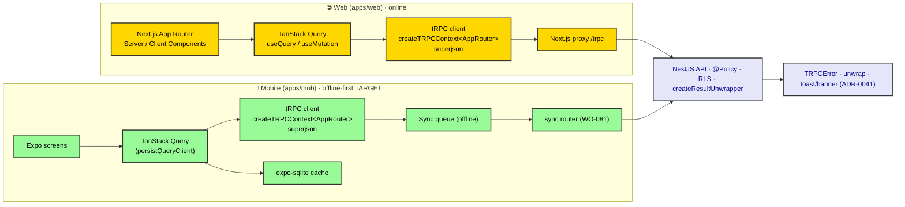

# ADR-0035: Rendering & Data-Fetching Standard (Web & Mobile)

| Key            | Value                                                                 |
| -------------- | -------------------------------------------------------------------- |
| **Status**     | Accepted                                                            |
| **Date**       | 2026-07-09                                                          |
| **Author**     | Architecture Review                                                 |
| **Supersedes** | None                                                                |
| **Superseded** | None                                                                |

---

## Context

ADR-0034 mapped the surface (154 procedures / 23 routers). This ADR prescribes **how that surface is
rendered and fed** — the first cross-cutting design standard (ADR-0033 §D6, trunk `0035`). *sniffs*
Look at what is actually there:

- **Web** (`apps/web`) is established and correct: `lib/trpc.ts` builds a tRPC v11 client via
  `createTRPCContext<AppRouter>()` with the `superjson` transformer (`@rocky/trpc/superjson`), routed
  through a Next.js proxy gateway (`/trpc`). `trpc-provider.tsx` wraps one `QueryClient`. Call sites
  use `useQuery(trpc.x.queryOptions(input))` / `useMutation(trpc.x.mutationOptions(...))`. Fully
  type-safe, end-to-end.
- **Mobile** (`apps/mob` — *not* `apps/mobile` as the RobotFarm contract claims; see WO-083) is
  **online-only today**. `providers/trpc-provider.tsx` uses the **older** `createTRPCReact<AppRouter>()`
  - `superjson`, with no persistence. `package.json` has **no** `expo-sqlite`, `mmkv`, `netinfo`,
  or `react-query-persist-client`. The AGENTS.md promise of "offline-first SQLite, tRPC sync queue,
  network-aware connectivity" (Mobile Bot) is **unimplemented** — the Real repressed by the
  imagination of the docs. `session-provider.tsx` even swallows API-unreachable silently, confirming
  no offline data path exists.

So the standard must (a) **codify** the web contract, (b) **converge** the mobile client API, and
(c) **prescribe the mobile offline-first target** and name the gap as a defect (**WO-082**).

---

## Decision



*Fig. 1 — Data-fetching topology. Web is online; mobile's offline branches (green) are the **target**
prescribed here and tracked by WO-082.*

### A. Web rendering & data-fetching (codified)

1. **Rendering split.** Next.js App Router: Server Components for the page shell/layout; Client
   Components for interactive data via tRPC React Query. No `fetch` to the API from the browser.
2. **Single `QueryClient`** (in `trpc-provider.tsx`). Default `staleTime` per domain; override only
   with justification.
3. **Only tRPC hooks.** `useQuery(trpc.<router>.<proc>.queryOptions(input))` and
   `useMutation(trpc.<router>.<proc>.mutationOptions(opts))`. Raw `fetch` to `/trpc` or the API is
   forbidden (bypasses `@Policy`, RLS context, and `createResultUnwrapper`).
4. **`superjson` transformer, always.** Import `transformer` from `@rocky/trpc/superjson`. Never the
   default JSON — it would corrupt `Date` (ADR-0010 date coercion).
5. **Gateway.** Browser → relative `/trpc` → Next.js proxy → NestJS API (per `getBaseUrl()`). SSR
   calls the API directly. `credentials: "include"` for session cookie.
6. **Error contract.** Domain `Result` errors become `TRPCError` via `createResultUnwrapper`
   (ADR-0032). They surface through React Query's `error` state; the **vocabulary** (toast/banner per
   code) is ADR-0041. 0035 only mandates: never swallow; surface the code.
7. **Optimistic updates — restricted.** Allowed only for pure local-UI toggles with explicit rollback.
   **Domain-write mutations** (create / update / state transitions) are **not** optimistic: the server
   is source of truth (Diamond Seal, ADR-0011). Prescribe invalidate-after-mutate instead.
8. **Prefetch** list→detail on navigation via `queryOptions` + router prefetch.

### B. Mobile rendering & data-fetching (converge + target)

1. **Converge the client API.** Migrate `createTRPCReact<AppRouter>()` → `createTRPCContext<AppRouter>()`
   (parity with web, ADR-0032 consumption pattern). Same `superjson` transformer. Same cookie/header
   attachment via `authClient.getCookie()` (better-auth expo) on native.
2. **Offline-first target (currently UNIMPLEMENTED — WO-082):**
   - **Local store:** `expo-sqlite` (Drizzle-Expo) as the offline read/write cache for domain entities
     (per AGENTS.md Mobile Bot + ADR-0015).
   - **Read cache persistence:** `persistQueryClient` (`react-query-persist-client` +
     `createAsyncStoragePersister` over MMKV/AsyncStorage) so lists survive app restarts.
   - **Network awareness:** `onlineManager` / `NetInfo` gates refetch and mutations. Offline writes
     enqueue to a **sync queue** (ADR-0015) and flush on reconnect via the `sync` router (**WO-081**).
   - **Reads:** offline → serve from local cache; online → fetch + populate cache.
3. **Convergence is part of WO-082**, not a separate item.

### C. Shared discipline (both surfaces)

- **Query keys:** auto-derived by tRPC react-query from procedure path + input. Do **not** hand-roll.
- **Invalidation:** after a mutation, `utils.invalidate()` by procedure/domain (tag-style), not
  global refetch storms.
- **Type safety:** always `import type { AppRouter } from "@rocky/trpc"` and parameterize the client.
  **Never redefine DTOs** (ADR-0032: the `server.ts` has zero `ReturnType<`; the client infers all).
- **Dates:** rely on `superjson`; never `JSON.parse`/manually coerce dates (ADR-0010).
- **No raw `fetch`** to the API on either surface.

---

## Consequences

### Positive

- **One data-fetching contract** for both surfaces; end-to-end type safety from `AppRouter`.
- **Dates are correct** (superjson), **errors are honest** (unwrap → code → UI).
- Mobile offline target is explicit and owned (WO-082), not repressed.

### Negative / Cost

- **WO-082 is a large build** (SQLite + persist + NetInfo + sync queue). Mobile is not offline today.
- Converging the mobile client API touches every mobile call site (`useQuery` → `queryOptions`).

### Neutral / Real

- Web is appropriately online (browser + proxy). Mobile's offline claim was fiction; 0035 makes the
  target real and tracks the gap. The `apps/mobile` path in the RobotFarm contract is wrong — the app
  is `apps/mob` (**WO-083**).

---

## Implementation

- **Web:** already conforms; add a lint rule forbidding raw `fetch` to `/trpc`/API.
- **Mobile:** implement WO-082 (cache + persist + NetInfo + sync queue); convert `createTRPCReact` →
  `createTRPCContext`; keep `superjson` + cookie header.
- **Ownership:** Admin Bot (web), Mobile Bot + Frontend Bot (mobile), per ADR-0033.

---

## Verification (Definition of Done)

```bash
# superjson transformer used on both surfaces
rg -n "transformer.*@rocky/trpc/superjson|@rocky/trpc/superjson" apps/web/lib/trpc.ts apps/mob/providers/trpc-provider.tsx
# web uses createTRPCContext<AppRouter>
rg -n "createTRPCContext<AppRouter>" apps/web/lib/trpc.ts
# mobile converged (after WO-082)
rg -n "createTRPCContext<AppRouter>" apps/mob/providers/trpc-provider.tsx
# no raw fetch to API /trpc on either surface
rg -n "fetch\(.*(/trpc|API_URL)" apps/web apps/mob --glob '!**/node_modules/**'   # expect: only the proxy in web/lib/trpc.ts
# offline libs present after WO-082
rg -n "expo-sqlite|react-query-persist-client|@react-native-community/netinfo" apps/mob/package.json
# tracked
rg -n "WO-082|WO-083" apps/docs/content/workorder.md
```

---

## Anti-Patterns (do not repeat)

1. **Raw `fetch` to the API.** Bypasses `@Policy`, RLS context, and `createResultUnwrapper` — the
   symptom returns as untyped, unguarded data.
2. **Hand-rolled DTOs** instead of `AppRouter` types — drifts from the server (ADR-0032).
3. **Optimistic domain writes** — violates Diamond Seal (ADR-0011); server is truth.
4. **Default JSON transformer** — silently corrupts `Date` (ADR-0010).
5. **Shipping "online-only" as "offline-first."** The repressed Real (mobile today) must be built
   (WO-082) or the claim retired.

---

## Related ADRs

- **ADR-0033** (client ADR standard — this is trunk `0035`).
- **ADR-0034** (surface inventory this standard feeds).
- **ADR-0032** (tRPC transport — `AppRouter`, `superjson`, `createResultUnwrapper`; client consumption).
- **ADR-0010** (date coercion — why `superjson` is mandatory).
- **ADR-0011** (Diamond Seal — why no optimistic domain writes).
- **ADR-0015** (offline sync queue — the mobile target; `sync` router per WO-081).
- **ADR-0041** (error / empty / loading UX vocabulary — consumes the unwrap contract).
- **WO-081** (promote `sync` to a top-level router) · **WO-082** (implement mobile offline cache) ·
  **WO-083** (reconcile `apps/mobile` → `apps/mob` in AGENTS.md).
