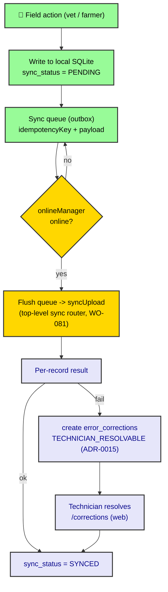

# ADR-0036: Offline-first Sync Architecture (Mobile)

| Key            | Value                                                                 |
| -------------- | -------------------------------------------------------------------- |
| **Status**     | Accepted                                                            |
| **Date**       | 2026-07-09                                                          |
| **Author**     | Architecture Review                                                 |
| **Supersedes** | None (ADR-0015 is the seed spec)                                    |
| **Superseded** | None                                                                |

---

## Context

ADR-0035 prescribed the mobile rendering/data-fetching target and named the gap: `apps/mob` is
**online-only today** — no `expo-sqlite`, no `react-query-persist-client`, no `netinfo`, no sync
queue. Yet ADR-0015 ("PDA Sync Conflict Resolution via Error Corrections") already legislates the
*server-side* contract: offline PDAs batch records via `syncUpload`; every failed record auto-creates
an `error_corrections` ticket (`TECHNICIAN_RESOLVABLE`, `detectionSource: "field"`); duplicates are
deduped by `idempotencyKey`. *sniffs* Look at what is actually missing: the **client offline layer**
that feeds `syncUpload`. The seed spec assumes a PDA that stores writes locally and flushes on
reconnect — that layer does not exist in `apps/mob`. This ADR designs it.

The `sync` transport (`syncDownload`/`syncUpload`) is currently **mis-filed under the `health`
router** (ADR-0034 §Context, WO-081). This ADR consumes it once promoted.

---

## Decision



*Fig. 1 — Offline write path. Local-first write, queue, network-aware flush, per-record correction.*

### 1. Local-first write (the missing layer)

Every domain **write mutation** enumerated in ADR-0034 (animal.create, movement.*, passport.issue/
deliverToKeeper, earTag.collectOrderTags, health.recordVaccination/recordTreatment, inspection.create/
schedule/complete, farmBook.create, device.recordSync) MUST:

1. Write to **local SQLite** (`expo-sqlite` + Drizzle-Expo) with `sync_status = PENDING` and a generated
   `idempotencyKey` (UUIDv7 or hash of `{entity, entityId, op}`). This is the source of truth while
   offline — the UI reads its own write back immediately (optimistic *local* UI only; not a server
   optimistic write — see ADR-0035 §A7).
2. Enqueue the operation in the **sync queue** (a local outbox table mirroring the server-side
   transactional outbox pattern, ADR-0012).
3. Return success to the UI immediately (offline-capable).

The server is **not** the source of truth during offline — the local SQLite row is, until flushed.

### 2. Sync queue (client outbox)

A local `sync_queue` table: `{ id, idempotencyKey, type, payload, createdAt, attempts, status }`.
Mirrors ADR-0012's transactional outbox, but client-side and per-device. `idempotencyKey` guards
against duplicate corrections on retry (ADR-0015: duplicate key → no correction).

### 3. Network-aware flush

`onlineManager` / `@react-native-community/netinfo` gates the flush. On `(online)`, drain the queue in
creation order via **`syncUpload`** (the promoted top-level `sync` router, WO-081), sending batches of
`{ idempotencyKey, type, data }`. Exponential backoff on failure; honor the ADR-0030 RuleSet feature
flags for any sync-gated domain.

### 4. Conflict resolution (per ADR-0015)

`syncUpload` returns **per-record** results. On success → local `sync_status = SYNCED`. On failure →
the server (or client, per WO-082 split) creates an `error_corrections` record:

```
{ detectionSource: "field", errorType: `sync_upload_${type}_failed`,
  errorDescription: `PDA sync failed: ${message}`,
  originalData: { idempotencyKey, type, data },
  caseType: "TECHNICIAN_RESOLVABLE", createdBy: <vet-id> }
```

The local row is marked `FAILED` and the UI shows "data is in a ticket" (farmer/vet transparency,
ADR-0015). A technician resolves via the web `/corrections` workflow (ADR-0023 / 0025): keep server /
accept vet / merge. Resolution flips the local row to `SYNCED`.

### 5. Read path

- **Offline:** reads serve from local SQLite (cached domain entities).
- **Online:** tRPC queries (`useQuery`) populate the cache; `persistQueryClient` (ADR-0035 §B2) keeps
  it across restarts.
- **`syncDownload`** (the read counterpart of the `sync` router) seeds/syncs the local cache on first
  connect and periodically.

### 6. Convergence with web (ADR-0035)

Mobile adopts `createTRPCContext<AppRouter>()` (replacing `createTRPCReact`); both surfaces consume the
generated `AppRouter` and the `superjson` transformer. The `sync` router is typed like any other
procedure — no hand-rolled DTOs (ADR-0032).

---

## Consequences

### Positive

- **Realizes ADR-0015's intent.** The seed spec's offline PDA finally has its client layer.
- **Zero silent failures.** Every failed sync → visible `error_corrections` ticket (ADR-0015).
- **Idempotent.** `idempotencyKey` prevents duplicate corrections on retry.
- **Audit trail.** `originalData` preserves field intent for reconstruction.

### Negative / Cost

- **WO-082 is the build.** Local SQLite + queue + NetInfo + flush + correction wiring is substantial;
  none of it exists in `apps/mob` today.
- **Ticket volume / latency** (ADR-0015): large batches flood `error_corrections`; needs throttling;
  data sits "in limbo" until a technician resolves.
- **No auto-merge.** Complex conflicts need human judgment (by design — last-write-wins was rejected).

### Neutral / Real

- ADR-0015's "Current State" claims `syncUpload` creates corrections; that is the **server** half. The
  **client** offline queue (this ADR) is what delivers records to it. Both halves are required.
- The `sync` router must be promoted (WO-081) before the flush can target a clean endpoint.

---

## Implementation

- **Owning bots:** Mobile Bot + Frontend Bot (`apps/mob`), per ADR-0033. Server `syncUpload`/correction
  wiring already scoped by ADR-0015 / Correction domain (ADR-0023 / 0025).
- **Steps (tracked by WO-082):** (1) add `expo-sqlite` + Drizzle-Expo local schema; (2) `sync_queue`
  outbox; (3) wrap domain writes (ADR-0034 list) to write-local-then-enqueue; (4) NetInfo-gated flush
  → `syncUpload`; (5) `persistQueryClient`; (6) correction feedback into local `sync_status`.
- **WO-081 first:** promote `syncDownload`/`syncUpload` out of `health` to a top-level `sync` router.

---

## Verification (Definition of Done)

```bash
# offline libs present in mob
rg -n "expo-sqlite|react-query-persist-client|@react-native-community/netinfo" apps/mob/package.json
# sync router promoted (no longer under health)
rg -n "syncDownload|syncUpload" packages/trpc/src/generated/server.ts   # should be under a `sync` router
# domain writes enqueue locally (grep a sample)
rg -n "sync_status|PENDING" apps/mob   # local write path present
# correction feedback wired
rg -n "error_corrections|TECHNICIAN_RESOLVABLE" packages/domains/correction   # server half (ADR-0015)
# tracked
rg -n "WO-082|WO-081" apps/docs/content/workorder.md
```

---

## Anti-Patterns (do not repeat)

1. **Online-only "offline-first."** Shipping `apps/mob` without the local queue is the repressed Real
   (ADR-0035); build WO-082 or stop claiming offline.
2. **Server optimistic writes.** Local write is optimistic; the *server* write is not (ADR-0035 §A7).
3. **No `idempotencyKey`.** Retries would flood `error_corrections` (ADR-0015 dedup guard).
4. **Last-write-wins on conflict.** Rejected by ADR-0015 — always create a correction ticket.
5. **Silent failures.** Every failed sync MUST create a visible ticket; never swallow.

---

## Related ADRs

- **ADR-0015** (seed spec — conflict → `error_corrections`; this ADR builds its client layer).
- **ADR-0012** (transactional outbox — the client `sync_queue` mirrors it).
- **ADR-0014** (cross-domain event decoupling — server-side counterpart).
- **ADR-0023 / ADR-0025** (error_corrections / correction domain — the resolution workflow).
- **ADR-0035** (rendering/data-fetching — parent trunk; offline target this ADR realizes).
- **ADR-0034** (surface inventory — the write mutations this ADR queues).
- **ADR-0032** (tRPC transport — `sync` router per WO-081, `superjson`, `createResultUnwrapper`).
- **ADR-0030** (RuleSet — feature-flag gating of sync domains).
- **ADR-0033** (client ADR standard — this is trunk `0036`).
- **WO-081** (promote `sync` router) · **WO-082** (implement this architecture).
