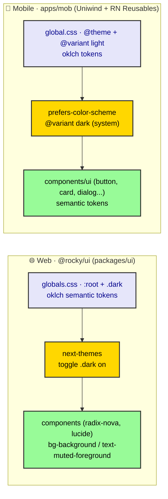

# ADR-0037: Design System & Theming (Web & Mobile)

| Key | Value |
| --- | --- |
| **Status** | Accepted |
| **Date** | 2026-07-09 |
| **Author** | Architecture Review |
| **Supersedes** | None |
| **Superseded** | None |

---

## Context

ADR-0035 (rendering) and ADR-0038 (forms) need a shared visual contract. *sniffs* Look at what is
actually there — and it is *not* uniform:

- **Web** (`@rocky/ui` = `packages/ui`): shadcn **radix-nova**, Tailwind v4, `cssVariables: true`,
  `lucide` icons. `packages/ui/src/styles/globals.css` defines semantic **oklch** tokens in `:root`
  (light) and a `.dark` block (dark), with `@custom-variant dark (&:is(.dark *))`. Dark mode is wired
  via `next-themes` (`apps/web/components/theme-provider.tsx` + `theme-toggle.tsx` toggling `.dark` on
  `<html>`). Radius `0.625rem`.
- **Mobile** (`apps/mob`): **Uniwind** (Tailwind-for-RN) + **RN Reusables** shadcn-style components
  (`apps/mob/components/ui`: button, card, dialog, input, …). `apps/mob/global.css` defines oklch
  tokens via `@theme` + `@layer theme { :root { @variant light { … } } }`. Radius `10px` (≈ matches
  . Both surfaces define complete light **and** dark oklch token sets — web via `:root` + `.dark`, mobile via `@variant light` + `@variant dark`.

So the standard must unify the *contract* (semantic tokens, no raw colors, dark parity, RTL-readiness)
across two different engines (Tailwind v4 web vs Uniwind RN), with token parity already established (see below).

---

## Decision



*Fig. 1 — Theming topology. Web and mobile share the semantic-token contract; engines differ.*

### 1. Semantic tokens only — never raw values

Both surfaces define tokens in **one file each** and components consume **only** semantic names:
`bg-background`, `text-foreground`, `bg-primary`, `text-muted-foreground`, `bg-card`, `bg-destructive`,
`border`, `ring`, `sidebar-*`, `chart-1..5`. No `bg-blue-500`, no hardcoded hex/oklch in components.
Per the shadcn rules: **no manual `dark:` color overrides** — the variant is resolved by the token
swap, not by per-component color hacks.

- **Web:** `packages/ui/src/styles/globals.css` (`:root` + `.dark`). Do **not** re-`@import
  "tailwindcss"` there (breaks the token rules — see the file's own warning).
- **Mobile:** `apps/mob/global.css` (`@theme` + `@layer theme`, `@variant light` **and `@variant dark`** — already mirroring web's `.dark` values).

Same token *names* on both surfaces so a component's intent is surface-agnostic.

### 2. Radius, spacing, sizing discipline

- Shared radius scale: web `--radius: 0.625rem` (≈10px) ↔ mobile `--radius: 10px`; keep them in lock-step
  (`--radius-sm/md/lg/xl` derived).
- `gap-*` (never `space-x/y-*`), `size-*` (never `w-* h-*`), `truncate` shorthand, `cn()` for
  conditional classes (never manual template-literal ternaries). No manual `z-index` on overlays.

### 3. Dark mode

- **Web:** `next-themes` toggles `.dark` on `<html>`; `@custom-variant dark (&:is(.dark *))` makes
  `dark:` resolve. Keep the `theme-provider` mounted at the root layout.
- **Mobile:** Uniwind's `@variant dark` resolves to the system `prefers-color-scheme` by default, so dark mode follows the device automatically; a manual toggle (RN `useColorScheme` + a `ThemeProvider`, mirroring web's `theme-toggle.tsx`) is an optional product addition, not a defect.

### 4. Component sourcing — compose, don't reinvent

- **Web:** add via shadcn CLI (`packages/ui/components.json`, alias `#components`); use `Card`
  (Header/Title/Content/Footer), `Dialog`+`DialogTitle`, `Alert`, `Empty`, `Skeleton`, `Badge`,
  `sonner` toasts, `Separator`, `FieldGroup`+`Field` for forms (ADR-0038).
- **Mobile:** RN Reusables equivalents from `apps/mob/components/ui`; same composition rules
  (Dialog needs a title, Empty for empty states, Skeleton for loading, sonner/toast for feedback).
- Icons: web `lucide` (`data-icon` pattern, pass icon objects, no sizing classes); mobile RN Reusables
  icon wrapper (lucide-react-native), same discipline.

### 5. RTL / i18n readiness (feeds ADR-0040)

Tokens and layout MUST be direction-agnostic: use logical properties / Tailwind RTL support; set `dir`
on the root from locale (`RuntimeBuilder`, ADR-0003). Theming must not bake LTR assumptions into token
choices or component markup.

---

## Consequences

### Positive

- **One visual language** across web and mobile (semantic tokens, shared names, matched radius).
- **Accessible by construction** — Dialog titles, `Field` `aria-invalid`, Skeleton/Empty states.
- **Dark mode is real on both** — web via `next-themes` + `.dark`; mobile via `@variant dark` (system `prefers-color-scheme`).

### Negative / Cost

- **Two token files** (`packages/ui/src/styles/globals.css`, `apps/mob/global.css`) must be kept in
  sync on rename/rebrand — a future `@rocky/tokens` package could unify (out of scope).
- **Two token files** (`packages/ui/src/styles/globals.css`, `apps/mob/global.css`) must be kept in sync on rename/rebrand — a future `@rocky/tokens` package could unify (out of scope).

### Neutral / Real

- Web radius `0.625rem` ≈ mobile `10px` — already aligned. Mobile's `@variant dark` block **already mirrors** web's `.dark` token values — token parity exists; runtime activation differs by platform (next-themes manual toggle vs system `prefers-color-scheme`), which is expected.

---

## Implementation

- **Owning bot:** UI Bot (`@rocky/ui`), per ADR-0033. Mobile components co-owned by Mobile Bot +
  Frontend Bot.
- **Steps:** (1) keep web tokens authoritative for names/values; (2) keep mobile `@variant dark` values in sync with web `.dark` on any rebrand; (3) (optional) add a mobile `ThemeProvider`
  (`useColorScheme`); (4) lint rule: forbid raw color utilities / manual `dark:` overrides.
- **Enforce** via the shadcn skill rules (semantic colors, composition, forms, icons).

---

## Verification (Definition of Done)

```bash
# web tokens + dark variant
rg -n "@custom-variant dark|^\.dark" packages/ui/src/styles/globals.css
# next-themes wired
rg -n "next-themes|ThemeProvider" apps/web/components/theme-provider.tsx
# mobile tokens + dark variant
rg -n "@variant light" apps/mob/global.css
rg -n "@variant dark" apps/mob/global.css   # expect: present (token parity already holds)
# no raw color utilities in components (sample)
rg -n "bg-blue-5|text-emerald-6|#[0-9a-f]{3,6}" apps/web/components apps/mob/components/ui || echo "clean"
# tracked
# both surfaces define dark tokens (web .dark + mob @variant dark)
```

---

## Anti-Patterns (do not repeat)

1. **Raw color values in components.** Use semantic tokens; raw `bg-blue-500` is the symptom of a
   broken theming contract.
2. **Manual `dark:` overrides.** The token swap handles dark; per-component color hacks fracture it.
3. **Two different radius scales.** Web `0.625rem` and mobile `10px` already match — keep them locked.
4. **Desyncing the two token files.** A rebrand/retoken must update both `packages/ui` and `apps/mob`; prefer a future shared `@rocky/tokens`. A manual mobile dark toggle is optional (system `prefers-color-scheme` already drives `@variant dark`).
5. **Hand-rolled markup instead of components.** `Alert`/`Empty`/`Skeleton`/`Card` exist — use them.

---

## Related ADRs

- **ADR-0033** (client ADR standard — this is trunk `0037`).
- **ADR-0035** (rendering — components live in screens) · **ADR-0038** (forms — `FieldGroup`/`Field`).
- **ADR-0040** (i18n / RTL — theming must be direction-agnostic).
- **ADR-0041** (error / empty / loading UX — `Alert`/`Empty`/`Skeleton`/`sonner`).
- **UI Bot** (`@rocky/ui`) — owns the web token file and component library.
- **shadcn skill** — styling / forms / composition / icons rules enforced here.

- **ADR-0032** (tRPC `AppRouter` / `superjson` / `createResultUnwrapper` — design-system components render tRPC Query states and `TRPCError` payloads; `Alert`/`Skeleton` are the error surface).
- **ADR-0018** (Diamond Seal validators — form components consume `*RequestSchema` via `zodResolver`).
