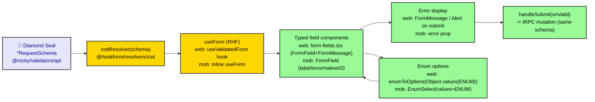

# ADR-0038: Forms & Validation (Web & Mobile)

| Key            | Value                                                                 |
| -------------- | -------------------------------------------------------------------- |
| **Status**     | Accepted                                                            |
| **Date**       | 2026-07-09                                                          |
| **Author**     | Architecture Review                                                 |
| **Supersedes** | None (codifies ADR-0017's "Form IS the API Contract" thesis)       |
| **Superseded** | None                                                                |

---

## Context

*adjusts shirt* ADR-0017 already diagnosed the split with brutal clarity: the Diamond Seal `*RequestSchema`
(~90 of them) "sit unused on the client. We validate *twice*, with two different contracts… forms accept
what the API rejects, and the user meets the Real only at submit time." The symptom was real. But the code
has *already* begun to resolve it. Look at what is actually there:

- **Web:** `apps/web/lib/use-validated-form.ts` — `useValidatedForm(schema)` →
  `useForm({ resolver: zodResolver(schema) })`. `apps/web/components/shared/validated-form.tsx` —
  a `ValidatedForm` wrapper (`<Form {...form}>`, destructive `Alert` on invalid submit).
  `apps/web/components/shared/form-fields.tsx` — typed `TextField`/`SelectField`/`NumberField`/
  `CheckboxField`/`SwitchField`/`DateField`/`TextareaField`, all on `@rocky/ui`
  `FormField`/`FormLabel`/`FormControl`/`FormMessage`. The corrections page binds
  `schema={createCorrectionRequestSchema}` and sources options via
  `enumToOptions(Object.values(DETECTION_SOURCE))` from `@rocky/validators/enums`.
- **Mobile:** `apps/mob/app/(tabs)/animals/create.tsx` derives `createAnimalFormSchema` from
  `createAnimalRequestSchema.shape` (validators) + `zodResolver`; renders RN Reusables `FormField`
  (`label`/`error`/`nativeID`) and `EnumSelect` fed by `@rocky/validators/enums` (`BIRTH_TYPE`, `SEX`).
- **Validators (Diamond Seal):** `*RequestSchema` per domain in `packages/validators/src/api/*.api.ts`
  (e.g., `createAnimalRequestSchema = animalsInsertSchema`), NoDrift-enforced.

So the *contract* is already unified; the *ergonomics* diverge (web hook+wrapper+typed fields, mobile
inline `useForm`+`FormField`). ADR-0038 **codifies** the contract as the standard and **converges**
ergonomics without forcing identical code.

---

## Decision



*Fig. 1 — Single source of truth: the Diamond Seal schema flows into both surfaces' forms via `zodResolver`.*

### 1. Single source of truth

Every client form binds `zodResolver` to a `@rocky/validators/api` `*RequestSchema` (or a `.shape`-derived
form schema). **No hand-rolled duplicate zod.** This is ADR-0017's "Form IS the API Contract" thesis, now
enforced — client validation === server contract (NoDrift).

### 2. Web ergonomics (codify existing)

`useValidatedForm(schema, opts)` → `useForm({ resolver: zodResolver(schema) })`; render
`<ValidatedForm form={form} onValid={...}>`; compose typed fields from `form-fields.tsx` over `@rocky/ui`
`FormField`/`FormLabel`/`FormControl`/`FormMessage`. `ValidatedForm` shows a destructive `Alert` on invalid
submit (already implemented). Emails use `type="email"`; required/`aria-invalid` handled by `FormField`.

### 3. Mobile ergonomics (codify existing)

`useForm({ resolver: zodResolver(formSchema) })` where `formSchema` derives from
`createXxxRequestSchema.shape` (Zod 4 object spread) to relax/extend; render RN Reusables `FormField`
(`label`+`error`+`nativeID`); `EnumSelect` for enums. (A future `useValidatedForm` hook on mobile is
optional ergonomic parity, not a defect.)

### 4. Enum options ONLY from validators

Web: `enumToOptions(Object.values(ENUM))` (`@rocky/validators/enums`). Mobile: `EnumSelect`
`values={ENUM}`. **Never** hardcoded option arrays — Diamond Seal enums are the only allowed source
(ADR-0011 / ADR-0018).

### 5. Form-only derivations

When the form needs fields absent from the API schema (confirm, client-generated IDs, captcha), derive from
`schema.shape` and `.extend()` / `.omit()` (Zod 4) — **never** duplicate the field rules. Mobile's
`createAnimalFormSchema` is the reference derivation.

### 6. Error-display contract

Web: per-field `FormMessage` + form-level `Alert` on submit. Mobile: `error` prop on `FormField`. Both
surface the *same* `zod` messages the API would return (because the schema is shared). No silent failures.

### 7. Submit → tRPC

`form.handleSubmit(onValid)` where `onValid` calls the tRPC mutation with the same shape (ADR-0034/0035).
Because schema === API input, the second-validation gap ADR-0017 warned about cannot reopen.

### 8. Date / coercion

Schemas are `z.coerce.date<string>()` (ISO string, per ADR-0017 L60 + ADR-0010). Forms use `DateField`
(web) / date `FormField` (mob) that **emits ISO strings**. Never pass `Date` objects where ISO is expected.

---

## Consequences

### Positive

- **Client validation === server contract** (NoDrift). The ADR-0017 symptom — "forms accept what the API
  rejects" — is resolved at the root, not patched.
- **Enum options single-sourced**; accessible by construction (`FormLabel` / `aria-invalid` / `FormMessage`).
- The pattern is **already implemented** on both surfaces — this ADR codifies, it does not invent.

### Negative / Cost

- `form-fields.tsx` (web) and `FormField` (mob) must track new `@rocky/ui` primitives.
- Ergonomic divergence (web hook+wrapper vs mobile inline) is tolerated — acceptable, not a defect.

### Neutral / Real

- The **contract** is unified; the **ergonomics** legitimately differ by platform. That is expected.
- No new structural gap was found during recon — hence **no new Work Order item** is raised here (contrast
  with the retracted WO-084: this ADR is grounded in verified code, not an assumed gap).

---

## Implementation

- **Owning bots:** UI Bot (`@rocky/ui` form primitives, `form-fields.tsx`), Frontend Bot (web forms),
  Mobile Bot (mobile forms). **Validation Bot** (`@rocky/validators`) is the source of truth.
- **Steps:** (1) every new form MUST bind `zodResolver` to a validators schema; (2) reuse
  `useValidatedForm` (web) / derive `.shape` (mob); (3) enum options from `@rocky/validators/enums`
  only; (4) lint: forbid hand-rolled zod in forms, forbid hardcoded select options.
- **No code change strictly required** — the standard is already practiced.

---

## Verification (Definition of Done)

```bash
# both surfaces bind zodResolver to a validators schema
rg -n "zodResolver" apps/web/lib/use-validated-form.ts \
                apps/mob/app/\(tabs\)/animals/create.tsx
# web form schema bound to *RequestSchema via the hook
rg -n "useValidatedForm\(|schema=\{.*RequestSchema\}" apps/web/app
# enum options sourced from validators/enums (not hardcoded)
rg -n "enumToOptions\(Object.values\(" apps/web
rg -n "EnumSelect" apps/mob
# no hand-rolled zod in form components (sample)
rg -n "z\.object\(|z\.strictObject\(" apps/web/components/shared \
                              apps/mob/app/\(tabs\) || echo "clean"
```

---

## Anti-Patterns (do not repeat)

1. **Hand-rolled duplicate zod in a form** — the ADR-0017 symptom. Reuse `*RequestSchema`.
2. **Hardcoded select options** — use `@rocky/validators/enums` via `enumToOptions` / `EnumSelect`.
3. **Passing `Date` objects where the schema expects ISO** (ADR-0010/0017) — use `DateField` / ISO emitters.
4. **Diverging error display (silent failures)** — always surface via `FormMessage` / `error` + submit `Alert`.
5. **New form without `zodResolver`** — the Form IS the API contract.

---

## Related ADRs

- **ADR-0017** (frontend architecture — dialectic origin: "Form IS the API Contract").
- **ADR-0011** (Diamond Seal layer boundaries) · **ADR-0018** (API validator design) · **ADR-0010** (date coercion).
- **ADR-0033** (client ADR standard) · **ADR-0035** (rendering) · **ADR-0037** (theming — `FormField`/`FormMessage` styled by tokens).
- **ADR-0041** (error / empty / loading UX — `Alert`/`FormMessage` placement).
- **Validation Bot** (`@rocky/validators`) — single source of truth for `*RequestSchema` + enums.
- **zod-4 skill** · **shadcn forms skill** (`Field`/`FieldGroup` is the upstream primitive direction;
  Rocky standardizes on `FormField` + `FormMessage`).
