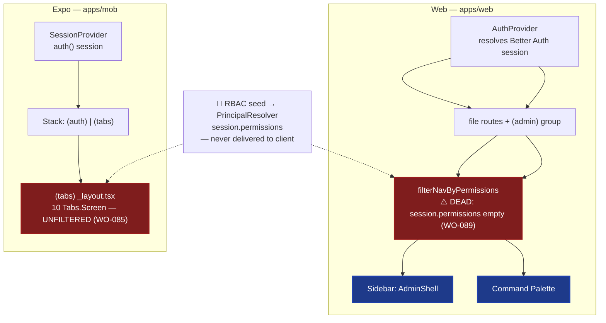

# ADR-0039 — Navigation & Routing (Web + Mobile)

> Client-surface ADR (standard: ADR-0033). Documents how `apps/web` and `apps/mob`
> route and gate navigation, and how permission-aware nav is *supposed* to work on both —
> versus what actually runs today (see WO-089).

## 1. Context

Web routing is **file-based** Next.js App Router under `apps/web/app`:

- `(admin)` route group → all staff/back-office screens, wrapped by `AdminShell`
  (sidebar + topbar) via `apps/web/app/(admin)/layout.tsx`.

Mobile routing is the **Expo Router** stack in `apps/mob/app`, gated at the provider
level:

```tsx
// apps/mob/app/_layout.tsx
<SessionProvider>
  <Stack>
    <Stack.Screen name="(auth)" />   {/* sign-in / sign-up */}
    <Stack.Screen name="(tabs)" />   {/* the 10-tab worker surface */}
  </Stack>
</SessionProvider>
// apps/mob/app/(tabs)/_layout.tsx
const { data: session } = auth.useSession();
if (!session) return <Redirect href="/(auth)/signin" />;
// then renders all 10 <Tabs.Screen> unconditionally
```

### Permission-filtered navigation — the stated standard

Web: `nav-config.ts` (`NavItem.permission` from RBAC seed) + `filterNavByPermissions(navSections,
permissions)` — *called* by `AdminShell` (sidebar) **and** `command-palette.tsx`. But it **fail-opens**
(returns the full nav) because `session.permissions` is **empty on the client**: the auth/RBAC split means **no permissions reach the client** — `packages/auth/src/better-auth.ts` is identity-only by design (no `customSession`), so nothing populates `session.permissions` (see ADR-0042 / WO-089). So the filter is **dead code**
at runtime.

Mobile: `apps/mob/app/(tabs)/_layout.tsx` renders all 10 `Tabs.Screen` **unconditionally** — no
permission check at all (WO-085).

**Reality (verified):** Client-side permission filtering is **not implemented at runtime on either
surface** (the web filter fail-opens; mobile tabs are unconditional). The *server* `PolicyEngine`
(ADR-0022) is the only enforcement. WO-089 proposes correcting this. This ADR documents the intended
standard and the present gap.

## 2. Decision

1. **Web uses file-based routing** + `(admin)` route group + `AdminShell`. No `middleware.ts`.
2. **Mobile uses Expo Router** + a single `Stack` (`(auth)` | `(tabs)`) gated by `SessionProvider`;
   `if (!session) return <Redirect href="/(auth)/signin" />`.
3. **Cross-cutting**: auth gate at the provider/layout, not per-route.



*Fig. 1 — Web nav filter is **dead code** (fail-open; `session.permissions` empty, WO-089); mobile
tabs are unfiltered (red, WO-085). Both gate auth.*

### 3. Permission-filtered navigation = the standard

Web: `nav-config.ts` (`NavItem.permission` from RBAC seed) + `filterNavByPermissions(navSections,
permissions)` — *called* by `AdminShell` (sidebar) **and** `command-palette.tsx` — but they **fail open**
today (`session.permissions` empty; auth/RBAC split; no `customSession`). **Re-enable** client permissions
(WO-089), *then* mobile MUST mirror it: filter `Tabs.Screen` visibility by the session's RBAC permissions
(see **WO-085**). "Users see only permitted rooms" (ADR-0017) applies to *both* surfaces.

Permissions *should* reach the client from the server-side `PrincipalResolver` (ADR-0021/0022) → a
`rbac.myPermissions` query → `session.permissions` → `filterNavByPermissions`. **But today the auth/RBAC split
means no `customSession` exists and permissions never reach the client**, so `session.permissions` is **empty** — the filter never fires. **WO-089 re-enables it.** Until
then, **never** hardcode permission logic; derive visibility from the session (once populated).

## 4. Consequences

|             | Web                  | Mobile           |
|-------------|----------------------|------------------|
| Route model | file-based           | Expo stack       |
| Auth gate   | AdminShell           | SessionProvider  |
| Nav filter  | permission (**dead**) | **none**       |
| Status      | WO-089               | WO-085           |

### Positive

- Web nav *has* the filter code (`filterNavByPermissions` in `AdminShell` + command palette) — but it is
  **dead at runtime** (fail-open) until `session.permissions` is populated (WO-089). RBAC is **not** visible
  today (see ADR-0042).
- Mobile routing is simple and auth-gated.

### Negative

- Mobile tabs are **not** permission-filtered yet (WO-085) — a staff user sees every tab.
- Web *appears* permission-filtered but is not (the filter silently no-ops), which is worse than an honest
  "all tabs" because it hides the gap.

### Neutral / Real

- The *routing model* is unified; the *permission-gated nav* standard is **not done at runtime on either
  surface** (web filter dead/fail-open; mobile unfiltered). The contradiction: backend enriches
  `permissions`, but the client session was split out of it (WO-089).

## 5. Implementation Notes

- **Web requires a change after all**: re-enable `session.permissions` via a `rbac.myPermissions` query (WO-089) so the
  existing `filterNavByPermissions` actually fires. Mobile: filter tabs (WO-085).
- After WO-089, both surfaces derive nav visibility from `session.permissions` — no hardcoded gating.

## 6. Verification

```bash
# Web filter EXISTS but FAIL-OPENS today (session.permissions empty on client) — WO-089
rg -n "filterNavByPermissions" apps/web/components/admin-shell.tsx apps/web/components/command-palette.tsx
# Mobile tabs are all rendered UNCONDITIONALLY (no permission filter) — WO-085
rg -n "Tabs.Screen" "apps/mob/app/(tabs)/_layout.tsx"
# The gap: no permissions reach the client (auth is identity-only; no customSession) — WO-089
rg -n "myPermissions" apps/api/src/routers/rbac.router.ts
# confirm better-auth stays identity-only (no customSession):
rg -n "customSession" packages/auth/src/better-auth.ts   # expect: 0 matches
```

## 7. References

- ADR-0017 (frontend architecture — "users see only permitted rooms").
- ADR-0021 / ADR-0022 (Better Auth + Policy Engine).
- ADR-0033 (client ADR standard).
- ADR-0042 (Permission-Aware UI — the corrective design).
- **WO-085** (filter mobile tabs by RBAC permission — mirror web `filterNavByPermissions`).
- **WO-089** (re-enable client `session.permissions` via `rbac.myPermissions` query; fixes dead web filter + mobile tabs).
