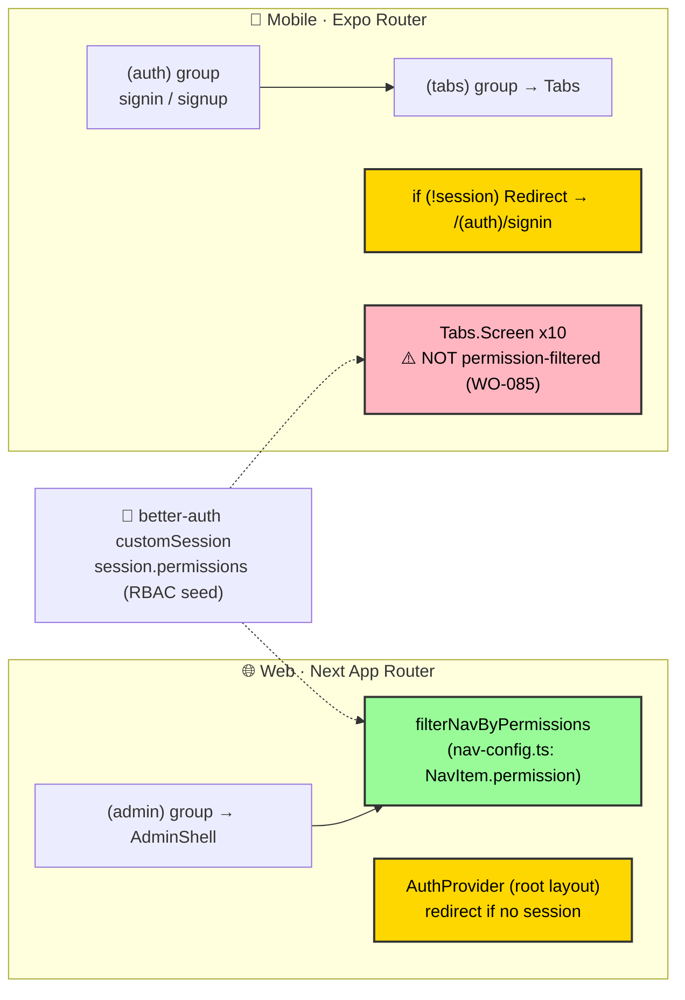

# ADR-0039: Navigation & Routing (Web & Mobile)

| Key            | Value                                                                 |
| -------------- | -------------------------------------------------------------------- |
| **Status**     | Accepted                                                            |
| **Date**       | 2026-07-09                                                          |
| **Author**     | Architecture Review                                                 |
| **Supersedes** | None                                                                |
| **Superseded** | None                                                                |

---

## Context

*adjusts shirt* ADR-0017 already named the dialectic: "navigation is permission-gated: nav items are
filtered by the session's permissions (better-auth `customSession` enrichment). RBAC becomes visible:
users see only permitted rooms. Authorization is no longer a repressed symptom." The code has made this
concrete on **web** — but mobile has *not* kept pace. Look at the actual topology:

- **Web (Next App Router):** `apps/web/app/layout.tsx` stacks `ThemeProvider` → `TRPCProvider` →
  `AuthProvider` → `Toaster`. `apps/web/app/(admin)/layout.tsx` is a thin shell → `AdminShell`, which
  consumes `filterNavByPermissions(navSections, permissions)` (from `apps/web/lib/nav-config.ts`, where
  each `NavItem.permission` is a RBAC seed string: `animal:read`, `analysis:read`, `hk:farm`…). Both
  the sidebar (`AdminShell`) and the command palette (`command-palette.tsx`) filter by permission. There is
  **no `middleware.ts`** — the auth gate is provider/component-level.
- **Mobile (Expo Router):** `apps/mob/app/_layout.tsx` → `SessionProvider` → `Stack{(auth), (tabs)}`.
  `apps/mob/app/(tabs)/_layout.tsx` uses `useSession()` and `if (!session) return <Redirect
  href="/(auth)/signin" />` (auth gate ✓), then renders **all 10 `Tabs.Screen` unconditionally** —
  animals, health, movements, inspections, eartags, passport, corrections, notifications, sync, explore.
  **No permission filter.** The ADR-0017 symptom returns on mobile: unauthorized users *see* rooms they
  cannot enter.

So the routing *model* converges (file-based + route groups + provider-level auth gate), but the
**permission-gated navigation** standard is only half-implemented.

---

## Decision



*Fig. 1 — Web nav is permission-filtered (green); mobile tabs are not (red, WO-085). Both gate auth.*

### 1. File-based routing + route groups (both)

Web `(admin)` / `(auth)/[...path]`; mobile `(auth)` / `(tabs)`. Route groups separate auth vs
authed surfaces **without** affecting the URL. Keep this; it is the convergent model.

### 2. Provider-level auth gate (no web middleware)

Web: `AuthProvider` (root layout) redirects unauthenticated users; `(admin)/layout.tsx` is a thin
`AdminShell`. Mobile: `(tabs)/_layout.tsx` `if (!session) <Redirect href="/(auth)/signin" />`. Both
redirect unauthenticated → auth. (Web has **no `middleware.ts`** — the SSR gate is component-level; see
Neutral/Real.)

### 3. Permission-filtered navigation = the standard

Web: `nav-config.ts` (`NavItem.permission` from RBAC seed) + `filterNavByPermissions(navSections,
permissions)`, used in `AdminShell` (sidebar) **and** `command-palette.tsx`. **Mobile MUST mirror this**:
filter `Tabs.Screen` visibility by the session's RBAC permissions (see **WO-085**). "Users see only
permitted rooms" (ADR-0017) applies to *both* surfaces.

### 4. Icon / label single source per surface

Web: `nav-config.ts` (`lucide` `LucideIcon`). Mobile: `(tabs)/_layout.tsx` (`lucide-react-native`
`Icon as={…}`). Both use lucide. Keep tab/route labels + icons declared in **one** place per surface; do
not scatter `title=`/icon props.

### 5. Route ↔ procedure mapping (ADR-0034)

Every authed route maps to a tRPC router/procedure; nav `href` ↔ router alias. The client inventory
(ADR-0034) is the reference. When a router/procedure is added or renamed, the nav entry follows.

### 6. Deep links + offline routes (ADR-0036)

Mobile deep links (`(tabs)/animals/[id]`) must resolve from the **local sync cache** when offline; the
router must not hard-require the network. Web routes are SSR (online by nature). The `(tabs)/sync` tab is
the offline flush surface (ADR-0036).

### 7. Permission source of truth

Permissions come from better-auth `customSession` enrichment (ADR-0021/0022) → `session.permissions`
→ `filterNavByPermissions`. **Never** hardcode permission logic inside a route/layout; derive visibility
from the session.

---

## Consequences

### Positive

- **Convergent routing model** (file-based, route groups, provider-level auth gate) on both surfaces.
- **Web nav is permission-filtered** — RBAC is visible (sidebar + command palette), per ADR-0017.
- Auth gate present on both (web `AuthProvider`, mobile `Redirect`).

### Negative / Cost

- **Mobile tabs are NOT permission-filtered** — a real gap (WO-085). Until fixed, the ADR-0017 symptom
  returns on mobile: users see rooms they cannot use.
- Web has no edge `middleware.ts`; the `(admin)` shell renders (briefly) before the client gate
  redirects. Acceptable for an internal admin tool, but noted.

### Neutral / Real

- The *routing model* is unified; the *permission-gated nav* standard is only **half** done (web yes,
  mobile no). That is the precise contradiction to resolve.
- Deep-link/offline resolution (§6) depends on ADR-0036 landing; track together.

---

## Implementation

- **Owning bots:** Frontend Bot (web nav/`AdminShell`/`nav-config`), Mobile Bot (`(tabs)/_layout.tsx`),
  Auth Bot (`customSession` enrichment → `session.permissions`), UI Bot (`@rocky/ui` shell).
- **Steps:** (1) codify web's `filterNavByPermissions` pattern as the standard; (2) **WO-085** — port it
  to mobile `(tabs)/_layout.tsx` (filter `Tabs.Screen` by `session.permissions`); (3) keep nav
  labels/icons single-sourced per surface; (4) keep nav `href` ↔ tRPC alias in sync with ADR-0034.
- **No change required on web** — it already complies.

---

## Verification (Definition of Done)

```bash
# web: nav filtered by permission
rg -n "filterNavByPermissions" apps/web/components/admin-shell.tsx apps/web/components/command-palette.tsx
rg -n "permission\??:" apps/web/lib/nav-config.ts
# mobile: auth gate present
rg -n "if \(!session\)|Redirect" "apps/mob/app/(tabs)/_layout.tsx"
# mobile: permission filter MISSING (WO-085 target) — expect 0 today
rg -n "filterNavByPermissions|permission" "apps/mob/app/(tabs)/_layout.tsx" || echo "not yet filtered (WO-085)"
# route groups both surfaces
rg -n "Stack.Screen name=\"\(auth\)\"|Stack.Screen name=\"\(tabs\)\"" apps/mob/app/_layout.tsx
rg -n "\(admin\)" apps/web/app
# tracked
rg -n "WO-085" apps/docs/content/workorder.md
```

---

## Anti-Patterns (do not repeat)

1. **Rendering all tabs/rooms unconditionally** (mobile today) — the ADR-0017 repressed symptom. Filter by
   `session.permissions`.
2. **Hardcoding permission logic in a route/layout.** Derive visibility from the session (ADR-0022).
3. **Scattering nav labels/icons** across screens. Declare them in one place (`nav-config.ts` / tabs layout).
4. **Deep links that hard-require the network** on mobile — violates offline-first (ADR-0036).
5. **Nav `href` drifting from the tRPC alias** — keep mapped to ADR-0034.

---

## Related ADRs

- **ADR-0017** (frontend architecture — dialectic: "navigation is permission-gated", RBAC visible).
- **ADR-0034** (client surface inventory — route ↔ procedure mapping).
- **ADR-0035** (rendering / data-fetching) · **ADR-0036** (offline-first sync + offline routes).
- **ADR-0042** (permission-aware UI — future convergence of filtering + in-screen guards).
- **ADR-0043** (push / deep-link / background sync — mobile link resolution).
- **ADR-0021** (better-auth config) · **ADR-0022** (authorization policy engine → `session.permissions`).
- **WO-085** (filter mobile tabs by RBAC permission — mirror web `filterNavByPermissions`).
