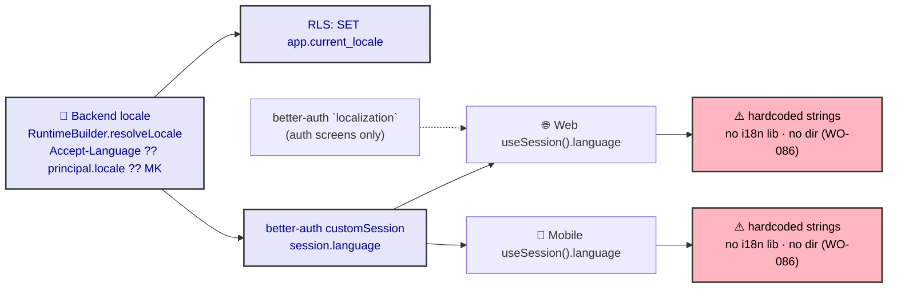

# ADR-0040: i18n & RTL (Web & Mobile)

| Key            | Value                                                                 |
| -------------- | -------------------------------------------------------------------- |
| **Status**     | Accepted                                                            |
| **Date**       | 2026-07-09                                                          |
| **Author**     | Architecture Review                                                 |
| **Supersedes** | None                                                                |
| **Superseded** | None                                                                |

---

## Context

*adjusts shirt* The backend already *speaks* the user's language. Look at the actual machinery:

- `packages/execution/src/runtime.builder.ts`: `resolveLocale(request, principal)` →
  `fromAcceptLanguage(request) ?? principal.getClaim<string>("locale") ?? "MK"`. Locale resolves
  from the `Accept-Language` header **or** the principal's `locale` claim, defaulting to **"MK"**
  (Macedonian).
- `packages/execution/src/rls/rls.stage.ts:55`: `SET LOCAL app.current_locale = runtime.locale` —
  locale is pushed into the DB session (RLS / pgPolicy can read it).
- better-auth `customSession` enriches the session with `language` (per AGENTS.md); the Execution
  Pipeline (ADR-0003) carries `locale` as a runtime context value via `RuntimeBuilder`.

So locale is a **first-class, multi-locale-capable** runtime value. *And the frontend?* **Silence.**
The only i18n in the client is better-auth's own `localization` object — used in `sign-in.tsx` /
`sign-up.tsx` / `forgot-password.tsx` / `reset-password.tsx` for **auth-screen strings only**.
Everything else — `AdminShell`, nav (`nav-config.ts`), domain screens, forms (ADR-0038), errors,
toasts — is **hardcoded, monolingual**. There is **no** `next-intl` / `react-i18next` /
`expo-localization` dependency, and **no `dir` / RTL handling** anywhere in source (the only `direction`
hits are Tailwind's compiled `flex-direction` in build CSS).

The contradiction is exact: the server tracks the user's `language` end-to-end — even into the DB
session — and the client **represses** it. The ADR-0003 pipeline carries `locale`; the UI ignores it.

---

## Decision



*Fig. 1 — Locale is computed and carried server-side, but the client ignores it (red). Auth `localization`
is partial (dashed).*

### 1. One i18n layer per surface, consuming `session.language`

Web: a catalog lib (e.g. `next-intl` / paraglide). Mobile: `expo-localization` / `i18next`. Both read
the active locale from `useSession().language` (better-auth `customSession`), default **"MK"**. The backend
already supplies the value — the frontend must **consume** it.

### 2. Centralize all user-facing strings

No hardcoded UI text in components. Auth screens keep better-auth `localization`. App content — nav
titles/icons labels, `AdminShell`, domain screens, form labels (ADR-0038), error messages, `sonner`
toasts, `Empty`/`Alert` copy (ADR-0041) — moves to a per-surface message catalog. Enum display labels
( today `enumToOptions` does a `titleCase` heuristic in `apps/web/lib/options.ts`) belong in the
catalog, not a hardcoded transform.

### 3. `dir` derived from locale (RTL-ready, not required today)

Set `<html dir>` (web) / RN `I18nManager.forceRTL` or `dir` style (mobile) from the locale. The current
locales (MK, and any EN/AL) are **LTR** — so RTL is **readiness**, not an immediate requirement. But the
contract must be direction-agnostic so adding an RTL locale later is mechanical. (Reinforces ADR-0037:
theming uses logical properties, no LTR-only assumptions.)

### 4. Locale → backend round-trip

The web proxy gateway (ADR-0035) must forward `Accept-Language` (or the UI-selected locale) so
`RuntimeBuilder.resolveLocale` and RLS `app.current_locale` stay consistent with what the UI shows. The
server already honors the header — the client must send it.

### 5. Permission strings stay single-sourced

RBAC permission codes (`animal:read`…) are NOT translated; only their **display** labels are catalog-driven.
The permission *keys* remain the contract (ADR-0022 / nav-config `permission`).

---

## Consequences

### Positive

- **Backend/frontend locale finally agree.** The repressed `language` claim becomes visible in the UI.
- **Adding a locale is mechanical** — catalog + `dir` switch, no LTR-baked markup to rewire.
- Enum / error / empty-state copy centralized (ADR-0041 benefits directly).

### Negative / Cost

- A real build-time/dependency addition on both surfaces (i18n lib + catalogs). Non-trivial but bounded.
- `enumToOptions` `titleCase` heuristic must be replaced by catalog labels (minor churn in `nav-config`/`options.ts`).

### Neutral / Real

- The **contract** (consume `session.language`, set `dir`) is clear; the **implementation** is absent.
  That is the precise gap (WO-086).
- RTL is *readiness* — do not over-state it as a current defect. MK/EN/AL are LTR.

---

## Implementation

- **Owning bots:** Frontend Bot (web i18n + catalogs), Mobile Bot (mobile i18n + `I18nManager`),
  Auth Bot (`customSession` `language` is the source), UI Bot (`@rocky/ui` string slots).
- **Steps:** (1) **WO-086** — add per-surface i18n consuming `session.language` (MK default); (2) migrate
  hardcoded strings to catalogs (start with `AdminShell` + nav + auth-adjacent); (3) set `dir` from
  locale; (4) web proxy forwards `Accept-Language` (ADR-0035); (5) replace `enumToOptions` titleCase
  with catalog labels.
- **No change required on the backend** — it already carries locale.

---

## Verification (Definition of Done)

```bash
# backend carries locale (already true)
rg -n "resolveLocale|current_locale|getClaim\(.locale.\)" packages/execution/src
# frontend: NO i18n today — expect 0 (pre-WO-086)
rg -n "next-intl|react-i18next|expo-localization|useTranslation|formatMessage" apps/web apps/mob \
  | grep -v node_modules || echo "no app i18n yet (WO-086)"
# no dir handling in source
rg -n "dir=|forceRTL|setDirection" apps/web/app apps/mob/app | grep -v node_modules || echo "no dir yet (WO-086)"
# tracked
rg -n "WO-086" apps/docs/content/workorder.md
```

---

## Anti-Patterns (do not repeat)

1. **Hardcoding user-facing strings** in components — centralize in catalogs.
2. **Ignoring `session.language`** — the backend computed it for a reason.
3. **Baking LTR assumptions into markup/theming** — keep direction-agnostic (ADR-0037).
4. **Translating permission *codes*** — only their display labels; keys stay the contract (ADR-0022).
5. **Relying on `enumToOptions` `titleCase`** as "i18n" — it is an EN/MK heuristic, not a catalog.

---

## Related ADRs

- **ADR-0003** (execution pipeline — carries `locale` via `RuntimeBuilder`).
- **ADR-0021** (better-auth config) · **ADR-0022** (policy engine — permission *keys* stay untranslated).
- **ADR-0035** (rendering — web proxy must forward `Accept-Language`).
- **ADR-0037** (theming — direction-agnostic tokens/logical properties).
- **ADR-0038** (forms — labels move to catalog) · **ADR-0041** (error/empty/loading UX — copy to catalog).
- **Auth Bot** — `customSession` `language` is the locale source of truth.
- **WO-086** (add i18n layer: consume `session.language`, centralize strings, set `dir`).
