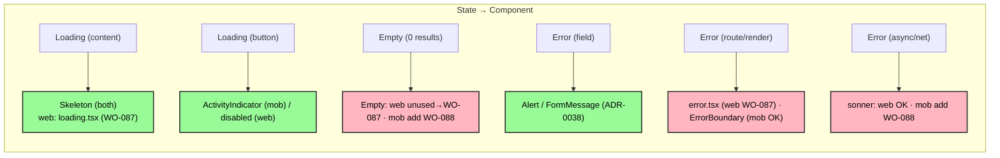

# ADR-0041: Error / Empty / Loading UX (Web & Mobile)

| Key            | Value                                                                 |
| -------------- | -------------------------------------------------------------------- |
| **Status**     | Accepted                                                            |
| **Date**       | 2026-07-09                                                          |
| **Author**     | Architecture Review                                                 |
| **Supersedes** | None                                                                |
| **Superseded** | None                                                                |

---

## Context

*adjusts shirt* The primitives exist; the *discipline* does not. Look at what is actually there:

- **Web (`@rocky/ui`):** `alert.tsx`, `empty.tsx`, `skeleton.tsx`, `sonner.tsx`. `<Toaster />`
  is mounted in `apps/web/app/layout.tsx`. But a usage survey of `apps/web/app` shows **`Empty`
  and `Skeleton` are never rendered** — only `Alert`/`FormMessage` (ADR-0038) and the Toaster
  are wired. And **no `error.tsx` / `loading.tsx` / `not-found.tsx`** route boundary was found in
  the surveyed `app` tree (depth ≤ 2). So: loading and empty states are **ad-hoc**; render/route
  errors have no boundary.
- **Mobile (`apps/mob/components/ui`):** `alert.tsx` + `skeleton.tsx` exist (no `empty`, no
  `sonner`). Usage: `Skeleton` for detail-screen content loading (`animals/[id]`, `passport/[id]`,
  `inspections/[id]`, `corrections/[id]`); `Alert` for inline/validation errors; root `ErrorBoundary`
  (imported in `apps/mob/app/_layout.tsx`); `ActivityIndicator` for button/submit in-flight. A
  **good baseline** — but zero-result lists are inline text, and async/network errors have **no toast**.

So the *components* are present (richer on web); the *contract* — when to use which — is unwritten,
and two gaps are real: web under-uses its primitives + lacks route boundaries; mobile lacks `Empty` + toast.

---

## Decision



*Fig. 1 — State→component matrix. Red = a grounded gap (WO-087 / WO-088).*

### 1. Loading (content) → `Skeleton`

Both surfaces use `Skeleton` for content placeholders (list/detail awaiting data). Web: add
`loading.tsx` (route-level) rendering `Skeleton`; mobile already does this for detail screens —
extend to lists.

### 2. Loading (button/submit) → `ActivityIndicator` / disabled

Mobile: `ActivityIndicator` inside the button (`isPending`/`isSubmitting`). Web: disable the `Button`
and show a spinner. Both already practiced (ADR-0038 submit states) — codify.

### 3. Empty (zero results) → `Empty`

**No inline "No data" text.** Web: USE the existing `Empty` component (today it is imported-but-unused).
Mobile: **add** the RN Reusables `Empty` component, then use it. Every zero-result list/query
renders `Empty` (with an action, e.g. "Add" / "Sync").

### 4. Error (field/inline) → `Alert` / `FormMessage`

Already the ADR-0038 contract: web `FormMessage` + destructive `Alert` on submit; mobile `Alert`
(`error` prop). Codify; no silent field failures.

### 5. Error (route/render) → boundary

Web: **add** `error.tsx` (route ErrorBoundary → destructive `Alert` + retry) and `not-found.tsx`
(404). Mobile: root `ErrorBoundary` exists — keep it, ensure it renders `Alert` (not a bare stack).

### 6. Error (async / network) → `sonner` toast

Non-blocking errors (mutation failure, sync conflict per ADR-0036, network) surface as a `sonner` toast.
Web: Toaster already mounted — use it. Mobile: **add** `sonner` and surface async errors (do not
swallow — recall `session-provider.tsx` swallowing API-unreachable; that silence is the symptom).

### 7. Offline / empty distinction (ADR-0036)

Offline is **not** "loading." A list that is offline-with-no-cache shows `Empty` + an offline badge,
**not** a perpetual `Skeleton`. Distinguish `isPending` (skeleton) from `isOffline` (empty + badge).

---

## Consequences

### Positive

- **One UX vocabulary** (Skeleton / Empty / Alert / Toast / Boundary) across both surfaces.
- Mobile baseline already strong (`Skeleton` + `Alert` + `ErrorBoundary` + `ActivityIndicator`).
- Web primitives (`Empty`/`Skeleton`) finally get used.

### Negative / Cost

- Web must **add** three route files (`error.tsx` / `loading.tsx` / `not-found.tsx`) and retrofit
  inline "no data" text → `Empty` (WO-087).
- Mobile must **add** `Empty` + `sonner`, and stop swallowing async errors (WO-088).

### Neutral / Real

- The *components* were never the problem — the *discipline* was. Both gaps are implementable,
  not architectural. That is the precise Real (WO-087 / WO-088).
- `session-provider.tsx` swallowing API-unreachable is the anti-pattern to kill (§6).

---

## Implementation

- **Owning bots:** UI Bot (`@rocky/ui` `Empty`/`Skeleton`/`Alert`/`sonner`), Frontend Bot
  (web boundaries + `Empty` adoption), Mobile Bot (mobile `Empty` + `sonner`).
- **Steps:** (1) **WO-087** — web `error.tsx`/`not-found.tsx`/`loading.tsx` + use `Empty`/`Skeleton`;
  (2) **WO-088** — mobile `Empty` + `sonner`, surface async errors; (3) codify the §1–§7 matrix;
  (4) distinguish offline vs loading (ADR-0036).
- **No new primitives required** — they exist; this ADR enforces their use.

---

## Verification (Definition of Done)

```bash
# web: primitives exist but unused today
rg -n "Empty|Skeleton" packages/ui/src/components
rg -n "<Empty" apps/web/app || echo "Empty unused in web app (WO-087)"
# web: route boundaries MISSING (WO-087 target) — expect 0 today
rg -n "error.tsx|loading.tsx|not-found.tsx" apps/web/app || echo "no route boundaries (WO-087)"
# mobile: Empty + sonner MISSING (WO-088 target) — expect 0 today
rg -n "empty.tsx|sonner" apps/mob/components/ui || echo "no Empty/sonner in mob (WO-088)"
# mobile ErrorBoundary present
rg -n "ErrorBoundary" apps/mob/app/_layout.tsx
# async errors must NOT be swallowed (ADR-0036)
rg -n "catch|swallow" apps/mob/providers/session-provider.tsx
# tracked
rg -n "WO-087|WO-088" apps/docs/content/workorder.md
```

---

## Anti-Patterns (do not repeat)

1. **Inline "No data" text** — use `Empty`.
2. **Perpetual `Skeleton` when offline** — distinguish offline (Empty + badge) from loading (ADR-0036).
3. **Swallowing async errors** (e.g. `session-provider` eating API-unreachable) — surface via toast.
4. **Bare error stacks / unstyled crashes** — route `error.tsx` / `ErrorBoundary` → `Alert`.
5. **Button spinners as the only loading signal** — content loading uses `Skeleton`, not a stuck spinner.

---

## Related ADRs

- **ADR-0036** (offline-first sync — offline vs empty distinction, sync-conflict toasts).
- **ADR-0037** (theming — `Empty`/`Skeleton`/`Alert` styled by tokens).
- **ADR-0038** (forms — `Alert`/`FormMessage` error contract).
- **ADR-0039** (nav — `not-found` / deep-link to missing record → Empty/Alert).
- **ADR-0040** (i18n — `Empty`/`Alert`/toast copy moves to catalog).
- **UI Bot** (`@rocky/ui`) — owns `Empty`/`Skeleton`/`Alert`/`sonner`.
- **WO-087** (web boundaries + use Empty/Skeleton) · **WO-088** (mobile Empty + sonner).
