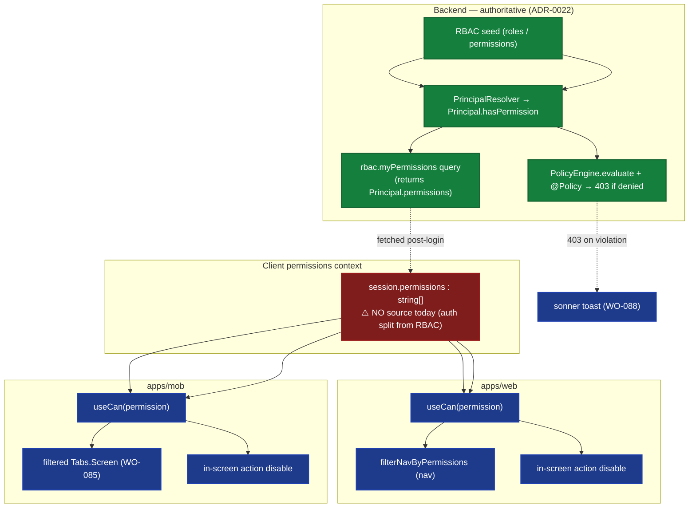

# ADR-0042 — Permission-Aware UI (Web + Mobile)

> Client-surface ADR (standard: ADR-0033). The corrective design that completes ADR-0039's
> "permission-gated navigation" standard and realizes ADR-0017's "users see only permitted rooms".
> _sniffs_ — the client was permission-blind by design; this ADR makes the permitted rooms _visible_.

## 1. Context

The **backend is correctly permission-aware** (ADR-0021 / ADR-0022):

- `PrincipalResolver` builds a `Principal` from the auth result + RBAC seed; `Principal.hasPermission(permission)`
  (server-only, `packages/authorization/src/principal/principal.ts:92` — `return this.permissions.includes(permission)`)
  answers "can this actor do X".
- `PolicyEngine.evaluate({ action, authenticated, roles, admin })` plus the `@Policy({ action, resource, permission })`
  - `@RegisterPolicy("alias")` decorators make the **server the sole enforcement point**: a router mutation
  throws `403` before it runs if the principal lacks the required permission. This is authoritative and correct.

The **client, however, is permission-blind** — verified while writing ADR-0039:

- `packages/auth/src/better-auth.ts` has **no `customSession` plugin at all** — its `Auth.getInstance()` builds
  `betterAuth({ plugins: [admin(...), expo()] })`, and its header explicitly states it "does NOT import SM users,
  RBAC, organizations, or any domain entities." Authorization was _deliberately_ moved to `PrincipalResolver`.
  So there is **no client permission source** — by architecture, not by accident.
- `apps/web/better-auth.d.ts` _declares_ `permissions?: string[]` (and `roles`, `orgId`, `language`, `status`) on
  the session `user` — as if a `customSession` enriched it — but **nothing populates it**. That is the drift:
  the type promises permissions the runtime never delivers.
- `apps/web/lib/nav-config.ts` has `NavItem.permission` + `filterNavByPermissions(navSections, permissions)`,
  called by `AdminShell` (sidebar) **and** `command-palette.tsx` — but it **fail-opens** (returns the full nav)
  because `permissions` is always empty. The filter is **dead code** at runtime (ADR-0039).
- `apps/mob/app/(tabs)/_layout.tsx` renders **all 10 `Tabs.Screen` unconditionally** — no permission check at all.
- There is **no `useCan` / `useHasRole` / `usePermissions`** client hook on either surface. In-screen mutating
  actions are gated only on `isPending` / `isSubmitting` / pagination, never on permission.
- The server's `403` reaches the client as a `TRPCError`; today it is either swallowed (mobile
  `session-provider.tsx` eats API-unreachable — ADR-0041) or shown as a raw error — never a graceful
  `sonner` toast.

### The contradiction (Žižek)

ADR-0017 promised "users see only permitted rooms" — an **Imaginary** of visible RBAC. The **Symbolic**
(server `PolicyEngine`) enforces it, but invisibly: the user attempts an action, is denied _after the fact_
by a `403`, with no prior signal. The **Real** is that the client cannot even _show_ which rooms are permitted,
because no permission source reaches it. The web filter's fail-open is the symptom — it _looks_ like
permission-gating while doing nothing. ADR-0042 proposes to make the Visible equal to the Enforced.

## 2. Decision

**Deliver permissions to the client _without_ re-coupling auth ↔ RBAC; keep the server authoritative.**

1. **Server delivers permissions via a `rbac.myPermissions` query** (WO-089): the existing `rbac` router gains a
   query that calls `PrincipalResolver.resolve(session)` server-side and returns `principal.permissions`. This
   respects the deliberate split — auth stays identity-only; RBAC is delivered through a domain query, reusing the
   _same_ resolver the `PolicyEngine` uses (single source of truth). It does **not** add `customSession` to
   `packages/auth/src/better-auth.ts` (that would re-couple auth with RBAC, violating the documented boundary).
2. **A pure client permission helper** in `@rocky/authorization`: `clientCan(permissions, required)` — a
   synchronous mirror of `Principal.hasPermission` (no DB, no cache). It is the client-side `Principal`, minus the
   server-only bits.
3. **Thin hooks `useCan(permission)` / `useHasRole(role)`** on both surfaces, reading a `PermissionsProvider`
   context populated by the `myPermissions` query.
4. **Gate every in-screen mutating action** by `useCan` — disabled/greyed when lacking (per ADR-0041's
   disabled-state UX), with an `Alert`/tooltip explaining why.
5. **Nav + tab filtering**: web `filterNavByPermissions` receives real permissions (no fail-open); mobile
   `(tabs)/_layout.tsx` filters `Tabs.Screen` by `useCan` (completes WO-085).
6. **Server stays authoritative**: client gating is UX-only. A `@Policy` `403` still fires on violation; it
   now surfaces as a `sonner` toast (WO-088) rather than a swallowed error.



_Fig. 1 — Permissions flow from RBAC seed → `PrincipalResolver` → `rbac.myPermissions` query → client
`PermissionsProvider` → `useCan` → nav/tab filtering + action gating. Red node is the present gap (WO-089).
The `403` loop (server → toast) stays; the client only makes the permitted rooms visible._

### Rejected alternatives

- **A — add a `customSession` plugin to `packages/auth/src/better-auth.ts` that enriches the session with
  `permissions`.** Rejected as the _primary_ path: it re-couples auth (identity) with RBAC (authorization),
  directly contradicting that file's stated boundary ("does NOT import ... RBAC"). It would also make the
  `apps/web/better-auth.d.ts` declaration true — but at the cost of the architecture's deliberate split. Kept
  only as a fallback if the query approach proves problematic.
- **B — keep the client blind, rely on 403 + toast only.** Rejected: a user who sees every button then gets
  denied _after clicking_ is worse UX than honest hiding, and it contradicts ADR-0017. Toast-only is necessary
  (for server-side re-checks) but not sufficient.
- **C — re-implement policy client-side** (role→permission map / separate endpoint that recomputes rules).
  Rejected: the server `PolicyEngine` is the source of truth; duplicating policy on the client risks drift. We
  only ever mirror the _result_ (`permissions[]`), never the rules.

## 3. The client `Principal` mirror (`useCan`)

`packages/authorization` exports a pure, synchronous helper (no `PrincipalResolver`, no caching — those are
server-only):

```ts
// packages/authorization/src/principal/client-can.ts
export function clientCan(permissions: string[] | undefined, required: string | string[]): boolean {
  const have = new Set(permissions ?? []);
  const need = Array.isArray(required) ? required : [required];
  return need.some((p) => have.has(p));
}
```

Both surfaces wrap it in a hook over the `PermissionsProvider` context:

```ts
// apps/web/lib/permissions.tsx  (apps/mob/providers/permissions-provider.tsx mirrors this)
const { data } = trpc.rbac.myPermissions.useQuery();   // proxy gateway (ADR-0035) / mobile client
const PermissionsCtx = createContext<string[]>([]);
export function PermissionsProvider({ children }: { children: React.ReactNode }) {
  return <PermissionsCtx.Provider value={data ?? []}>{children}</PermissionsCtx.Provider>;
}
export const usePermissions = () => useContext(PermissionsCtx);
export const useCan = (permission: string) => clientCan(usePermissions(), permission);
```

This is the _only_ place the client reasons about permissions — it never re-implements policy.

## 4. In-screen action gating (both surfaces)

Mutating actions are disabled when `useCan` is false (ADR-0041 disabled-state UX):

```tsx
const canDelete = useCan("farm:delete");
<Button disabled={!canDelete} aria-disabled={!canDelete} onClick={onDelete}>
  Delete farm
</Button>
{/* tooltip / Alert explains: "Requires farm:delete" */}
```

No action that the server would `403` should be _clickable_ by a user who lacks it.

## 5. Nav + tab filtering

- **Web:** `filterNavByPermissions(navSections, permissions)` now receives real `permissions` (from
  `usePermissions()`) and filters (fail-CLOSED-safe: admin rooms a user lacks are hidden, not shown). `AdminShell`
  - command palette already call it — they just start working (ADR-0039).
- **Mobile:** `(tabs)/_layout.tsx` computes `useCan` per tab and conditionally renders `Tabs.Screen` entries
  (unauthorized tabs are not rendered) — completing **WO-085**.

## 6. Server stays authoritative — the `403` → `sonner` loop

Client gating is cosmetic. The `@Policy` decorator still throws `403` on the server. That `403` must reach the
user as a `sonner` toast (WO-088), not a swallowed promise rejection (`session-provider.tsx` eating
API-unreachable is the anti-pattern to retire). So the Real (server denial) surfaces gracefully, while the
Imaginary (visible permitted rooms) is finally honest.

## 7. Consequences

|                          | Web                    | Mobile                 | Server              |
|--------------------------|------------------------|------------------------|---------------------|
| Session `permissions`    | none → **delivered**   | none → **delivered**   | source of truth     |
| Nav / tab filtering      | dead → **fixed**       | none → **filtered** (WO-085) | unchanged     |
| In-screen action gating  | none → **useCan**      | none → **useCan**      | unchanged (403)     |
| 403 UX                   | raw → **sonner toast** (WO-088) | swallowed → **sonner toast** (WO-088) | unchanged |

### Positive

- ADR-0017's "permitted rooms" becomes runtime-true on both surfaces.
- Web nav filter stops being dead code; mobile stops showing unusable rooms.
- Respects the deliberate auth/RBAC split — no re-coupling; the server `PolicyEngine` remains the single source.

### Negative

- One extra query (`myPermissions`) per session start (cheap; can be cached in the provider and refreshed on
  role change).
- The client helper must stay in sync with "what the server enforces" — mitigated by sourcing both from the
  same `PrincipalResolver` and treating the server `403` as the backstop.

### Neutral / Real

- This is the missing half of ADR-0039's "permission-gated navigation = the standard": ADR-0039 documented the
  _intent_; ADR-0042 supplies the _mechanism_ (WO-089). Until WO-089 lands, ADR-0039's web "compliant" claim is
  void — which is exactly why ADR-0039 was corrected to call the filter dead.

## 8. Implementation Notes

- **Server (WO-089):** add `myPermissions` query to the existing `rbac` router; inject `PrincipalResolver`
  (AuthorizationModule) and return `principal.permissions`. Do **not** add `customSession` to
  `packages/auth/src/better-auth.ts`.
- **Shared:** `packages/authorization` `clientCan()`; ship it so web + mobile share one mirror.
- **Web:** `apps/web/lib/permissions.tsx` (`PermissionsProvider` + `useCan`); gate actions; `nav-config.ts`
  fail-closed; wrap `(admin)` tree in `PermissionsProvider`.
- **Mobile:** `apps/mob/providers/permissions-provider.tsx`; `(tabs)/_layout.tsx` filters tabs (WO-085); gate
  actions; wrap app in `PermissionsProvider`.
- **Both:** `sonner` toast on `403` (WO-088); stop swallowing API errors in `session-provider.tsx`.

## 9. Verification

```bash
# Server delivers permissions via a domain query (NOT customSession):
rg -n "myPermissions" apps/api/src/routers/rbac.router.ts
# Client mirror + hooks exist on both surfaces:
rg -n "clientCan|useCan" packages/authorization apps/web/lib apps/mob
# Mobile tabs are now permission-filtered (WO-085):
rg -n "Tabs.Screen" "apps/mob/app/(tabs)/_layout.tsx"
# 403 surfaces as a toast, not a swallowed rejection:
rg -n "sonner|toast" apps/web apps/mob
```

## 10. References

- ADR-0017 (frontend architecture — "users see only permitted rooms").
- ADR-0021 (Better Auth configuration) / ADR-0022 (Authorization Policy Engine — server enforcement).
- ADR-0039 (Navigation & Routing — the fail-open filter + unfiltered tabs this ADR fixes).
- ADR-0041 (Error/Empty/Loading UX — disabled-state + sonner toast on 403).
- ADR-0033 (client ADR standard).
- `packages/auth/src/better-auth.ts` (identity-only by design; no `customSession`).
- `apps/web/better-auth.d.ts` (declares `permissions` that nothing populates — the drift to fix).
- **WO-085** (filter mobile tabs — completed here), **WO-088** (sonner toast on 403), **WO-089** (deliver
  `session.permissions` via `rbac.myPermissions`; the keystone).
