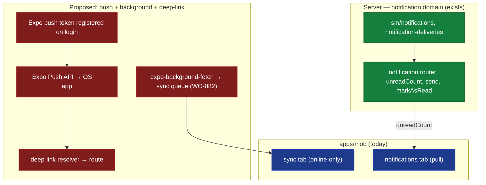

# ADR-0043 — Push Notifications, Background Sync & Deep-link (Mobile)

> Client-surface ADR (standard: ADR-0033). The mobile real-time/background story: how Rocky
> *addresses* the field worker (push), how it *keeps data fresh offline* (background sync), and how an
> external address *resolves* to a screen (deep-link). *sniffs* — today the worker is addressed only when
> they remember to open the tab; the Big Other (server) whispers, but the subject is not listening.

## 1. Context (verified)

- **Server notifications exist.** `apps/api/src/routers/notification.router.ts` exposes `unreadCount`
  (query), `send`, and `markAsRead` (mutations). The DB has `sm/notifications`, `sm/notification-deliveries`,
  `sm/notification-preferences`, `sm/notification-templates`, plus `an/birth-notifications`. A
  `notification` domain package exists. So the *in-app* notification system is real.
- **Mobile has the tabs.** `apps/mob/app/(tabs)/` contains `notifications/` and `sync/` — the UI shells exist.
- **But there is no push.** `apps/mob/package.json` depends only on `expo-linking` — **no `expo-notifications`**,
  no `expo-background-fetch`, no `expo-task-manager`. Notifications are therefore **pull-based**: the worker
  must open the `notifications` tab and call `unreadCount`/list to learn anything. The server can `send`, but
  nothing delivers it to the device.
- **No background execution.** Sync (ADR-0036) is specified but the *transport* is online-only (WO-081/WO-082
  pending); there is no task that runs the sync queue when the app is backgrounded or the network returns.
- **Deep-link scheme is configured but inert for routing.** `apps/mob/app.json` sets `"scheme": "rocky"` and
  `apps/mob/lib/auth.ts` reads that scheme for the better-auth **Expo OAuth callback** — but there is **no
  resolver** that maps an incoming `rocky://…` URL (from a push payload, a QR code, or an external link) to an
  in-app route. Expo Router *does* resolve file-route URLs by default, yet nothing handles notification payloads
  or guarantees the deep-linked route is available **offline** (per the ADR-0036 cache).

### The contradiction (Žižek)

The server *wants* to address the field worker in real time (the notification domain proves it). The **Symbolic**
(in-app notification record) exists; the **Imaginary** is "the worker gets alerted in the field"; the **Real** is
that delivery stops at the database — the worker only learns of it on their next pull. Push is the missing
mediation. Background sync is the suture between online and offline; deep-link is the mapping of the Symbolic
address (URL) onto the Real of the screen.

## 2. Decision

1. **Push notifications** — register an Expo push token on login (store against the user/device), have the server
   emit an Expo push when a notification row is created, and on receipt route the payload through a
   **deep-link resolver** to the relevant screen.
2. **Background sync** — register an `expo-background-fetch` (or `expo-task-manager`) task that drains the sync
   queue (WO-082) on a schedule and on network regain; the `sync` tab becomes the *manual* trigger, not the only one.
3. **Deep-link resolver** — a single handler (Expo Router `linking` config + an intent handler) that maps incoming
   URLs/push `data` to routes, with **offline-parity** (the target route is resolvable from cache per ADR-0036).



*Fig. 1 — Today: server notification is pull-only; sync is online-only. Proposed: push token → Expo → deep-link
resolver → route; background-fetch drains the sync queue. Red nodes are the present gaps (WO-091/092/093).*

## 3. Push notification design

- **Token registration:** on successful auth, `auth.useSession()` provides the user; register the Expo push token
  (`expo-notifications` `getExpoPushTokenAsync`) and persist it (new `device_tokens` row or on
  `notification-preferences`). Re-register on token refresh.
- **Server emission:** when `notification.router.send` (or domain logic) creates a notification, also enqueue an
  Expo push via the Expo Push API (a small server client; respect `notification-preferences` opt-outs).
- **Receipt → route:** the push `data` payload carries a route key (e.g., `{ route: "animals/123" }`); the app's
  notification listener calls the **deep-link resolver** (§5) to navigate.

## 4. Background sync design

- Add `expo-background-fetch` (+ `expo-task-manager` if finer control is needed). Register a task that, when
  triggered (OS schedule / network regain), runs the **sync queue** built in WO-082 (`syncDownload` +
  `syncUpload` against the promoted `sync` router, WO-081).
- The existing `sync` tab stays as the manual, user-visible trigger and progress view; background fetch is the
  silent counterpart. Respect battery/data by only syncing when on Wi-Fi or when the queue is non-empty.

## 5. Deep-link design

- Configure Expo Router `linking` in `apps/mob/app/_layout.tsx` (or `app.json`) with the `rocky` scheme and a
  path→route map; add an intent/`notification` listener that translates incoming `data` to the same map.
- **Offline-parity:** the resolver must only navigate to routes whose data is present in the ADR-0036 cache; if the
  deep-linked entity is not cached, show the `Skeleton`/`Empty` UX (ADR-0041) and queue a background fetch
  (§4) rather than a hard failure.

## 6. Consequences

|                     | Today                        | Proposed                              | Server        |
|---------------------|------------------------------|---------------------------------------|---------------|
| Delivery            | pull (open tab)              | **push** (Expo) + pull                | send exists   |
| Sync trigger        | manual (sync tab)            | **manual + background-fetch**         | unchanged     |
| External URL → route| auth callback only           | **deep-link resolver** (offline-aware)| unchanged     |

### Positive

- The worker is *addressed* in the field (real-time alerts), not only on pull — realizes the notification domain's intent.
- Data stays fresh offline via background sync; deep-links resolve even without connectivity (cache-backed).

### Negative

- New mobile deps (`expo-notifications`, `expo-background-fetch`); a server Expo Push client + device-token storage.
- Background tasks are OS-throttled and platform-asymmetric (iOS stricter than Android) — must degrade gracefully.

### Neutral / Real

- All three are **client-only** additions; the server notification/sync contracts are unchanged (ADR-0036/0015). The
  gaps are precisely the missing mobile halves — encoded as WO-091/092/093.

## 7. Implementation Notes

- **WO-091:** add `expo-notifications`; register token on login (store on `notification-preferences`/device table);
  server emits Expo push on notification creation (respect opt-outs); receipt routes via deep-link resolver.
- **WO-092:** add `expo-background-fetch`; task drains the WO-082 sync queue on schedule + network regain. Depends
  on WO-081 (promote `sync` router) + WO-082 (mobile offline cache + sync queue).
- **WO-093:** Expo Router `linking` config + intent/notification listener (deep-link resolver); offline-parity via
  ADR-0036 cache + ADR-0041 `Skeleton`/`Empty`.
- Keep the `rocky` scheme (already in `app.json`); extend its *use* beyond the auth callback.

## 8. Verification

```bash
# Push deps present + token registration on login:
rg -n "expo-notifications|getExpoPushTokenAsync" apps/mob
# Background fetch task registered:
rg -n "expo-background-fetch|registerTaskAsync" apps/mob
# Deep-link resolver maps URLs/push data to routes:
rg -n "linking|addNotificationReceivedListener|getInitialNotificationResponseAsync" apps/mob
# Server still emits notifications (unchanged contract):
rg -n "unreadCount|markAsRead|send" apps/api/src/routers/notification.router.ts
```

## 9. References

- ADR-0036 (Offline-first Sync Architecture — transport + cache this ADR's background sync depends on).
- ADR-0015 (Mobile PDA Sync — seed for the sync router, WO-081).
- ADR-0035 (Rendering & Data-Fetching — mobile is online-only today; this ADR extends to background).
- ADR-0041 (Error/Empty/Loading UX — `Skeleton`/`Empty` for offline deep-links).
- ADR-0033 (client ADR standard).
- `apps/api/src/routers/notification.router.ts` + `packages/domains/notification` (server notification domain).
- **WO-081** (promote `sync` router), **WO-082** (mobile offline cache + sync queue) — prerequisites.
- **WO-091** (push), **WO-092** (background sync), **WO-093** (deep-link resolver) — this ADR's keystones.
