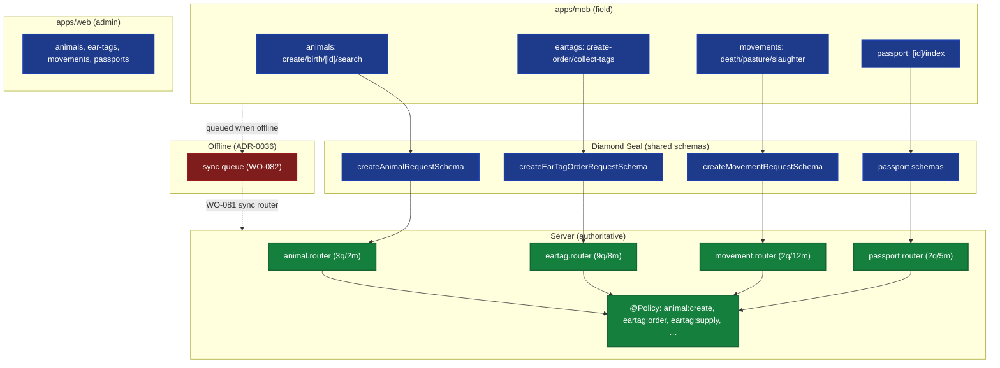

# ADR-0044 — Livestock Domain Feature (Web + Mobile)

> Client-surface domain ADR (standard: ADR-0033; first of the 0044+ set). The **anchor domain**: livestock
> is the core daily field workflow — animal registration (incl. birth), ear-tag ordering/collection, movements
> (death/pasture/slaughter), and passport. Both surfaces, grounded in backend ADRs 0024 / 0025 / 0029 and the
> client trunk 0034–0043. _sniffs_ — the worker registers a calf in a field with no signal; the Symbolic order
> (server mutation) must still arrive, via the offline queue, or the Real of the farm book diverges.

## 1. Context (verified)

**Mobile livestock tabs** (`apps/mob/app/(tabs)/`):

- `animals/` — `create.tsx`, `birth.tsx`, `[id].tsx`, `index.tsx`, `search.tsx` (+ `_layout.tsx`): full
  registration CRUD, birth notification, detail, search.
- `eartags/` — `create-order.tsx`, `collect-tags.tsx`, `index.tsx`: the 6-stage order lifecycle (ADR-0024)
  reduced to order + collect on mobile.
- `movements/` — `death.tsx`, `pasture.tsx`, `slaughter.tsx`, `index.tsx`: death/pasture/slaughter flows
  (matches the movement state machine, ADR-0025).
- `passport/` — `[id].tsx`, `index.tsx`: passport view/lookup.

**Web admin** (`apps/web/app/(admin)/`): `animals/`, `ear-tags/`, `movements/`, `passports/` (plus `farms/`)
— the same operations in the back-office shell.

**Routers** (ADR-0034 inventory): `animal.router` (3q/2m), `eartag.router` (9q/8m), `movement.router` (2q/12m),
`passport.router` (2q/5m). All guarded by `@Policy` (ADR-0022).

**Permissions (verified literals in code):** `animal:create`, `eartag:order`, `eartag:supply`. Movement and
passport operations are `@Policy`-guarded against RBAC-seed permissions; the exact literal strings should be
confirmed when wiring `useCan` (WO-089).

**Forms:** mobile `animals/create.tsx` already derives `createAnimalFormSchema` from
`createAnimalRequestSchema.shape` + `zodResolver` (ADR-0038) — the Diamond Seal contract holds.

**Two cross-cutting gaps (from the trunk):**

- **Offline:** field registration happens with no connectivity; mutations must queue and sync (ADR-0036;
  WO-081/WO-082). Today mobile is online-only (ADR-0035), so livestock mutations in the field are **not yet
  possible offline**.
- **Permission-gating:** tabs/actions render unconditionally today (ADR-0039/0042); the server `@Policy` enforces,
  but the client is blind (WO-089).

## 2. Decision (the livestock feature standard)

1. **One operation, two surfaces, one schema.** Web and mobile implement the same livestock operations from the
   same Diamond Seal `*RequestSchema` (no drift — ADR-0038). Mobile is the field entry point; web is the
   back-office view/correction point.
2. **Forms bind `zodResolver(createXxxRequestSchema)`** — verified working on `animals/create`; extend to
   `eartags`, `movements`, `passport`.
3. **Permission-gate every livestock action/tab by `useCan`** (ADR-0042): `animal:create` → `animals/create`;
   `eartag:order`/`eartag:supply` → `eartags/create-order`/`collect-tags`; movement/passport perms → the
   corresponding `movements`/`passport` screens and mutating buttons. Server `@Policy` stays authoritative.
4. **Offline-first for field mutations** (ADR-0036): `animals`, `eartags`, `movements` creations/edits queue and
   sync via the promoted `sync` router (WO-081) + mobile cache (WO-082); conflict resolution per ADR-0015/0036.
   `passport` view is offline-readable; issuance stays server-side.
5. **Server `@Policy` is the backstop** — client gating is UX-only; a `403` surfaces as a `sonner` toast (WO-088).



_Fig. 1 — Livestock operations flow: mobile/web → shared Diamond Seal schema → router (`@Policy`-guarded) →
domain service. Field mutations queue offline (red) and sync via WO-081/WO-082. Client `useCan` gates the
visible rooms (ADR-0042)._

## 3. Per-feature breakdown

| Feature | Mobile screens | Web pages | Router (procs) | Permission(s) | Offline-critical |
|---------|----------------|-----------|----------------|---------------|------------------|
| Animal registration (+ birth) | `animals/create`, `birth`, `[id]`, `search`, `index` | `animals/` | animal (3q/2m) | `animal:create` (verified) | **Yes** (field registration) |
| Ear tags (order + collect) | `eartags/create-order`, `collect-tags`, `index` | `ear-tags/` | eartag (9q/8m) | `eartag:order`, `eartag:supply` (verified) | **Yes** (collect in field) |
| Movements (death/pasture/slaughter) | `movements/death`, `pasture`, `slaughter`, `index` | `movements/` | movement (2q/12m) | movement:* (`@Policy`, RBAC) | **Yes** (death in field, etc.) |
| Passport | `passport/[id]`, `index` | `passports/` | passport (2q/5m) | passport:* (`@Policy`, RBAC) | Partial (view offline; issuance server-side) |

## 4. Permissions matrix (client gating target)

| Screen / action | Required permission | Source |
|-----------------|--------------------|--------|
| `animals/create`, `animals/birth` | `animal:create` | verified literal |
| `eartags/create-order` | `eartag:order` | verified literal |
| `eartags/collect-tags` | `eartag:supply` | verified literal |
| `movements/death` · `pasture` · `slaughter` | movement domain perm (RBAC) | `@Policy` |
| `passport/[id]` (view) | passport domain perm (RBAC) | `@Policy` |

These are the `useCan` keys WO-089 must wire; the server `@Policy` already enforces them (ADR-0022).

## 5. Offline considerations (ADR-0036)

Livestock is _why_ offline-first exists. The field worker creates an animal, collects ear tags, records a death —
all without signal. Until WO-081/WO-082 land, these are **blocked offline**. The ADR-0036 cache must prioritize
livestock entities (animal, ear_tag, movement, passport) so deep-linked records (WO-093) and list views resolve
offline (ADR-0041 `Skeleton`/`Empty`).

## 6. Consequences

|                     | Web                         | Mobile                                  | Server        |
|---------------------|-----------------------------|------------------------------------------|---------------|
| Forms               | Diamond Seal (ADR-0038)     | Diamond Seal (ADR-0038, extends to all)  | unchanged     |
| Permission gating   | `useCan` (WO-089)           | `useCan` tabs + actions (WO-089)         | `@Policy` ✓   |
| Field mutations     | n/a                         | **offline-queued** (WO-081/082)          | sync router   |

### Positive

- One schema, two surfaces — no livestock logic divergence (the ADR-0017/0038 contract realized).
- Field reality (no signal) is handled by the queue, not by a hard failure.

### Negative

- Depends on the trunk WOs (081/082/089) landing before livestock is fully field-capable offline.
- Movement/passport permission literals must be confirmed during WO-089 wiring.

### Neutral / Real

- This ADR is the template for the rest of 0044+ (Health, Inspections/Corrections, Infrastructure,
  Administration): same shape — shared schema, `useCan` gating, offline-queue for field ops, server `@Policy`.

## 7. Implementation Notes

- Reuse trunk WOs: **WO-081** (sync router), **WO-082** (offline cache + queue), **WO-085** (mobile tab filter),
  **WO-086** (i18n), **WO-087** (web UX boundaries), **WO-088** (mobile `Empty`/sonner), **WO-089**
  (`useCan` + permissions).
- **WO-094 (this ADR):** livestock parity + offline/permission sweep — bind every mutating livestock action to
  the offline sync queue (WO-082) and `useCan` (WO-089); confirm mobile↔web parity for animal/ear-tag/movement/
  passport; verify movement/passport permission literals.
- Forms: extend `zodResolver(createXxxRequestSchema)` to `eartags`/`movements`/`passport` (mirror `animals/create`).

## 8. Verification

```bash
# Forms bind Diamond Seal schemas (ADR-0038):
rg -n "createAnimalRequestSchema|createEarTagOrderRequestSchema|createMovementRequestSchema" apps/mob
# Livestock routers are @Policy-guarded:
rg -n "@Policy" apps/api/src/routers/animal.router.ts apps/api/src/routers/eartag.router.ts \
         apps/api/src/routers/movement.router.ts apps/api/src/routers/passport.router.ts
# After WO-089: tabs/actions gated by useCan:
rg -n "useCan" apps/mob/app/\(tabs\)/animals apps/mob/app/\(tabs\)/eartags apps/mob/app/\(tabs\)/movements
```

## 9. References

- ADR-0024 (Ear Tag Domain), ADR-0025 (Animal/Movement Domain), ADR-0029 (Passport/Archive) — backend.
- ADR-0015 (Mobile PDA Sync), ADR-0036 (Offline-first Sync), ADR-0035 (Rendering).
- ADR-0038 (Forms & Validation — Diamond Seal contract), ADR-0042 (Permission-Aware UI), ADR-0041 (Error/Empty/Loading).
- ADR-0022 (Policy Engine — server enforcement), ADR-0033 (client ADR standard).
- **WO-081/082/085/086/087/088/089** (trunk), **WO-094** (this ADR's livestock sweep).
