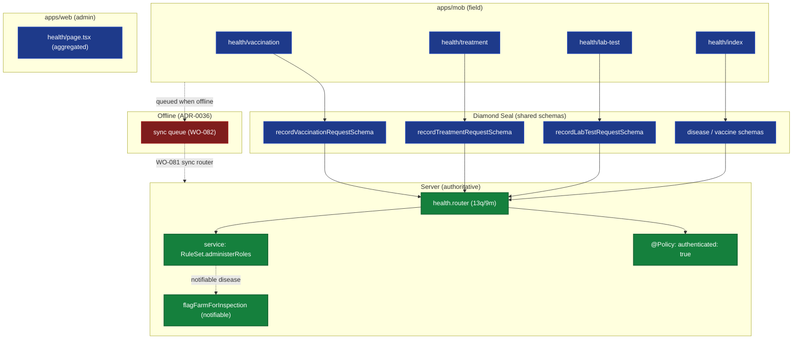

# ADR-0045: Health Domain Feature (Web + Mobile)

| Key | Value |
| --- | --- |
| **Status** | Accepted |
| **Date** | 2026-07-09 |
| **Author** | Rocky Architecture Board |
| **Supersedes** | None |
| **Superseded** | None |

---

> Client-surface domain ADR (standard: ADR-0033; second of 0044+). Health is the **second field-critical
> domain**: vaccination and treatment are recorded in the field (offline), and a notifiable-disease treatment
> has a cross-domain side-effect (it flags the farm for inspection, ADR-0026). _sniffs_ — the vet records a
> vaccination with no signal; the Symbolic act (server mutation + inspection flag) must still arrive, or the
> Real of disease surveillance collapses.

## Context (verified)

**Mobile `health/` tab** (`apps/mob/app/(tabs)/health/`): `index.tsx`, `vaccination.tsx`, `treatment.tsx`,
`lab-test.tsx` (+ `_layout.tsx`). Covers vaccination, treatment, lab-test recording, and a list. **No disease
master-data screen** on mobile (diseases are reference data, admin-only).

**Web `health/`** (`apps/web/app/(admin)/health/`): a **single aggregated `page.tsx`** — all health operations
on one page. (Asymmetry vs mobile's split screens; parity is about _operations_, not 1:1 screens — see §3.)

**`health.router.ts`** (ADR-0034 inventory: 13q/9m), verified procedures:

- Disease: `getDisease`, `listDiseases`, `createDisease`.
- Vaccine: `getVaccine`, `listVaccines`, `createVaccine`; `createVaccineBatch` (inventory).
- Vaccination: `getVaccination`, `listVaccinations`, `recordVaccination`.
- Treatment: `getTreatment`, `listTreatments`, `recordTreatment`.
- LabTest: `getLabTest`, `listLabTests`, `recordLabTest`.
- Vaccine↔disease mapping: `listVaccineDisease`, `linkVaccineDisease`, `unlinkVaccineDisease`.
- **`syncDownload` (query) + `syncUpload` (mutation)** — the offline sync transport (WO-081).

**Authorization model (different from livestock — verified):**

- The router is decorated `@RegisterPolicy("health")` + `@Policy({ authenticated: true })` — i.e. **auth-only,
  no flat `health:*` permission literal** (grep finds none).
- Finer gating (who may vaccinate/administer) is enforced **server-side in the service** via
  `RuleSet.administerRoles` (per jurisdiction; MK seeds `veterinarian`), per ADR-0026 / WO-014. So health uses
  **role + RuleSet**, not a static permission string.
- **Consequence for ADR-0042:** the `useCan(permission)` model (flat `session.permissions`) does **not** map
  directly to health. Client gating needs the user's `role(s)` + the jurisdiction `administerRoles` — a
  _role-based variant_ of `useCan`. Whether `session.roles` is populated is an **open drift question** (the
  `better-auth.d.ts` declares `roles?: string[]`, but, like `permissions`, it may be unpopulated — same class
  as WO-089).

**Cross-domain:** `recordTreatment` for a notifiable disease triggers `InspectionRepository.flagFarmForInspection()`
(server-side, fire-and-forget, ADR-0026). The client should surface this (toast/alert: "Farm flagged for
inspection").

**Offline:** health recording is field-critical; the router already carries `syncDownload`/`syncUpload`, so the
sync transport exists (pending promotion to the top-level `sync` router, WO-081) and must be wired to the mobile
queue (WO-082).

## Decision (the health feature standard)

1. **One operation, two surfaces, one schema** (ADR-0038): mobile split screens and the web aggregated page both
   call the same Diamond Seal `*RequestSchema` (`recordVaccinationRequestSchema`, etc.).
2. **Forms bind `zodResolver(createXxxRequestSchema)`** — mirror `animals/create` (ADR-0038); extend to
   `vaccination`/`treatment`/`lab-test`.
3. **Role + RuleSet gating (not flat-permission gating).** Client computes `canAdminister = clientCanRole(
   session.roles, ruleSet.administerRoles)` (a variant of `clientCan`, ADR-0042). Disable vaccination/treatment
   buttons when the user lacks administer rights for the jurisdiction. **Server `RuleSet.administerRoles`
   stays authoritative** (ADR-0026/WO-014). If `session.roles` is unpopulated (drift), that is a WO-089-class fix.
4. **Offline-first for field recording** (ADR-0036): `recordVaccination`/`recordTreatment`/`recordLabTest` queue
   and sync via the promoted `sync` router (WO-081) + mobile cache (WO-082).
5. **Surface cross-domain side-effects**: on notifiable-disease treatment, show a `sonner` toast that the farm was
   flagged for inspection (ADR-0041/WO-088). Server `@Policy`/`RuleSet` remains the backstop.



_Fig. 1 — Health operations flow: mobile split screens / web aggregated page → shared Diamond Seal schema →
`health.router` (auth-only `@Policy`) → service `RuleSet.administerRoles` gate → domain. Notifiable treatment
flags the farm for inspection. Field recordings queue offline (red)._

## 3. Per-feature breakdown

| Feature | Mobile screens | Web | Router procedures | Gating | Offline-critical |
|---------|----------------|-----|------------------|--------|------------------|
| Disease master data | — (reference) | `health/page.tsx` | `getDisease`,`listDiseases`,`createDisease` | admin | No |
| Vaccine catalog + batch | (vaccine picker in `vaccination`) | `health/page.tsx` | `listVaccines`,`createVaccine`,`createVaccineBatch` | admin | partial (catalog cached) |
| Vaccination | `health/vaccination` | `health/page.tsx` | `recordVaccination` | `RuleSet.administerRoles` | **Yes** |
| Treatment | `health/treatment` | `health/page.tsx` | `recordTreatment` | `RuleSet.administerRoles` | **Yes** |
| Lab test | `health/lab-test` | `health/page.tsx` | `recordLabTest` | `RuleSet.administerRoles` | **Yes** |
| Notifiable → inspection | (side-effect toast) | (side-effect) | `recordTreatment` → `flagFarmForInspection` | — | n/a |

## 4. Authorization matrix (client gating target)

| Action | Required | Source |
|--------|----------|--------|
| Any health read | authenticated | `@Policy({ authenticated: true })` (verified) |
| Vaccinate / treat / lab-test | `RuleSet.administerRoles` (jurisdiction; vet seeds `veterinarian`) | ADR-0026 / WO-014 (service) |
| Create disease / vaccine / batch | admin role | domain convention |

Client gating = `clientCanRole(session.roles, ruleSet.administerRoles)` — **not** `useCan(permission)`. The
server `RuleSet.administerRoles` check is the authoritative backstop. Confirm `session.roles` is populated
(WO-089-class drift check) before relying on client gating.

## 5. Offline considerations (ADR-0036)

Health recording is _why_ offline-first matters for surveillance. `syncDownload`/`syncUpload` already exist under
`health`; promote them to the top-level `sync` router (WO-081) and drain via the mobile queue (WO-082). The
notifiable-disease → inspection flag must survive the offline→sync round-trip (the server re-evaluates on
upload).

## Consequences

|                     | Web                              | Mobile                                       | Server        |
|---------------------|----------------------------------|----------------------------------------------|---------------|
| Forms               | Diamond Seal (ADR-0038)          | Diamond Seal (extends to vaccination/tx/lab)  | unchanged     |
| Gating model        | `clientCanRole` (role+RuleSet)   | `clientCanRole` (role+RuleSet)               | `RuleSet` ✓   |
| Field recording     | n/a                              | **offline-queued** (WO-081/082)              | sync router   |
| Cross-domain        | toast on inspection flag         | toast on inspection flag                     | `flagFarmForInspection` ✓ |

### Positive

- Surveillance integrity: field vaccinations/treatments arrive offline; notifiable diseases still flag inspections.
- Health uses the _same_ client primitives as livestock, just a role+RuleSet variant — no new mechanism.

### Negative

- Gating depends on `session.roles` being populated (open drift question; WO-089-class fix if not).
- Web is one aggregated page vs mobile's split screens — parity must be audited at the _operation_ level.

### Neutral / Real

- Health reveals that ADR-0042's flat-`permission` `useCan` is insufficient alone; a `clientCanRole` variant is
  required for role+RuleSet domains. This refinement should fold back into ADR-0042 / WO-089.

## Implementation

- Reuse trunk WOs: **WO-081** (sync router), **WO-082** (offline cache + queue), **WO-085** (tab filter),
  **WO-086** (i18n — disease/vaccine labels), **WO-087** (web UX boundaries), **WO-088** (mobile `Empty`/sonner),
  **WO-089** (client `roles`/`permissions` delivery + `clientCanRole`).
- **WO-095 (this ADR):** health parity + offline/role-gating sweep — bind `recordVaccination`/`recordTreatment`/
  `recordLabTest` to the sync queue (WO-082); add `clientCanRole` gating (role + `RuleSet.administerRoles`);
  confirm `session.roles` population (drift check); surface the notifiable→inspection toast.
- Fold `clientCanRole` back into `@rocky/authorization` + ADR-0042 (role+RuleSet variant of `useCan`).

## Verification

```bash
# Health router is auth-only (no flat health:* permission literal):
rg -n "@Policy" apps/api/src/routers/health.router.ts
# Service enforces RuleSet.administerRoles:
rg -n "administerRoles|flagFarmForInspection" packages/domains/health/src
# Forms bind Diamond Seal schemas:
rg -n "recordVaccinationRequestSchema|recordTreatmentRequestSchema|recordLabTestRequestSchema" apps/mob
# Sync endpoints exist (promote via WO-081):
rg -n "syncDownload|syncUpload" apps/api/src/routers/health.router.ts
```

## References

- ADR-0026 (Health Domain — disease/vaccine/treatment/lab, `RuleSet.administerRoles`, notifiable→inspection).
- ADR-0015 (Mobile PDA Sync), ADR-0036 (Offline-first), ADR-0035 (Rendering).
- ADR-0038 (Forms & Validation), ADR-0042 (Permission-Aware UI — flat `useCan`; this ADR adds `clientCanRole`),
  ADR-0041 (Error/Empty/Loading — inspection-flag toast).
- ADR-0022 (Policy Engine), ADR-0033 (client ADR standard), ADR-0044 (Livestock — the template).
- **WO-081/082/085/086/087/088/089** (trunk), **WO-095** (this ADR's health sweep).
