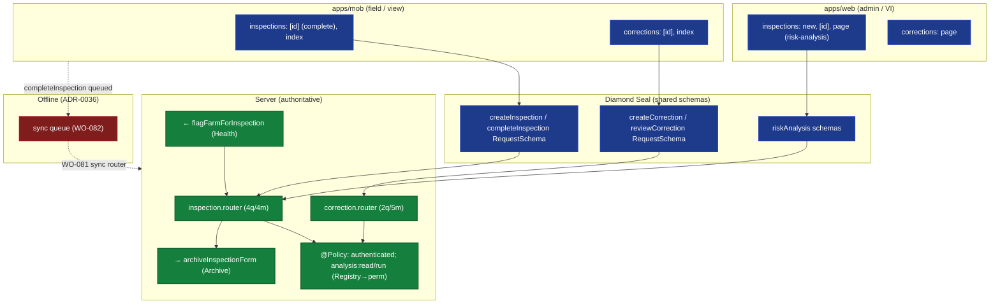

# ADR-0046 — Inspections / Corrections Domain Feature (Web + Mobile)

> Client-surface domain ADR (standard: ADR-0033; third of 0044+). Inspections is where the **field meets
> surveillance**: a VI completes an on-spot inspection (offline), which is archived (ADR-0029) and may have been
> *triggered* by a health event (ADR-0026/0045). Corrections fix data the plausibility engine or a human flagged.
> *sniffs* — the inspection is born from a diseased animal (Health) and dies into the archive; the client must
> make that lifecycle *visible* without re-enforcing the rules the server already owns.

## 1. Context (verified)

**Mobile `inspections/`** (`apps/mob/app/(tabs)/inspections/`): `index.tsx`, `[id].tsx`. **No `new.tsx`** —
creating/scheduling an inspection is a VI/admin action performed on web. The mobile `[id]` screen *completes* an
on-spot inspection in the field (offline-critical).

**Mobile `corrections/`** (`apps/mob/app/(tabs)/corrections/`): `index.tsx`, `[id].tsx` — view case list + detail.
Creation/review is office/plausibility-engine driven, not field entry.

**Web `inspections/`** (`apps/web/app/(admin)/inspections/`): `new/`, `[id]/`, `page.tsx` — full CRUD + the
risk-analysis surface. **Web `corrections/`**: `page.tsx` (list, with detail inline).

**`inspection.router.ts`** (ADR-0034 inventory 4q/4m), verified: `getInspection`, `listInspections`,
`createInspection`, `scheduleInspection`, `completeInspection`, `printInspectionForm` (mutations; form output
`z.any()`), plus risk analysis gated by `@Policy({ action: "analysis:read" })` / `analysis:run`
(`@Policy({ action: "analysis:run" })`). **`correction.router.ts`**: 2q (`get`/`list`) / 5m
(`create`/`review`/`resolve`/`escalate`/…).

**Authorization:**

- Both routers `@Policy({ authenticated: true })` (verified) — auth-only for the CRUD/list ops.
- Inspection risk analysis is gated by `action: "analysis:read"` / `"analysis:run"` (mapped to a permission via
  `PolicyRegistry`). No flat literal found — so client gating needs `session.permissions` populated (WO-089),
  exactly like Health (ADR-0045).
- Correction ops are auth-only; case state transitions (`review`→`resolve`/`escalate`) are server-enforced.

**Cross-domain wires (server-side, ADR-0028):**

- *Inbound:* Health notifiable-disease treatment → `InspectionRepository.flagFarmForInspection()` creates an
  inspection case (ADR-0026/0045). The client should surface "Farm flagged for inspection".
- *Outbound:* inspection completion → `archiveInspectionForm()` (3-year retention, ADR-0029). Toast on completion.

## 2. Decision (the inspections/corrections feature standard)

1. **One schema, two surfaces, one contract** (ADR-0038): web `new`/`[id]` and mobile `[id]` both call the same
   Diamond Seal `*RequestSchema` (`createInspectionRequestSchema`, `completeInspectionRequestSchema`,
   `createCorrectionRequestSchema`, …). Mobile omits *creation* screens where the action is office/VI-only.
2. **Forms bind `zodResolver(createXxxRequestSchema)`** — mirror `animals/create` (ADR-0038); extend to
   inspection complete + correction create/review.
3. **Permission-gate the gated actions by `useCan`** (ADR-0042, needs WO-089): `analysis:read`/`analysis:run`
   gate the risk-analysis buttons; everything else is auth-only (server `@Policy`). Corrections' state transitions
   are server-enforced; the client merely disables unavailable transitions.
4. **Offline-complete for field inspections** (ADR-0036): `completeInspection` queues and syncs (WO-081/082).
   Viewing (`[id]`) must resolve from the ADR-0036 cache when offline (ADR-0041 `Skeleton`/`Empty`).
5. **Surface cross-domain side-effects**: toast on "farm flagged for inspection" (inbound from Health) and on
   "inspection archived" (outbound to Archive) — `sonner` (WO-088).



*Fig. 1 — Inspections/Corrections flow: web admin + mobile view/complete → shared Diamond Seal schema →
routers (`@Policy`-guarded; risk analysis via `analysis:read/run`). Inbound from Health (flag), outbound to
Archive. Field `completeInspection` queues offline (red).*

## 3. Per-feature breakdown

| Feature | Mobile | Web | Router procedures | Gating | Offline-critical |
|---------|--------|-----|------------------|--------|------------------|
| Inspection list/detail | `inspections/index`,`[id]` | `inspections/page`,`[id]` | `getInspection`,`listInspections` | authenticated | view (cache) |
| Schedule/create inspection | — (VI only) | `inspections/new` | `createInspection`,`scheduleInspection` | authenticated | n/a |
| Complete inspection (on-spot) | `inspections/[id]` | `inspections/[id]` | `completeInspection` | authenticated | **Yes** |
| Print form | `inspections/[id]` | `inspections/[id]` | `printInspectionForm` | authenticated | partial |
| Risk analysis | — (office) | `inspections/page` | `analysis:read`/`analysis:run` | `analysis:read`/`analysis:run` (Registry→perm) | n/a |
| Correction list/detail | `corrections/index`,`[id]` | `corrections/page` | `getCorrection`,`listCorrections` | authenticated | view (cache) |
| Correction create/review/resolve | — (office/engine) | `corrections/page` | `create`/`review`/`resolve`/`escalate` | authenticated | n/a |

## 4. Authorization matrix (client gating target)

| Action | Required | Source |
|--------|----------|--------|
| Inspection/correction CRUD + view | authenticated | `@Policy({ authenticated: true })` (verified) |
| Risk analysis read/run | `analysis:read` / `analysis:run` (PolicyRegistry → permission) | `@Policy({ action: … })`, ADR-0028 |
| Correction transitions | server-enforced state machine | correction service |

Client gating = `useCan("analysis:read"/"analysis:run")` for the risk buttons — **requires `session.permissions`
populated** (WO-089), same dependency as Health. Everything else is auth-only; the client only disables
transitions the server would reject.

## 5. Offline considerations (ADR-0036)

The VI completes inspections in the field with no signal — `completeInspection` is the offline-critical mutation.
It must queue (WO-082) and sync (WO-081); the `[id]` detail must render from cache offline (ADR-0041).
Corrections are office-driven, so offline is view-only.

## 6. Consequences

|                     | Web                                | Mobile                                    | Server        |
|---------------------|------------------------------------|-------------------------------------------|---------------|
| Forms               | Diamond Seal (ADR-0038)            | Diamond Seal (complete/correction views) | unchanged     |
| Gating              | `useCan("analysis:*")` (WO-089)    | `useCan("analysis:*")` (WO-089)           | `@Policy` ✓   |
| Field complete      | n/a                                | **offline-queued** (WO-081/082)           | sync router   |
| Cross-domain        | toasts (flag in / archived out)    | toasts (flag in / archived out)           | flag/archive ✓ |

### Positive

- The full inspection lifecycle is visible on both surfaces; the Health→Inspection→Archive chain is surfaced as
  toasts, not hidden.
- `completeInspection` is offline-capable (the real field need).

### Negative

- Risk-analysis gating depends on `session.permissions` (WO-089); until then the buttons are unguarded client-side
  (server still enforces).
- Mobile intentionally omits creation screens (office/VI-only) — a deliberate, documented asymmetry.

### Neutral / Real

- Inspections is the *consumer* of Health's notifiable trigger and the *producer* of Archive entries — the
  cross-domain spine of surveillance. The client's job is to make that spine *legible*, not to re-decide it.

## 7. Implementation Notes

- Reuse trunk WOs: **WO-081** (sync router), **WO-082** (offline cache + queue), **WO-085** (tab filter),
  **WO-086** (i18n — inspection form labels, 9 CheckedAnimal sections), **WO-087** (web UX boundaries),
  **WO-088** (mobile `Empty`/sonner), **WO-089** (`useCan` + `session.permissions`).
- **WO-096 (this ADR):** inspections/corrections parity + offline/permission sweep — bind `completeInspection`
  to the sync queue (WO-082); gate risk-analysis buttons via `useCan("analysis:read"/"analysis:run")` (WO-089);
  surface the flag-in / archived-out toasts; confirm mobile omits creation screens intentionally.
- Forms: extend `zodResolver(createXxxRequestSchema)` to `completeInspection` + correction views (mirror
  `animals/create`, ADR-0038).

## 8. Verification

```bash
# Inspection router: auth-only CRUD + analysis:read/run gating:
rg -n "@Policy" apps/api/src/routers/inspection.router.ts
# Correction router: auth-only:
rg -n "@Policy" apps/api/src/routers/correction.router.ts
# Cross-domain wires:
rg -n "flagFarmForInspection|archiveInspectionForm" packages/domains/inspection/src packages/domains/health/src
# Forms bind Diamond Seal schemas:
rg -n "completeInspectionRequestSchema|createCorrectionRequestSchema" apps/mob apps/web
```

## 9. References

- ADR-0028 (Inspection Risk Analysis — weighted 10% selection, on-spot lifecycle, form gen, `analysis:read/run`).
- ADR-0029 (Passport/Archive — `archiveInspectionForm` 3-yr retention).
- ADR-0026 / ADR-0045 (Health → `flagFarmForInspection` inbound trigger).
- ADR-0015 (Mobile PDA Sync), ADR-0036 (Offline-first), ADR-0038 (Forms), ADR-0042 (Permission-Aware UI),
  ADR-0041 (Error/Empty/Loading), ADR-0022 (Policy Engine), ADR-0033 (client ADR standard).
- **WO-081/082/085/086/087/088/089** (trunk), **WO-096** (this ADR's sweep).
