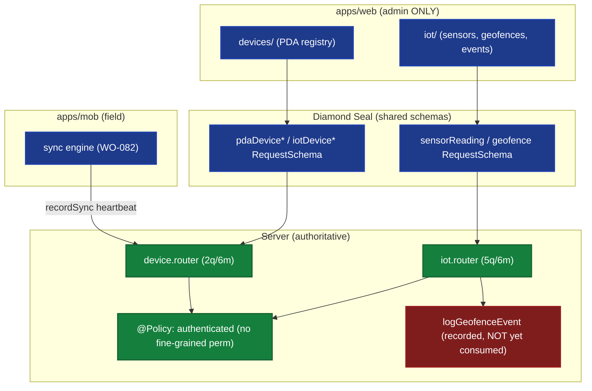

# ADR-0047: Infrastructure (IoT / Devices) Domain Feature (Web + Mobile)

| Key | Value |
| --- | --- |
| **Status** | Proposed |
| **Date** | 2026-07-09 |
| **Author** | Rocky Architecture Board |
| **Supersedes** | None |
| **Superseded** | None |

---

> Client-surface domain ADR (standard: ADR-0033; fourth of 0044+). Infrastructure is the **back-office that the
> field never sees**: the mobile app *is* a device (managed by `device.router`) but has no device screens. *sniffs*
> — the worker holds the thing that is administered, yet is not permitted to administer it. The client surface for
> Infrastructure is therefore **web-only**, and the only mobile footprint is a heartbeat (`recordSync`) the offline
> sync engine should emit.

## Context (verified)

**Mobile: no IoT/device surface.** `apps/mob/app/(tabs)/` contains no `iot`/`device`/`sensor`/`geo` tab
(confirmed). The mobile app is a PDA — its identity exists in `device.router` (`pdaDevice*`) — but device/IoT
management lives on web/admin only.

**Web admin:** `apps/web/app/(admin)/devices/` (PDA device registry: create/assign/block/recordSync) and
`apps/web/app/(admin)/iot/` (IoT device registry, sensor readings, geofences, geofence events).

**`device.router.ts`** (ADR-0034 inventory 2q/6m), verified: `getPdaDevice`, `listPdaDevices` (queries);
`createPdaDevice`, `updatePdaDevice`, `assignDeviceUser`, `recordSync`, `blockPdaDevice`, and a 6th mutation
(block/unblock transition). **`iot.router.ts`** (5q/6m), verified: `registerDevice`, `listDevices`,
`getDevice`, `ingestReading`, `ingestReadings` (batch), `listReadings`, `createGeofence`, `listGeofences`,
`deleteGeofence`, `logGeofenceEvent`.

**Authorization:** both routers `@Policy({ authenticated: true })` (verified) — **auth-only, no fine-grained
permission literal** (grep finds none). Consistent with backend ADR-0031 ("Basic CRUD — no event queues, no
real-time processing, no edge AI"). Client gating is therefore *none beyond authenticated* — the simplest shape in
the 0044+ taxonomy (c.f. Livestock `useCan`, Health `clientCanRole`, Inspections `analysis:read/run`).

**Cross-domain (the Real that is deferred):** `iot.logGeofenceEvent` records geofence entry/exit events, but
(per ADR-0031) nothing consumes them yet — no movement/animal wire, no alert. The geofence event is a *symptom
without a return* — recorded into the Symbolic, awaiting a future cross-domain link. The one *actual* cross-link
today is `device.recordSync`: the WO-082 mobile sync could log a PDA heartbeat here.

## Decision (the infrastructure feature standard)

1. **Web-only feature, documented as such.** Infrastructure has **no mobile screens by design** — the app is a
   device, not a device manager. ADR-0033 parity is satisfied at the *operation* level (web covers all device/iot
   ops); the mobile absence is intentional and recorded.
2. **Forms bind `zodResolver(*RequestSchema)`** (ADR-0038) — extend the Diamond Seal contract to the admin
   `devices` / `iot` forms (`createPdaDeviceRequestSchema`, `registerDeviceRequestSchema`,
   `createGeofenceRequestSchema`, `ingestReadingRequestSchema`). No mobile form needed.
3. **No client permission gating beyond auth.** Both routers are `@Policy({ authenticated: true })`; the client
   need only ensure the user is signed in (the WO-089 `session` is enough to know "authenticated"). No `useCan`
   variant required for Infrastructure.
4. **Mobile's only footprint: `device.recordSync` heartbeat.** The WO-082 offline sync engine should call
   `recordSync` so PDA connectivity is logged server-side — the one place mobile touches Infrastructure.
5. **Record but don't pretend.** Geofence events are ingested and displayed (web) but are *explicitly not yet
   consumed*; ADR-0047 documents this as a known deferred cross-domain, not a hidden gap.



*Fig. 1 — Infrastructure is web/admin-only. Mobile has no IoT screens; its sole touchpoint is the `recordSync`
heartbeat the sync engine emits. Both routers are `@Policy({ authenticated: true })` — no client permission gating.
`logGeofenceEvent` is recorded but unconsumed (red) — a deferred cross-domain.*

## 3. Per-feature breakdown

| Feature | Mobile | Web | Router procedures | Gating | Offline-critical |
|---------|--------|-----|------------------|--------|------------------|
| PDA device registry | — (app is a device) | `devices/` | `get`/`list`/`create`/`update`/`assignDeviceUser`/`block` | authenticated | No |
| PDA sync heartbeat | `recordSync` (via WO-082) | — | `recordSync` | authenticated | n/a (uplink) |
| IoT device registry | — | `iot/` | `registerDevice`/`listDevices`/`getDevice` | authenticated | No |
| Sensor readings | — | `iot/` | `ingestReading(s)`/`listReadings` | authenticated | No (edge ingest) |
| Geofences | — | `iot/` | `createGeofence`/`listGeofences`/`deleteGeofence` | authenticated | No |
| Geofence events | — | `iot/` | `logGeofenceEvent` (+query) | authenticated | No (recorded, unconsumed) |

## 4. Authorization matrix (client gating target)

| Action | Required | Source |
|--------|----------|--------|
| All device/iot ops | authenticated | `@Policy({ authenticated: true })` (verified) |

Infrastructure is the **auth-only** pole of the 0044+ gating taxonomy (c.f. Livestock `useCan`, Health
`clientCanRole`, Inspections `analysis:read/run`). No `useCan`/`clientCanRole` needed — only "is signed in".

## 5. Offline considerations (ADR-0036)

Infrastructure management is admin/back-office → always online; **no offline need**. The single mobile link is the
`recordSync` heartbeat, which the WO-082 sync engine emits when a PDA syncs — an *uplink*, not a field form. No
local cache/read path is required for Infrastructure on mobile (there is no UI).

## Consequences

|                     | Web                                | Mobile                          | Server        |
|---------------------|------------------------------------|--------------------------------|---------------|
| Forms               | Diamond Seal (ADR-0038)            | none (by design)               | unchanged     |
| Gating              | authenticated only                 | none (by design)               | `@Policy` ✓   |
| Offline             | n/a                                | `recordSync` uplink (WO-082)   | device.router |
| Cross-domain        | geofence events displayed          | —                              | none consumed |

### Positive

- Honest scope: Infrastructure is explicitly web-only; the mobile-as-device relationship is documented, not hidden.
- Simplest gating shape — reduces client complexity where the server already restricts to authenticated.

### Negative

- Geofence events are recorded but unconsumed (ADR-0031) — a deferred cross-domain the client merely displays.

### Neutral / Real

- Infrastructure reveals that "domain feature parity" (ADR-0033) does **not** mean "every domain gets a mobile
  tab". Parity is at the *operation* level; some domains are intrinsically back-office. ADR-0033 should state this
  explicitly to prevent future "why no IoT tab?" churn.

## Implementation

- Reuse trunk WOs: **WO-086** (i18n — device/geofence labels), **WO-087** (web UX boundaries for `devices`/`iot`
  admin pages), **WO-082** (mobile sync → `device.recordSync` heartbeat).
- **WO-097 (this ADR):** Infrastructure admin parity + device-sync touchpoint — bind web `devices`/`iot` admin
  forms to Diamond Seal `zodResolver` (extend ADR-0038); wire WO-082 mobile sync → `device.recordSync`; document
  (in ADR-0033) that Infrastructure is web-only by design; display geofence events as "recorded, not yet acted on".
- No `useCan`/`clientCanRole` work needed (auth-only).

## Verification

```bash
# No mobile IoT/device tab:
ls apps/mob/app/\(tabs\) | rg -i "iot|device|sensor|geo" || echo "confirmed: no mobile IoT surface"
# Web admin pages exist:
ls apps/web/app/\(admin\) | rg -i "iot|device"
# Both routers auth-only:
rg -n "@Policy" apps/api/src/routers/device.router.ts apps/api/src/routers/iot.router.ts
# Geofence event recorded but (per ADR-0031) not consumed elsewhere:
rg -n "logGeofenceEvent" packages/domains/iot/src
# Admin forms bind Diamond Seal schemas:
rg -n "createPdaDeviceRequestSchema|registerDeviceRequestSchema|createGeofenceRequestSchema" apps/web
```

## References

- ADR-0031 (IoT Connectivity Abstraction — device registry, readings, geofences, events; "no event queues").
- ADR-0036 (Offline-first — WO-082 sync → `recordSync`), ADR-0038 (Forms), ADR-0042 (Permission-Aware UI — the
  auth-only pole), ADR-0022 (Policy Engine), ADR-0033 (client ADR standard; this ADR proposes a "web-only is
  valid parity" clarification).
- **WO-082/086/087** (trunk), **WO-097** (this ADR's infra sweep).
