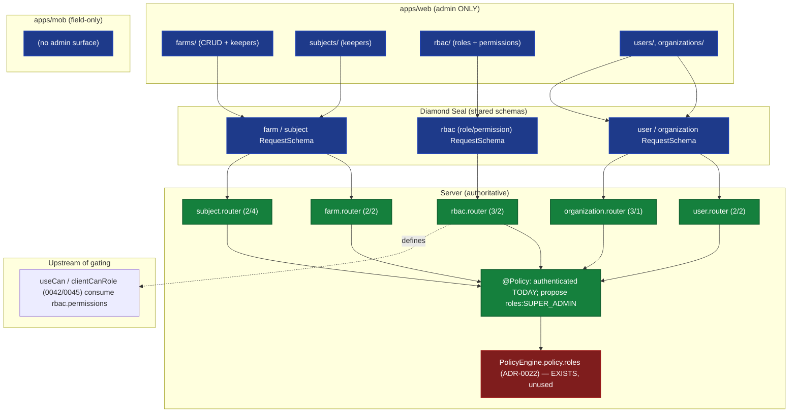

# ADR-0048: Administration Domain Feature (Web + Mobile)

| Key | Value |
| --- | --- |
| **Status** | Accepted |
| **Date** | 2026-07-09 |
| **Author** | Rocky Architecture Board |
| **Supersedes** | None |
| **Superseded** | None |

---

> Client-surface domain ADR (standard: ADR-0033; **final of 0044+**). Administration is the **meta-domain**: it
> owns the farms, the keepers (subjects), the users, the organizations, and — decisively — the **RBAC roles and
> permissions that every other ADR's `useCan` (0042) consumes**. _sniffs_ — the worker who is gated by a
> permission is gated by a permission _someone else administered_. And that administration, right now, is
> **auth-only**: the lock on the locker-room door is the same lock as the pitch.

> **Corrigendum (WO-098 implementation, 2026-07-09):** Administration is implemented and the security keystone is closed. `rbac.router` and `user.router` now carry `@Policy({ authenticated: true, roles: ["SUPER_ADMIN"] })` (server-enforced via ADR-0022 `PolicyEngine.policy.roles`) — verified in the working tree. `farm`/`subject`/`organization` routers remain `@Policy({ authenticated: true })` (RLS-scoped, role decision deferred to ADR-0027). All web admin forms bind Diamond Seal `*RequestSchema` via `zodResolver` (verified: 14/14 forms). Web-only parity is recorded per ADR-0033 §6. Client-side, the "New user" / "Assign role" / "Revoke role" buttons are SUPER_ADMIN-gated; "Register animal" and all `authenticated: true` actions stay visible (no 403 exists — gating would false-hide).

## Context (verified)

**Web admin surface** (`apps/web/app/(admin)/`): `farms/`, `subjects/`, `rbac/`, `users/`, `organizations/`
(+ `systemParameters`, `vsAssignment`, `vsContract`, `audit`, `archive`). **Mobile: no admin surface** (confirmed
— no `admin`/`user`/`rbac`/`org`/`farm`/`subject` tab). Administration is **web-only**, like Infrastructure
(ADR-0047); the mobile app is field-only.

**Administration-family routers** (ADR-0034 inventory; verified class + per-procedure `@Policy`):

- `farm.router` (2q/2m) — `@Policy({ authenticated: true })`.
- `subject.router` (2q/4m) — `@Policy({ authenticated: true })`.
- `rbac.router` (3q/2m) — `@Policy({ authenticated: true })` (class + **every** procedure; no `roles` override).
- `user.router` (2q/2m) — `@Policy({ authenticated: true })` (class + **every** procedure; no `roles` override).
- `organization.router` (3q/1m) — `@Policy({ authenticated: true })`.

**No flat permission literal** found in any admin router (grep). The `better-auth` `admin({ adminRoles:
["SUPER_ADMIN"] })` plugin guards its _own_ `/admin` HTTP endpoints — but the tRPC `rbac`/`user` routers are
separate and currently only require authentication.

**The security crux (verified):** the `PolicyEngine` (`packages/authorization/src/policies/engine.ts:58`) **does**
evaluate `policy.roles` (`if (policy.roles && policy.roles.length > 0) … principal.hasRole(r)`), but **none of the
admin routers configure it** — they set only `authenticated: true`. So the machinery that would enforce
`SUPER_ADMIN` exists (ADR-0022) and is **switched off** at the router level. Unless the _service_ layer
independently enforces `SUPER_ADMIN`, **any authenticated session can mutate RBAC and users** — including a farmer
holding a mobile app session. This is a server-side authorization gap, not a client-side one.

**Upstream of the whole permission story:** `rbac.router` is what _defines_ the permissions `useCan` (ADR-0042)
and `clientCanRole` (ADR-0045) consume. Administration is therefore the source of the gating taxonomy mapped in
0044–0047.

## Decision (the administration feature standard)

1. **Web-only feature, documented as such** (c.f. Infrastructure, ADR-0047). Administration has no mobile surface
   by design; ADR-0033 parity is satisfied at the operation level (web covers all admin ops).
2. **Forms bind `zodResolver(*RequestSchema)`** (ADR-0038) — extend the Diamond Seal contract to the admin
   `farms`/`subjects`/`rbac`/`users`/`organizations` forms. No mobile form needed.
3. **Switch on the existing role gate (security keystone).** Add `@Policy({ roles: ["SUPER_ADMIN"] })` (or the
   appropriate admin role) to the admin routers, leveraging the already-built `PolicyEngine` `policy.roles`
   support (ADR-0022). This closes the gap where any authenticated session can reach `rbac.*`/`user.*`.
4. **RBAC is upstream — treat it reverently.** The `rbac` router defines permissions; changes here ripple to
   every `useCan`/`clientCanRole` gate. Admin RBAC UI must reflect the _same_ permission set the PolicyEngine
   enforces (single source of truth, ADR-0011/0019).
5. **No client permission gating beyond "is this an admin".** The web admin shell should still gate navigation by
   role (ADR-0039/WO-089), but the _authoritative_ gate is the server `@Policy({ roles: ["SUPER_ADMIN"] })`.



_Fig. 1 — Administration is web-only. The `rbac` router (red) defines the permissions every other ADR consumes,
yet is currently `@Policy({ authenticated: true })` only. The `PolicyEngine.policy.roles` gate exists (red) but is
unswitched. WO-098 proposes `@Policy({ roles: ["SUPER_ADMIN"] })`._

## 3. Per-feature breakdown

| Feature | Mobile | Web | Router | Gating (today → propose) |
|---------|--------|-----|--------|--------------------------|
| Farm CRUD + keepers | — | `farms/` | `farm.router` (2/2) | authenticated → +`SUPER_ADMIN`? (farm admin) |
| Farm subjects / keepers | — | `subjects/` | `subject.router` (2/4) | authenticated → role-gated |
| RBAC roles + permissions | — | `rbac/` | `rbac.router` (3/2) | **authenticated → `SUPER_ADMIN`** |
| User management | — | `users/` | `user.router` (2/2) | **authenticated → `SUPER_ADMIN`** |
| Organizations | — | `organizations/` | `organization.router` (3/1) | authenticated → role-gated |
| System params / VS* | — | `systemParameters/`,`vsAssignment/`,`vsContract/` | `systemParameters`(1/1),`vsAssignment`(4/2),`vsContract`(3/2) | authenticated → role-gated |

## 4. Authorization matrix (client gating target)

| Action | Required (today) | Required (proposed, WO-098) |
|--------|------------------|------------------------------|
| All admin ops (router level) | authenticated | authenticated + `roles: [SUPER_ADMIN]` (or domain admin role) |
| RBAC/user mutation | authenticated | **`SUPER_ADMIN`** (server-enforced via ADR-0022) |

The PolicyEngine already supports `policy.roles` (engine.ts:58) — WO-098 _switches it on_ for admin routers. Until
then, client navigation gating (ADR-0039/WO-089) is the only protection, and it is currently fail-open.

## 5. Offline considerations (ADR-0036)

Administration is back-office → always online; **no offline need**, no mobile cache/read path (no UI). This is the
same posture as Infrastructure (ADR-0047).

## Consequences

|                     | Web                                      | Mobile            | Server        |
|---------------------|------------------------------------------|-------------------|---------------|
| Forms               | Diamond Seal (ADR-0038)                  | none (by design)  | unchanged     |
| Gating (today)      | authenticated only                      | none              | `@Policy` ✓ (weak) |
| Gating (proposed)   | `roles: SUPER_ADMIN` (server)           | none              | ADR-0022 ✓    |
| Upstream            | defines `useCan` permissions            | —                 | rbac.router   |

### Positive

- Closes the 0044+ set with the **meta-domain** that explains _where the permissions come from_.
- Surfaces a real, verifiable server-side authorization gap and the already-built fix (PolicyEngine `roles`).

### Negative

- Until WO-098 lands, admin routers are reachable by any authenticated session — a genuine security exposure.

### Neutral / Real

- Administration is the second web-only domain (after Infrastructure). ADR-0033 must state "web-only is valid
  parity" to prevent churn — and must note that web-only does **not** mean "ungated".

## Implementation

- Reuse trunk WOs: **WO-086** (i18n — admin labels), **WO-087** (web UX boundaries for admin pages),
  **WO-089** (admin navigation role-gating; currently fail-open), **WO-082** (n/a — no mobile).
- **WO-098 (this ADR, P1 security):** (a) verify whether admin routers' _service_ layer enforces `SUPER_ADMIN`;
  (b) if not, add `@Policy({ roles: ["SUPER_ADMIN"] })` (or domain admin role) to `rbac`/`user`/`farm`/`subject`/
  `organization` routers, using the existing `PolicyEngine.policy.roles` (ADR-0022); (c) bind web admin forms to
  Diamond Seal `zodResolver` (extend ADR-0038); (d) document web-only parity in ADR-0033.
- This is the **keystone security ADR** of the 0044+ set — it protects the very permissions the other ADRs rely on.

## Verification

```bash
# Admin routers are auth-only (no roles gate today):
rg -n "@Policy" apps/api/src/routers/rbac.router.ts apps/api/src/routers/user.router.ts
# PolicyEngine supports roles (the fix exists):
rg -n "policy.roles|principal.hasRole" packages/authorization/src/policies/engine.ts
# Web admin pages exist; mobile has none:
ls apps/web/app/\(admin\) | rg "farms|subjects|rbac|users|organizations"
ls apps/mob/app/\(tabs\) | rg -i "admin|rbac|user" || echo "confirmed: no mobile admin surface"
# Forms bind Diamond Seal schemas:
rg -n "createFarmRequestSchema|createUserRequestSchema|createRoleRequestSchema" apps/web
```

## References

- ADR-0021 (Better Auth config — `admin({ adminRoles: ["SUPER_ADMIN"] })`), ADR-0022 (Policy Engine — the
  `policy.roles` support this ADR switches on), ADR-0027 (Farm/Holder/Subject).
- ADR-0011/0019 (single source of truth for permissions/schemas), ADR-0033 (client ADR standard; web-only parity).
- ADR-0038 (Forms), ADR-0039 (Navigation — fail-open today), ADR-0042 (Permission-Aware UI — `useCan` consumes
  `rbac.permissions`), ADR-0045 (`clientCanRole`), ADR-0047 (Infrastructure — sibling web-only domain).
- **WO-086/087/089** (trunk), **WO-098** (this ADR's security + parity sweep — P1).
