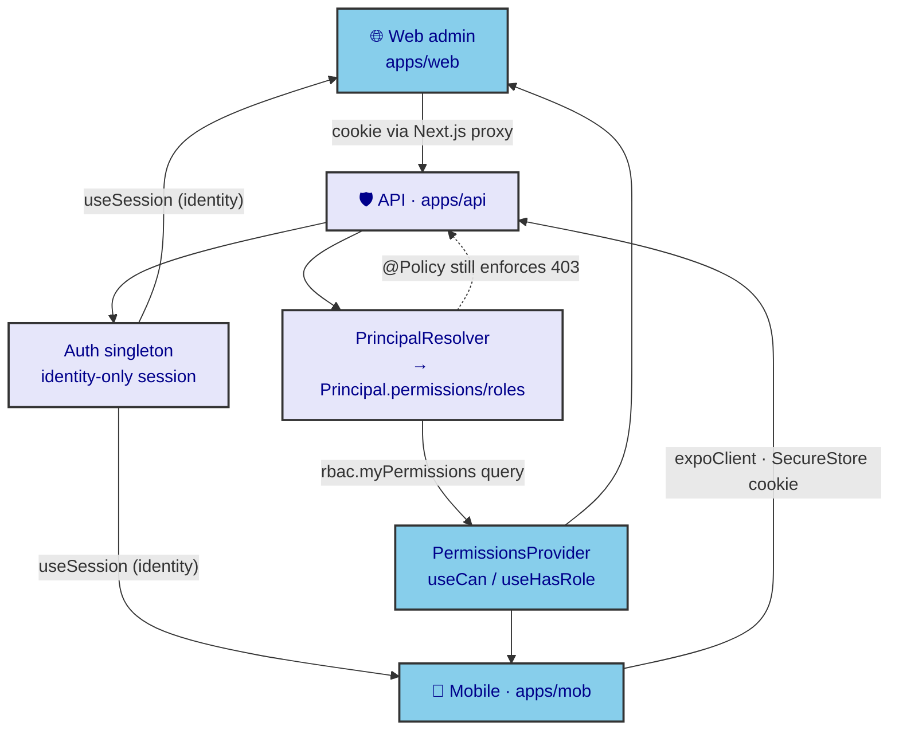

# ADR-0049: Client Auth & Session Architecture

| Key | Value |
| --- | --- |
| **Status** | Accepted |
| **Date** | 2026-07-09 |
| **Author** | Rocky Architecture Board |
| **Supersedes** | None |
| **Superseded** | None |

---

> Client-surface ADR (standard: ADR-0033). The dialectical counterpart to **ADR-0021** (backend
> Better Auth configuration). Documents how the two client surfaces (Next.js admin, Expo mobile)
> obtain *identity* from the session, why they are deliberately *permission-blind* in the session,
> and how permissions reach the client (via the `rbac.myPermissions` query, WO-089) without
> re-coupling auth to RBAC.

## Context

ADR-0021 ratified the backend auth: a single idempotent `Auth` singleton, **identity-only** — the
session carries `{ session, user }` and **nothing about RBAC**. `PrincipalResolver` (ADR-0022) builds
the `Principal` (roles + permissions) server-side; `@Policy` (ADR-0022) enforces it. The boundary is
clean on the server.

The client side, however, had **no commensurate decision**. Two surfaces consume the session:

- **Web admin** (`apps/web`): `apps/web/lib/auth-client.ts` calls the shared `createRockyAuthClient()`
  and exports `useSession`. `AdminShell` reads `session.user.permissions` / `session.user.roles` from
  `better-auth.d.ts` — but **nothing populates them** (ADR-0042). The nav filter fail-opens.
- **Mobile** (`apps/mob`): `apps/mob/lib/auth.ts` adds the `expoClient` plugin (SecureStore) and also
  exports `useSession`. `(tabs)/_layout.tsx` renders **all 10 tab screens unconditionally** — no
  permission check at all.

`packages/auth/src/client.ts` already provides `createRockyAuthClient()` — a transport-agnostic factory
wrapping `createAuthClient` with `adminClient()` only — `organizationClient()`/`twoFactorClient()` are deliberately absent (Identity-Only Boundary, ADR-0021); platform differences are supplied via `plugins`
plugins. So the *client factory* exists; what was missing was the **decision** that the client stays
identity-only and gets permissions out-of-band.

Without this ADR, developers are tempted to (a) add a `customSession` plugin to enrich the session with
RBAC (re-coupling `packages/auth` to SM/RBAC — exactly what ADR-0021 split out), or (b) trust the
client's `permissions` field for security (it is drift, never populated).

## Decision

1. **Identity-only session on the client, by design.** `useSession()` returns `{ session, user }`
   (identity). The client never reads permissions/roles from the session object. The
   `permissions?`/`roles?` fields declared in `apps/web/better-auth.d.ts` are **drift** and must not
   be trusted or relied upon.
2. **One client factory.** Both surfaces use `createRockyAuthClient()` from `@rocky/auth/client`.
   - Web: `createRockyAuthClient({ baseURL: NEXT_PUBLIC_API_URL })` — relies on the cookie forwarded by
     the Next.js proxy; `useSession` reads it client-side (SSR hydration guarded by a `mounted` flag in
     `AdminShell`, ADR-0039).
   - Mobile: `createRockyAuthClient({ baseURL: EXPO_PUBLIC_API_URL, plugins: [expoClient({ scheme:
     "mobile", cookiePrefix: "rocky", storage: SecureStore })] })` — persists the session cookie in
     Expo SecureStore and bridges it to the API.
3. **Permissions delivered out-of-band, not in the session.** The client fetches its permission/role
   strings from the `rbac.myPermissions` query (WO-089), which calls `PrincipalResolver` server-side and
   returns `principal.permissions` + `principal.roles`. These feed a client `PermissionsProvider`
   (ADR-0042) exposing `useCan(permission)` / `useHasRole(role)`.
4. **Client permission state is advisory only.** `useCan` drives UI (hidden/disabled nav, greyed
   actions). The server `@Policy` remains the sole enforcement point — a missing/forged client
   permission still yields `403` before any mutating procedure runs (ADR-0022). The client mirror can
   never grant access the server denies.

## Consequences

### Positive

- **Auth package stays RBAC-free.** No `customSession`, no SM/user/org imports in `packages/auth`.
  The ADR-0021 boundary holds end-to-end.
- **Single client entry point.** Both surfaces share `createRockyAuthClient()`; platform differences
  are plugins, not forks.
- **Permissions are correct and live.** `myPermissions` derives from the RBAC seed via
  `PrincipalResolver` — the same source the server enforces — so client and server can never disagree.
- **Clear failure mode.** Client permission UI is cosmetic; security is server-owned.

### Negative / Cost

- The client is **permission-blind until `myPermissions` resolves** — a brief window where `useCan`
  returns `false` for everything. Mitigated by optimistic "show all, server enforces" during load
  (ADR-0042) and by gating only *UI*, never *access*.
- An extra query per session start (`myPermissions`), cached in the `PermissionsProvider`.

### Neutral

- `apps/web/better-auth.d.ts` keeps its `permissions?`/`roles?` declarations for type-compat, but they
  are documented as unused drift.

## Implementation

- **Factory:** `packages/auth/src/client.ts` — `createRockyAuthClient()` (already implemented; this ADR
  ratifies its use as the sole client entry).
- **Web:** `apps/web/lib/auth-client.ts` → `createRockyAuthClient()`; `AdminShell` uses `useSession()`
  for identity only.
- **Mobile:** `apps/mob/lib/auth.ts` → `createRockyAuthClient({ plugins: [expoClient(...)] })`.
- **Permissions (WO-089):** `rbac.myPermissions` query (returns `{ permissions, roles }`) + client
  `PermissionsProvider` + `useCan`/`useHasRole` (ADR-0042). `clientCan` pure helper in `@rocky/trpc`
  (not `@rocky/authorization` — that package is server-only and would bloat the client bundle).



## Verification

```bash
# Client factory is the sole entry (no per-app auth forks)
rg -n "createAuthClient|betterAuth\(" apps/web apps/mob --glob '!**/node_modules/**'   # only via @rocky/auth/client
# Session is identity-only (no customSession enrichment on server)
rg -n "customSession" packages/auth/src/better-auth.ts                              # expect: none
# Permissions come from the query, not the session
rg -n "myPermissions" apps/api/src/routers/rbac.router.ts                          # present (WO-089)
# Client consumes permissions via the provider, not session.permissions
rg -n "useCan|usePermissions" apps/web apps/mob --glob '!**/node_modules/**'        # present (ADR-0042)
```

## Anti-Patterns (do not repeat)

1. **`customSession` RBAC enrichment.** Adding a `customSession` plugin to stuff `permissions`/`roles`
   into the session re-couples `packages/auth` to SM/RBAC/organizations — the exact split ADR-0021 made.
   Use `rbac.myPermissions` instead (WO-089).
2. **Trusting `session.user.permissions` for security.** That field is drift (declared, never populated).
   Client permission state is advisory; `@Policy` on the server is authoritative (403).
3. **Per-surface auth forks.** Both clients must use `createRockyAuthClient()`; platform differences are
   plugins, never duplicated auth logic.
4. **Putting permissions in the session cookie.** The cookie stays identity-only; permission strings
   are fetched per session via the query and held in the (ephemeral) `PermissionsProvider`.
