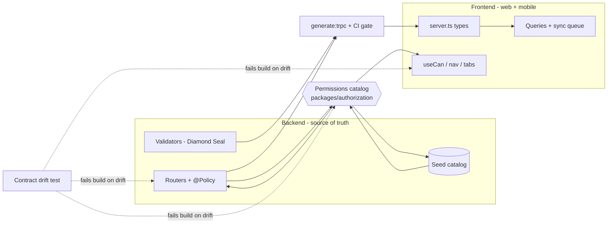

# ADR-0050: Frontend ↔ Backend Contract Synchronization

| Key | Value |
| --- | --- |
| **Status** | Accepted |
| **Date** | 2026-07-09 |
| **Author** | Architecture Review |
| **Supersedes** | — |
| **Superseded** | — |

---

## Context

The frontend (web `apps/web` + mobile `apps/mob`) depends on the backend across **four contract
surfaces**. An investigation of the current tree (2026-07-09) found them drifting independently:

1. **tRPC type surface** — `packages/trpc/src/generated/server.ts` (155 procedures) regenerated by
   `generate:trpc` (WO-090). Not wired to CI/pre-commit, so a backend router change can leave the
   generated types stale.
2. **Validator surface** — `@rocky/validators` Diamond Seal. Guarded by the NoDrift guillotine
   (WO-032). **Healthy.**
3. **Permission surface** — **three sub-surfaces with no shared source**:
   - **Seed catalog** (`packages/database/src/seed.ts`): ~50 literals (`animal:read`,
     `health:read`, `movement:read`, `passport:read`, `eartag:read`, `correction:read`,
     `notification:read`, …). Drives `principal.permissions` → what `myPermissions` returns.
   - **`@Policy` decorators** (`apps/api/src/routers/*`): only **10** action literals, mostly
     *writes* (`animal:create`, `eartag:order`, `eartag:supply`, `analysis:read|run`, `sm:*`).
     Read operations use `@Policy({ authenticated: true })` — **no action literal**.
   - **Frontend `useCan`/nav literals** (`apps/web/lib/nav-config.ts`, `apps/mob/app/(tabs)/_layout.tsx`):
     request `animal:read`, `health:read`, `movement:read`, `passport:read`, `eartag:read`,
     `correction:read`, `notification:read`, `analysis:read`, plus `hk:*`, `sm:*`, `pda:*`,
     `archive:read`, `report:read`.
4. **ADR surface** — frontend ADRs (0034–0049) cite backend ADRs; enforced by the ADR-0033 DoD.

**The repressed symptom:** the frontend tracks the **seed catalog**, but backend *enforcement*
(`@Policy`) tracks a *different, smaller* set. Reads are enforced as "any authenticated user" while
the UI hides tabs on `*:read`. RLS still protects data, but the two gates are inconsistent and can
diverge silently. There is **no single source of truth** and **no drift detector** — a time-bomb
(ADR-0042 flagged the verbatim-string smell; this ADR fixes the root cause).

## Decision

Establish **one source of truth** for the cross-surface contract and **automate every sync point**.

### D1 — Permission catalog (kills the triple-source drift)

Add `packages/authorization/src/permissions.ts`:

```ts
export const Permissions = {
  AnimalRead: "animal:read", AnimalCreate: "animal:create", AnimalWrite: "animal:write",
  HealthRead: "health:read", MovementRead: "movement:read", PassportRead: "passport:read",
  EartagRead: "eartag:read", EartagOrder: "eartag:order", EartagSupply: "eartag:supply",
  CorrectionRead: "correction:read", NotificationRead: "notification:read",
  AnalysisRead: "analysis:read", AnalysisRun: "analysis:run",
  ArchiveRead: "archive:read", ReportRead: "report:read",
  SmAuditRead: "sm:audit:read", SmModulesRead: "sm:modules:read", SmSysparamsRead: "sm:sysparams:read",
  // …full set, generated from the same literals the seed uses
} as const;
export type Permission = (typeof Permissions)[keyof typeof Permissions];
```

- **Seed** (`seed.ts`) maps over `Permissions` instead of hand-written strings.
- **Backend** `@Policy({ action: Permissions.AnimalRead })` — no verbatim strings.
- **Frontend** `useCan(Permissions.AnimalRead)` / `nav-config` / tabs import the same const.
- `packages/authorization` is server-only, so the frontend consumes the **string values** via a
  re-exported const in a client-safe module (e.g. `@rocky/trpc` or a new `@rocky/permissions`
  const-only package) — mirroring the WO-089 `clientCan`-in-`@rocky/trpc` decision.

### D2 — Automated type-regen gate (kills stale `server.ts`)

`generate:trpc` runs in **pre-commit + CI**. A "types stale?" check fails the build if
`server.ts` does not match the current routers (cheap git-diff against a regen). Frontend typecheck
is blocked on current types.

### D3 — Keep the Validator NoDrift guillotine (WO-032). No change

### D4 — Contract drift test (kills silent divergence)

A test in `apps/api` (or `packages/authorization`) asserts, at build time:

- every `@Policy({ action })` literal ∈ `Permissions`;
- every seed permission ∈ `Permissions`;
- every frontend `useCan`/`nav-config`/`tabs` literal ∈ `Permissions`.
Failure = red build. This is the enforceable form of ADR-0042's verbatim-string concern.

### D5 — ADR cross-reference stays enforced by the ADR-0033 DoD (frontend ADRs cite backend ADRs)

### D6 — Sync router promotion (WO-081)

`syncDownload`/`syncUpload` move from `health.router.ts` to a top-level `sync` router so the mobile
offline cache (WO-082) and background sync (WO-092) have a stable, versioned contract.

## Consequences

- **Good:** drift becomes a build failure, not a 2 a.m. production surprise. Adding a permission is
  one edit in `Permissions`. Frontend always typechecks against current backend procedures.
- **Bad / cost:** the catalog must be maintained; CI/pre-commit must run `generate:trpc`; the
  `@Policy`-vs-seed inconsistency for *reads* must be reconciled (either reads get real `@Policy`
  actions, or the UI gates reads on `authenticated` like the backend — decided per domain in WO-100).
- **Risk:** retrofitting 50 literals into the catalog touches seed + every router + every `useCan`.
  Do it behind WO-100 with the contract test greening incrementally.

## Implementation

| Step | File(s) | Note |
| ---- | ------- | ---- |
| 1 | `packages/authorization/src/permissions.ts` | New catalog const (D1) |
| 2 | `packages/database/src/seed.ts` | Map over `Permissions` |
| 3 | `apps/api/src/routers/*.ts` | `@Policy({ action: Permissions.X })` |
| 4 | `apps/web/lib/nav-config.ts`, `apps/mob/app/(tabs)/_layout.tsx`, `apps/*/lib/permissions.tsx` | `useCan(Permissions.X)` |
| 5 | pre-commit + CI | `generate:trpc` + stale-types check (D2) |
| 6 | `apps/api` contract test | drift assertion (D4) |
| 7 | `apps/api/src/routers/sync.router.ts` | promote from `health` (D6 / WO-081) |

## Verification

- `pnpm -C apps/api generate:trpc` regenerates; `apps/web` + `apps/mob` typecheck against 155 procedures.
- Contract test passes: `@Policy` ⊂ `Permissions` ⊂ seed ⊂ frontend literals (all equal).
- `myPermissions` returns only catalog values; tabs render for seeded roles; a removed literal fails
  the build, not the UI.

## Anti-Patterns

- **Verbatim permission strings** in `@Policy`/seed/frontend — the triple-source drift. Use `Permissions`.
- **`@Policy({ authenticated: true })` for reads while UI gates `*:read`** — pick one gate, encode it
  in the catalog.
- **Skipping `generate:trpc` after a router change** — CI must catch the stale `server.ts`.
- **Hand-editing `server.ts`** — it is generated (ADR-0032); never commit manual edits.

## Roadmap — keeping the frontend in step with the backend

| Phase | Work Orders | Contract sync mechanism |
| ----- | ----------- | ----------------------- |
| 0 (done) | ADR-0049, WO-089, WO-085, WO-087, WO-088(p1), WO-083 | identity-only session; `myPermissions` delivers seed perms; nav/tab gating |
| 1 (done) | — | UX vocabulary (Empty/Skeleton/error boundaries) |
| **2 — Offline** | **WO-081** (promote `sync` router), **WO-082** (cache+sync queue), **WO-092** (bg sync), **WO-093** (deep-link) | sync router is the versioned offline contract (D6) |
| 3 — i18n | WO-086 | consume `session.language`; centralize strings |
| 4 — Parity sweeps | WO-094 (Livestock), WO-095 (Health), WO-096 (Inspections/Corrections) | each binds mutating actions to sync queue (WO-082) + `useCan(Permissions.X)` |
| 5 — Push | WO-091 | Expo push → deep-link (WO-093) |
| **Cross-cutting (new)** | **WO-100** (permission catalog + `@Policy` reconciliation), **WO-101** (contract drift test), **WO-102** (CI type-regen gate) | the D1/D4/D2 enforcements — root cause of "keeping up" |
| Cross-cutting (new) | geofence-event consumer, forms-standardization sweep | IoT→movement/animal wiring; every form binds Diamond Seal |


