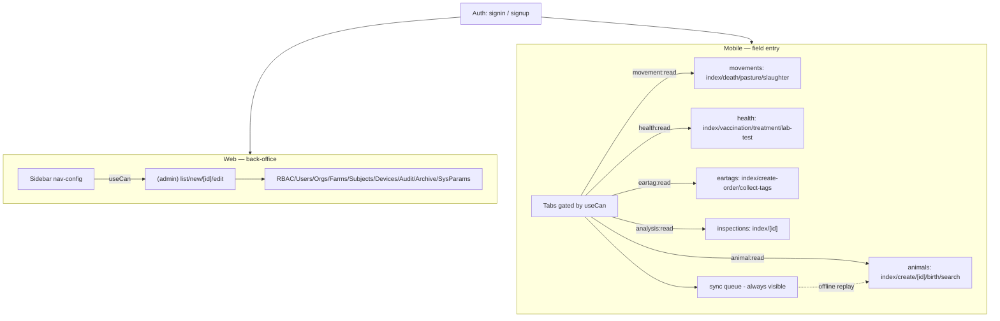

# ADR-0051: Web ↔ Mobile Page Matrix & Navigation Logic

| Key | Value |
| --- | --- |
| **Status** | Accepted |
| **Date** | 2026-07-09 |
| **Author** | Architecture Review |
| **Supersedes** | 0034 (Client Surface Inventory), 0039 (Navigation) |
| **Superseded** | — |

---

## Context

We need ONE reference that maps every screen to its surface (web/admin vs mobile/field), the
permission that gates it, and how screens relate + navigate — so a designer can acquire ready-made
screen sets (shadcn/web for web, RN Reusables for mobile) without re-deriving the domain model.
This is the concrete realization of ADR-0034 + ADR-0039, informed by ADR-0042 (permissions),
ADR-0049 (auth/session), ADR-0050 (contract sync), and the backend RBAC model (ADR-0022) + tRPC
surface (ADR-0032).

**Key finding from route enumeration (2026-07-09):** mobile owns the *field workflows*
(`animals/birth`, `movements/death|pasture|slaughter`, `health/vaccination|treatment|lab-test`,
`eartags/create-order|collect-tags`); web owns the *back-office* (`rbac`, `users`, `organizations`,
`farms`, `subjects`, `devices`, `audit`, `archive`, `system-parameters`, `feature-flags`). They are
**complementary**, not 1:1 mirrors — parity (ADR-0052) is about shared data + permissions, not
identical screens.

Permission literals below are the **seed catalog** values the frontend `useCan` already requests
(ADR-0050 §Context). They must migrate to the `Permissions` const (WO-100).

## Decision

Adopt the matrix + navigation model below as the canonical screen spec.

### A. Page Matrix (web ↔ mobile ↔ permission ↔ parity)

| Module | Web pages (`apps/web/app/(admin)/…`) | Mobile screens (`apps/mob/app/(tabs)/…`) | Permission(s) | Parity |
| ------ | ------------------------------------ | ----------------------------------------- | ------------- | ------ |
| Auth | `auth/[...path]`, root `page.tsx` | `(auth)/signin`, `(auth)/signup` | `authenticated` | Both |
| Dashboard | `dashboard` | `index` (Home) | `authenticated` | Both |
| Animals | `animals`, `animals/new`, `animals/[id]/edit` | `animals/index`, `animals/create`, `animals/[id]`, `animals/birth`, `animals/search` | `animal:read`/`create`/`write`/`register` | Mobile primary (has detail+birth+search; web has edit only) |
| Movements | `movements`, `movements/new`, `movements/[id]/edit` | `movements/index`, `movements/death`, `movements/pasture`, `movements/slaughter` | `movement:read`/`write` (+ `animal:death`) | Complementary (web generic CRUD, mobile sub-flows) |
| Ear Tags | `ear-tags` (list) | `eartags/index`, `eartags/create-order`, `eartags/collect-tags` | `eartag:read`/`order`/`supply`/`allocate` | Mobile primary (order+collect) |
| Passport | `passports` (list) | `passport/index`, `passport/[id]` | `passport:read`/`create`/`admin` | Mobile has detail; web list-only |
| Farm / Subject | `farms`+`new`+`[id]/edit`, `subjects`+`new`+`[id]/edit` | — (none) | `hk:farm`, `hk:subject`, `hk:address`, `hk:binding` | **Web-only** (back-office) |
| Health | `health` (list) | `health/index`, `health/vaccination`, `health/treatment`, `health/lab-test` | `health:read`/`write`/`admin` | Mobile primary (3 sub-flows) |
| Inspection | `inspections`, `inspections/new`, `inspections/[id]/edit` | `inspections/index`, `inspections/[id]` | `analysis:read`/`run` | Both list; web create/edit, mobile detail |
| Correction | `corrections` (list) | `corrections/index`, `corrections/[id]` | `correction:read`/`resolve` | Mobile has detail; web list-only |
| Notification | `notifications` | `notifications/index` | `notification:read`/`write`/`admin` | Both list |
| Archive | `archive`+`new`+`[id]/edit` | — (none) | `archive:read`/`write`/`destroy` | **Web-only** |
| IoT / Devices | `iot`, `devices`+`new`+`[id]/edit` | — (none) | `pda:sync`, `pda:import` | **Web-only** |
| Documents | `documents` | — (none) | `report:read` | **Web-only** |
| Admin (RBAC/Users/Orgs) | `rbac`, `users`+`new`+`[id]/edit`, `organizations`+`new`, `audit`, `feature-flags`, `system-parameters` | — (none) | `sm:roles:read`, `sm:users:read`, `sm:orgs:read`, `sm:audit:read`, `sm:modules:read`, `sm:sysparams:read` | **Web-only** |
| Profile / Settings | (user menu — TBD) | `explore` (Profile) | `authenticated` | Mobile has; web TBD |
| Sync | — (none) | `sync/index` (offline queue UI) | `authenticated` | **Mobile-only** (offline) |

### B. Screen Inventory (status: ✅ exists · 🟡 planned gap)

**Animals** — `animal:read` gate

- ✅ `animals/index` (mob list) · ✅ `animals` (web list) · ✅ `animals/create` (mob, `animal:create`) · ✅ `animals/new` (web, `animal:create`) · ✅ `animals/[id]` (mob detail) · ✅ `animals/[id]/edit` (web, `animal:write`) · ✅ `animals/birth` (mob, `animal:register`) · ✅ `animals/search` (mob) · 🟡 `animals/[id]` **web detail page** (web only has edit, no read-only detail).

**Movements** — `movement:read`/`write`

- ✅ `movements/index` (mob) · ✅ `movements` (web) · ✅ `movements/new` + `[id]/edit` (web) · ✅ `movements/death` (mob, `animal:death`) · ✅ `movements/pasture` (mob) · ✅ `movements/slaughter` (mob) · 🟡 `movements/[id]` (mob detail) · 🟡 `movements/create` (mob create, mirrors web new).

**Ear Tags** — `eartag:read`/`order`/`allocate`

- ✅ `eartags/index` (mob) · ✅ `ear-tags` (web list) · ✅ `eartags/create-order` (mob, `eartag:order`) · ✅ `eartags/collect-tags` (mob, `eartag:allocate`) · 🟡 `eartags/[id]` (mob order detail) · 🟡 `ear-tags/new` + `[id]/edit` (web order CRUD).

**Passport** — `passport:read`/`create`/`admin`

- ✅ `passport/index` (mob) · ✅ `passports` (web list) · ✅ `passport/[id]` (mob detail) · 🟡 `passports/new` + `[id]/edit` (web CRUD) · 🟡 `passport/issue|reprint|seize` (mob lifecycle flows, `passport:admin`).

**Health** — `health:read`/`write`/`admin`

- ✅ `health/index` (mob) · ✅ `health` (web list) · ✅ `health/vaccination` (mob, `health:write`) · ✅ `health/treatment` (mob) · ✅ `health/lab-test` (mob) · 🟡 `health/[id]` (mob animal health detail) · 🟡 `health/new` + `[id]/edit` (web CRUD + vaccine-batch admin).

**Inspection** — `analysis:read`/`run`

- ✅ `inspections/index` (mob+web) · ✅ `inspections/new` + `[id]/edit` (web, `analysis:run`) · ✅ `inspections/[id]` (mob detail) · 🟡 `inspections/create` (mob create flow) · 🟡 `inspections/[id]/edit` (mob edit).

**Correction** — `correction:read`/`resolve`

- ✅ `corrections/index` (mob+web) · ✅ `corrections/[id]` (mob detail) · 🟡 `corrections/[id]/edit` (mob resolve, `correction:resolve`) · 🟡 `corrections/[id]` (web detail).

**Notification** — `notification:read`/`write`

- ✅ `notifications/index` (mob+web) · 🟡 `notifications/[id]` (detail both).

**Farm / Subject** — `hk:farm`/`hk:subject` (web-only)

- ✅ `farms`+`new`+`[id]/edit` · ✅ `subjects`+`new`+`[id]/edit` · 🟡 mobile farm/subject *viewer* (read-only, if field workers need lookup).

**Archive / IoT / Documents / Admin** — web-only (back-office, no mobile parity by design).

### C. Navigation Logic

- **Web** — left sidebar built from `nav-config` sections; each item gated by `useCan(permission)`
  via `filterNavByPermissions` (fail-closed). Clicking a section → nested route stack
  `(admin)/<module>/[list | new | [id]/edit]`. List rows → `[id]/edit`. No separate detail page for
  most modules (edit doubles as detail) — gap noted in §B.
- **Mobile** — bottom tabs in `(tabs)/_layout`, each gated by `useCan(permission)` (fail-closed
  while loading). Tapping a tab → stack `(tabs)/<module>/[index | create | [id] | subflow]`.
  Auth gate: `(auth)` group renders before `(tabs)`. `sync` tab is always visible (offline queue).
- **Shared flow rule** — `list → detail/edit/create`. Create/edit commit via tRPC mutation
  (optimistic on web; queued in sync queue on mobile, WO-082). Permission missing ⇒ screen hidden,
  never shown-then-403.
- **Deep links** (WO-093) — notification/push → resolve to stacked screen; offline → deferred until
  connectivity, then replayed.
- **Root** — web `page.tsx` redirects to `dashboard` or `auth`; mobile `(tabs)/index` is Home.

## Implementation

The matrix (§A) + inventory (§B) + nav logic (§C) **are** the implementation spec — this ADR holds
no code. Realization path:
- **✅ existing screens:** wire to the `Permissions` const (WO-100); verify the `useCan` gate matches
  the seed literal already in `nav-config` / `(tabs)/_layout`.
- **🟡 gaps:** built under WO-094 (Livestock), WO-095 (Health), WO-096 (Inspections/Corrections);
  web detail pages + mobile create/edit flows are the bulk of the work.
- **Designer mapping:** each matrix row → a ready component set — web → shadcn (`@rocky/ui`);
  mobile → React Native Reusables. The permission column is the gating contract.
- **Navigation:** web sidebar from `nav-config` (already `useCan`-gated); mobile tabs from
  `(tabs)/_layout` (already gated, WO-085). Deep links resolve to stacked screens (WO-093).

## Consequences

- **Good:** one reference for designers; parity model clarified (complementary, not 1:1); gaps
  enumerated as concrete WOs; the permission column is the contract for `useCan` + the future
  `Permissions` const.
- **Bad / cost:** web needs detail pages it lacks; mobile needs create/edit flows it lacks; the
  matrix must be maintained as screens are added (ties to the ADR-0050 contract test, WO-101).

## Verification

- Every `nav-config` permission has at least one screen (web or mobile).
- Every mobile tab `useCan` literal has a screen.
- Every backend `@Policy` action (ADR-0022) maps to a screen permission (cross-check via WO-101).
- Mermaid nav graph renders.

## Anti-Patterns

- **1:1 web↔mobile mirroring** — wrong model; mobile is field-entry, web is back-office.
- **Permission strings inline** in screens — use the `Permissions` const (WO-100, ADR-0050).
- **Screens without a parent list** — every detail/edit/create hangs off a list route.
- **Shown-then-403** — gate entry with `useCan` (fail-closed), never navigate then reject.
