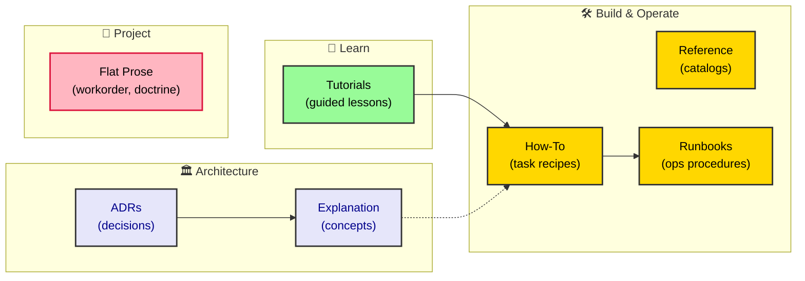

# ADR-0052: Documentation Architecture (Diátaxis + Audience)

| | |
|---|---|
| **Status** | Accepted |
| **Date** | 2026-07-11 |
| **Author** | Architecture Review |
| **Supersedes** | None |
| **Superseded** | None |

## Context

The repository accumulated **51 ADRs** (decision records) plus a scattering of
explanation/doctrine prose (`offline-architecture`, `diamond-seal-audit`,
`result-monad-and-error-sovereignty`, `router-design`, `router-patterns`,
`TESTING_DOCTRINE`, `workorder`) — all flat in `apps/docs/content/`, with a
single onboarding tutorial (`get-started`). The ADR corpus was normalized to the
ADR-0033 house standard and closed (no redundant overlap, all grounded in
verified code). Two guardians (`check:adrs`, `check:md-links`) enforce the
decision corpus in `ci:checks`.

The symptom after closure: the docs over-document the **exception** (the
decision/cut — 51 ADRs) and the **why** (explanation prose), but have **no
genre separation** for the everyday work — zero `how-to`, `reference`, or
`tutorial` structure. The daily task (how to *do* the work) is repressed into
the Real, while the fascinating object (the ADR) is lavished upon.

## Decision

Adopt the **Diátaxis** documentation taxonomy as the spine of `apps/docs/content/`,
with **ADR as a 5th "Decisions" section** (already existing). The four quadrants
plus Decisions:

| Section | Diátaxis quadrant | Audience | Repo folder |
|---|---|---|---|
| `tutorials/` | Tutorials (learning) | newcomer | ✅ created |
| `explanation/` | Explanation (understanding) | architect/reviewer | ✅ created (root prose linked) |
| `how-to/` | How-to (task) | practitioner | ✅ created (seeds) |
| `reference/` | Reference (facts) | lookup | ✅ created (TSDoc + catalogs) |
| `ADR/` | Decision records | architect/reviewer | ✅ existing, 51/51 |

- **Audience cross-cut** is realized through the root `_meta.ts` navbar
  (separators: *Learn / Architecture / Build & Operate / Project*) — Nextra's
  `type: 'separator'` + folder grouping, **not** duplicated content.
- **API Reference** is generated via Nextra's `TSDoc` component
  (`nextra/tsdoc`), realizing the repo's NoDrift ideology: docs *are* the
  types, so drift is impossible by construction. (Wiring it to the real
  `AppRouter` requires the docs app to resolve `@rocky/*` — a follow-up.)
- The existing **flat prose stays put** (no URL migration yet) to keep
  `check:md-links` green; `explanation/index.mdx` links to it as a temporary
  aggregate. A later move relocates each file into `explanation/`.

## Consequences

**Positive**
- Genre clarity: a reader knows *why* (ADR/explanation) vs *how* (how-to) vs
  *facts* (reference) vs *learn* (tutorials).
- Audience access without content duplication (navbar grouping only).
- TSDoc gives a real, auto-generated API surface — closing the earlier
  "TSDoc is a fetish" critique by giving it an actual home.

**Negative / Costs**
- More files to maintain (5 new folders + seeds).
- Seed stubs are intentionally incomplete; they must be fleshed out as work
  happens (guarded by ADR-0033 D2 — every new doc is an asset, not drift).

## Implementation

- `apps/docs/content/{tutorials,explanation,how-to,reference,runbooks}/` created.
- Each folder has an `index.mdx` (`asIndexPage: true`) as a landing.
- `how-to/` seeds: `add-trpc-router`, `add-domain-service`, `add-zod-validator`,
  `run-db-migration`, `write-docs-guardian`.
- `reference/` seeds: `api-reference` (TSDoc on a local type), `permissions-catalog`,
  `enums-catalog`, `error-codes`.
- `runbooks/` seeds: `db-recreate` (real procedure), `deploy`, `env-config`.
- Root `_meta.ts` rewritten with separators grouping the 5 sections + existing prose.
- `check:adrs` (now 52/52) and `check:md-links` (0 broken) remain green.

## Verification

- `pnpm check:adrs` → 52/52 conform (incl. this ADR).
- `pnpm check:md-links` → 0 broken (new files link only to existing pages).
- Build: `pnpm --filter docs build` renders the 5 new sections + TSDoc page.

## Anti-Patterns

- **Don't write how-tos as ADRs** — a task recipe is not a decision record.
- **Don't duplicate ADR claims in explanation/how-to** — reference the ADR
  instead (keeps the decision corpus the single source of *why*).
- **Don't couple the docs build to the workspace TS graph** without need —
  the TSDoc page proves the mechanism on a local type first; wiring `AppRouter`
  is an explicit follow-up.
- **Don't migrate the flat prose without updating inbound links** — that
  re-breaks `check:md-links`.

## Related ADRs

- [ADR-0033](/ADR/0033-frontend-mobile-adr-standard) — the ADR house standard
  this taxonomy sits beside.
- [ADR-0011](/ADR/0011-diamond-seal-layer-boundaries) / [ADR-0018](/ADR/0018-api-validator-design) —
  the layer + validator boundaries the how-to seeds reference.
- [ADR-0043](/ADR/0043-push-background-sync-deeplink) / [ADR-0044](/ADR/0044-livestock-domain-feature) —
  client-surface work that belongs to `tutorials`/`how-to`.
