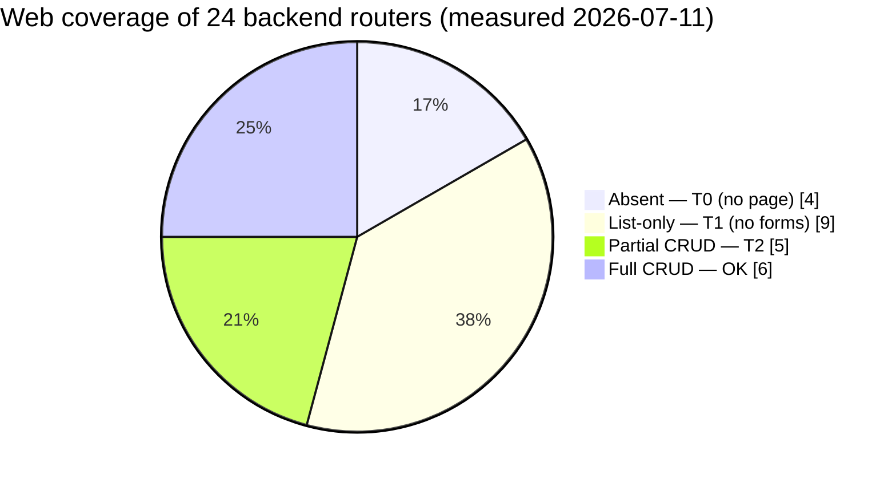

# ADR-0055: Web Admin Feature Parity with Backend

> The web admin is a list-only photograph of a living backend — **only 6 of 24 routers (~13% of 156 procedures) are fully actionable from the web today**. We ratify the program that makes every backend procedure an actionable web affordance.

| Key | Value |
| --- | --- |
| **Status** | Accepted |
| **Date** | 2026-07-11 |
| **Author** | Architecture Review (RobotFarm) |
| **Supersedes** | None |
| **Superseded** | None |

---

## Context

The backend exposes **24 routers / 156 procedures** — the full Symbolic order of the domain
(the generated `api-reference.mdx`, see ADR-0052). The web admin (`apps/web`, Admin Bot) invokes
**20 routers** but is *uneven*:

- **4 backend routers have no web page at all** — `farmBook`, `vsContract`, `vsAssignment`, `sync`.
- **9 of 24 admin areas are list-only** — they render a table but have *no* create/edit forms
  (confirmed by the absence of `*-create-form.tsx` components for `earTag`, `health`, `passport`,
  `correction`, `iot`, `notification`, `rbac`, `systemParameters`, `document`).
- The remainder are **partial CRUD** — pages exist with forms, but specific procedures are un-wired
  (`inspection.runRiskAnalysis`, `archive.markDestroyed`, `movement` death/slaughter/import variants,
  `organization` edit).

The consequence: the admin can *view* the Symbolic ledger but cannot *act* on the Real of the record.
For a regulatory veterinary system, view-only administration is a **fetish** — the photograph stands in
for the act.

### Coverage at a glance



Only **6 / 24 routers (25%)** reach full CRUD; **13 / 24 (54%) are absent or list-only**. Of the
156 backend procedures, roughly **13% are fully actionable from the web** today — the rest are
un-wired Mutations or absent surfaces.

### The 24-router coverage matrix

| Router | Procs | Web depth | Tier | Phase |
| --- | --- | --- | --- | --- |
| `animal` | 5 | CRUD ✓ | 🟢 OK | — |
| `audit` | 1 | list ✓ (complete) | 🟢 OK | — |
| `farm` | 4 | CRUD ✓ | 🟢 OK | — |
| `subject` | 6 | CRUD ✓ | 🟢 OK | — |
| `user` | 4 | CRUD ✓ | 🟢 OK | — |
| `modules` | 2 | used, no page | 🟢 minor | — |
| `archive` | 7 | CRUD − (no retention actions) | 🟣 T2 | 3 |
| `device` | 8 | CRUD − | 🟣 T2 | 3 |
| `inspection` | 8 | CRUD − (no risk analysis) | 🟣 T2 | 2–3 |
| `movement` | 15 | CRUD − (no death/slaughter/import) | 🟣 T2 | 2–3 |
| `organization` | 4 | list + new (no edit) | 🟣 T2 | 3 |
| `correction` | 7 | list-only | 🟡 T1 | 3 |
| `document` | 2 | list-only | 🟡 T1 | 3 |
| `earTag` | 17 | list-only | 🟡 T1 | 2 |
| `health` | 20 | list-only | 🟡 T1 | 2 |
| `iot` | 11 | list-only | 🟡 T1 | 3 |
| `notification` | 4 | list-only | 🟡 T1 | 3 |
| `passport` | 7 | list-only | 🟡 T1 | 2 |
| `rbac` | 6 | list-only | 🟡 T1 | 3 |
| `systemParameters` | 2 | list-only | 🟡 T1 | 3 |
| `farmBook` | 4 | **no page** | 🔴 T0 | 1 |
| `sync` | 2 | **no page** (mobile-owned) | 🔴 T0 | 1 |
| `vsAssignment` | 6 | **no page** | 🔴 T0 | 1 |
| `vsContract` | 5 | **no page** | 🔴 T0 | 1 |

Backend dependencies (ADR-0033 §D4): tRPC surface → ADR-0032; validators / Diamond Seal → ADR-0018 /
ADR-0019; permission UI → ADR-0042 / ADR-0022; auth/session → ADR-0049; domain rules → ADR-0023 /
ADR-0024 / ADR-0025 / ADR-0026 / ADR-0027 / ADR-0028 / ADR-0029 / ADR-0030 / ADR-0031.

## Decision

Adopt a **phased program** to bring `apps/web` to **full parity with the backend tRPC surface**, defined as:
every backend procedure has a corresponding web affordance (list / create / edit-detail / state-transition
action), Zod-validated via `@rocky/validators`, RBAC-gated via `@rocky/authorization` permissions (the routers
already carry `@Policy`), with standard empty/error/toast states.

The pie above is the *current state*; the flowchart below is the *plan* that closes it.

```mermaid
flowchart LR
  subgraph T0["Tier 0 — no page (4 routers)"]
    A1["farmBook"] A2["vsContract"] A3["vsAssignment"] A4["sync (monitor)"]
  end
  subgraph T1["Tier 1 — list-only (9 routers)"]
    B1["earTag 17"] B2["health 20"] B3["passport 7"] B4["correction 7"]
    B5["iot 11"] B6["notification 4"] B7["rbac 6"] B8["systemParameters 2"] B9["document 2"]
  end
  subgraph T2["Tier 2 — partial CRUD (5 routers)"]
    C1["inspection 8"] C2["movement 15"] C3["archive 7"] C4["device 8"] C5["organization 4"]
  end
  P0["Phase 0: Scaffold + RBAC gate"] --> P1["Phase 1: Tier 0"]
  P1 --> P2["Phase 2: Tier 1 lifecycle"]
  P2 --> P3["Phase 3: Tier 1 + T2 deepen"]
  P3 --> P4["Phase 4: Polish + check:web-parity"]
  T0 --> P1
  T1 --> P2
  T2 --> P3
  classDef t0 fill:#FFB6C1,stroke:#DC143C,stroke-width:2px,color:black
  classDef t1 fill:#FFD700,stroke:#333,stroke-width:2px,color:black
  classDef t2 fill:#E6E6FA,stroke:#333,stroke-width:2px,color:darkblue
  classDef ph fill:#98FB98,stroke:#333,stroke-width:2px,color:black
  class A1,A2,A3,A4 t0
  class B1,B2,B3,B4,B5,B6,B7,B8,B9 t1
  class C1,C2,C3,C4,C5 t2
  class P0,P1,P2,P3,P4 ph
```

## Consequences

### Positive

- **Regulatory completeness** — issue/seize/reprint passports, run vaccination/treatment cycles, execute the
  ear-tag 6-stage lifecycle, manage VS contracts/assignments: all actionable from the back office.
- **RBAC-correct** — action visibility tied to each router's `@Policy` permission (ADR-0042).
- **Parity is enforced** by a `check:web-parity` CI guardian, preventing regression of the gap.

### Negative / Cost

- **Large program** (~5 phases, ~156 procedure-affordances). Phase 0 scaffold is prerequisite effort before
  feature velocity is reached.
- **Risk of Jouissance** — per-feature hand-rolled forms. Mitigated by the Phase 0 reusable `<EntityPage>` /
  `<ResourceForm>`.

### Neutral

- `sync` stays mobile-owned; web receives a read-only monitor, not CRUD.
- `audit` (1 proc) is already at parity (list-only is complete for it). `modules` is invoked but has no
  dedicated page (tracked as minor).

## Implementation

Owning Bot: **Admin Bot** (`apps/web`). RobotFarm pass: this ADR + **WO-123** in `workorder.md`; no root
`AGENTS.md` scope change (Admin Bot contract unchanged).

- **Phase 0 — Web CRUD scaffold & RBAC foundation:** build one reusable `<EntityPage>` / `<ResourceForm>` from
  `@rocky/ui` + `@rocky/validators` + `trpc`, plus a client permission-gating hook (extends WO-105
  `permissions-core`). After this, closing a gap is ~1 file per feature, not 5.
- **Phase 1 — Tier 0 (presence):** `vsContract` (5) → `vsAssignment` (6) → `farmBook` (4) → `sync` (read-only
  monitor). ~17 procs. VS workflow + farm book are legally mandatory.
- **Phase 2 — Tier 1 lifecycle depth:** `earTag` (17) → `health` (20) → `passport` (7) → deepen `movement` +
  `inspection` (risk analysis). The regulatory core made actionable.
- **Phase 3 — Tier 1 remainder + Tier 2 deepen:** `correction` → `iot` → `archive` (retention) → `document`
  (generate) → `notification` → `rbac` → `systemParameters` → `organization` (edit) → wire missing procs in
  `device` / `animal` / `farm` / `subject` / `user`.
- **Phase 4 — Polish + institutionalize parity:** dashboard analytics across domains; pagination/filter
  standard; e2e for the critical path (animal→passport→movement→earTag→health); add a **`check:web-parity`**
  guardian that diffs the backend router/procedure surface (`api-reference.mdx`) against the routers the web
  actually invokes (`trpc.<router>` usage in `apps/web`).

## Verification (Definition of Done)

```bash
ls apps/docs/content/ADR/0055-*.md                 # exists in canonical set
rg -n "ADR-00(18|19|22|32|42|49|50|51)" 0055-*.md  # ≥1 backend/contract dep cited
rg -n "WO-123" apps/docs/content/workorder.md       # tracking entry present
# per-phase, once built:
node scripts/check-web-parity.mjs                   # exit 0: every backend router invoked by web (sync exempt)
```

Target state: web invokes all 24 routers (`sync` exempt as monitor); every Mutation has a form/action;
`pnpm check:web-parity` green; `pnpm ci:checks` green.

## Anti-Patterns (do not repeat)

1. **List-only fetish** — shipping a table with no create/edit/action. Viewing is not administering.
2. **Per-feature form Jouissance** — hand-rolling a form per domain instead of the Phase 0 scaffold.
3. **RBAC-blind actions** — wiring a Mutation button without gating on the router's `@Policy` permission.
4. **Hardcoded literals** — duplicating Zod/permission strings instead of importing `@rocky/validators` /
   `Permissions` (ADR-0050).
5. **Silent gap** — adding a backend procedure with no web affordance and no `check:web-parity` guard.


## Decomposition (per-tier ADRs)

ADR-0055 is the charter; the domain detail lives in per-tier ADRs so no single
document becomes a 2000-line monolith (ADR-0055 §Anti-Patterns). Each plans every
domain's frontend representation with a distinctive design signature.

- **ADR-0056** — Web UI: Tier 0 (Presence) — `farmBook`, `vsContract`, `vsAssignment`, `sync` → Phase 1.
- **ADR-0057** — Web UI: Tier 1 Lifecycle (Regulatory core) — `earTag`, `health`, `passport` → Phase 2.
- **ADR-0058** — Web UI: Tier 1 Operational — `correction`, `iot`, `notification`, `rbac`, `systemParameters`, `document` → Phase 3.
- **ADR-0059** — Web UI: Tier 2 Deepen — `archive`, `device`, `inspection`, `movement`, `organization` → Phase 3.

The 24-router coverage matrix above remains the index.

## Related ADRs

- **ADR-0050** — Frontend ↔ Backend Contract Synchronization (code-level contract, not UI parity).
- **ADR-0051** — Web↔Mobile Page Matrix & Navigation Logic (web vs mobile pages, not web vs backend).
- **ADR-0052** — Documentation Architecture (hosts `api-reference.mdx`, the parity source of truth).
- **ADR-0032** — tRPC Output Schema (the backend surface).
- **ADR-0042 / 0022** — Permission-Aware UI / Authorization Policy Engine (RBAC gating).
- **ADR-0049** — Client Auth & Session.
- **ADR-0018 / 0019** — Validator Diamond Seal (input/output schemas).
- Domain ADRs: **0023** (traceability), **0024** (earTag), **0025** (animal/movement), **0026** (health),
  **0027** (farm/subject), **0028** (inspection), **0029** (passport/archive), **0030** (ruleset),
  **0031** (iot).
