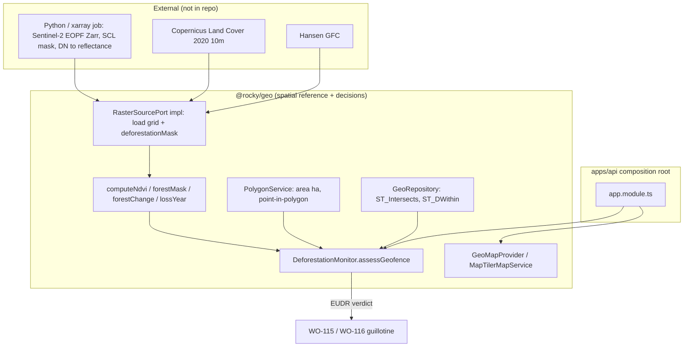

# ADR-0079: Geo Map-Provider Abstraction & Deforestation Raster Overlay (ADR-0063 Resolution)

> We end the fetishistic disavowal: EUDR due-diligence stops pretending a declared date *is* a satellite check. Geo now owns the map-provider boundary **and** the deforestation raster decision seam — both swappable, both testable.

| Key | Value |
| --- | --- |
| **Status** | Accepted |
| **Date** | 2026-07-12 |
| **Author** | Geo Bot / Architecture Review |
| **Supersedes** | None |
| **Superseded** | None |

---

## Context

`packages/geo` (`@rocky/geo`) is the spatial reference service extracted from IoT by **ADR-0078** — it answers "where", never "may". It owns geofences, disease zones, and animal geofence events.

The EUDR due-diligence guillotine (**ADR-0063**) currently checks deforestation via a *declared date* (`deforestation_free_since`), not a satellite overlay. ADR-0063 is honest about this lack:

> *"Rocky has no deforestation raster layer. The check is **logical** (a declared date), not a satellite overlay... a real satellite/raster overlay can later replace the date check."*

That is the symptom of a repressed contradiction. We now have (a) a map provider (MapTiler Cloud) and (b) the means to ingest **Sentinel-2 (EOPF Zarr / xarray)** NDVI, **Copernicus Land Cover 2020 (10 m)**, and **Hansen Global Forest Change** rasters. The decision is therefore no longer "if" but "how to own it without coupling geo to one vendor or to Python data plumbing."

Two ideological traps must be avoided:

- **Vendor lock-in** — MapTiler Cloud is a convenience, not the Big Other of sovereign geospatial infra. Callers must not know which provider serves them.
- **The heavy-lifting fetish** — downloading Sentinel-2 Zarr, SCL cloud-masking, DN→reflectance scaling, is an external Python/xarray job (the shared notebook). TypeScript owns the *per-pixel decision*, not the download.

## Decision

1. **Map-provider abstraction.** `GeoMapProvider` is the interface (`forwardGeocode`, `reverseGeocode`, `staticMapUrl`, `elevationAt`, `coordinateTransform`, `geolocation`). `MapTilerMapService` (backed by `@maptiler/client`) is the current implementation. A self-hosted map server implements the same interface and is swapped in at the composition root (`app.module.ts`) with **zero caller change**.

2. **Spatial engine.** `PolygonService` — pure, deterministic geometry with no DB/network:
   - axis-order normalization (EPSG:4326 is lat-first per spec; GeoJSON + PostGIS are lng-first — the ADR-0054 R1 "axis-order trap"),
   - geodesic polygon area in hectares (the **> 4 ha** classification boundary),
   - haversine distance, point-in-polygon, radius containment, ring validation.
   Fully unit-tested so the EUDR guillotine has a sovereign, side-effect-free truth.

3. **Deforestation raster seam.** `RasterSourcePort` (kinds `sentinel2_ndvi` | `land_cover_2020` | `hansen_gfc`). `DeforestationMonitor.assessGeofence()` overlays a raster grid against a geofence polygon (reusing `PolygonService`) and returns an EUDR-ready verdict (`compliant`, `deforestedPixels`, `deforestationFreeSince`). Pure kernels — `computeNdvi`, `forestMask`, `forestChange`, `lossYear` — port the exact per-pixel math of the Sentinel-2/xarray notebook (NDVI = (B08−B04)/(B08+B04), forest mask NDVI ≥ 0.7, year-over-year change) to typed arrays, so they run anywhere and are testable.

4. **Graceful fallback.** `NoDataRasterSource` is the default wiring: no raster coverage ⇒ no deforestation can be proven ⇒ fall back to the declared date (ADR-0063's current logical behavior). A real Sentinel-2 / Land Cover 2020 backend implements the port — the gate stays permissive until then.

5. **EUDR traversal + overlay in the repository.** `GeoRepository.findGeofencesForAnimalPastures` (pastures touched → geofences), `findGeofencesIntersectingPolygon` (the `ST_Intersects` seam the raster overlay reuses), and `findActiveDiseaseZonesNearFarm` (proximity via `ST_DWithin` in **metres** over `::geography` — the WO-119 / AHL 2016/429 reuse).

6. **MapTiler ToS caveat.** Geocoding and static-map results are licensed for *client-side* use and must not be stored/redistributed. Server-side use here is a transitional convenience; review the ToS before production rollout.

## Consequences

- **ADR-0063's assumption is resolved.** EUDR due-diligence can now be fed by real satellite deforestation data instead of a declared date; the `NoDataRasterSource` keeps the gate backward-compatible until a backend is wired.
- **No vendor lock-in.** MapTiler swaps for a self-hosted `GeoMapProvider` with no caller change.
- **Sovereign geometry.** `PolygonService` gives the WO-115/WO-116 guillotine a computed >4 ha boundary, not an asserted one.
- **New test surface.** Polygon engine + deforestation kernels are unit-tested in `packages/geo/src/services/*.test.ts`.
- **Risk (accepted).** `MapTilerMapService` server-side use is a ToS transitional convenience; revisit before production.

## Implementation

- `packages/geo/src/services/map.service.ts` — `GeoMapProvider`, `MapTilerMapService`.
- `packages/geo/src/services/polygon.service.ts` — `PolygonService` + pure kernels.
- `packages/geo/src/services/deforestation.service.ts` — `RasterSourcePort`, `DeforestationMonitor`, `NoDataRasterSource`, kernels.
- `packages/geo/src/repositories/geo.repository.ts` — EUDR traversal, `ST_Intersects`, `ST_DWithin`.
- `packages/geo/src/errors/geo.errors.ts` — geometry + map-provider error codes.
- `apps/api/src/app.module.ts` — wires `GeoRepository`, `GeoService`, `PolygonService`, `MapTilerMapService`, `DeforestationMonitor`.

### References

- **ADR-0053** — Geo Module: INSPIRE / NUTS-LAU hierarchy + PostGIS polygons + LPIS cadastre.
- **ADR-0054 R1** — Geometry / axis-order discipline (> 4 ha = polygon; ≤ 4 ha = point, ≥ 6 decimals).
- **ADR-0063** — EUDR due-diligence (the assumption this ADR resolves).
- **ADR-0064** — Disease-Zone Spatial Block (WO-119 / AHL 2016/429).
- **ADR-0078** — Geo spatial service package extraction.
