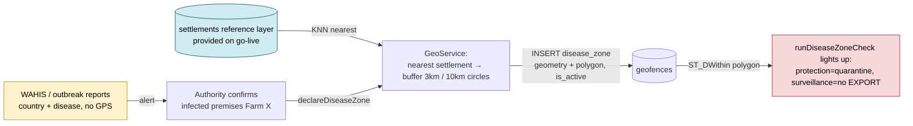

# ADR-0080: Disease-Zone Data Collection & Declaration Workflow (WO-119)

> The block (ADR-0064) is built, but the data cannot reach it. This ADR resolves the
> latent contradiction: a regulatory guillotine with no populated trigger. **Zones are
> anchored to the nearest settlement (village/town) and derived as geodesic circles — not
> hand-drawn by vets/farmers, and not centered on the infected premises.**

| Key | Value |
| --- | --- |
| **Status** | Accepted |
| **Date** | 2026-07-12 |
| **Author** | Architecture Review (prompted by user directive) |
| **Supersedes** | None |
| **Superseded** | None |
| **Related** | WO-119 · ADR-0064 (Disease-Zone Spatial Block) · ADR-0078 (Geo Spatial Service) · ADR-0053 (PostGIS) · ADR-0054 (RuleSet radii, AHL 2016/429) · ADR-0033 (doc standard) |

---

## Context

ADR-0064 shipped the disease-zone *block*: `runDiseaseZoneCheck` (now owned by the
Geo package) intersects a farm's `farms.location` against active `disease_zone`
geofences via `ST_DWithin(geofences.polygon::geography, farms.location::geography, meters)`.
ADR-0064 §Consequences explicitly **deferred the declaration workflow** — "it only
needs to `INSERT` a `disease_zone` geofence; the block lights up automatically."

Several contradictions press on the Real:

1. **The data path had a hole.** The only creation path was the generic `createGeofence`
   mutation, whose service wrote `geometry` (jsonb) but **never set `polygon` (PostGIS)**.
   The check intersects on `geofences.polygon`, so a zone created that way was invisible to
   the block (`ST_DWithin(NULL, …)` is `NULL`). **Resolved:** `declareDiseaseZone`
   (and the `createGeofence` mirror) now dual-write `geometry` + `polygon`.

2. **Vets and farmers do not draw catastrophe shapes.** It is unrealistic to expect field
   staff to hand-draw protection/surveillance polygons. The authoritative reference data —
   a **settlements layer** (villages/towns) plus the **outbreak reports** — is
   **provided to us** on go-live, not authored interactively. Therefore the zone anchor is
   the **nearest settlement** to the infected premises, and the zone itself is a **circle
   derived by buffering** that settlement center (geodesic), not a drawn polygon. The
   disease is reported "as it happened in the nearest village or town."

3. **WAHIS is an alert feed, not a geometry source.** The European outbreak events carry
   **country + disease + report-number**, never infected-premises GPS. Under AHL 2016/429
   Art.21-22 the protection (3 km) / surveillance (10 km) zones are concentric around a
   point — here, the **nearest settlement**, not WAHIS. Feeding WAHIS country polygons
   as zone geometry would be regulatory nonsense.

Backend dependencies (ADR-0033 §D4): spatial query → ADR-0078 (Geo owns the *where*);
PostGIS polygon → ADR-0053; radii → ADR-0054; doc standard → ADR-0033.

## Decision

**Disease zones are collected by per-premises declaration, anchored to the nearest
settlement, and derived as geodesic circles — not hand-drawn, and not centered on the
infected premises.**

1. **Anchor = nearest settlement; shape = geodesic circle (AHL 2016/429).** A confirmed
   notifiable-disease holding (`farms` row) is declared infected. The system resolves the
   farm's `farms.location`, finds the **nearest village/town** via a KNN query
   (`ORDER BY location <-> point LIMIT 1`) over the provided `settlements` reference layer,
   and derives a PROTECTION (3 km) and a concentric SURVEILLANCE (10 km) `disease_zone`
   geofence as **buffers (geodesic circles via `PolygonService.geodesicCircle`)** around that
   settlement center. Radii come from `RuleSet.thresholds.protectionZoneKm` /
   `surveillanceZoneKm` (never hardcoded — ADR-0054 mandate); 3 km / 10 km are the AHL
   floors. The settlement name is the public label (`cadastralReference`). If no settlement
   is known, the farm point is the fallback anchor.

2. **The declaration lives in Geo (the spatial owner, ADR-0078).** A
   `GeoService.declareDiseaseZone(farmId, disease, opts)` that:
   - resolves the farm point (`farms.location` via `GeoRepository.findFarmLocation`),
   - resolves the anchor (`GeoRepository.findNearestSettlement(lng, lat)` — KNN),
   - buffers the anchor into **two** geodesic rings (`geodesicCircle(center, radiusMeters, 64)`),
   - persists **two** `disease_zone` geofences with `is_active=true`, `farm_id`,
     `name` (e.g. `"Springfield — Protection (3 km)"`), `cadastralReference` (settlement
     name), `disease` reference, and — critically — writes **both `geometry` (jsonb) and
     `polygon` (PostGIS WKT)**.

3. **Polygon dual-write is mandatory, not optional.** The check intersects
   `geofences.polygon::geography`. `declareDiseaseZone` derives `polygon` from `geometry`
   (a `circle` geometry → geodesic ring closed into `ST_GeomFromText('POLYGON((...))', 4326)`;
   a `polygon` geometry is passed through). Without this the block is dead. The `createGeofence`
   mirror shares the same dual-write.

4. **Reference data is provided to us, not authored in-app.** The `settlements` reference
   table (id, name, settlement_type, location point) is **ingested** (provided on go-live);
   `GeoRepository.listSettlements` / `insertSettlement` support that ingestion. Outbreak
   reports likewise arrive as data, not as interactive form input. No vet/farmer UI draws
   catastrophe shapes.

5. **WAHIS is an upstream alert layer, never the geometry source.** A `waHisImport` (or
   manual) job ingests outbreak reports → country/disease *status* records that alert the
   authority. Confirmation of an infected premises then triggers the per-premises
   declaration. The EU event corpus is the alert source; it never directly creates zones.

6. **Zones are time-bound (AHL).** A `validTo` plus a deactivation path (or scheduled
   job) flips `is_active=false` so the block clears when the outbreak is resolved.
   `findActiveDiseaseZonesNearFarm` already filters `is_active=true`.



## Consequences

### Positive

- The gate and its data are finally connected: declaring an infected farm makes the
  movement block fire with no further wiring (ADR-0064 promise realised).
- AHL-correct: zones are settlement-centric concentric circles; radii jurisdiction-overridable
  via RuleSet (3 km / 10 km are floors, not caps).
- Operationally honest: the anchor is the nearest village/town (a provided reference layer),
  and zones are buffered circles — no vet/farmer hand-draws catastrophe polygons.
- WAHIS is reused as an alert feed without distorting geometry (no false country polygons).
- No new "zone" table — reuses `geofences` (`fence_type='disease_zone'`) plus a
  `settlements` *reference* table for the anchor lookup.

### Negative / Cost

- Must build `declareDiseaseZone` (Geo) + a `PolygonService.geodesicCircle(center, radiusMeters, segments)`
  helper (was absent — PolygonService had haversine/area/point-in-polygon but no buffer). **Done.**
- Must ingest the `settlements` reference layer (`settlements` table + pgEnum + RLS) and
  expose `GeoRepository.findNearestSettlement` / `listSettlements` / `insertSettlement`. **Done (schema + service; migration pending push).**
- Must fix `createGeofence` (IoT + Geo mirror) to dual-write `polygon`. **Done.**
- Reference data (settlements + outbreak reports) must be **provided on go-live**; until
  then `findNearestSettlement` falls back to the farm point.

### Neutral

- Movement `runDiseaseZoneCheck` already consumes `GeoService` (relocated in the Option-A
  reconciliation, ADR-0078); no movement-side change needed.
- MapTiler (`MAPTILER_API_KEY` in `apps/api/.env`) only visualises zones (UX highlight of
  `movement.diseaseZoneCheck`); it is unrelated to collection.

## Implementation

- **Owning Bot:** Geo Bot (`packages/geo`).
  - `settlements` reference table in `@rocky/database` (`schema/an/settlements.ts`):
    `id`, `name`, `settlement_type` (pgEnum `settlement_type`: village/town/city),
    `location` (point geometry), `created_at`; RLS = public select, admin write.
  - `GeoRepository.findFarmLocation(farmId)` (WKT point → lat/lng),
    `findNearestSettlement(lng, lat)` (KNN `<->`), `listSettlements()`, `insertSettlement()`.
  - `PolygonService.geodesicCircle(center: LatLng, radiusMeters, segments=64): LatLng[]`
    — direct geodesic, auto-closed ring.
  - `GeoService.declareDiseaseZone(farmId, disease, opts)` → 2 `disease_zone` geofences
    (protection/surveillance) dual-written; `listDiseaseZones`, `listSettlements`.
  - `apps/api/src/routers/geo.router.ts`: `geo.declareDiseaseZone` (Mutation),
    `geo.listDiseaseZones` (Query), `geo.listSettlements` (Query) — all
    `@Policy({ authenticated: true })` + `GEO_TRPC_ERROR_MAP`.
- **RobotFarm pass:** update Geo `AGENTS.md` (settlement-anchored circular declaration +
  provided reference data + polygon dual-write gotcha); update root `AGENTS.md` Geo Bot
  description; note in `WORKORDER` if tracked.
- **Pending external step:** push the `settlements` migration (`pnpm generate` +
  `scripts/fix-rls-sql.mjs` + `psql`) and ingest the provided reference data.

## Verification (Definition of Done)

```bash
# 1. The ADR exists in the canonical set and cites its backend dependencies
ls apps/docs/content/ADR/0080-disease-zone-data-collection.md
rg -n "ADR-00(64|78|53|54)" apps/docs/content/ADR/0080-disease-zone-data-collection.md

# 2. Declaration writes two circular zones, anchored to the nearest settlement, with non-null polygon
pnpm --filter @rocky/geo test
#   declareDiseaseZone test asserts: 2 zones, polygon != null, is_active=true,
#   names contain the settlement + "Protection (3 km)" / "Surveillance (10 km)".

# 3. End-to-end: declare, then the check fires
#    declareDiseaseZone(farmX, disease) -> movement.diseaseZoneCheck(farmX) => inProtectionZone: true
```

## Anti-Patterns (do not repeat)

1. Creating disease zones via `createGeofence` **without setting `polygon`** — the block
   silently never fires (the hole this ADR closes).
2. Using WAHIS **country polygons** as zone geometry — AHL requires a point-anchored zone;
   WAHIS list data has no premises GPS.
3. Hardcoding `3 km` / `10 km` instead of `RuleSet.thresholds` (ADR-0054 sovereignty floors).
4. Bulk-importing outbreak reports as zones — alerts are not infected holdings.
5. **Centering zones on `farms.location`** — the anchor is the **nearest settlement**, and the
   shape is a **buffered circle**, not the infected premises.
6. **Expecting vets/farmers to hand-draw catastrophe polygons** — the authoritative
   `settlements` layer + outbreak reports are **provided to us**; zones are derived by buffering.

## Related ADRs

- **ADR-0064** — Disease-Zone Spatial Block (the `runDiseaseZoneCheck` gate this feeds).
- **ADR-0078** — Geo Spatial Service (owns the *where*; declaration lives here).
- **ADR-0053** — PostGIS polygons / `geofences.polygon`.
- **ADR-0054** — RuleSet radii + AHL 2016/429 Art.21-22.
- **ADR-0033** — ADR house standard (this document conforms).
