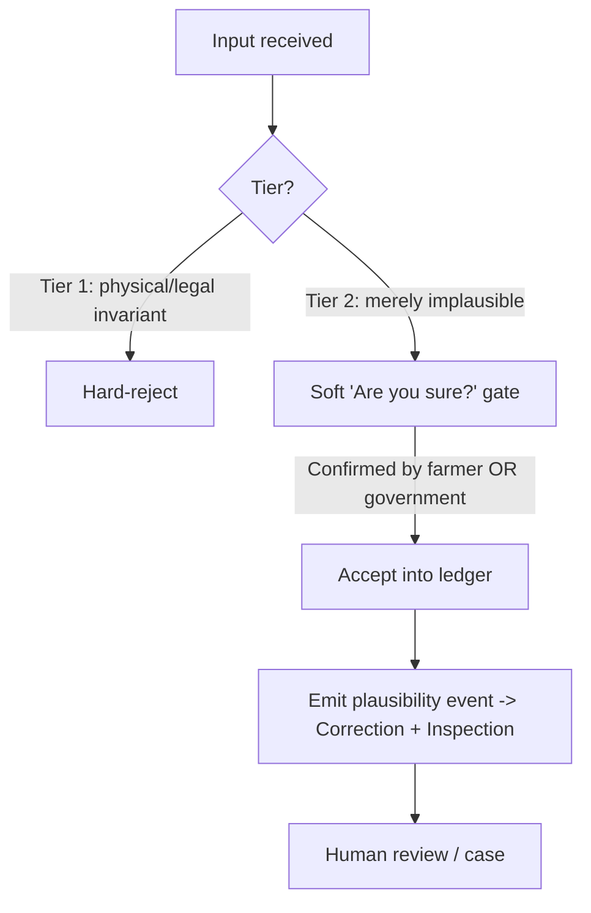

# ADR-0081: Accept-and-Flag Validation Doctrine (plausibility over rejection)

> The registry must ingest the Real, not the bureaucracy. Reject the impossible; flag the merely-implausible.

| Key | Value |
| --- | --- |
| **Status** | Proposed |
| **Date** | 2026-07-12 |
| **Author** | Architecture Review |
| **Supersedes** | None |
| **Superseded** | None |

---

## Context

An I&R registry lives or dies on the *quality of its mess*. At go-live the data is
inherently inconsistent: a cow recorded as calving at six months, a sale to a buyer
who was never enrolled, contradictory movement dates, missing documents. The force of
circumstance is that **rigidity causes more damage than the inconsistency it rejects** —
farmers either abandon the system or enter lies to pass validation, and the audit trail
the registry exists to protect is lost.

Today the model encodes the bureaucracy, not the Real:

- `MovementResponse` / `CreateMovementRequest` model the counterparty as `toFarmId` — a
  **registered farm UUID** (non-nullable in the response). A private sale to an
  off-system individual has no `toFarmId` to give, so the movement is effectively
  rejected.
- `RecordMarketTransactionRequest` demands `sellerFarmId`, `buyerFarmId`, `marketFarmId`
  — all registered farms. No external party exists in the type.

The eartags + movement modeling is the worst offender — "worse than a bull having a
baby." This ADR sets the governing doctrine so those domains can be fixed *consistently*
rather than with ad-hoc phantom holdings.

Depends on: validators → ADR-0018 / ADR-0019; tRPC → ADR-0032; outbox / cross-domain
events → ADR-0012 / ADR-0014; web parity → ADR-0055; Correction Bot plausibility engine
(consumes Tier-2 events).

## Decision

Validation is **two-tier**. Only Tier 1 is hard; everything else is accepted and flagged.

- **Tier 1 — Hard invariants (hard-reject).** A *minimal, explicit, government-ratified*
  set of physical / legal truths. The canonical example: a dead or slaughtered animal
  **cannot move** — that is the terminus of the lineage, not a preference. Seizure locks
  are another. The set MUST be enumerated and ratified; it is not open-ended.
- **Tier 2 — Plausibility violations (accept + flag).** The input is written to the
  ledger. A soft **"Are you sure?"** confirmation guards against a genuine data-entry
  error. Acceptance requires confirmation from **either** the submitting farmer **or**
  the government. On acceptance, a **plausibility event** is emitted via the existing
  `OutboxEventPublisher` → Correction Bot plausibility engine + Inspection
  `flagFarmForInspection`. Tier 2 is **never** hard-rejected.



## Consequences

### Positive

- The audit trail is preserved even for impossible-looking records.
- Farmer trust: the system accepts their reality instead of blocking it.
- Inspector effort is *targeted* (events) rather than *blocking* (rejections).
- eartags + movement can be modelled truthfully (external counterparty, nullable
  `toFarmId`) instead of with phantom holdings.

### Negative / Cost

- Review workload on Correction / Inspection increases (bounded by event routing).
- Requires the Tier-1 set to be explicitly enumerated and ratified (governance task).
- Concrete schema changes for movement / eartags are *deferred until ratification*
  (see Open Questions).

### Neutral

- The event plumbing (OutboxEventPublisher, `MOVEMENT_RECORDED`, `flagFarmForInspection`)
  already exists; this ADR mainly changes the *default stance*, not the machinery.

## Implementation (pending ratification — NO validator / DB mutation yet)

Owning Bots (RobotFarm pass on root `AGENTS.md`):

- **Validation Bot** — annotate intent in validators (reference this ADR). **No logic
  change** until the allow/deny list is confirmed.
- **Movement Bot / EarTag Bot** — emit plausibility events on Tier-2 cases (external
  counterparty, implausible dates) post-ratification.
- **Correction Bot** — plausibility engine consumes Tier-2 events (Rule 2 already exists).
- **Inspection Bot** — `flagFarmForInspection` on Tier-2 events (already wired from Health).
- **Execution Bot** — `OutboxEventPublisher` (exists).
- **Frontend Bot** — "Are you sure?" confirm dialogs + event visibility for the farmer /
  government confirmation path.

> Discipline: this ADR is **live (Proposed)**. Only the *enumeration of what we allow vs
> deny* awaits confirmation. It is **not** "on hold" like DB encryption, which is parked
> to end-of-program.

## Verification (Definition of Done)

```bash
ls apps/docs/content/ADR/0081-*.md                 # exists in canonical set
rg -n "ADR-00(18|19|32|12|14)" 0081-*.md           # >=1 backend dep cited
rg -n "ADR-0081" packages/validators/src/api/{movements,eartags}.api.ts  # intent annotated
rg -n "complianceOptionsSchema" packages/validators/src/compliance/compliance-options.ts  # tri-state options exist
# Post-ratification only:
rg -n "plausibility" packages/domains/movement/src/services/*.ts         # event emitted on Tier-2
```

## Resolved rulings (governance confirmation received)

1. **Off-system buyer (movement):** `toFarmId` **NULLABLE** + external counterparty
   (`buyerName` / `buyerExternalRef`). **Mandatory disease-control trace:** the
   *previous owner* (seller) is queried for the buyer's identity — tracking the
   counterparty is legally required (likely criminally punishable if omitted). Accept
   - flag + capture counterparty via seller.
2. **Suspicious new eartag administered:** ACCEPT (Tier 2) + **notify** a responsible
   party (procedure TBD). No hard-reject.
3. **Live cow → slaughterhouse movement:** regulated **max 8-hour** transport window.
   Exceeding it is a Tier-2 plausibility flag (suspicious transport), not a hard-reject.
   Ownership changes at slaughter; carcass / meat tracking is recognised "in theory"
   (which cow → which market is known) but its implementation scope is **undecided**.
4. **Eartag return at slaughter:** the **SLAUGHTERHOUSE** is responsible for returning
   the tag — a tracking obligation attached to the movement-to-slaughter. Lost /
   destroyed tags are processed by a **vet** (required procedure), not auto-closed.

## Governance as config (open questions → tri-state options)

The open questions are NOT left as free-floating "answer pending" blockers. Each is
modeled as a **tri-state option** in `complianceOptionsSchema`
(`@rocky/validators/compliance`) — so it can be **decided or left undecided per
circumstance** (jurisdiction / deployment / RuleSet), and the system degrades to
accept-and-flag instead of blocking:

- **Boolean option** — `true` = ON, `false` = OFF, `undefined` = UNDECIDED.
- **Numeric tolerance** — `number` = SET (slider value, e.g. transport-window hours,
  gestation days), `undefined` = UNDECIDED.

`undefined` is the default posture. `resolveComplianceOption()` /
`resolveComplianceTolerance()` classify the state; an `"undecided"` result means the
caller ACCEPTS the input and emits a plausibility event (Tier 2) rather than rejecting.
This is the accept-and-flag doctrine applied to governance itself: the question stays
*configurable*, never *blocking*.

`COMPLIANCE_OPTIONS_DEFAULTS` pre-sets the four hard operational realities + the one
ratified threshold (8h slaughter transport window) so the system never drifts into the
bureaucrat's fantasy (see ADR-0061 WO-137/139/140/141). Every other field defaults to
`undefined` → accept-and-flag.

## Visibility (who can see what in the frontend)

The tri-state options and the accept-and-flag UI are governed by the **existing
permission catalog** (`@rocky/validators/rbac` `Permissions` const; ADR-0050 D1,
WO-100/101) via the client `useCan` / `clientCan` gates + `filterNavByPermissions`
(WO-089) — NOT by ad-hoc checks. Per circumstance (role / deployment) the catalog is
the single configurable source. The open mapping questions are tracked as **WO-142**:

- **Configure the compliance-options screen** — propose `sm:compliance:write` (system
  management), SUPER_ADMIN-gated like the other `sm:*` admin surfaces (WO-098). Which
  exact literal + whether SUPER_ADMIN-only is TBD.
- **See plausibility flags / events** — inspectors / government via `inspection:read`
  (+ `correction:read` for the Correction case queue).
- **Accept-and-flag confirmation** — the *submitting farmer* (own data) OR *government*
  (inspector) may confirm (Tier 2); the "Are you sure?" gate is shown to both.
- **PII / erasure controls** — gated by `pii:read` (ADR-0061 Phase 1 reveal-gate);
  `pii:read` is **not yet in the catalog** (Phase 2) — adding it is part of WO-142.

## Still TBD (awaiting final ratification)

> Modeled as tri-state fields in `complianceOptionsSchema` (@rocky/validators/compliance):
> `undefined`/unset = UNDECIDED → accept-and-flag. Tracked in WORKORDER as **WO-124 … WO-142**.

- **Tier-1 invariant set:** confirm the canonical list — dead/slaughtered animal cannot
  move (lineage terminus) + seizure lock are proposed; government ratification pending.
- **"Notify someone" procedure** for suspicious eartags (responsible party / channel).
- **Carcass / meat tracking** scope (which cow → which market is known; implementation
  undecided).
- **Impossible dates** (6-month calving, move-before-birth): covered by general Tier-2
  accept + flag; no separate block pending vet confirmation unless ratified.

## Anti-Patterns (do not repeat)

1. Hard-rejecting implausible-but-legal input (loses the audit trail).
2. Forcing a **phantom holding** (`toFarmId`) to satisfy the type instead of recording
   the truth.
3. Silently dropping inconsistent input.
4. Treating this doctrine as "on hold" — it is live; only the allow/deny list awaits
   confirmation.

## Related ADRs

- **ADR-0018 / ADR-0019** — validators (Diamond Seal guillotines, two-type contracts).
- **ADR-0032** — tRPC transport.
- **ADR-0012 / ADR-0014** — transactional outbox / cross-domain event decoupling.
- **ADR-0055** — web admin feature parity.
- **Correction Bot** (domain) — plausibility engine consumes Tier-2 events.
