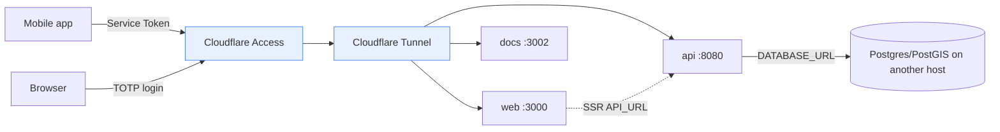

# ADR-0083: Deployment Topology — Docker Compose, External DB & Cloudflare Access (DockFlare)

> The symptom this resolves: a monorepo that only ran on a dev laptop, with secrets in
> plaintext and no controlled public exposure. The Real presses: ship to a VM behind a
> Zero-Trust shield without opening ports or baking secrets into images.

| Key | Value |
| --- | --- |
| **Status** | Accepted |
| **Date** | 2026-07-12 |
| **Author** | Architecture Review |
| **Supersedes** | None |
| **Superseded** | None |

---

## Context

- **Target:** deploy `api` + `web` (+ `docs`) to a single VM; PostgreSQL/PostGIS runs on a separate host.
- **Need:** controlled public exposure (no published ports, no vm-ip hacks), MFA in front of every
  service, and machine auth for the native mobile app — without Google or interactive 2FA in the app.
- **Repo discipline:** images must not bake secrets; secrets stay in a gitignored `.env` (dev) or an
  external vault (prod). Builds must use the pinned pnpm (`packageManager`), or `frozen-lockfile` fails.
- **Backend contract:** tRPC `AppRouter` (154 procedures / 23 routers) is the only sanctioned surface
  between frontend and backend (ADR-0032, ADR-0050); Zod schemas from `@rocky/validators` are the wire
  format (ADR-0018 / ADR-0019); domain `Result<E>` maps to `TRPCError` at the boundary via
  `createResultUnwrapper()` (ADR-0066). `packages/database` reads `DATABASE_URL` directly — it does
  NOT consume the `PG_*` values from `apps/api/src/config.ts`.

## Decision

1. **Compose topology** — `docker-compose.yml` runs `api` + `web` (+ `docs`) on a VM. The bundled
   `db` (postgis) is profiled off (`--profile local-db`); production DB is external.
2. **External DB** — `api` reaches Postgres/PostGIS via `DB_HOST`/`DB_PORT` (default `db`), so the same
   compose targets a local or external database. `DATABASE_URL` is built from those vars because
   `packages/database` reads `DATABASE_URL` directly.
3. **Cloudflare Access + DockFlare** — DockFlare reconciles Docker labels into Cloudflare Tunnel ingress
   - Access applications. `web`/`docs` use `dockflare.access.policy=authenticate` (Cloudflare TOTP/2FA,
   no Google); `api` uses `dockflare.access.group=rocky-api` (an Access Group allowing a Service Token
   **plus** authenticated users, so both the mobile app and the web browser reach it). Published ports
   are removed; the tunnel is the only ingress. `api`/`web`/`docs` join the external `cloudflare-net`
   shared with DockFlare.
4. **Mobile machine auth** — the native app clears the Access shield with a Cloudflare Access
   **Service Token** (`CF-Access-Client-Id` / `CF-Access-Client-Secret`), injected on every request by
   both the tRPC client and the better-auth client (`EXPO_PUBLIC_CF_*`, inlined at build). No
   interactive login for the app.
5. **Secrets** — dev: gitignored `.env` + `chmod 600` + encrypted VM disk. Prod: Cloudflare
   **Secrets Store** + a fetch init container (deferred — WO-145).
6. **Frontend↔Backend boundary** — see the dedicated section below.



## Frontend ↔ Backend Boundary (the contract)

- **Surface:** tRPC `AppRouter`, generated by `nestjs-trpc generate` into
  `packages/trpc/src/generated/server.ts` and re-exported from `@rocky/trpc`. Web (`@trpc/react-query`)
  and mobile (`@trpc/react-query` + `@trpc/client`) consume the `AppRouter` **type** — never the server.
- **Wire format:** every input/output is a Zod schema from `@rocky/validators` (Diamond Seal). superjson
  transports it. No raw domain objects cross the wire.
- **Error boundary:** domain services return `Result<T,E>`; routers call `createResultUnwrapper(ERROR_MAP)`
  which maps `E` → `TRPCError`. The domain never sees HTTP/tRPC (ADR-0066). The "church and state"
  separation is enforced by the `check:trpc-boundary` guardian.
- **Server-only:** `PolicyEngine` / `@rocky/authorization` Principal resolution, `@rocky/execution`
  `RLSStage`, and all domain services stay behind the boundary. Clients receive only validated data and
  role-filtered results.
- **Drift guard:** `generate:trpc` + `check:trpc-boundary` (in `ci:checks`) guarantee client types ==
  server procedures. `check:adrs` + `check:md-links` guard this documentation.

## Consequences

### Positive

- One `docker compose up` brings up the app on a VM; no port exposure; MFA on every service.
- Mobile authenticates as a machine (Service Token) — no Google, no 2FA prompt inside the app.
- The boundary is type-safe and guardian-enforced; the frontend cannot drift from the backend.
- Images carry no secrets.

### Negative / Cost

- Cloudflare Tunnel is a hard ingress dependency (no LAN reachability unless ports are re-added).
- Prod secrets need a fetch step + scoped API token (WO-145), or stay on the gitignored `.env`.
- Multi-stage images still copy devDeps into the runtime layer (thin-ness opportunity, see below).

### Neutral

- `db` service retained for local dev only (profile `local-db`).

## Implementation

- **Owning Bot:** Docs Bot (this ADR + the ADR set) with API Bot / Auth Bot for boundary correctness.
  RobotFarm pass: this ADR + WORKORDER (WO-144–WO-148).
- **Files:** `docker-compose.yml` (api/web/docs + `cloudflare-net`), `apps/api/Dockerfile`,
  `apps/web/Dockerfile`, `apps/docs/Dockerfile` (new), `apps/mob/lib/auth.ts` (Service Token),
  `packages/auth/src/client.ts` (`fetchOptions` forward), `.env.example`.
- **Compliance evidence:** the deployment controls map onto ISO 27001 Annex A / ISO 27701 PIMS in
  `apps/docs/content/compliance/iso27701-2025-gap-analysis.md` §10 — Cloudflare Access → A.5.15–.18 /
  A.8.5; tunnel-only ingress → A.8.20/.22; non-root images → A.8.9/.10/.19; secrets → A.8.24; external
  Postgres + RLS → A.5.12/.15–.18; PAdES / PDF-A-3 signed documents → A.8.24 / A.3.27–.30. Feeds the SoA.
- **Package → container closure** (resolved by `pnpm install -r --filter <svc>...`):
  - `api`: `@rocky/api` + `@rocky/auth`, `@rocky/validators`, `@rocky/trpc`, `@rocky/database`,
    `@rocky/authorization`, `@rocky/execution`, `@rocky/domains-*`, `@rocky/pdf`,
    `@rocky/testing` (dev only).
  - `web`: `@rocky/ui`, `@rocky/auth` (client), `@rocky/validators`, `@rocky/trpc` (types),
    `@rocky/authorization` (RBAC UI).
  - `docs`: `@rocky/ui` (globals + components), `@rocky/validators` / `@rocky/trpc` (API-reference type
    generation at build), Nextra / Next.js.
  - External: PostgreSQL/PostGIS (another host), Cloudflare Tunnel + Access.

## Thin-image note

- **Per-service base image (the Nest/Next split):** the `api` image is **`node:24-alpine`**
  (NestJS is pure JS; `@rocky/pdf` renders via the `typst.ts` **WASM** compiler, which is libc-agnostic,
  so musl is safe). The `web` and `docs` images stay on **`node:24.14.0-slim`** (glibc) because Next.js
  pulls `@parcel/watcher`, which ships **no musl prebuild** — Alpine breaks the Next.js build.
- **DevDeps are dropped at runtime** via `pnpm -r prune --prod` in the build stage (the pnpm equivalent
  of `npm prune --omit=dev`); the runtime copies only the pruned `node_modules`. Removes `drizzle-kit`,
  `tsx`, `typescript`, `vitest`, `@nestjs/cli`, etc. from the shipped image.
- **Non-root runtime user** (`addgroup`/`adduser` + `chown` + `USER`) on all three images.
- **`.dockerignore`** at repo root keeps local `node_modules`/`.git`/`.env` out of the build context
  (and secrets out of the image).
- Multi-stage (deps → build → runtime) keeps each runtime to base + built app + pruned `node_modules`.
  The remaining lever for `api` is the Alpine base; `web`/`docs` keep glibc for `@parcel/watcher`.

## Verification (Definition of Done)

```bash
ls apps/docs/content/ADR/0083-*.md                  # exists in canonical set
rg -n "ADR-00(18|19|21|32|50|66)" 0083-*.md         # ≥1 backend dep cited
docker compose config                               # parses; default services = api, web, docs
docker compose --profile local-db config            # db present only with profile
```

## Anti-Patterns (do not repeat)

1. Baking secrets into the Dockerfile `ENV` — they must come from runtime env / secret.
2. Hardcoding `DATABASE_URL` with a literal host — `packages/database` reads `DATABASE_URL`, not the
   `PG_*` from `config.ts`.
3. Letting the mobile app do an interactive Cloudflare login — use a Service Token.
4. Publishing container ports when a Tunnel is the ingress.

## Related ADRs

- **ADR-0032** — tRPC transport (the surface).
- **ADR-0050** — Frontend/Backend Contract Sync.
- **ADR-0018 / ADR-0019** — Validators (Diamond Seal, wire format).
- **ADR-0066** — Error Sovereignty (Result → TRPCError at the boundary).
- **ADR-0021** — Auth/session (better-auth).
- **ADR-0081** — Accept-and-Flag Validation Doctrine (validators consumed across the boundary).
- **ADR-0082** — PDF/A-3 Hybrid Container + PAdES Signing (cryptographic, archive-grade documents;
  A.8.24 / A.3.27–.30 evidence — see gap-analysis §10.2).
- **ADR-0084** — Offline-verifiable Signed QR Credentials (Ed25519; EU DCC / mDL / W3C VC paradigm);
  offline sibling to the PAdES seal, reuses HSM key custody — GDPR Art 5(1)(f)/32 evidence (§11.3).
